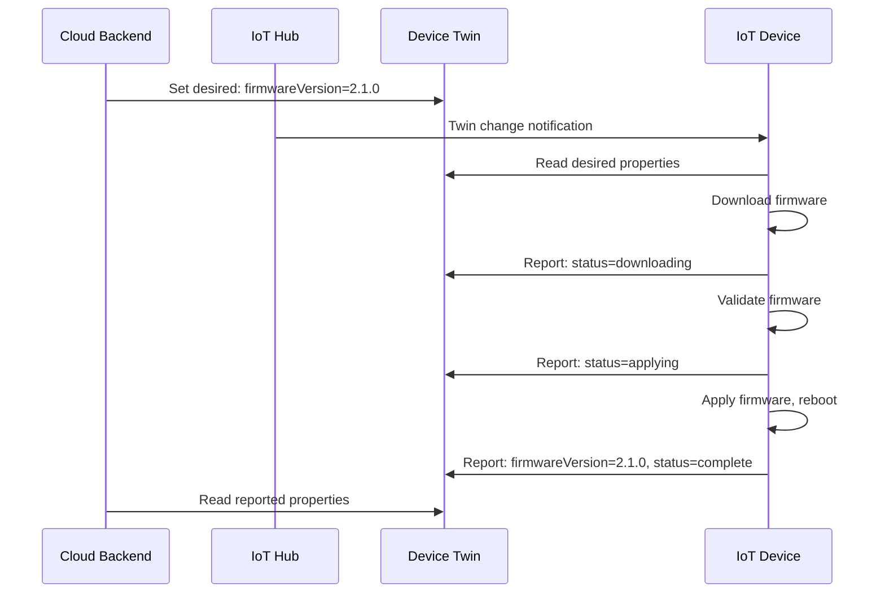

# How to Implement IoT Device Firmware Updates Over the Air Using Azure IoT Hub Device Twins

Author: [nawazdhandala](https://www.github.com/nawazdhandala)

Tags: Azure IoT Hub, Device Twins, Firmware Update, OTA Update, IoT, Device Management, Embedded Systems

Description: Learn how to implement over-the-air firmware updates for IoT devices using Azure IoT Hub device twins and direct methods for coordinated update management.

---

Deploying firmware updates to IoT devices in the field is one of the most critical (and most nerve-wracking) operations in IoT device management. Unlike server software, a bad firmware update on a remote sensor or edge device can brick it, and someone might need to physically visit the device to recover it. Azure IoT Hub provides device twins and direct methods that let you manage firmware updates reliably and at scale. This guide covers the architecture, the implementation, and the safety mechanisms you should build in.

## How Device Twins Enable Firmware Updates

A device twin is a JSON document maintained by IoT Hub for each registered device. It has two key sections:

- **Desired properties**: Set by the backend (your cloud service). These represent the state you want the device to be in.
- **Reported properties**: Set by the device. These represent the device's current actual state.

For firmware updates, the pattern is:

1. The backend sets a desired property like `firmwareVersion: "2.1.0"` and `firmwareUrl: "https://..."`
2. The device reads the desired properties and sees that a new firmware version is available
3. The device downloads the firmware, validates it, and applies it
4. The device updates its reported properties with the new firmware version and update status



## Prerequisites

- An Azure IoT Hub (Standard tier for device twins)
- Devices registered in IoT Hub
- A storage account for hosting firmware files
- Azure CLI with the IoT extension
- Python 3.8+ (for the device-side code examples)

## Step 1: Set Up the Firmware Storage

Store firmware binaries in Azure Blob Storage with SAS token access:

```bash
# Create a storage account for firmware files
RESOURCE_GROUP="rg-iot-production"
STORAGE_ACCOUNT="iotfirmware01"

az storage account create \
    --name $STORAGE_ACCOUNT \
    --resource-group $RESOURCE_GROUP \
    --location eastus \
    --sku Standard_LRS

# Create a container for firmware binaries
az storage container create \
    --name firmware \
    --account-name $STORAGE_ACCOUNT

# Upload a firmware binary
az storage blob upload \
    --account-name $STORAGE_ACCOUNT \
    --container-name firmware \
    --name "v2.1.0/firmware.bin" \
    --file ./build/firmware-v2.1.0.bin

# Generate a SAS URL for the firmware (valid for 24 hours)
EXPIRY=$(date -u -d '+24 hours' '+%Y-%m-%dT%H:%MZ')
FIRMWARE_URL=$(az storage blob generate-sas \
    --account-name $STORAGE_ACCOUNT \
    --container-name firmware \
    --name "v2.1.0/firmware.bin" \
    --permissions r \
    --expiry $EXPIRY \
    --full-uri -o tsv)

echo "Firmware URL: $FIRMWARE_URL"
```

## Step 2: Implement the Device-Side Firmware Update Handler

Here is a Python implementation for the device side that handles firmware updates through device twin changes:

```python
# device_firmware_handler.py
# Handles OTA firmware updates on the device side using device twin
import asyncio
import hashlib
import os
import sys
import aiohttp
from azure.iot.device.aio import IoTHubDeviceClient

# Device connection string from environment
CONNECTION_STRING = os.environ["IOTHUB_DEVICE_CONNECTION_STRING"]
FIRMWARE_DIR = "/tmp/firmware"

async def download_firmware(url, target_path):
    """Download the firmware binary from the given URL."""
    os.makedirs(os.path.dirname(target_path), exist_ok=True)

    async with aiohttp.ClientSession() as session:
        async with session.get(url) as response:
            if response.status != 200:
                raise Exception(f"Download failed with status {response.status}")

            total_size = int(response.headers.get("Content-Length", 0))
            downloaded = 0

            with open(target_path, "wb") as f:
                async for chunk in response.content.iter_chunked(8192):
                    f.write(chunk)
                    downloaded += len(chunk)

            print(f"Downloaded {downloaded} bytes to {target_path}")
            return target_path


def validate_firmware(file_path, expected_checksum):
    """Validate the firmware binary against its SHA256 checksum."""
    sha256 = hashlib.sha256()
    with open(file_path, "rb") as f:
        for block in iter(lambda: f.read(65536), b""):
            sha256.update(block)

    actual_checksum = sha256.hexdigest()
    if actual_checksum != expected_checksum:
        raise Exception(
            f"Checksum mismatch: expected {expected_checksum}, got {actual_checksum}"
        )
    print("Firmware checksum validated successfully")


def apply_firmware(file_path):
    """Apply the firmware update.
    In a real device, this would flash the firmware to the appropriate partition.
    """
    print(f"Applying firmware from {file_path}")
    # Platform-specific firmware flashing logic goes here
    # For example: subprocess.run(["fw_setenv", "firmware_path", file_path])
    # Then trigger a reboot: subprocess.run(["reboot"])
    print("Firmware applied successfully")


async def report_status(client, status, version=None, error=None):
    """Report the firmware update status back to IoT Hub via reported properties."""
    reported = {
        "firmware": {
            "updateStatus": status,
            "lastUpdateTime": asyncio.get_event_loop().time(),
        }
    }
    if version:
        reported["firmware"]["currentVersion"] = version
    if error:
        reported["firmware"]["lastError"] = str(error)

    await client.patch_twin_reported_properties(reported)
    print(f"Reported status: {status}")


async def handle_twin_update(client, patch):
    """Handle a device twin desired property update."""
    print(f"Received twin update: {patch}")

    # Check if the update contains firmware information
    firmware = patch.get("firmware", {})
    desired_version = firmware.get("desiredVersion")
    firmware_url = firmware.get("firmwareUrl")
    checksum = firmware.get("checksum")

    if not desired_version or not firmware_url:
        return

    # Get current firmware version from reported properties
    twin = await client.get_twin()
    current_version = twin.get("reported", {}).get("firmware", {}).get("currentVersion", "1.0.0")

    if current_version == desired_version:
        print(f"Already running firmware {desired_version}, skipping update")
        return

    print(f"Starting firmware update: {current_version} -> {desired_version}")

    try:
        # Phase 1: Download
        await report_status(client, "downloading", current_version)
        firmware_path = os.path.join(FIRMWARE_DIR, f"firmware-{desired_version}.bin")
        await download_firmware(firmware_url, firmware_path)

        # Phase 2: Validate
        await report_status(client, "validating", current_version)
        if checksum:
            validate_firmware(firmware_path, checksum)

        # Phase 3: Apply
        await report_status(client, "applying", current_version)
        apply_firmware(firmware_path)

        # Phase 4: Complete
        await report_status(client, "complete", desired_version)
        print(f"Firmware update to {desired_version} completed successfully")

    except Exception as e:
        print(f"Firmware update failed: {e}")
        await report_status(client, "failed", current_version, error=str(e))


async def main():
    """Main device loop."""
    client = IoTHubDeviceClient.create_from_connection_string(CONNECTION_STRING)
    await client.connect()

    # Register the twin update handler
    client.on_twin_desired_properties_patch_received = (
        lambda patch: asyncio.create_task(handle_twin_update(client, patch))
    )

    # Report initial firmware version
    await report_status(client, "idle", "1.0.0")

    print("Device is running. Waiting for firmware updates...")

    # Keep the device running
    try:
        while True:
            await asyncio.sleep(60)
    except KeyboardInterrupt:
        await client.disconnect()


if __name__ == "__main__":
    asyncio.run(main())
```

## Step 3: Trigger a Firmware Update from the Backend

The backend service sets the desired properties on the device twin to initiate the update:

```python
# backend_trigger_update.py
# Backend service that triggers firmware updates via device twin
import os
from azure.iot.hub import IoTHubRegistryManager

CONNECTION_STRING = os.environ["IOTHUB_CONNECTION_STRING"]

def trigger_firmware_update(device_id, version, firmware_url, checksum):
    """Trigger a firmware update by setting desired properties on the device twin."""
    registry_manager = IoTHubRegistryManager(CONNECTION_STRING)

    # Get the current twin
    twin = registry_manager.get_twin(device_id)

    # Set the desired firmware properties
    twin_patch = {
        "properties": {
            "desired": {
                "firmware": {
                    "desiredVersion": version,
                    "firmwareUrl": firmware_url,
                    "checksum": checksum,
                    "updateRequestTime": "2026-02-16T10:00:00Z"
                }
            }
        }
    }

    # Update the twin
    registry_manager.update_twin(device_id, twin_patch, twin.etag)
    print(f"Firmware update triggered for device {device_id}: version {version}")


# Trigger an update for a single device
trigger_firmware_update(
    device_id="sensor-001",
    version="2.1.0",
    firmware_url="https://iotfirmware01.blob.core.windows.net/firmware/v2.1.0/firmware.bin?sv=...",
    checksum="a1b2c3d4e5f6..."
)
```

## Step 4: Rolling Updates Across a Fleet

For updating multiple devices, use IoT Hub queries to target devices and roll out updates gradually:

```python
# fleet_update.py
# Roll out firmware updates across a fleet of devices in stages
import time
from azure.iot.hub import IoTHubRegistryManager

CONNECTION_STRING = os.environ["IOTHUB_CONNECTION_STRING"]
registry_manager = IoTHubRegistryManager(CONNECTION_STRING)

def get_devices_needing_update(target_version):
    """Query IoT Hub for devices not running the target firmware version."""
    query = (
        f"SELECT deviceId FROM devices "
        f"WHERE properties.reported.firmware.currentVersion != '{target_version}' "
        f"AND status = 'enabled'"
    )
    result = registry_manager.query_iot_hub(query)
    return [device["deviceId"] for device in result]


def check_update_status(device_id):
    """Check the firmware update status of a device."""
    twin = registry_manager.get_twin(device_id)
    firmware = twin.properties.reported.get("firmware", {})
    return firmware.get("updateStatus", "unknown")


def rolling_update(target_version, firmware_url, checksum, batch_size=10):
    """Perform a rolling firmware update across all devices."""
    devices = get_devices_needing_update(target_version)
    print(f"Found {len(devices)} devices needing update to {target_version}")

    # Process in batches
    for i in range(0, len(devices), batch_size):
        batch = devices[i:i + batch_size]
        print(f"\nProcessing batch {i // batch_size + 1}: {len(batch)} devices")

        # Trigger update for each device in the batch
        for device_id in batch:
            trigger_firmware_update(device_id, target_version, firmware_url, checksum)

        # Wait for the batch to complete before proceeding
        print("Waiting for batch to complete...")
        timeout = 300  # 5 minutes per batch
        start = time.time()

        while time.time() - start < timeout:
            statuses = {d: check_update_status(d) for d in batch}
            completed = sum(1 for s in statuses.values() if s in ("complete", "failed"))

            if completed == len(batch):
                failed = [d for d, s in statuses.items() if s == "failed"]
                if failed:
                    print(f"WARNING: {len(failed)} devices failed: {failed}")
                break

            time.sleep(10)

        print(f"Batch complete. Moving to next batch.")
```

## Safety Mechanisms

Firmware updates are inherently risky. Build these safety mechanisms into your update process:

**A/B partitioning**: Devices should have two firmware partitions. The new firmware is written to the inactive partition, and on reboot, the bootloader switches to it. If the new firmware fails to start, the bootloader reverts to the previous partition.

**Checksum validation**: Always validate the downloaded firmware against a known-good checksum before applying it. The example code above includes this.

**Gradual rollout**: Start with a small percentage of devices (canary group), monitor for issues, then expand to the full fleet. Never update all devices simultaneously.

**Rollback capability**: If the new firmware causes problems, you should be able to trigger a rollback by setting the desired version back to the previous version.

**Connectivity checks**: Before starting a firmware update, verify the device has a stable network connection. A firmware download interrupted midway can leave the device in a bad state.

## Summary

Over-the-air firmware updates using Azure IoT Hub device twins follow a clear pattern: the backend sets desired properties with the target firmware version and URL, the device detects the change, downloads and validates the firmware, applies it, and reports its new status. The device twin acts as the coordination mechanism, and the reported properties give you visibility into every device's update status. For fleet updates, use IoT Hub queries to target devices and roll out updates in batches with proper monitoring between each batch. Build safety mechanisms like checksum validation, A/B partitioning, and gradual rollout into every firmware update workflow.
