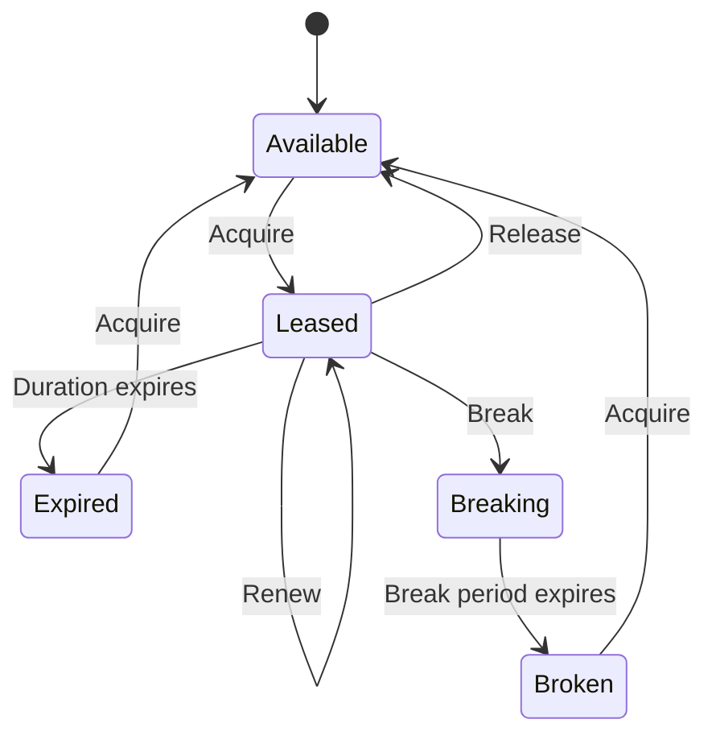

# How to Implement Lease Management for Blob Concurrency Control in Azure Storage

Author: [nawazdhandala](https://www.github.com/nawazdhandala)

Tags: Azure, Blob Storage, Leases, Concurrency Control, Distributed Systems, Locking, Azure SDK

Description: How to use Azure Blob Storage leases to implement distributed locking and prevent concurrent modifications to blobs in multi-instance applications.

---

When multiple instances of your application can read and write the same blob, you need a way to prevent them from stepping on each other. Imagine two workers both reading a configuration file, making changes, and writing it back - the second write would silently overwrite the first one's changes. Azure Blob Storage leases solve this by providing a distributed locking mechanism that gives one client exclusive write access to a blob for a specified duration. This guide covers how leases work and how to use them for practical concurrency control.

## How Blob Leases Work

A lease is an exclusive lock on a blob. When a client acquires a lease on a blob, it gets a lease ID. Any subsequent write or delete operation on that blob must include this lease ID. Operations from other clients (or the same client without the lease ID) are rejected with a 412 Precondition Failed error.

Key concepts:

- **Lease duration**: 15 to 60 seconds, or infinite
- **Lease states**: Available, Leased, Expired, Breaking, Broken
- **Lease actions**: Acquire, Renew, Change, Release, Break



## Acquiring and Releasing Leases

### Basic Lease Workflow in Python

```python
from azure.storage.blob import BlobServiceClient, BlobLeaseClient
from azure.identity import DefaultAzureCredential

credential = DefaultAzureCredential()
blob_service = BlobServiceClient(
    "https://mystorageaccount.blob.core.windows.net",
    credential=credential
)

blob_client = blob_service.get_blob_client("config", "app-settings.json")

# Acquire a lease on the blob
# Duration of 30 seconds - the lease expires automatically if not renewed
lease_client = blob_client.acquire_lease(lease_duration=30)
lease_id = lease_client.id

print(f"Lease acquired: {lease_id}")

try:
    # Read the current content
    download = blob_client.download_blob(lease=lease_client)
    current_content = download.readall()

    # Modify the content
    import json
    settings = json.loads(current_content)
    settings["last_updated"] = "2026-02-16T10:30:00Z"
    settings["version"] = settings.get("version", 0) + 1

    # Write back with the lease - only succeeds if we still hold the lease
    blob_client.upload_blob(
        json.dumps(settings, indent=2).encode("utf-8"),
        overwrite=True,
        lease=lease_client
    )
    print("Settings updated successfully")

finally:
    # Always release the lease when done
    lease_client.release()
    print("Lease released")
```

### C# Implementation

```csharp
using Azure.Storage.Blobs;
using Azure.Storage.Blobs.Specialized;
using Azure.Storage.Blobs.Models;
using Azure.Identity;
using System.Text.Json;

var credential = new DefaultAzureCredential();
var blobClient = new BlobClient(
    new Uri("https://mystorageaccount.blob.core.windows.net/config/app-settings.json"),
    credential
);

// Acquire a 30-second lease
BlobLeaseClient leaseClient = blobClient.GetBlobLeaseClient();
BlobLease lease = await leaseClient.AcquireAsync(TimeSpan.FromSeconds(30));
string leaseId = lease.LeaseId;

Console.WriteLine($"Lease acquired: {leaseId}");

try
{
    // Read current content with the lease
    var downloadOptions = new BlobDownloadOptions
    {
        Conditions = new BlobRequestConditions { LeaseId = leaseId }
    };
    BlobDownloadResult download = await blobClient.DownloadContentAsync(downloadOptions);
    var settings = JsonSerializer.Deserialize<Dictionary<string, object>>(
        download.Content.ToString()
    );

    // Modify and write back
    settings["last_updated"] = DateTime.UtcNow.ToString("o");

    var uploadOptions = new BlobUploadOptions
    {
        Conditions = new BlobRequestConditions { LeaseId = leaseId }
    };
    await blobClient.UploadAsync(
        BinaryData.FromString(JsonSerializer.Serialize(settings)),
        uploadOptions
    );

    Console.WriteLine("Settings updated");
}
finally
{
    // Release the lease
    await leaseClient.ReleaseAsync();
    Console.WriteLine("Lease released");
}
```

## Renewing Leases for Long Operations

If your operation takes longer than the lease duration, you need to renew the lease before it expires. A common pattern is to use a background thread that periodically renews the lease:

```python
import threading
import time

class LeaseRenewer:
    """Background thread that periodically renews a blob lease."""

    def __init__(self, lease_client, renew_interval=15):
        """
        Args:
            lease_client: The BlobLeaseClient to renew
            renew_interval: Seconds between renewal attempts
        """
        self._lease_client = lease_client
        self._renew_interval = renew_interval
        self._stop_event = threading.Event()
        self._thread = None

    def start(self):
        """Start the background renewal thread."""
        self._thread = threading.Thread(target=self._renew_loop, daemon=True)
        self._thread.start()

    def stop(self):
        """Stop the background renewal thread."""
        self._stop_event.set()
        if self._thread:
            self._thread.join(timeout=5)

    def _renew_loop(self):
        """Continuously renew the lease until stopped."""
        while not self._stop_event.is_set():
            try:
                self._lease_client.renew()
            except Exception as e:
                print(f"Lease renewal failed: {e}")
                break
            self._stop_event.wait(self._renew_interval)


# Usage
lease_client = blob_client.acquire_lease(lease_duration=30)
renewer = LeaseRenewer(lease_client, renew_interval=15)
renewer.start()

try:
    # Do long-running work with the blob
    # The lease stays active as long as the renewer is running
    perform_lengthy_processing(blob_client, lease_client)
finally:
    renewer.stop()
    lease_client.release()
```

## Breaking Leases

Sometimes a lease holder crashes without releasing the lease, and you need to recover. The break operation lets you force-release a lease.

```python
# Break a lease with a specific break period
# The lease transitions to "Breaking" state for the specified period
# After the break period, the lease becomes "Broken" and can be re-acquired
blob_client = blob_service.get_blob_client("config", "app-settings.json")

try:
    # Try to acquire a lease
    lease_client = blob_client.acquire_lease(lease_duration=30)
except Exception as e:
    print(f"Cannot acquire lease (likely already leased): {e}")

    # Break the existing lease with a 0-second break period (immediate)
    # Only use this when you are sure the lease holder has crashed
    lease_client = BlobLeaseClient(blob_client)
    lease_client.break_lease(lease_break_period=0)
    print("Lease broken")

    # Now acquire a new lease
    lease_client = blob_client.acquire_lease(lease_duration=30)
    print(f"New lease acquired: {lease_client.id}")
```

The `lease_break_period` parameter controls how long to wait before the lease is fully broken:
- `0`: Break immediately
- `1-60`: Wait the specified number of seconds
- `None`: Use the remaining time on the lease

## Implementing a Distributed Lock

Leases on blobs can serve as distributed locks for coordinating work across multiple instances. The pattern is simple: create a zero-byte "lock" blob and use leases on it to control access to a shared resource.

```python
class DistributedLock:
    """Distributed lock using Azure Blob Storage leases."""

    def __init__(self, blob_service, container_name, lock_name):
        self._container = blob_service.get_container_client(container_name)
        self._blob_name = f"locks/{lock_name}.lock"
        self._lease_client = None
        self._renewer = None

    def _ensure_lock_blob(self):
        """Create the lock blob if it does not exist."""
        blob_client = self._container.get_blob_client(self._blob_name)
        try:
            blob_client.upload_blob(b"", overwrite=False)
        except Exception:
            pass  # Blob already exists

    def acquire(self, timeout=60, retry_interval=2):
        """Acquire the distributed lock with retry.

        Args:
            timeout: Maximum seconds to wait for the lock
            retry_interval: Seconds between retry attempts
        Returns:
            True if the lock was acquired, False if timeout
        """
        self._ensure_lock_blob()
        blob_client = self._container.get_blob_client(self._blob_name)

        start_time = time.time()
        while time.time() - start_time < timeout:
            try:
                self._lease_client = blob_client.acquire_lease(lease_duration=30)
                # Start background renewal
                self._renewer = LeaseRenewer(self._lease_client, renew_interval=15)
                self._renewer.start()
                return True
            except Exception:
                # Lease is held by someone else, retry
                time.sleep(retry_interval)

        return False

    def release(self):
        """Release the distributed lock."""
        if self._renewer:
            self._renewer.stop()
        if self._lease_client:
            try:
                self._lease_client.release()
            except Exception:
                pass

    def __enter__(self):
        if not self.acquire():
            raise TimeoutError("Could not acquire distributed lock")
        return self

    def __exit__(self, exc_type, exc_val, exc_tb):
        self.release()
        return False


# Usage as a context manager
lock = DistributedLock(blob_service, "coordination", "data-processor")

with lock:
    # Only one instance executes this block at a time
    print("Lock acquired, processing data...")
    process_shared_data()
    print("Processing complete")
# Lock is automatically released
```

## Container Leases

Leases are not just for blobs - you can lease containers too. A container lease prevents the container from being deleted:

```python
container_client = blob_service.get_container_client("critical-data")

# Acquire a lease on the container
# This prevents container deletion
lease_client = container_client.acquire_lease(lease_duration=-1)  # Infinite lease
print(f"Container lease acquired: {lease_client.id}")

# Attempting to delete the container without the lease will fail
try:
    blob_service.delete_container("critical-data")
except Exception as e:
    print(f"Delete blocked: {e}")

# Delete with the lease ID succeeds
# container_client.delete_container(lease=lease_client)
```

This is useful for protecting production containers from accidental deletion.

## Optimistic Concurrency with ETags

For scenarios where you do not need exclusive access but want to prevent lost updates, ETags provide optimistic concurrency control without the overhead of leases:

```python
# Read the blob and get its ETag
blob_client = blob_service.get_blob_client("config", "app-settings.json")
download = blob_client.download_blob()
content = download.readall()
current_etag = download.properties.etag

# Modify the content
import json
settings = json.loads(content)
settings["counter"] = settings.get("counter", 0) + 1

# Write back, but only if the blob hasn't changed since we read it
# If someone else modified it, this raises a ConditionNotMet error
from azure.core import MatchConditions

try:
    blob_client.upload_blob(
        json.dumps(settings).encode("utf-8"),
        overwrite=True,
        etag=current_etag,
        match_condition=MatchConditions.IfNotModified
    )
    print("Update succeeded")
except Exception as e:
    print(f"Conflict detected - blob was modified by another process: {e}")
    # Retry: re-read, re-modify, re-write
```

The ETag approach is lighter weight than leases because there is no lock to manage. However, it means your code needs to handle conflicts and retry.

## Choosing Between Leases and ETags

| Scenario | Use Leases | Use ETags |
|----------|-----------|-----------|
| Long-running exclusive operations | Yes | No |
| Quick read-modify-write cycles | No | Yes |
| Preventing container deletion | Yes | N/A |
| Coordinating distributed workers | Yes | No |
| High-contention workloads | Depends | Yes (with retry) |

Leases provide pessimistic locking - you lock the resource before working with it. ETags provide optimistic concurrency - you assume no conflict and handle it if it occurs. For most applications, ETags are simpler and more scalable. Leases are the right choice when you need guaranteed exclusive access or when your operations take more than a few seconds.

Both mechanisms are built into Azure Blob Storage at no additional cost, and they work reliably across regions and availability zones. Pick the one that matches your concurrency pattern, and your multi-instance applications will handle concurrent access gracefully.
