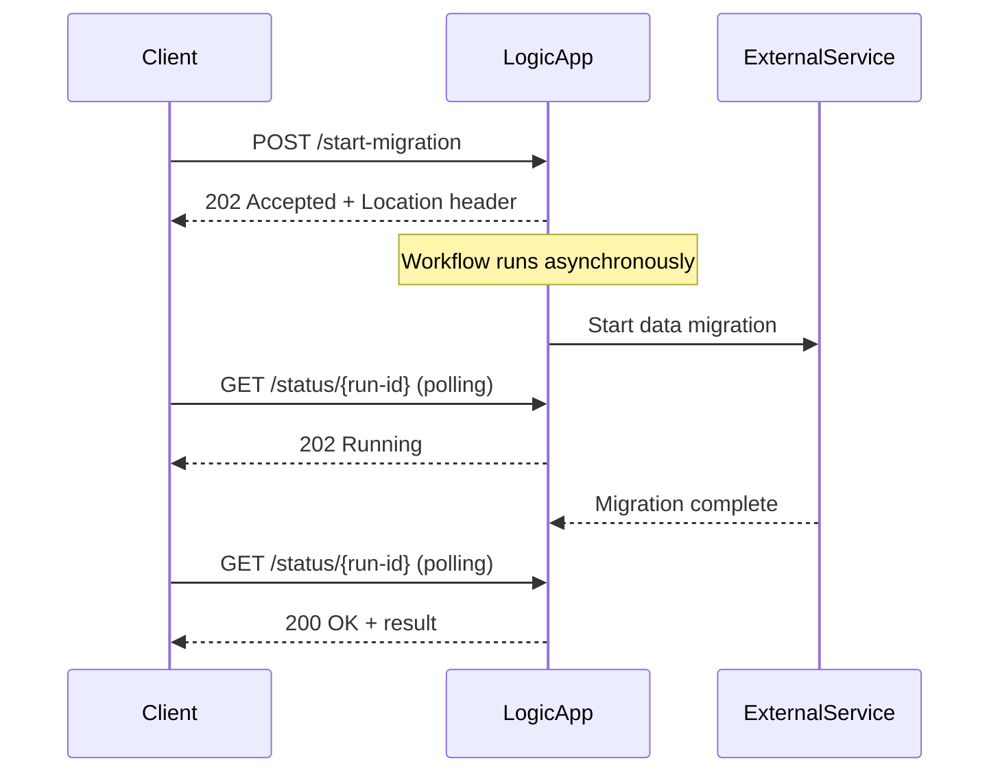
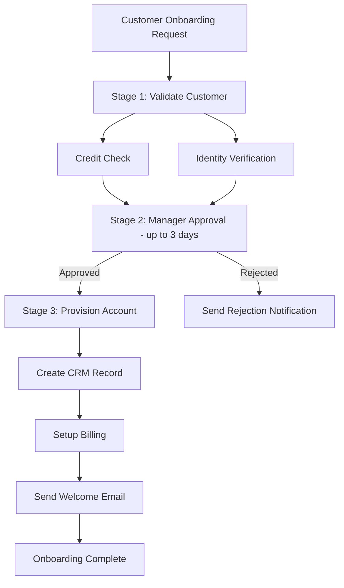

# How to Implement Long-Running Workflows with Azure Logic Apps Stateful Actions

Author: [nawazdhandala](https://www.github.com/nawazdhandala)

Tags: Azure, Logic Apps, Long-Running Workflows, Stateful Actions, Async Patterns, Durable Workflows, Orchestration

Description: Build long-running workflows in Azure Logic Apps using stateful actions, webhook callbacks, and async polling patterns for processes that take hours or days.

---

Some business processes take minutes, hours, or even days to complete. A document approval chain might take three days. A data migration job might run for hours. A customer onboarding process might span multiple steps over a week. Azure Logic Apps handles these long-running workflows through stateful execution, webhook callbacks, and async polling patterns that persist state across the entire duration.

## Why Long-Running Workflows Need Special Handling

A typical HTTP request has a timeout measured in seconds or minutes. But a Logic Apps workflow that orchestrates a multi-day approval process cannot hold an HTTP connection open for days. The workflow needs to persist its state, release all connections, and resume exactly where it left off when the next event arrives.

Logic Apps Standard's stateful workflows are designed exactly for this. They persist the state of every action to durable storage, allowing the workflow to survive restarts, scale-out events, and even infrastructure failures.

## Stateful vs Stateless for Long-Running Processes

Always use stateful workflows for long-running processes. Stateless workflows execute in memory and are meant for quick, request-response scenarios. If the host restarts during a stateless workflow execution, the run is lost.

```json
{
  "definition": {
    "$schema": "https://schema.management.azure.com/providers/Microsoft.Logic/schemas/2016-06-01/workflowdefinition.json#",
    "actions": { },
    "triggers": { }
  },
  "kind": "Stateful"
}
```

The `"kind": "Stateful"` declaration tells the runtime to persist all action inputs, outputs, and state to the backing storage account.

## The Async HTTP Pattern

When a caller triggers a long-running workflow via HTTP, Logic Apps automatically implements the async polling pattern. Instead of waiting for the workflow to complete, the caller gets a 202 Accepted response with a location header pointing to a status endpoint.



The workflow automatically manages this pattern. You do not need to implement the polling endpoint yourself.

```json
{
  "triggers": {
    "manual": {
      "type": "Request",
      "kind": "Http",
      "inputs": {
        "method": "POST",
        "schema": {
          "type": "object",
          "properties": {
            "migrationId": { "type": "string" },
            "sourceDatabase": { "type": "string" },
            "targetDatabase": { "type": "string" }
          }
        }
      },
      "operationOptions": "asynchronous"
    }
  }
}
```

The `"operationOptions": "asynchronous"` flag tells the trigger to return 202 immediately instead of waiting for the workflow to complete.

## Webhook-Based Long-Running Actions

For actions that call external services and need to wait for a callback, use the `HttpWebhook` action type. This is the foundation of long-running action patterns.

```json
{
  "actions": {
    "Start_Data_Migration": {
      "type": "Http",
      "inputs": {
        "method": "POST",
        "uri": "@appsetting('MigrationApiUrl')/start",
        "body": {
          "sourceDb": "@triggerBody()?['sourceDatabase']",
          "targetDb": "@triggerBody()?['targetDatabase']"
        }
      },
      "runAfter": {}
    },
    "Wait_For_Migration_Complete": {
      "type": "HttpWebhook",
      "inputs": {
        "subscribe": {
          "method": "POST",
          "uri": "@appsetting('MigrationApiUrl')/subscribe",
          "body": {
            "migrationId": "@body('Start_Data_Migration')?['migrationId']",
            "callbackUrl": "@{listCallbackUrl()}"
          }
        },
        "unsubscribe": {
          "method": "POST",
          "uri": "@appsetting('MigrationApiUrl')/unsubscribe",
          "body": {
            "migrationId": "@body('Start_Data_Migration')?['migrationId']"
          }
        }
      },
      "limit": {
        "timeout": "P7D"
      },
      "runAfter": {
        "Start_Data_Migration": ["Succeeded"]
      }
    },
    "Process_Migration_Result": {
      "type": "Compose",
      "inputs": {
        "migrationId": "@body('Start_Data_Migration')?['migrationId']",
        "result": "@body('Wait_For_Migration_Complete')",
        "completedAt": "@utcNow()"
      },
      "runAfter": {
        "Wait_For_Migration_Complete": ["Succeeded"]
      }
    }
  }
}
```

The `subscribe` action registers a callback URL with the external service. When the migration completes, the external service POSTs to that callback URL, which resumes the workflow. The `unsubscribe` action is called if the workflow is cancelled or the timeout expires.

## Multi-Stage Long-Running Workflow

Here is a real-world example: a customer onboarding workflow that spans multiple days with multiple human interactions and external system calls.

```json
{
  "definition": {
    "actions": {
      "Stage_1_Validate_Customer": {
        "type": "Scope",
        "actions": {
          "Check_Credit": {
            "type": "Http",
            "inputs": {
              "method": "POST",
              "uri": "@appsetting('CreditCheckApiUrl')/verify",
              "body": {
                "customerId": "@triggerBody()?['customerId']",
                "taxId": "@triggerBody()?['taxId']"
              }
            },
            "runAfter": {}
          },
          "Verify_Identity": {
            "type": "Http",
            "inputs": {
              "method": "POST",
              "uri": "@appsetting('IdentityApiUrl')/verify",
              "body": "@triggerBody()"
            },
            "runAfter": {}
          }
        },
        "runAfter": {}
      },
      "Stage_2_Manager_Approval": {
        "type": "ApiConnectionWebhook",
        "inputs": {
          "body": {
            "Message": {
              "To": "@triggerBody()?['salesManagerEmail']",
              "Subject": "New Customer Onboarding: @{triggerBody()?['companyName']}",
              "Options": "Approve, Reject",
              "Body": "Credit check: @{body('Check_Credit')?['status']}\nIdentity: @{body('Verify_Identity')?['status']}"
            }
          }
        },
        "limit": {
          "timeout": "P3D"
        },
        "runAfter": {
          "Stage_1_Validate_Customer": ["Succeeded"]
        }
      },
      "Stage_3_Provision_Account": {
        "type": "Scope",
        "actions": {
          "Create_CRM_Record": {
            "type": "Http",
            "inputs": {
              "method": "POST",
              "uri": "@appsetting('CrmApiUrl')/accounts",
              "body": "@triggerBody()"
            },
            "runAfter": {}
          },
          "Setup_Billing": {
            "type": "Http",
            "inputs": {
              "method": "POST",
              "uri": "@appsetting('BillingApiUrl')/setup",
              "body": {
                "customerId": "@triggerBody()?['customerId']",
                "plan": "@triggerBody()?['selectedPlan']"
              }
            },
            "runAfter": {
              "Create_CRM_Record": ["Succeeded"]
            }
          },
          "Send_Welcome_Email": {
            "type": "Http",
            "inputs": {
              "method": "POST",
              "uri": "@appsetting('EmailApiUrl')/send",
              "body": {
                "to": "@triggerBody()?['contactEmail']",
                "template": "welcome-onboarding",
                "data": {
                  "companyName": "@triggerBody()?['companyName']",
                  "accountId": "@body('Create_CRM_Record')?['accountId']"
                }
              }
            },
            "runAfter": {
              "Setup_Billing": ["Succeeded"]
            }
          }
        },
        "runAfter": {
          "Stage_2_Manager_Approval": ["Succeeded"]
        }
      }
    },
    "triggers": {
      "manual": {
        "type": "Request",
        "kind": "Http",
        "inputs": { "method": "POST" },
        "operationOptions": "asynchronous"
      }
    }
  },
  "kind": "Stateful"
}
```



## Handling Timeouts in Long-Running Steps

Every action has a timeout. For long-running steps, set explicit timeouts using ISO 8601 duration format.

| Duration | Format |
|----------|--------|
| 30 minutes | PT30M |
| 2 hours | PT2H |
| 1 day | P1D |
| 3 days | P3D |
| 1 week | P7D |
| 30 days | P30D |

The maximum timeout for a single action is 30 days. The maximum for a workflow run is 90 days on Consumption and configurable on Standard.

```json
{
  "Wait_For_External_Process": {
    "type": "HttpWebhook",
    "inputs": { ... },
    "limit": {
      "timeout": "P30D"
    }
  }
}
```

## Delay and Schedule Actions

Sometimes a workflow needs to wait for a specific time or duration before continuing.

```json
{
  "Wait_One_Hour": {
    "type": "Wait",
    "inputs": {
      "interval": {
        "count": 1,
        "unit": "Hour"
      }
    },
    "runAfter": {
      "Send_First_Reminder": ["Succeeded"]
    }
  },
  "Wait_Until_Business_Hours": {
    "type": "Wait",
    "inputs": {
      "until": {
        "timestamp": "@addHours(utcNow(), 8)"
      }
    },
    "runAfter": {
      "Prepare_Report": ["Succeeded"]
    }
  }
}
```

During a wait action, the workflow is suspended. No compute resources are consumed. When the wait period expires, the runtime resumes the workflow from where it left off.

## Tracking and Monitoring Long-Running Workflows

Long-running workflows need special attention for monitoring. A workflow that has been "running" for 5 days might be waiting for an approval (normal) or might be stuck (a problem).

Track the current stage of each running workflow by using custom tracking properties.

```json
{
  "trackedProperties": {
    "customerId": "@triggerBody()?['customerId']",
    "currentStage": "approval",
    "startedAt": "@workflow().run.startDateTime"
  }
}
```

Set up alerts for workflows that have been running longer than expected. Use Azure Monitor to query workflow run durations and alert on outliers.

## Best Practices

Use scopes to group related actions into logical stages. This makes it easier to understand the workflow's current position and to implement error handling at the stage level.

Set explicit timeouts on every long-running action. Without timeouts, a workflow can run indefinitely if a callback never arrives.

Implement compensation logic for multi-stage workflows. If Stage 3 fails, you might need to undo Stage 2 and Stage 1.

Store intermediate results in external storage (Blob Storage, database) rather than relying solely on the workflow state. This makes it easier to debug and recover from failures.

Use stateful workflows for anything that takes more than a few minutes. The persistence overhead is negligible compared to the risk of losing a long-running workflow to a host restart.

## Summary

Azure Logic Apps excels at long-running workflows. Stateful execution persists state across the entire duration, webhook callbacks let you wait for external events, and the async HTTP pattern keeps clients informed of progress. Combine these with approval actions, delay actions, and proper timeout handling to build workflows that span hours, days, or even weeks. The runtime handles the hard parts - persistence, resumption, and scaling - so you can focus on the business logic.
