# How to Implement Message Correlation Across Azure Service Bus and Azure Functions

Author: [nawazdhandala](https://www.github.com/nawazdhandala)

Tags: Azure, Service Bus, Azure Functions, Message Correlation, Distributed Systems, Tracing, Messaging

Description: Implement message correlation across Azure Service Bus and Azure Functions to track related messages through distributed processing pipelines.

---

In a distributed system where messages flow through queues, topics, and multiple functions, tracking which messages belong to the same business transaction is essential. Without correlation, debugging a failed order or tracing a request through the pipeline becomes a guessing game. Azure Service Bus has built-in support for message correlation through properties like `CorrelationId`, `SessionId`, and `MessageId`. Combined with Azure Functions, you can build a pipeline where every message and every function invocation is linked to the original request.

In this post, I will show you how to implement message correlation patterns with Azure Service Bus and Azure Functions, including request-reply, process tracking, and end-to-end tracing.

## Why Message Correlation Matters

Imagine an order processing system where the flow is:

1. An API receives an order.
2. A function validates the order and puts it on a queue.
3. Another function processes the payment.
4. Another function fulfills the order.
5. A notification is sent to the customer.

If the payment function fails, you need to answer: which order failed? What was the original request? What happened in the validation step? Without correlation IDs linking all these messages together, you are hunting through logs with timestamps and hoping for the best.

```mermaid
graph LR
    A[API Gateway] -->|correlationId: abc-123| B[Validation Queue]
    B -->|correlationId: abc-123| C[Validation Function]
    C -->|correlationId: abc-123| D[Payment Queue]
    D -->|correlationId: abc-123| E[Payment Function]
    E -->|correlationId: abc-123| F[Fulfillment Queue]
    F -->|correlationId: abc-123| G[Fulfillment Function]
```



Every message in the chain carries the same correlation ID, making it trivial to trace the entire flow.

## Setting Up Correlation from the Start

The correlation ID should be assigned when the request first enters your system. It flows through every subsequent message and log entry.

```javascript
// api-entry.js - HTTP-triggered function that starts a correlated workflow
const { ServiceBusClient } = require('@azure/service-bus');
const { v4: uuidv4 } = require('uuid');

const sbClient = new ServiceBusClient(process.env.SERVICEBUS_CONNECTION_STRING);
const sender = sbClient.createSender('order-validation');

module.exports = async function (context, req) {
  // Generate a correlation ID for this request
  // Or use one from the incoming request if present
  const correlationId = req.headers['x-correlation-id'] || uuidv4();

  const order = req.body;
  order.correlationId = correlationId;

  // Send to the validation queue with correlation metadata
  await sender.sendMessages({
    body: order,
    correlationId: correlationId,                // Service Bus built-in property
    messageId: uuidv4(),                         // Unique ID for this specific message
    applicationProperties: {
      'source': 'api-gateway',                   // Where this message originated
      'operation': 'order.create',               // What operation this is
      'timestamp': new Date().toISOString()
    }
  });

  context.log(`[${correlationId}] Order submitted to validation queue`);

  context.res = {
    status: 202,
    headers: {
      'X-Correlation-Id': correlationId
    },
    body: {
      message: 'Order submitted for processing',
      correlationId: correlationId,
      orderId: order.id
    }
  };
};
```

## Forwarding Correlation Through the Pipeline

Each function in the pipeline reads the correlation ID from the incoming message and includes it in any outgoing messages.

```javascript
// validate-order.js - Function that validates and forwards with correlation
const { ServiceBusClient } = require('@azure/service-bus');

const sbClient = new ServiceBusClient(process.env.SERVICEBUS_CONNECTION_STRING);
const paymentSender = sbClient.createSender('payment-processing');
const deadLetterSender = sbClient.createSender('validation-failures');

module.exports = async function (context, message) {
  // Extract the correlation ID from the incoming message
  const correlationId = message.correlationId;
  const order = message.body;

  context.log(`[${correlationId}] Validating order ${order.id}`);

  try {
    // Validate the order
    const validationResult = validateOrder(order);

    if (!validationResult.valid) {
      // Send to dead letter with correlation preserved
      await deadLetterSender.sendMessages({
        body: {
          order: order,
          validationErrors: validationResult.errors
        },
        correlationId: correlationId,
        messageId: `${message.messageId}-validation-failed`,
        applicationProperties: {
          'source': 'order-validation',
          'operation': 'validation.failed',
          'originalMessageId': message.messageId
        }
      });

      context.log(`[${correlationId}] Order validation failed: ${validationResult.errors.join(', ')}`);
      return;
    }

    // Forward to payment processing with the same correlation ID
    await paymentSender.sendMessages({
      body: {
        ...order,
        validatedAt: new Date().toISOString()
      },
      correlationId: correlationId,               // Same correlation ID
      messageId: `${correlationId}-payment`,       // New message ID for this step
      applicationProperties: {
        'source': 'order-validation',
        'operation': 'payment.process',
        'previousStep': 'validation',
        'originalMessageId': message.messageId     // Link to the previous message
      }
    });

    context.log(`[${correlationId}] Order validated, forwarded to payment`);

  } catch (err) {
    context.log.error(`[${correlationId}] Validation error: ${err.message}`);
    throw err; // Let Service Bus handle the retry
  }
};

function validateOrder(order) {
  const errors = [];
  if (!order.items || order.items.length === 0) errors.push('No items in order');
  if (!order.customerId) errors.push('Missing customer ID');
  if (!order.totalAmount || order.totalAmount <= 0) errors.push('Invalid total amount');
  return { valid: errors.length === 0, errors };
}
```

## Request-Reply Pattern with Correlation

Sometimes you need to send a message and wait for a response. The request-reply pattern uses the `ReplyTo` and `CorrelationId` properties to match responses to requests.

```javascript
// request-reply.js - Send a request and wait for a correlated response
const { ServiceBusClient } = require('@azure/service-bus');
const { v4: uuidv4 } = require('uuid');

const sbClient = new ServiceBusClient(process.env.SERVICEBUS_CONNECTION_STRING);

async function requestReply(requestQueue, replyQueue, requestBody, timeoutMs) {
  const sender = sbClient.createSender(requestQueue);
  const receiver = sbClient.createReceiver(replyQueue);

  const correlationId = uuidv4();

  // Send the request with replyTo and correlationId
  await sender.sendMessages({
    body: requestBody,
    correlationId: correlationId,
    messageId: uuidv4(),
    replyTo: replyQueue,
    applicationProperties: {
      'expectsReply': 'true'
    }
  });

  // Wait for a response message with the matching correlation ID
  const messages = await receiver.receiveMessages(1, {
    maxWaitTimeInMs: timeoutMs || 30000
  });

  // Filter for the correlated response
  const response = messages.find(m => m.correlationId === correlationId);

  if (response) {
    await receiver.completeMessage(response);
    return response.body;
  }

  throw new Error(`No reply received for correlation ${correlationId} within timeout`);
}

// The responder function reads the correlationId and includes it in the reply
async function responder(context, message) {
  const correlationId = message.correlationId;
  const replyTo = message.replyTo;

  // Process the request
  const result = await processRequest(message.body);

  // Send the reply with the same correlation ID
  const replySender = sbClient.createSender(replyTo);
  await replySender.sendMessages({
    body: result,
    correlationId: correlationId,  // Must match the request
    messageId: `${correlationId}-reply`,
    applicationProperties: {
      'source': 'responder',
      'isReply': 'true'
    }
  });
}
```

## Session-Based Correlation

For scenarios where you need ordered processing of related messages, use Service Bus sessions. Messages with the same `SessionId` are always processed by the same consumer in order.

```javascript
// session-correlation.js - Using sessions for ordered correlation

// Sending messages that should be processed in order
async function sendOrderSteps(orderId, steps) {
  const sender = sbClient.createSender('order-steps');

  for (let i = 0; i < steps.length; i++) {
    await sender.sendMessages({
      body: steps[i],
      sessionId: orderId,              // All steps for this order go to the same session
      correlationId: orderId,          // Also set correlation for tracing
      messageId: `${orderId}-step-${i}`,
      applicationProperties: {
        'stepNumber': i,
        'totalSteps': steps.length
      }
    });
  }
}

// Receiving session messages - guaranteed in order
async function processOrderSession(context, message) {
  const sessionId = message.sessionId;
  const stepNumber = message.applicationProperties.stepNumber;
  const totalSteps = message.applicationProperties.totalSteps;

  context.log(`[Session: ${sessionId}] Processing step ${stepNumber + 1} of ${totalSteps}`);

  // Process the step
  await processStep(message.body);

  // Session state can track progress
  if (stepNumber === totalSteps - 1) {
    context.log(`[Session: ${sessionId}] All steps completed`);
  }
}
```

## Building a Correlation Tracker

For visibility into your pipeline, build a tracker that logs correlation events to a central store.

```javascript
// correlation-tracker.js - Track message flow across the pipeline
const { CosmosClient } = require('@azure/cosmos');

const cosmos = new CosmosClient(process.env.COSMOS_CONNECTION_STRING);
const container = cosmos.database('tracking').container('correlations');

async function trackEvent(correlationId, event) {
  const trackingEntry = {
    id: `${correlationId}-${Date.now()}-${Math.random().toString(36).substr(2, 5)}`,
    correlationId: correlationId,
    timestamp: new Date().toISOString(),
    source: event.source,
    operation: event.operation,
    status: event.status,
    messageId: event.messageId,
    details: event.details || {},
    partitionKey: correlationId
  };

  await container.items.create(trackingEntry);
}

// Usage in each function
async function processPayment(context, message) {
  const correlationId = message.correlationId;

  // Track that we started processing
  await trackEvent(correlationId, {
    source: 'payment-processor',
    operation: 'payment.started',
    status: 'processing',
    messageId: message.messageId
  });

  try {
    const result = await chargeCustomer(message.body);

    // Track successful completion
    await trackEvent(correlationId, {
      source: 'payment-processor',
      operation: 'payment.completed',
      status: 'success',
      messageId: message.messageId,
      details: { paymentId: result.id }
    });

  } catch (err) {
    // Track the failure
    await trackEvent(correlationId, {
      source: 'payment-processor',
      operation: 'payment.failed',
      status: 'error',
      messageId: message.messageId,
      details: { error: err.message }
    });

    throw err;
  }
}
```

Query the tracker to see the full journey of a correlated message.

```javascript
// query-correlation.js - Query the tracking data for a correlation
async function getCorrelationHistory(correlationId) {
  const { resources: events } = await container.items
    .query({
      query: 'SELECT * FROM c WHERE c.correlationId = @id ORDER BY c.timestamp ASC',
      parameters: [{ name: '@id', value: correlationId }]
    })
    .fetchAll();

  return events;
}

// Example output:
// [
//   { operation: "order.create", source: "api-gateway", status: "submitted" },
//   { operation: "validation.started", source: "order-validation", status: "processing" },
//   { operation: "validation.completed", source: "order-validation", status: "success" },
//   { operation: "payment.started", source: "payment-processor", status: "processing" },
//   { operation: "payment.completed", source: "payment-processor", status: "success" },
//   { operation: "fulfillment.started", source: "fulfillment", status: "processing" }
// ]
```

## Application Insights Integration

Azure Functions integrates with Application Insights, which supports distributed tracing out of the box. The Service Bus trigger automatically propagates trace context.

```javascript
// Enable custom tracking in Application Insights
const appInsights = require('applicationinsights');
appInsights.setup(process.env.APPINSIGHTS_CONNECTION_STRING).start();
const telemetryClient = appInsights.defaultClient;

module.exports = async function (context, message) {
  const correlationId = message.correlationId;

  // Add correlation ID to all telemetry for this invocation
  telemetryClient.trackEvent({
    name: 'OrderProcessingStep',
    properties: {
      correlationId: correlationId,
      step: 'payment',
      orderId: message.body.orderId
    }
  });

  // Process the message...
};
```

You can then query Application Insights with the correlation ID to see the full trace across all functions.

## Wrapping Up

Message correlation is the glue that holds distributed systems together. By consistently applying correlation IDs from the moment a request enters your system, through every Service Bus message and function invocation, you create a traceable pipeline that is easy to debug and monitor. Use the built-in `correlationId` property on Service Bus messages, forward it through every step, and log it in a central tracking store. When something goes wrong, you can reconstruct the entire journey of any request in seconds.
