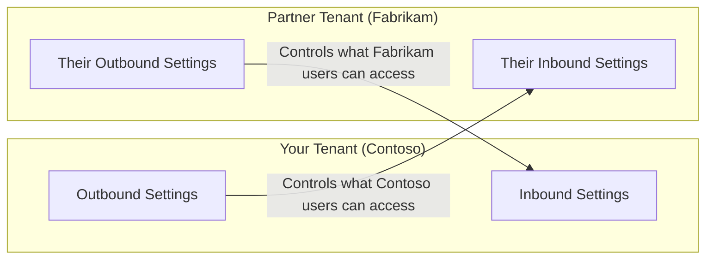

# How to Implement Microsoft Entra Cross-Tenant Access Settings for External Organization Trust

Author: [nawazdhandala](https://www.github.com/nawazdhandala)

Tags: Azure, Microsoft Entra, Cross-Tenant, B2B, External Identity, Collaboration, Zero Trust

Description: Learn how to configure Microsoft Entra cross-tenant access settings to establish trust relationships with external organizations for secure B2B collaboration.

---

When your organization collaborates with external partners, vendors, or subsidiaries that have their own Microsoft Entra tenants, you need a way to control how those relationships work. Cross-tenant access settings in Microsoft Entra ID let you define exactly what external organizations can do in your tenant and what your users can do in theirs. This replaces the old approach of blindly allowing all B2B guest invitations and hoping for the best.

In this post, I will walk through configuring inbound and outbound access settings, establishing trust for MFA and device compliance, and setting up organization-specific policies.

## Understanding Cross-Tenant Access

Cross-tenant access settings control two directions of collaboration:

**Inbound access:** How external users from other organizations access resources in YOUR tenant. This covers B2B collaboration (guest accounts) and B2B direct connect (accessing shared channels in Teams without a guest account).

**Outbound access:** How YOUR users access resources in other organizations' tenants. This controls which of your users can accept invitations to external tenants and what applications they can access there.

**Trust settings:** Whether your tenant trusts MFA claims, compliant device claims, and Hybrid Azure AD joined device claims from the external organization. This is important because without trust, external users must redo MFA in your tenant even if they already completed MFA in their home tenant.



## Default Settings vs Organization-Specific Settings

Cross-tenant access has two layers:

1. **Default settings:** Apply to ALL external organizations unless overridden
2. **Organization-specific settings:** Override the defaults for a named organization

The typical approach is:

- Set restrictive defaults (block or limit external access)
- Add organization-specific settings for trusted partners with more permissive access

## Step 1: Review and Configure Default Settings

Go to the Microsoft Entra admin center. Navigate to External Identities, then Cross-tenant access settings. Click on the "Default settings" tab.

**Default inbound access:**

The default allows all external users to be invited as guests. For a more secure posture, restrict this:

- B2B collaboration: Block all external users and applications by default
- B2B direct connect: Block by default

**Default outbound access:**

Controls which of your users can access external tenants:

- B2B collaboration: Allow all users and applications (or restrict to specific groups)
- B2B direct connect: Block by default

**Default trust settings:**

By default, your tenant does not trust MFA or device claims from external organizations. Leave this as the default and only enable trust for specific organizations.

Here is how to configure defaults using Microsoft Graph PowerShell:

```powershell
# Connect to Microsoft Graph
Connect-MgGraph -Scopes "Policy.ReadWrite.CrossTenantAccess"

# Get current default settings
$defaults = Get-MgPolicyCrossTenantAccessPolicyDefault

# Update default inbound settings to block all B2B collaboration
# This is the restrictive default approach
$inboundParams = @{
    B2BCollaborationInbound = @{
        UsersAndGroups = @{
            AccessType = "blocked"
            # Block all external users by default
            Targets = @(
                @{
                    Target = "AllUsers"
                    TargetType = "user"
                }
            )
        }
        Applications = @{
            AccessType = "blocked"
            Targets = @(
                @{
                    Target = "AllApplications"
                    TargetType = "application"
                }
            )
        }
    }
}

Update-MgPolicyCrossTenantAccessPolicyDefault -BodyParameter $inboundParams
```

## Step 2: Add a Trusted Organization

Now add an organization-specific policy for a partner you trust. You need the partner's tenant ID. You can find it by asking the partner admin, or by looking it up from their domain.

```powershell
# Add an organization-specific cross-tenant access policy
# Replace with the partner's actual tenant ID
$partnerTenantId = "fabrikam-tenant-id-here"

# Create the organization entry
New-MgPolicyCrossTenantAccessPolicyPartner -TenantId $partnerTenantId

# Configure inbound access for this specific organization
# Allow their users to be invited as guests, but only to specific apps
$partnerInbound = @{
    TenantId = $partnerTenantId
    B2BCollaborationInbound = @{
        UsersAndGroups = @{
            AccessType = "allowed"
            Targets = @(
                @{
                    Target = "AllUsers"
                    TargetType = "user"
                }
            )
        }
        Applications = @{
            AccessType = "allowed"
            Targets = @(
                @{
                    # Only allow access to specific applications
                    Target = "your-app-id-here"
                    TargetType = "application"
                }
            )
        }
    }
}

Update-MgPolicyCrossTenantAccessPolicyPartner -CrossTenantAccessPolicyConfigurationPartnerTenantId $partnerTenantId -BodyParameter $partnerInbound
```

## Step 3: Configure MFA Trust

This is one of the most valuable settings. Without MFA trust, a partner user who already completed MFA in their home tenant (Fabrikam) will be asked to complete MFA again in your tenant (Contoso). This creates a bad user experience and often confuses external users.

When you enable MFA trust for a partner organization, your tenant accepts the MFA claim from their tenant. The user only does MFA once.

```powershell
# Enable MFA and device compliance trust for the partner organization
$trustSettings = @{
    TenantId = $partnerTenantId
    InboundTrust = @{
        # Trust MFA completed in the partner's tenant
        IsMfaAccepted = $true
        # Trust compliant device claims from the partner
        IsCompliantDeviceAccepted = $true
        # Trust hybrid Azure AD join claims
        IsHybridAzureADJoinedDeviceAccepted = $true
    }
}

Update-MgPolicyCrossTenantAccessPolicyPartner `
    -CrossTenantAccessPolicyConfigurationPartnerTenantId $partnerTenantId `
    -BodyParameter $trustSettings
```

Important considerations for MFA trust:

- Only enable this for organizations you trust to have strong MFA policies. If the partner allows weak MFA methods (like SMS), those will be accepted in your tenant.
- MFA trust does not bypass your Conditional Access policies. It just means the MFA claim from the partner is accepted as satisfying the MFA requirement.
- You can trust MFA but not device compliance, or vice versa. Configure each independently.

## Step 4: Configure Outbound Access

Outbound settings control what your users can do when they accept an invitation to an external tenant. Restrict this to prevent data exfiltration scenarios.

```powershell
# Configure outbound access for the partner organization
# Allow only specific user groups to access the partner tenant
$outboundSettings = @{
    TenantId = $partnerTenantId
    B2BCollaborationOutbound = @{
        UsersAndGroups = @{
            AccessType = "allowed"
            Targets = @(
                @{
                    # Only the partner collaboration group can go to this tenant
                    Target = "group-id-for-partner-collab-team"
                    TargetType = "group"
                }
            )
        }
        Applications = @{
            AccessType = "allowed"
            Targets = @(
                @{
                    Target = "AllApplications"
                    TargetType = "application"
                }
            )
        }
    }
}

Update-MgPolicyCrossTenantAccessPolicyPartner `
    -CrossTenantAccessPolicyConfigurationPartnerTenantId $partnerTenantId `
    -BodyParameter $outboundSettings
```

## Step 5: Enable Automatic Redemption (Optional)

Automatic redemption removes the consent prompt that external users see when they first access your tenant. When enabled, users from the partner organization are automatically redeemed without having to click "Accept" on the invitation.

This only works when BOTH tenants enable automatic redemption for each other.

```powershell
# Enable automatic redemption for the partner
$redemptionSettings = @{
    TenantId = $partnerTenantId
    AutomaticUserConsentSettings = @{
        InboundAllowed = $true
        OutboundAllowed = $true
    }
}

Update-MgPolicyCrossTenantAccessPolicyPartner `
    -CrossTenantAccessPolicyConfigurationPartnerTenantId $partnerTenantId `
    -BodyParameter $redemptionSettings
```

## Step 6: Configure B2B Direct Connect (Teams Shared Channels)

B2B direct connect allows external users to access Teams shared channels without creating a guest account in your tenant. The user stays in their home tenant and accesses the shared channel directly.

```powershell
# Enable B2B direct connect for the partner (Teams shared channels)
$directConnectSettings = @{
    TenantId = $partnerTenantId
    B2BDirectConnectInbound = @{
        UsersAndGroups = @{
            AccessType = "allowed"
            Targets = @(
                @{
                    Target = "AllUsers"
                    TargetType = "user"
                }
            )
        }
        Applications = @{
            AccessType = "allowed"
            Targets = @(
                @{
                    # Office 365 app ID for Teams
                    Target = "00000003-0000-0ff1-ce00-000000000000"
                    TargetType = "application"
                }
            )
        }
    }
    B2BDirectConnectOutbound = @{
        UsersAndGroups = @{
            AccessType = "allowed"
            Targets = @(
                @{
                    Target = "AllUsers"
                    TargetType = "user"
                }
            )
        }
        Applications = @{
            AccessType = "allowed"
            Targets = @(
                @{
                    Target = "00000003-0000-0ff1-ce00-000000000000"
                    TargetType = "application"
                }
            )
        }
    }
}

Update-MgPolicyCrossTenantAccessPolicyPartner `
    -CrossTenantAccessPolicyConfigurationPartnerTenantId $partnerTenantId `
    -BodyParameter $directConnectSettings
```

## Monitoring Cross-Tenant Access

Use sign-in logs to monitor how cross-tenant access is being used:

```
// KQL query for cross-tenant sign-in activity
SigninLogs
| where TimeGenerated > ago(7d)
// Filter for cross-tenant sign-ins
| where HomeTenantId != ResourceTenantId
| summarize
    SignInCount = count(),
    UniqueUsers = dcount(UserPrincipalName),
    Applications = make_set(AppDisplayName)
    by HomeTenantId, ResourceTenantId
| order by SignInCount desc
```

## Best Practices

- Start with restrictive defaults and add specific organizations as needed. This is the zero-trust approach.
- Only enable MFA trust for organizations that have MFA policies at least as strong as yours.
- Review organization-specific settings quarterly. Partnerships end, and you do not want stale trust relationships.
- Use security groups to control which users can participate in outbound B2B collaboration. Do not allow all users by default.
- Document each organization-specific setting with the business justification and the contact person at the partner organization.
- Test the full user experience from the partner side before announcing the integration. Sign-in flows can be confusing for external users if not configured properly.

## Summary

Cross-tenant access settings give you precise control over B2B collaboration in Microsoft Entra ID. By setting restrictive defaults and adding per-organization trust relationships, you maintain a zero-trust posture while enabling the collaboration your business needs. MFA trust settings are particularly valuable for user experience, and outbound controls prevent your users from being invited to untrusted tenants. Take the time to configure these properly and review them regularly.
