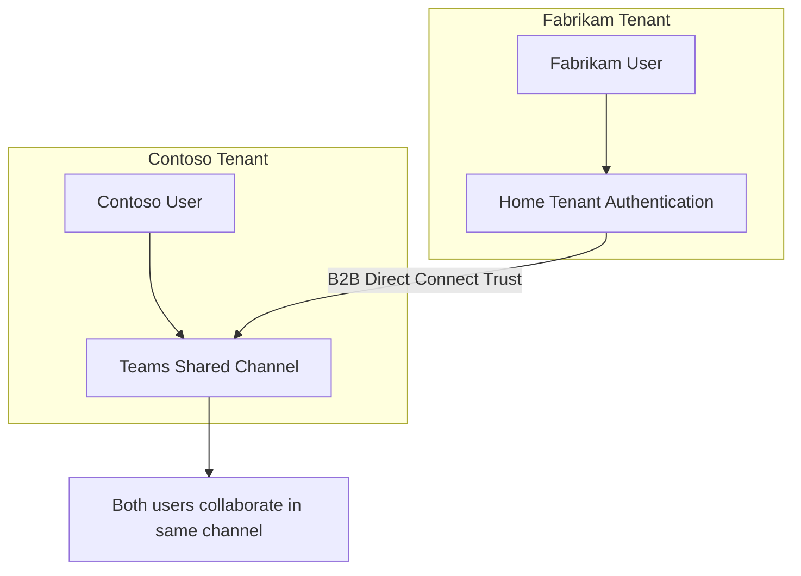

# How to Implement Microsoft Entra ID B2B Direct Connect for Shared Channels in Teams

Author: [nawazdhandala](https://www.github.com/nawazdhandala)

Tags: Microsoft Entra ID, B2B Direct Connect, Microsoft Teams, Shared Channels, Cross-Tenant, Collaboration, Identity

Description: Learn how to configure Microsoft Entra ID B2B Direct Connect to enable shared channels in Teams for seamless cross-organization collaboration.

---

Cross-organization collaboration in Microsoft Teams used to mean adding guest users to your tenant. Guests show up with a "(Guest)" tag next to their name, they switch between tenants constantly, and your IT team has to manage their lifecycle. B2B Direct Connect changes this by letting external users participate in shared channels without being added as guests. They stay in their home tenant, use their home credentials, and appear in your shared channel as if they belong there.

This guide covers how to configure B2B Direct Connect between two organizations, set up the Teams policies, and manage the security implications.

## How B2B Direct Connect Differs from B2B Collaboration

Microsoft Entra ID has two models for external identity access:

**B2B Collaboration (Guest Users)**: External users are added to your tenant as guest objects. They get a user record in your directory, can be assigned roles and licenses, and show up in your user list. They switch tenants to access your resources.

**B2B Direct Connect**: External users access your resources directly from their home tenant. No guest object is created in your directory. The user authenticates with their home tenant and is granted access through a trust relationship. Currently, this is primarily used for Teams shared channels.



The practical difference for end users is significant. With B2B Direct Connect, Fabrikam users see the shared channel right in their own Teams client without switching tenants. Files shared in the channel are stored in the channel host's SharePoint, but access is seamless.

## Prerequisites

Both organizations need:

- Microsoft 365 Business Basic (or higher) licenses with Teams enabled
- Microsoft Entra ID P1 or P2 (for cross-tenant access settings)
- Teams administrator and Global Administrator roles
- Agreement between both organizations to establish the trust relationship

Both sides must configure their cross-tenant access settings. This is not a one-way setup - both organizations must explicitly enable inbound and outbound B2B Direct Connect.

## Step 1: Configure Cross-Tenant Access Settings (Organization A - Contoso)

Start by adding the partner organization and configuring B2B Direct Connect settings.

Navigate to Microsoft Entra admin center > External Identities > Cross-tenant access settings.

### Add the Partner Organization

```powershell
# Connect to Microsoft Graph
Connect-MgGraph -Scopes "Policy.ReadWrite.CrossTenantAccess"

# Add Fabrikam as a partner organization
$partnerConfig = @{
    TenantId = "fabrikam-tenant-id"
}

New-MgPolicyCrossTenantAccessPolicyPartner -BodyParameter $partnerConfig
```

### Configure Outbound B2B Direct Connect

Outbound settings control whether your users can access shared channels in the partner organization.

```powershell
# Enable outbound B2B Direct Connect for Fabrikam
$outboundSettings = @{
    B2bDirectConnectOutbound = @{
        UsersAndGroups = @{
            AccessType = "allowed"
            Targets = @(
                @{
                    Target = "AllUsers"
                    TargetType = "user"
                }
            )
        }
        Applications = @{
            AccessType = "allowed"
            Targets = @(
                @{
                    Target = "Office365"
                    TargetType = "application"
                }
            )
        }
    }
}

Update-MgPolicyCrossTenantAccessPolicyPartner `
    -CrossTenantAccessPolicyConfigurationPartnerTenantId "fabrikam-tenant-id" `
    -BodyParameter $outboundSettings
```

### Configure Inbound B2B Direct Connect

Inbound settings control whether partner users can access shared channels in your organization.

```powershell
# Enable inbound B2B Direct Connect from Fabrikam
$inboundSettings = @{
    B2bDirectConnectInbound = @{
        UsersAndGroups = @{
            AccessType = "allowed"
            Targets = @(
                @{
                    Target = "AllUsers"
                    TargetType = "user"
                }
            )
        }
        Applications = @{
            AccessType = "allowed"
            Targets = @(
                @{
                    Target = "Office365"
                    TargetType = "application"
                }
            )
        }
    }
}

Update-MgPolicyCrossTenantAccessPolicyPartner `
    -CrossTenantAccessPolicyConfigurationPartnerTenantId "fabrikam-tenant-id" `
    -BodyParameter $inboundSettings
```

## Step 2: Configure Cross-Tenant Access Settings (Organization B - Fabrikam)

Fabrikam must perform the same configuration in reverse. They add Contoso as a partner and enable both inbound and outbound B2B Direct Connect.

The Fabrikam administrator follows the same steps as above, replacing the tenant ID with Contoso's tenant ID.

This mutual configuration requirement is an important security feature. Neither organization can establish B2B Direct Connect unilaterally.

## Step 3: Configure Teams Shared Channel Policy

Teams administrators need to enable shared channels in the Teams admin center.

Navigate to Teams admin center > Teams > Teams policies.

```powershell
# Connect to Teams PowerShell
Connect-MicrosoftTeams

# Create or update the Teams policy to allow shared channels
Set-CsTeamsChannelsPolicy -Identity "Global" `
    -AllowSharedChannelCreation $true `
    -AllowChannelSharingToExternalUser $true `
    -AllowUserToParticipateInExternalSharedChannel $true
```

These three settings control different aspects:

- **AllowSharedChannelCreation**: Lets users create shared channels within their teams
- **AllowChannelSharingToExternalUser**: Lets team owners invite external users to shared channels
- **AllowUserToParticipateInExternalSharedChannel**: Lets your users join shared channels hosted by external organizations

You can also create targeted policies for specific groups instead of modifying the global policy.

```powershell
# Create a policy for the sales team that allows external shared channels
New-CsTeamsChannelsPolicy -Identity "SalesTeamPolicy" `
    -AllowSharedChannelCreation $true `
    -AllowChannelSharingToExternalUser $true `
    -AllowUserToParticipateInExternalSharedChannel $true

# Assign the policy to the sales group
Grant-CsTeamsChannelsPolicy -Group "sales-security-group-id" `
    -PolicyName "SalesTeamPolicy"
```

## Step 4: Create and Share a Channel

With the configuration in place, team owners can now create shared channels and invite external participants.

In the Teams client:
1. Right-click a team and select "Add channel"
2. Set the channel type to "Shared"
3. Name the channel (e.g., "Joint Project - Contoso x Fabrikam")
4. Click "Create"
5. Click "Share channel" and select "With people or teams from another organization"
6. Enter the email address of the Fabrikam user or team
7. The external user receives a notification and can join the channel

From the Fabrikam user's perspective, the shared channel appears under a new section in their Teams client. They do not need to switch tenants or accept a guest invitation.

## Step 5: Verify the Connection

After setting up the shared channel, verify that the B2B Direct Connect is functioning correctly.

```powershell
# Check the cross-tenant access partner configuration
Get-MgPolicyCrossTenantAccessPolicyPartner -CrossTenantAccessPolicyConfigurationPartnerTenantId "fabrikam-tenant-id" |
    Select-Object TenantId,
    @{Name='InboundB2BDC'; Expression={$_.B2bDirectConnectInbound.UsersAndGroups.AccessType}},
    @{Name='OutboundB2BDC'; Expression={$_.B2bDirectConnectOutbound.UsersAndGroups.AccessType}}
```

You can also check the sign-in logs for B2B Direct Connect authentication events.

```powershell
# Query sign-in logs for B2B Direct Connect events
Get-MgAuditLogSignIn -Filter "crossTenantAccessType eq 'b2bDirectConnect'" -Top 10 |
    Select-Object UserDisplayName, AppDisplayName, CreatedDateTime, Status
```

## Step 6: Apply Conditional Access to B2B Direct Connect Users

Even though B2B Direct Connect users do not have guest accounts in your tenant, you can still apply Conditional Access policies to them.

Create a Conditional Access policy targeting external users.

```powershell
# Create a Conditional Access policy for B2B Direct Connect users
$caPolicy = @{
    DisplayName = "Require MFA for B2B Direct Connect Users"
    State = "enabled"
    Conditions = @{
        Users = @{
            IncludeGuestsOrExternalUsers = @{
                GuestOrExternalUserTypes = "b2bDirectConnectUser"
                ExternalTenants = @{
                    MembershipKind = "all"
                }
            }
        }
        Applications = @{
            IncludeApplications = @("All")
        }
    }
    GrantControls = @{
        Operator = "OR"
        BuiltInControls = @("mfa")
    }
}

New-MgIdentityConditionalAccessPolicy -BodyParameter $caPolicy
```

You can also trust the MFA claims from the partner tenant instead of forcing users to complete MFA again in your context. This provides a better user experience while maintaining security.

```powershell
# Trust MFA claims from the partner tenant
$trustSettings = @{
    InboundTrust = @{
        IsMfaAccepted = $true
        IsCompliantDeviceAccepted = $false
        IsHybridAzureADJoinedDeviceAccepted = $false
    }
}

Update-MgPolicyCrossTenantAccessPolicyPartner `
    -CrossTenantAccessPolicyConfigurationPartnerTenantId "fabrikam-tenant-id" `
    -BodyParameter $trustSettings
```

## Step 7: Monitor and Audit B2B Direct Connect Activity

Track cross-tenant access through the Entra ID sign-in logs and audit logs.

```kql
// KQL query to monitor B2B Direct Connect sign-ins in Log Analytics
SigninLogs
| where TimeGenerated > ago(7d)
| where CrossTenantAccessType == "b2bDirectConnect"
| summarize
    SignInCount = count(),
    UniqueUsers = dcount(UserPrincipalName)
    by HomeTenantId, ResourceDisplayName
| order by SignInCount desc
```

Review the access patterns regularly:
- Which partner tenants are most active?
- Which applications are being accessed?
- Are there any unexpected access patterns?

## Restricting B2B Direct Connect to Specific Users

For more granular control, restrict which users in the partner organization can access your shared channels.

Instead of allowing all users, target specific groups.

```powershell
# Restrict inbound B2B Direct Connect to a specific Fabrikam group
$restrictedInbound = @{
    B2bDirectConnectInbound = @{
        UsersAndGroups = @{
            AccessType = "allowed"
            Targets = @(
                @{
                    # Only allow users from a specific group in Fabrikam's tenant
                    Target = "fabrikam-project-group-id"
                    TargetType = "group"
                }
            )
        }
        Applications = @{
            AccessType = "allowed"
            Targets = @(
                @{
                    Target = "Office365"
                    TargetType = "application"
                }
            )
        }
    }
}

Update-MgPolicyCrossTenantAccessPolicyPartner `
    -CrossTenantAccessPolicyConfigurationPartnerTenantId "fabrikam-tenant-id" `
    -BodyParameter $restrictedInbound
```

## Common Issues and Solutions

**Users cannot see the shared channel**: Verify that both tenants have configured cross-tenant access settings and that Teams policies allow external shared channels. Policy propagation can take up to 24 hours.

**MFA prompts are excessive**: Configure inbound trust settings to accept MFA claims from the partner tenant. This prevents double MFA prompts.

**Shared channel files are inaccessible**: Files in shared channels are stored in the hosting tenant's SharePoint. Make sure the B2B Direct Connect settings include the SharePoint application.

**Channel sharing option is greyed out**: The Teams channel policy must allow sharing to external users, and the team owner must have the correct policy assigned.

## Wrapping Up

B2B Direct Connect fundamentally improves how organizations collaborate in Microsoft Teams. External users participate in shared channels without guest accounts, without tenant switching, and without the administrative overhead of managing guest lifecycles. The setup requires mutual configuration between both organizations, appropriate Teams policies, and thoughtful Conditional Access settings. Once in place, users from both organizations can work together in shared channels as naturally as if they were in the same tenant.
