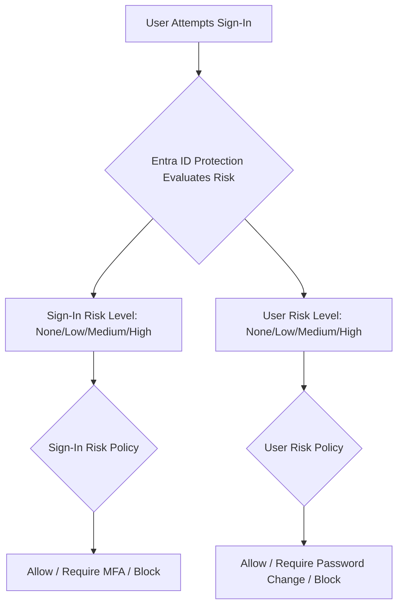

# How to Implement Microsoft Entra ID Protection Policies for Risky Users and Sign-Ins

Author: [nawazdhandala](https://www.github.com/nawazdhandala)

Tags: Microsoft Entra ID, Identity Protection, Risk Policies, Conditional Access, MFA, Security, Zero Trust

Description: Learn how to configure Microsoft Entra ID Protection risk policies to automatically detect and respond to compromised identities and suspicious sign-in activities.

---

Every identity in your organization is a potential attack vector. Credentials get phished, passwords get leaked in breaches, and attackers use VPNs and Tor to mask their locations. Microsoft Entra ID Protection uses machine learning to detect these risks in real time and lets you build automated responses that protect your organization without requiring manual intervention for every alert.

This guide covers how to set up both user risk and sign-in risk policies, tune them to reduce noise, and integrate them with conditional access for a layered defense.

## Understanding Risk Detection

Entra ID Protection evaluates two types of risk:

**Sign-in risk** measures the probability that a specific authentication request was not made by the legitimate account owner. Common detections include:
- Anonymous IP address usage (Tor, VPN exit nodes)
- Atypical travel (sign-in from New York, then Tokyo 20 minutes later)
- Malware-linked IP addresses
- Unfamiliar sign-in properties (new device, new location, new browser)
- Password spray attacks

**User risk** represents the overall likelihood that an account has been compromised. It aggregates signals over time:
- Leaked credentials found on the dark web
- Anomalous user activity patterns
- Threat intelligence indicators linked to the account
- History of risky sign-ins

Each risk is classified as Low, Medium, or High. The policy you build determines what happens at each level.



## Prerequisites

Before configuring risk policies, you need:

- Microsoft Entra ID P2 licenses for all users who will be covered
- Global Administrator or Security Administrator role
- MFA already configured and available for your users (risk policies often require MFA as a response)
- A break-glass account excluded from all conditional access policies

## Step 1: Review Current Risk Detections

Before creating policies, see what risks Entra ID Protection is already detecting in your environment. This gives you a baseline and helps you set appropriate thresholds.

Navigate to the Azure portal > Microsoft Entra ID > Security > Identity Protection > Risk detections.

You can also query risk detections programmatically using Microsoft Graph.

```bash
# Query recent risk detections using Microsoft Graph API
az rest --method GET \
  --url "https://graph.microsoft.com/v1.0/identityProtection/riskDetections" \
  --query "value[0:10].{user:userDisplayName, riskLevel:riskLevel, riskType:riskEventType, timestamp:activityDateTime, location:location.city}" \
  --output table
```

Review the output to understand which risk types are most common in your environment. If you see a lot of "unfamiliar sign-in properties" detections, it might be because your users travel frequently or use VPNs, and you may want to adjust the policy threshold accordingly.

## Step 2: Configure the Sign-In Risk Policy

The sign-in risk policy runs at authentication time and can require additional verification or block the sign-in entirely.

**Using the Portal:**

1. Navigate to Microsoft Entra ID > Security > Identity Protection > Sign-in risk policy
2. Set the **Users** scope to "All users" (or a specific group for testing)
3. Under **Exclude**, add your break-glass accounts
4. Set the **Sign-in risk** threshold to "Medium and above"
5. Under **Access**, select "Allow access" with "Require multi-factor authentication"
6. Set **Enforce policy** to "On"
7. Click Save

**Using Microsoft Graph PowerShell:**

```powershell
# Connect to Microsoft Graph with the required permissions
Connect-MgGraph -Scopes "Policy.ReadWrite.ConditionalAccess"

# Create a conditional access policy that acts as the sign-in risk policy
$params = @{
    DisplayName = "Require MFA for Medium and High Risk Sign-Ins"
    State = "enabled"
    Conditions = @{
        # Apply to all users
        Users = @{
            IncludeUsers = @("All")
            ExcludeUsers = @("break-glass-account-object-id")
        }
        # Apply to all cloud apps
        Applications = @{
            IncludeApplications = @("All")
        }
        # Trigger on medium and high sign-in risk
        SignInRiskLevels = @("medium", "high")
    }
    GrantControls = @{
        Operator = "OR"
        BuiltInControls = @("mfa")
    }
}

# Create the policy
New-MgIdentityConditionalAccessPolicy -BodyParameter $params
```

With this policy in place, any sign-in detected as medium or high risk will require the user to complete MFA before access is granted. If the user successfully completes MFA, the sign-in risk is automatically remediated.

## Step 3: Configure the User Risk Policy

The user risk policy is different from sign-in risk because it addresses ongoing account compromise rather than a single suspicious sign-in. When a user is flagged as risky, the policy can require a password change.

**Using the Portal:**

1. Navigate to Microsoft Entra ID > Security > Identity Protection > User risk policy
2. Set the **Users** scope to "All users"
3. Exclude break-glass accounts
4. Set the **User risk** threshold to "High"
5. Under **Access**, select "Allow access" with "Require password change"
6. Set **Enforce policy** to "On"
7. Click Save

**Using Microsoft Graph PowerShell:**

```powershell
# Create a conditional access policy for user risk remediation
$userRiskParams = @{
    DisplayName = "Require Password Change for High Risk Users"
    State = "enabled"
    Conditions = @{
        Users = @{
            IncludeUsers = @("All")
            ExcludeUsers = @("break-glass-account-object-id")
        }
        Applications = @{
            IncludeApplications = @("All")
        }
        # Trigger on high user risk only
        UserRiskLevels = @("high")
    }
    GrantControls = @{
        Operator = "AND"
        BuiltInControls = @("mfa", "passwordChange")
    }
}

New-MgIdentityConditionalAccessPolicy -BodyParameter $userRiskParams
```

When a user is flagged as high risk, they will be required to change their password and verify with MFA the next time they sign in. The combination of MFA plus password change ensures that even if the password was compromised, the attacker cannot use it anymore.

## Step 4: Handle Self-Service Password Reset Integration

For the user risk policy to work smoothly, your users need the ability to change their own passwords. This requires Self-Service Password Reset (SSPR) to be enabled.

If SSPR is not enabled, high-risk users will be blocked and will need to contact the helpdesk, which creates a support burden and delays remediation.

Check your SSPR configuration under Microsoft Entra ID > Password reset. Ensure that:
- SSPR is enabled for at least the groups covered by your user risk policy
- Users have registered at least two authentication methods
- Password writeback is configured if you have on-premises AD

## Step 5: Monitor and Investigate Risky Users

After the policies are active, monitor the Risky users and Risky sign-ins reports in the Identity Protection blade.

For risky users, you have three options:
- **Confirm compromised** - if your investigation confirms the account is compromised, this sets the risk to High and triggers the user risk policy immediately
- **Dismiss risk** - if you determine the detection was a false positive, this clears the risk flag
- **Reset password** - manually forces a password reset for the user

```powershell
# List all users currently flagged as risky
Get-MgRiskyUser -Filter "riskLevel eq 'high'" -Property DisplayName,UserPrincipalName,RiskLevel,RiskLastUpdatedDateTime |
    Select-Object DisplayName, UserPrincipalName, RiskLevel, RiskLastUpdatedDateTime

# Manually confirm a user as compromised
Confirm-MgRiskyUserCompromised -UserIds @("user-object-id")

# Dismiss risk for a user after investigation
Invoke-MgDismissRiskyUser -UserIds @("user-object-id")
```

## Step 6: Tune Risk Policy Thresholds

The initial policy configuration is a starting point. You will need to tune the thresholds based on your organization's risk tolerance and the volume of detections.

Here is a general guideline:

| Risk Level | Sign-In Risk Action | User Risk Action |
|---|---|---|
| Low | Monitor only (no enforcement) | Monitor only |
| Medium | Require MFA | Monitor or require MFA |
| High | Require MFA or block | Require password change + MFA |

If you are seeing too many false positives at the Medium level, raise the threshold to High and investigate the Medium detections manually for a few weeks. If you are not seeing enough enforcement, lower the threshold.

## Step 7: Exclude Known Safe Locations

Some risk detections, like "atypical travel," can fire when users are at known corporate offices or using approved VPN gateways. Define named locations to reduce false positives.

Navigate to Microsoft Entra ID > Security > Conditional Access > Named locations. Add your office IP ranges and mark them as trusted.

Then update your sign-in risk policy to exclude sign-ins from trusted locations, or create a separate, more lenient policy for those locations.

## Automation with Microsoft Graph

For large organizations, managing risk policies manually does not scale. Here is how to automate the review of risky users.

```python
# Python script to auto-remediate low and medium risk users
# that have been flagged for more than 7 days without investigation
import requests
from datetime import datetime, timedelta

headers = {"Authorization": f"Bearer {access_token}"}

# Get risky users flagged more than 7 days ago
response = requests.get(
    "https://graph.microsoft.com/v1.0/identityProtection/riskyUsers",
    headers=headers,
    params={
        "$filter": "riskLevel eq 'low' or riskLevel eq 'medium'",
        "$select": "id,userPrincipalName,riskLevel,riskLastUpdatedDateTime"
    }
)

stale_users = []
cutoff = datetime.utcnow() - timedelta(days=7)

for user in response.json().get("value", []):
    last_updated = datetime.fromisoformat(user["riskLastUpdatedDateTime"].rstrip("Z"))
    if last_updated < cutoff:
        stale_users.append(user["id"])

# Dismiss risk for stale low/medium risk users
if stale_users:
    requests.post(
        "https://graph.microsoft.com/v1.0/identityProtection/riskyUsers/dismiss",
        headers=headers,
        json={"userIds": stale_users}
    )
    print(f"Dismissed risk for {len(stale_users)} users")
```

## Wrapping Up

Microsoft Entra ID Protection risk policies are one of the most effective tools for catching compromised identities early. The key is to start with conservative thresholds (high risk only), verify that the detections are accurate in your environment, then gradually expand coverage to medium risk. Combine sign-in risk policies with user risk policies for defense in depth, make sure SSPR is enabled for seamless remediation, and review the risky users report regularly. Over time, your organization will develop a strong automated response to identity-based attacks with minimal analyst overhead.
