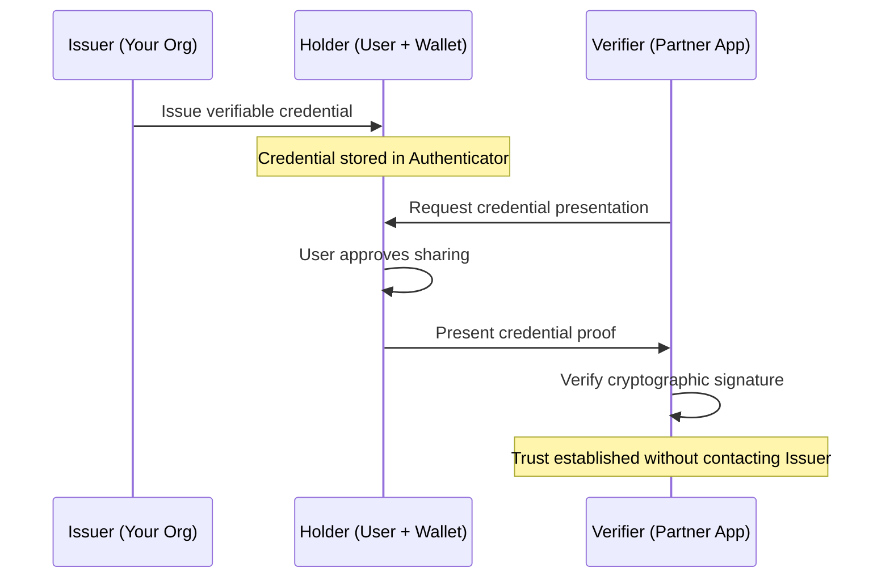

# How to Implement Microsoft Entra Verified ID for Decentralized Identity Credential Issuance

Author: [nawazdhandala](https://www.github.com/nawazdhandala)

Tags: Azure, Microsoft Entra, Verified ID, Decentralized Identity, Verifiable Credentials, Identity, DID

Description: A practical guide to setting up Microsoft Entra Verified ID to issue and verify decentralized identity credentials for employee verification and partner onboarding.

---

Traditional identity verification requires sharing sensitive personal data with every service that needs to verify who you are. Microsoft Entra Verified ID flips this model using decentralized identity standards. Instead of sharing your actual data, you hold a cryptographically signed credential in your digital wallet, and you present just the proof needed - nothing more. The verifier can check the credential's authenticity without contacting the issuer directly.

This guide covers setting up the Verified ID service, creating credential types, issuing credentials to users, and building a verification flow.

## How Verified ID Works

The system has three roles:

**Issuer:** Your organization. You verify a claim about a user (for example, that they are an employee) and issue a verifiable credential.

**Holder:** The user. They store the credential in a digital wallet (Microsoft Authenticator app) and choose when to present it.

**Verifier:** The party that needs to check the claim. They request the credential, verify the cryptographic signature, and trust the result without contacting the issuer.



The underlying technology uses W3C Verifiable Credentials and Decentralized Identifiers (DIDs). Microsoft manages the DID infrastructure so you do not need to understand the cryptographic details.

## Prerequisites

- Microsoft Entra ID P1 or P2 license
- Global Administrator role (for initial setup)
- Azure subscription for hosting the issuance/verification service
- An Azure Key Vault for signing key storage
- Users with Microsoft Authenticator app installed (for holding credentials)

## Step 1: Set Up the Verified ID Service

Go to the Microsoft Entra admin center. Navigate to Verified ID (under Verifiable credentials or the Identity section, depending on your portal version).

The setup wizard walks you through:

**Organization name:** This appears on the credential and in the user's wallet. Use your official organization name.

**Domain:** Verify a domain that you own. This links your DID to a recognizable domain name, so credential holders and verifiers can see which organization issued the credential.

**Key Vault:** Select or create an Azure Key Vault for storing the signing keys. The Verified ID service will create signing keys in this vault.

```bash
# Create a Key Vault for Verified ID signing keys
az keyvault create \
  --name myVerifiedIdKeyVault \
  --resource-group myResourceGroup \
  --location eastus \
  --sku standard \
  --enable-rbac-authorization true

# Grant the Verified ID service access to the Key Vault
# The Verified ID service principal needs Key Vault Crypto Officer role
VERIFIED_ID_SP="bb2a64ee-5d29-4b07-a491-25806dc854d3"

az role assignment create \
  --assignee $VERIFIED_ID_SP \
  --role "Key Vault Crypto Officer" \
  --scope "/subscriptions/{sub-id}/resourceGroups/{rg}/providers/Microsoft.KeyVault/vaults/myVerifiedIdKeyVault"
```

After completing the wizard, Entra ID creates a DID (Decentralized Identifier) for your organization. This is a unique identifier that looks something like `did:web:contoso.com`.

## Step 2: Verify Your Domain

Domain verification proves that your organization controls the domain associated with your DID. The service provides a DID configuration file that you need to host on your domain.

1. Download the `did-configuration.json` file from the Verified ID setup page
2. Host it at `https://yourdomain.com/.well-known/did-configuration.json`
3. Click "Verify" in the portal

This file contains a signed statement linking your domain to your DID. Anyone can verify this link by checking the file on your domain.

## Step 3: Create a Credential Type

A credential type defines what claims the credential contains. For an employee verification credential, you might include:

- Employee name
- Job title
- Department
- Employee ID
- Employment start date

In the Entra admin center, go to Verified ID, then Credentials. Click "Add a credential."

You define the credential using a rules file and a display file:

**Display definition (controls how the credential looks in the wallet):**

```json
{
  // Display definition for the employee credential
  "locale": "en-US",
  "card": {
    "title": "Contoso Employee Credential",
    "issuedBy": "Contoso Ltd.",
    "backgroundColor": "#1E3A5F",
    "textColor": "#FFFFFF",
    "logo": {
      "uri": "https://contoso.com/logo.png",
      "description": "Contoso Logo"
    },
    "description": "This credential verifies that the holder is a current employee of Contoso Ltd."
  },
  "consent": {
    "title": "Employee Verification",
    "instructions": "Please review the information below. By accepting, a verifiable credential will be added to your Microsoft Authenticator."
  },
  "claims": {
    "vc.credentialSubject.displayName": {
      "type": "String",
      "label": "Name"
    },
    "vc.credentialSubject.jobTitle": {
      "type": "String",
      "label": "Job Title"
    },
    "vc.credentialSubject.department": {
      "type": "String",
      "label": "Department"
    },
    "vc.credentialSubject.employeeId": {
      "type": "String",
      "label": "Employee ID"
    }
  }
}
```

**Rules definition (controls what data is collected and how the credential is structured):**

```json
{
  // Rules definition for the employee credential
  "attestations": {
    "idTokenHints": [
      {
        "mapping": [
          {
            "outputClaim": "displayName",
            "required": true,
            "inputClaim": "name",
            "indexed": false
          },
          {
            "outputClaim": "jobTitle",
            "required": true,
            "inputClaim": "jobTitle",
            "indexed": false
          },
          {
            "outputClaim": "department",
            "required": true,
            "inputClaim": "department",
            "indexed": false
          },
          {
            "outputClaim": "employeeId",
            "required": true,
            "inputClaim": "employeeId",
            "indexed": true
          }
        ],
        "required": true
      }
    ]
  },
  "validityInterval": 2592000,
  "vc": {
    "type": ["VerifiedEmployee"]
  }
}
```

The `validityInterval` is in seconds. 2592000 seconds equals 30 days, meaning the credential expires after 30 days and needs to be reissued.

## Step 4: Build the Issuance Application

To issue credentials, you build a web application that calls the Verified ID Request API. When a user visits the issuance page, the app:

1. Authenticates the user (using Entra ID)
2. Retrieves their employee data
3. Calls the Verified ID API to create an issuance request
4. Displays a QR code for the user to scan with Authenticator

Here is a Node.js example for the issuance endpoint:

```javascript
const express = require('express');
const { ConfidentialClientApplication } = require('@azure/msal-node');
const axios = require('axios');

const app = express();

// MSAL configuration for authenticating to the Verified ID API
const msalConfig = {
    auth: {
        clientId: 'your-app-client-id',
        authority: 'https://login.microsoftonline.com/your-tenant-id',
        clientSecret: 'your-client-secret'
    }
};

const msalClient = new ConfidentialClientApplication(msalConfig);

// Endpoint to start the credential issuance flow
app.post('/api/issue-credential', async (req, res) => {
    try {
        // Get an access token for the Verified ID API
        const tokenResponse = await msalClient.acquireTokenByClientCredential({
            scopes: ['3db474b9-6a0c-4840-96ac-1fceb342124f/.default']
        });

        // Build the issuance request
        // The claims come from the authenticated user's profile
        const issuanceRequest = {
            includeQRCode: true,
            callback: {
                url: 'https://yourapp.com/api/issuance-callback',
                state: req.body.sessionId,
                headers: {
                    'api-key': 'your-callback-api-key'
                }
            },
            authority: 'did:web:contoso.com',
            registration: {
                clientName: 'Contoso Employee Portal'
            },
            type: 'VerifiedEmployee',
            manifest: 'https://verifiedid.did.msidentity.com/v1.0/tenants/{tenant-id}/verifiableCredentials/contracts/{contract-id}/manifest',
            claims: {
                displayName: req.body.userName,
                jobTitle: req.body.jobTitle,
                department: req.body.department,
                employeeId: req.body.employeeId
            }
        };

        // Call the Verified ID issuance API
        const response = await axios.post(
            'https://verifiedid.did.msidentity.com/v1.0/verifiableCredentials/createIssuanceRequest',
            issuanceRequest,
            {
                headers: {
                    'Authorization': `Bearer ${tokenResponse.accessToken}`,
                    'Content-Type': 'application/json'
                }
            }
        );

        // Return the QR code URL to the frontend
        res.json({
            qrCode: response.data.qrCode,
            requestId: response.data.requestId
        });
    } catch (error) {
        console.error('Issuance error:', error.response?.data || error.message);
        res.status(500).json({ error: 'Failed to create issuance request' });
    }
});

app.listen(3000);
```

## Step 5: Build the Verification Application

The verification side is similar. A partner organization or application requests that the user present their employee credential.

```javascript
// Endpoint to start the credential verification flow
app.post('/api/verify-credential', async (req, res) => {
    try {
        const tokenResponse = await msalClient.acquireTokenByClientCredential({
            scopes: ['3db474b9-6a0c-4840-96ac-1fceb342124f/.default']
        });

        // Build the presentation (verification) request
        const presentationRequest = {
            includeQRCode: true,
            callback: {
                url: 'https://yourapp.com/api/verification-callback',
                state: req.body.sessionId,
                headers: {
                    'api-key': 'your-callback-api-key'
                }
            },
            authority: 'did:web:contoso.com',
            registration: {
                clientName: 'Partner Verification Portal'
            },
            // Request specific credential types
            requestedCredentials: [
                {
                    type: 'VerifiedEmployee',
                    // Which claims to request from the credential
                    // Only request what you need (data minimization)
                    purpose: 'Verify employment status',
                    acceptedIssuers: ['did:web:contoso.com']
                }
            ]
        };

        const response = await axios.post(
            'https://verifiedid.did.msidentity.com/v1.0/verifiableCredentials/createPresentationRequest',
            presentationRequest,
            {
                headers: {
                    'Authorization': `Bearer ${tokenResponse.accessToken}`,
                    'Content-Type': 'application/json'
                }
            }
        );

        res.json({
            qrCode: response.data.qrCode,
            requestId: response.data.requestId
        });
    } catch (error) {
        console.error('Verification error:', error.response?.data || error.message);
        res.status(500).json({ error: 'Failed to create verification request' });
    }
});
```

## Step 6: Handle Callbacks

Both issuance and verification use callbacks to notify your application of the result:

```javascript
// Callback handler for issuance completion
app.post('/api/issuance-callback', (req, res) => {
    const body = req.body;
    // Check the status of the issuance
    if (body.requestStatus === 'issuance_successful') {
        console.log(`Credential issued successfully for session: ${body.state}`);
        // Update your application state
    } else if (body.requestStatus === 'issuance_error') {
        console.error(`Issuance failed: ${body.error.message}`);
    }
    res.sendStatus(200);
});

// Callback handler for verification completion
app.post('/api/verification-callback', (req, res) => {
    const body = req.body;
    if (body.requestStatus === 'presentation_verified') {
        // The credential was verified successfully
        // Extract the verified claims
        const claims = body.verifiedCredentialsData[0].claims;
        console.log(`Verified employee: ${claims.displayName}`);
        console.log(`Department: ${claims.department}`);
    }
    res.sendStatus(200);
});
```

## Use Cases for Verified ID

Beyond employee verification, common use cases include:

- **Partner onboarding:** Partners present a credential issued by their organization to access your B2B portal.
- **Education verification:** Universities issue degree credentials that employers can verify.
- **Background checks:** Issue a credential after a background check passes, so the user can present it to multiple employers without repeating the check.
- **Age verification:** Issue an "over 18" credential without revealing the actual birthdate.

## Credential Revocation

If an employee leaves or a credential needs to be invalidated, you can revoke it. Entra Verified ID supports status lists for revocation. When you revoke a credential, verifiers who check the status will see it is no longer valid.

Revocation is configured at the credential type level and checked during the verification flow automatically.

## Best Practices

- Only include claims in the credential that are necessary. The principle of data minimization applies strongly here.
- Set reasonable validity intervals. Shorter intervals mean more frequent reissuance but lower risk from compromised credentials.
- Build the issuance flow into existing processes (like employee onboarding) so it is not an extra step.
- Test the full issuance and verification flow with real Authenticator apps before going to production.
- Monitor issuance and verification logs in Entra ID for failed attempts or unusual patterns.

## Summary

Microsoft Entra Verified ID brings decentralized identity to your organization. Set up the service, define credential types with the claims you need, build issuance and verification applications using the Request API, and integrate the flow into your business processes. The technology is still maturing, but it already solves real problems around identity verification, employee verification for partners, and privacy-preserving credential sharing.
