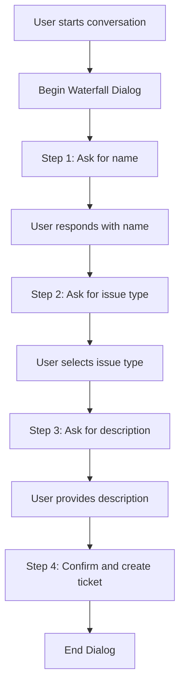

# How to Implement Multi-Turn Conversations in Azure Bot Service

Author: [nawazdhandala](https://www.github.com/nawazdhandala)

Tags: Azure Bot Service, Multi-Turn Dialogs, Bot Framework, Conversational AI, Waterfall Dialogs, State Management, Python

Description: Learn how to build multi-turn conversation flows in Azure Bot Service using dialogs, prompts, and state management for complex user interactions.

---

A bot that only handles single-question-single-answer interactions is limited. Real conversations involve multiple steps. A user might say "I want to book a flight," and the bot needs to ask where they are going, when they want to fly, how many passengers, and which class they prefer. This kind of back-and-forth is what multi-turn conversations are all about.

Azure Bot Service's Bot Framework SDK provides a dialog system specifically designed for this. Dialogs manage conversational state, prompt users for input, validate responses, and branch based on user choices. In this guide, I will walk through building a multi-turn conversation flow using waterfall dialogs and prompts.

## Understanding the Dialog System

The Bot Framework dialog system has a few key concepts:

- **Dialog Set**: A collection of dialogs that your bot can use
- **Waterfall Dialog**: A sequence of steps that execute in order, like a wizard
- **Prompts**: Built-in dialogs for collecting specific types of input (text, numbers, dates, choices)
- **Dialog Context**: Manages the current position in the dialog stack
- **Conversation State**: Persists data across turns of a conversation



## Prerequisites

- Python 3.9+
- Bot Framework SDK for Python
- An Azure Bot Service resource (or Bot Framework Emulator for local testing)

Install the required packages:

```bash
# Install Bot Framework SDK packages including dialogs
pip install botbuilder-core botbuilder-dialogs botbuilder-integration-aiohttp
```

## Step 1: Set Up State Management

Multi-turn dialogs need state management to remember where the user is in the conversation and what data has been collected so far.

```python
# config.py - State management setup
from botbuilder.core import (
    MemoryStorage,
    ConversationState,
    UserState
)

# In-memory storage works for development
# Use CosmosDbPartitionedStorage or BlobStorage for production
storage = MemoryStorage()

# Conversation state persists data for the duration of a conversation
conversation_state = ConversationState(storage)

# User state persists data across conversations for a specific user
user_state = UserState(storage)
```

## Step 2: Create the Data Model

Define a class to hold the data collected during the multi-turn dialog:

```python
# ticket_data.py - Data model for the support ticket dialog
class TicketData:
    """Holds data collected during the ticket creation dialog."""

    def __init__(self):
        self.name = None        # User's name
        self.email = None       # User's email address
        self.issue_type = None  # Category of the issue
        self.priority = None    # Priority level
        self.description = None # Detailed description of the issue
```

## Step 3: Build the Waterfall Dialog

A waterfall dialog defines a series of steps that execute sequentially. Each step typically prompts the user for input, and the next step processes that input.

```python
# ticket_dialog.py - Multi-turn dialog for creating a support ticket
from botbuilder.dialogs import (
    WaterfallDialog,
    WaterfallStepContext,
    DialogTurnResult,
    ComponentDialog,
)
from botbuilder.dialogs.prompts import (
    TextPrompt,
    ChoicePrompt,
    ConfirmPrompt,
    PromptOptions,
    PromptValidatorContext,
)
from botbuilder.dialogs.choices import Choice
from botbuilder.core import MessageFactory
from ticket_data import TicketData

class TicketDialog(ComponentDialog):
    """A multi-step dialog that collects information for a support ticket."""

    def __init__(self, dialog_id: str = None):
        super().__init__(dialog_id or TicketDialog.__name__)

        # Register the prompts that the waterfall steps will use
        self.add_dialog(TextPrompt("TextPrompt"))
        self.add_dialog(TextPrompt("EmailPrompt", self._validate_email))
        self.add_dialog(ChoicePrompt("ChoicePrompt"))
        self.add_dialog(ConfirmPrompt("ConfirmPrompt"))

        # Define the waterfall steps in order
        self.add_dialog(
            WaterfallDialog(
                "WaterfallDialog",
                [
                    self.name_step,
                    self.email_step,
                    self.issue_type_step,
                    self.priority_step,
                    self.description_step,
                    self.confirm_step,
                    self.final_step,
                ],
            )
        )

        # Set the initial dialog to run
        self.initial_dialog_id = "WaterfallDialog"

    async def name_step(self, step_context: WaterfallStepContext) -> DialogTurnResult:
        """Step 1: Ask for the user's name."""
        # Store a new TicketData instance in the step options
        step_context.values["ticket_data"] = TicketData()

        return await step_context.prompt(
            "TextPrompt",
            PromptOptions(
                prompt=MessageFactory.text(
                    "Let's create a support ticket. What is your name?"
                )
            ),
        )

    async def email_step(self, step_context: WaterfallStepContext) -> DialogTurnResult:
        """Step 2: Ask for the user's email. Store the name from the previous step."""
        # Save the name from the previous step
        step_context.values["ticket_data"].name = step_context.result

        return await step_context.prompt(
            "EmailPrompt",
            PromptOptions(
                prompt=MessageFactory.text(
                    f"Thanks, {step_context.result}. What is your email address?"
                ),
                retry_prompt=MessageFactory.text(
                    "That does not look like a valid email address. "
                    "Please enter a valid email (e.g., user@example.com)."
                ),
            ),
        )

    async def issue_type_step(
        self, step_context: WaterfallStepContext
    ) -> DialogTurnResult:
        """Step 3: Ask for the issue type using a choice prompt."""
        step_context.values["ticket_data"].email = step_context.result

        return await step_context.prompt(
            "ChoicePrompt",
            PromptOptions(
                prompt=MessageFactory.text("What type of issue are you experiencing?"),
                choices=[
                    Choice("Bug Report"),
                    Choice("Feature Request"),
                    Choice("Account Issue"),
                    Choice("Performance Problem"),
                    Choice("Other"),
                ],
            ),
        )

    async def priority_step(
        self, step_context: WaterfallStepContext
    ) -> DialogTurnResult:
        """Step 4: Ask for the priority level."""
        # The choice prompt returns a FoundChoice object
        step_context.values["ticket_data"].issue_type = step_context.result.value

        return await step_context.prompt(
            "ChoicePrompt",
            PromptOptions(
                prompt=MessageFactory.text("What priority level should this be?"),
                choices=[
                    Choice("Critical"),
                    Choice("High"),
                    Choice("Medium"),
                    Choice("Low"),
                ],
            ),
        )

    async def description_step(
        self, step_context: WaterfallStepContext
    ) -> DialogTurnResult:
        """Step 5: Ask for a detailed description of the issue."""
        step_context.values["ticket_data"].priority = step_context.result.value

        return await step_context.prompt(
            "TextPrompt",
            PromptOptions(
                prompt=MessageFactory.text(
                    "Please describe the issue in detail. "
                    "Include any error messages or steps to reproduce."
                )
            ),
        )

    async def confirm_step(
        self, step_context: WaterfallStepContext
    ) -> DialogTurnResult:
        """Step 6: Show a summary and ask for confirmation."""
        ticket = step_context.values["ticket_data"]
        ticket.description = step_context.result

        # Show the user a summary of what they entered
        summary = (
            f"Here is your ticket summary:\n\n"
            f"- **Name**: {ticket.name}\n"
            f"- **Email**: {ticket.email}\n"
            f"- **Issue Type**: {ticket.issue_type}\n"
            f"- **Priority**: {ticket.priority}\n"
            f"- **Description**: {ticket.description}\n\n"
            f"Would you like to submit this ticket?"
        )

        return await step_context.prompt(
            "ConfirmPrompt",
            PromptOptions(prompt=MessageFactory.text(summary)),
        )

    async def final_step(
        self, step_context: WaterfallStepContext
    ) -> DialogTurnResult:
        """Step 7: Process the confirmation and end the dialog."""
        if step_context.result:
            ticket = step_context.values["ticket_data"]
            # In a real bot, you would save the ticket to a database here
            await step_context.context.send_activity(
                f"Your support ticket has been created successfully! "
                f"Ticket ID: TKT-{hash(ticket.description) % 10000:04d}. "
                f"We will get back to you at {ticket.email}."
            )
        else:
            await step_context.context.send_activity(
                "Ticket creation cancelled. Let me know if you need anything else."
            )

        # End the dialog and return to the parent
        return await step_context.end_dialog()

    @staticmethod
    async def _validate_email(
        prompt_context: PromptValidatorContext,
    ) -> bool:
        """Validate that the input looks like an email address."""
        value = prompt_context.recognized.value
        # Simple email validation - check for @ and at least one dot after it
        if value and "@" in value and "." in value.split("@")[-1]:
            return True
        return False
```

## Step 4: Wire Up the Bot with Dialogs

Now connect the dialog to your main bot class:

```python
# bot.py - Main bot that manages the dialog lifecycle
from botbuilder.core import ActivityHandler, TurnContext
from botbuilder.dialogs import DialogSet, DialogTurnStatus
from ticket_dialog import TicketDialog

class SupportBot(ActivityHandler):
    def __init__(self, conversation_state, user_state):
        self.conversation_state = conversation_state
        self.user_state = user_state

        # Create a dialog state accessor for tracking active dialogs
        self.dialog_state = conversation_state.create_property("DialogState")

        # Create the dialog set and add our ticket dialog
        self.dialogs = DialogSet(self.dialog_state)
        self.dialogs.add(TicketDialog())

    async def on_message_activity(self, turn_context: TurnContext):
        """Handle incoming messages by managing the dialog stack."""
        # Create a dialog context from the current turn
        dialog_context = await self.dialogs.create_context(turn_context)

        # Try to continue an existing dialog first
        result = await dialog_context.continue_dialog()

        # If no dialog is active, check if we should start one
        if result.status == DialogTurnStatus.Empty:
            text = turn_context.activity.text.lower().strip()

            if "ticket" in text or "support" in text or "help" in text:
                # Start the ticket creation dialog
                await dialog_context.begin_dialog(TicketDialog.__name__)
            else:
                await turn_context.send_activity(
                    "I can help you create a support ticket. "
                    "Just say 'create ticket' to get started."
                )

        # Save state changes at the end of every turn
        await self.conversation_state.save_changes(turn_context)
        await self.user_state.save_changes(turn_context)

    async def on_members_added_activity(self, members_added, turn_context):
        """Welcome new users."""
        for member in members_added:
            if member.id != turn_context.activity.recipient.id:
                await turn_context.send_activity(
                    "Welcome! I can help you create support tickets. "
                    "Type 'create ticket' to get started."
                )
```

## Step 5: Handle Interruptions

Real users do not always follow the happy path. They might want to cancel mid-dialog, ask for help, or change their mind. Add interruption handling:

```python
# Add this method to the TicketDialog class for handling interruptions
async def on_continue_dialog(self, inner_dc):
    """Check for interruptions before continuing the dialog."""
    result = await self._interrupt(inner_dc)
    if result is not None:
        return result
    return await super().on_continue_dialog(inner_dc)

async def _interrupt(self, inner_dc):
    """Handle common interruptions like cancel and help."""
    text = inner_dc.context.activity.text
    if text is None:
        return None

    text = text.lower().strip()

    # User wants to cancel the current dialog
    if text in ("cancel", "quit", "stop", "never mind"):
        await inner_dc.context.send_activity(
            "Cancelling the current operation."
        )
        return await inner_dc.cancel_all_dialogs()

    # User wants help
    if text in ("help", "?"):
        await inner_dc.context.send_activity(
            "You are creating a support ticket. "
            "Answer each question to proceed, or type 'cancel' to stop."
        )
        # Return a waiting status so the current prompt re-displays
        return DialogTurnResult(DialogTurnStatus.Waiting)

    return None
```

## Persisting State for Production

For production use, replace `MemoryStorage` with a durable storage backend:

```python
# production_config.py - Use Azure Cosmos DB for state persistence
from botbuilder.azure import CosmosDbPartitionedStorage, CosmosDbPartitionedConfig

# Configure Cosmos DB storage so state survives restarts
cosmos_config = CosmosDbPartitionedConfig(
    cosmos_db_endpoint="https://your-cosmos.documents.azure.com:443/",
    auth_key="your-key",
    database_id="bot-state",
    container_id="state-store",
    compatibility_mode=False
)

storage = CosmosDbPartitionedStorage(cosmos_config)
```

## Summary

Multi-turn conversations are essential for any bot that needs to collect structured information from users. The Bot Framework SDK's dialog system provides waterfall dialogs for sequential flows, prompts with built-in validation, and state management for tracking progress across turns. By combining these components, you can build conversational experiences that feel natural while still ensuring all required data gets collected reliably. The key is to design each step clearly, validate input early, handle interruptions gracefully, and persist state in durable storage for production reliability.
