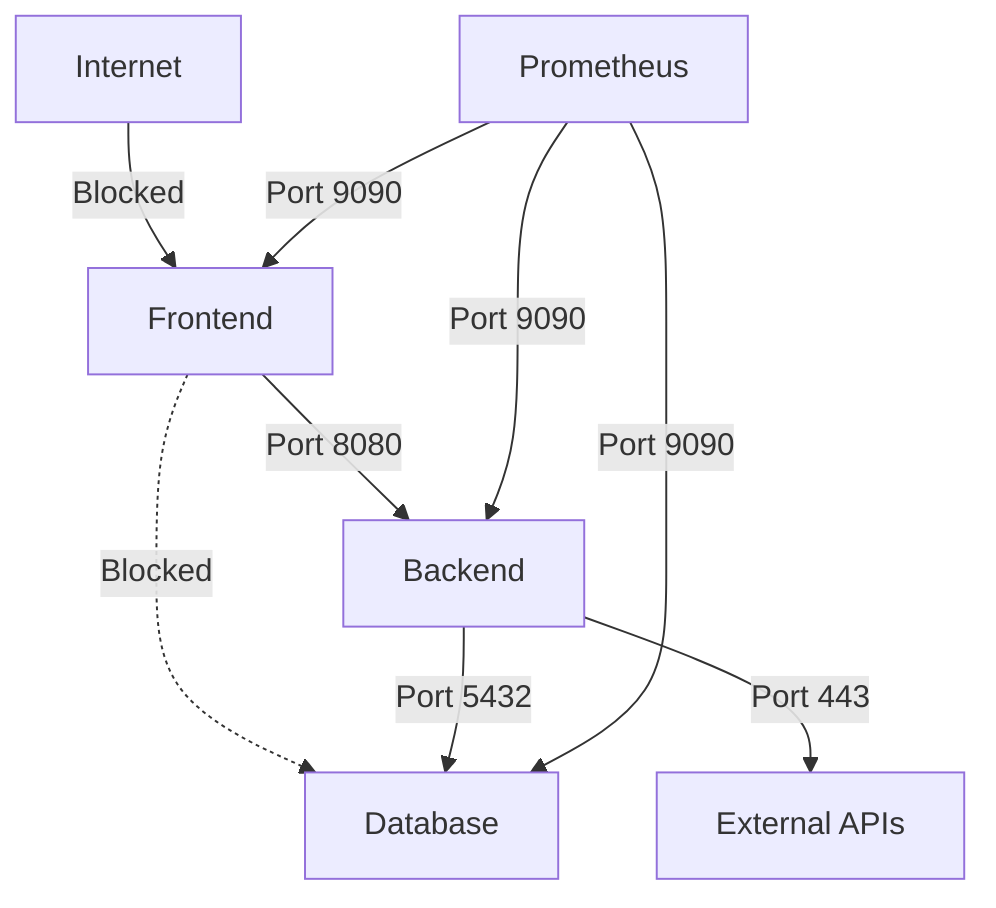

# How to Implement Network Policies with Calico on AKS to Restrict Pod-to-Pod Traffic

Author: [nawazdhandala](https://www.github.com/nawazdhandala)

Tags: AKS, Calico, Network Policies, Kubernetes, Security, Networking, Zero Trust

Description: Practical guide to implementing Calico network policies on AKS to restrict pod-to-pod communication and enforce a zero-trust network model.

---

By default, every pod in a Kubernetes cluster can talk to every other pod. There are no firewalls between namespaces, no access controls between services. A compromised pod can reach the database, the secrets store, and every other service in the cluster. Network policies fix this by acting as firewalls at the pod level, and Calico is the most capable network policy engine available for AKS.

## Why Calico Over Azure Network Policies

AKS supports two network policy engines: Azure Network Policies and Calico. Azure Network Policies handle basic ingress rules but have significant limitations - they do not support egress policies, deny rules, or policy ordering. Calico supports all of these plus global policies, DNS-based rules, and rich label selectors. For any serious network segmentation, Calico is the better choice.

## Prerequisites

- An AKS cluster with Calico network policy enabled
- kubectl configured for the cluster
- Understanding of Kubernetes labels and selectors

If your cluster was not created with Calico, you can enable it during cluster creation.

```bash
# Create an AKS cluster with Calico network policy
az aks create \
  --resource-group myResourceGroup \
  --name myAKSCluster \
  --network-plugin azure \
  --network-policy calico \
  --node-count 3 \
  --generate-ssh-keys
```

Note: You cannot switch an existing cluster from Azure network policy to Calico. If you need Calico, you must create a new cluster or recreate the cluster with the Calico policy engine.

## Understanding Network Policy Basics

Network policies work by selecting pods using labels and defining what traffic is allowed. Important concepts:

- **If no network policy selects a pod, all traffic is allowed** (default allow).
- **If any network policy selects a pod, only traffic explicitly allowed by a policy is permitted** (default deny for selected pods).
- **Ingress rules** control traffic coming into a pod.
- **Egress rules** control traffic leaving a pod.
- **Policies are additive** - if multiple policies select the same pod, the union of all allowed traffic applies.

## Step 1: Deploy a Test Application

Set up a multi-tier application to practice with network policies.

```yaml
# test-app.yaml
# Three-tier application: frontend, backend, and database
apiVersion: v1
kind: Namespace
metadata:
  name: app
---
# Frontend deployment
apiVersion: apps/v1
kind: Deployment
metadata:
  name: frontend
  namespace: app
  labels:
    app: frontend
    tier: frontend
spec:
  replicas: 2
  selector:
    matchLabels:
      app: frontend
  template:
    metadata:
      labels:
        app: frontend
        tier: frontend
    spec:
      containers:
      - name: nginx
        image: nginx:1.25
        ports:
        - containerPort: 80
---
# Backend deployment
apiVersion: apps/v1
kind: Deployment
metadata:
  name: backend
  namespace: app
spec:
  replicas: 2
  selector:
    matchLabels:
      app: backend
  template:
    metadata:
      labels:
        app: backend
        tier: backend
    spec:
      containers:
      - name: nginx
        image: nginx:1.25
        ports:
        - containerPort: 8080
---
# Database deployment
apiVersion: apps/v1
kind: Deployment
metadata:
  name: database
  namespace: app
spec:
  replicas: 1
  selector:
    matchLabels:
      app: database
  template:
    metadata:
      labels:
        app: database
        tier: database
    spec:
      containers:
      - name: postgres
        image: postgres:15
        ports:
        - containerPort: 5432
        env:
        - name: POSTGRES_PASSWORD
          value: testpassword
---
# Services for each tier
apiVersion: v1
kind: Service
metadata:
  name: frontend
  namespace: app
spec:
  selector:
    app: frontend
  ports:
  - port: 80
---
apiVersion: v1
kind: Service
metadata:
  name: backend
  namespace: app
spec:
  selector:
    app: backend
  ports:
  - port: 8080
---
apiVersion: v1
kind: Service
metadata:
  name: database
  namespace: app
spec:
  selector:
    app: database
  ports:
  - port: 5432
```

Apply with `kubectl apply -f test-app.yaml`.

## Step 2: Create a Default Deny Policy

The first network policy you should create is a default deny policy. This blocks all traffic that is not explicitly allowed, establishing a zero-trust baseline.

```yaml
# default-deny.yaml
# Block all ingress and egress traffic in the app namespace
# Only traffic explicitly allowed by other policies will be permitted
apiVersion: networking.k8s.io/v1
kind: NetworkPolicy
metadata:
  name: default-deny-all
  namespace: app
spec:
  podSelector: {}
  policyTypes:
  - Ingress
  - Egress
```

The empty `podSelector: {}` selects all pods in the namespace. After applying this, no pod in the `app` namespace can communicate with anything.

```bash
# Apply the default deny policy
kubectl apply -f default-deny.yaml

# Test - this should fail now
kubectl exec -n app deployment/frontend -- curl -s --max-time 3 http://backend:8080
```

## Step 3: Allow DNS Resolution

With egress denied, pods cannot resolve DNS names. You need to explicitly allow DNS traffic to the kube-dns service.

```yaml
# allow-dns.yaml
# Allow all pods in the app namespace to resolve DNS
# Without this, pods cannot resolve service names
apiVersion: networking.k8s.io/v1
kind: NetworkPolicy
metadata:
  name: allow-dns
  namespace: app
spec:
  podSelector: {}
  policyTypes:
  - Egress
  egress:
  - to:
    - namespaceSelector:
        matchLabels:
          kubernetes.io/metadata.name: kube-system
      podSelector:
        matchLabels:
          k8s-app: kube-dns
    ports:
    - protocol: UDP
      port: 53
    - protocol: TCP
      port: 53
```

## Step 4: Allow Frontend to Backend Traffic

Now selectively allow the frontend pods to talk to the backend pods on port 8080.

```yaml
# allow-frontend-to-backend.yaml
# Allow frontend pods to send traffic to backend pods
apiVersion: networking.k8s.io/v1
kind: NetworkPolicy
metadata:
  name: allow-frontend-to-backend
  namespace: app
spec:
  # This policy applies to backend pods
  podSelector:
    matchLabels:
      app: backend
  policyTypes:
  - Ingress
  ingress:
  - from:
    # Only allow traffic from pods with the frontend label
    - podSelector:
        matchLabels:
          app: frontend
    ports:
    - protocol: TCP
      port: 8080
---
# Also need to allow frontend egress to backend
apiVersion: networking.k8s.io/v1
kind: NetworkPolicy
metadata:
  name: frontend-egress-to-backend
  namespace: app
spec:
  podSelector:
    matchLabels:
      app: frontend
  policyTypes:
  - Egress
  egress:
  - to:
    - podSelector:
        matchLabels:
          app: backend
    ports:
    - protocol: TCP
      port: 8080
```

## Step 5: Allow Backend to Database Traffic

Similarly, allow only the backend to reach the database.

```yaml
# allow-backend-to-database.yaml
# Allow backend pods to connect to database pods on port 5432
apiVersion: networking.k8s.io/v1
kind: NetworkPolicy
metadata:
  name: allow-backend-to-database
  namespace: app
spec:
  podSelector:
    matchLabels:
      app: database
  policyTypes:
  - Ingress
  ingress:
  - from:
    - podSelector:
        matchLabels:
          app: backend
    ports:
    - protocol: TCP
      port: 5432
---
apiVersion: networking.k8s.io/v1
kind: NetworkPolicy
metadata:
  name: backend-egress-to-database
  namespace: app
spec:
  podSelector:
    matchLabels:
      app: backend
  policyTypes:
  - Egress
  egress:
  - to:
    - podSelector:
        matchLabels:
          app: database
    ports:
    - protocol: TCP
      port: 5432
```

## Step 6: Verify the Policies

Test that the allowed paths work and the denied paths are blocked.

```bash
# Frontend to backend should work
kubectl exec -n app deployment/frontend -- curl -s --max-time 3 http://backend:8080

# Frontend to database should be blocked
kubectl exec -n app deployment/frontend -- curl -s --max-time 3 http://database:5432
# This should time out

# Backend to database should work
kubectl exec -n app deployment/backend -- curl -s --max-time 3 http://database:5432

# Any pod from another namespace should be blocked
kubectl run test --rm -it --image=curlimages/curl -n default -- \
  curl -s --max-time 3 http://frontend.app.svc.cluster.local
# This should time out
```

## Step 7: Cross-Namespace Policies

Allow traffic from a monitoring namespace to scrape metrics from all pods.

```yaml
# allow-monitoring.yaml
# Allow Prometheus in the monitoring namespace to scrape metrics from app pods
apiVersion: networking.k8s.io/v1
kind: NetworkPolicy
metadata:
  name: allow-monitoring-scrape
  namespace: app
spec:
  podSelector: {}
  policyTypes:
  - Ingress
  ingress:
  - from:
    - namespaceSelector:
        matchLabels:
          kubernetes.io/metadata.name: monitoring
      podSelector:
        matchLabels:
          app: prometheus
    ports:
    - protocol: TCP
      port: 9090
```

The `namespaceSelector` combined with `podSelector` ensures only Prometheus pods in the monitoring namespace can reach the metrics port.

## Step 8: Allow External Egress

If your backend needs to call external APIs, allow egress to specific CIDR ranges.

```yaml
# allow-external-egress.yaml
# Allow backend pods to reach external APIs
apiVersion: networking.k8s.io/v1
kind: NetworkPolicy
metadata:
  name: backend-external-egress
  namespace: app
spec:
  podSelector:
    matchLabels:
      app: backend
  policyTypes:
  - Egress
  egress:
  # Allow HTTPS traffic to any external IP
  - to:
    - ipBlock:
        cidr: 0.0.0.0/0
        # Exclude internal cluster and VNet ranges
        except:
        - 10.0.0.0/8
        - 172.16.0.0/12
        - 192.168.0.0/16
    ports:
    - protocol: TCP
      port: 443
```

This allows the backend to make HTTPS calls to the internet while blocking access to internal network ranges. This is useful for preventing lateral movement if the backend is compromised.

## Visualizing Network Policies

Keeping track of network policies gets complex. Use the following command to list all policies and their targets.

```bash
# List all network policies and their pod selectors
kubectl get networkpolicies -n app -o wide

# View the details of a specific policy
kubectl describe networkpolicy allow-frontend-to-backend -n app
```

The traffic flow after applying all policies looks like this:



## Common Mistakes

**Forgetting DNS egress**: The most common issue. Pods cannot resolve service names without explicit DNS egress rules.

**Overlapping selectors causing unexpected allows**: Since policies are additive, a broad policy can accidentally allow traffic that a narrow policy intended to block.

**Not testing from the right pods**: Always test from the actual source pod, not from a different pod that might have different labels.

**Applying policies to the wrong namespace**: Network policies are namespace-scoped. A policy in namespace A does not affect pods in namespace B.

## Summary

Network policies with Calico on AKS let you enforce least-privilege networking between your pods. Start with a default deny policy, then selectively allow only the traffic paths your application needs. This approach limits the blast radius of a compromised pod and gives you an auditable record of which services are allowed to communicate. The initial setup takes effort, but it is one of the most effective security measures you can apply to a Kubernetes cluster.
