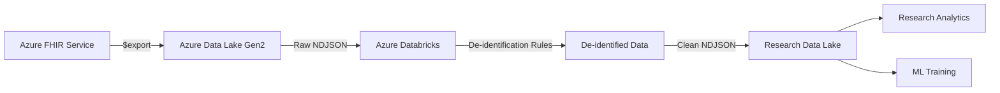

# How to Implement Patient Data De-Identification on Azure Using FHIR Export and Azure Databricks

Author: [nawazdhandala](https://www.github.com/nawazdhandala)

Tags: FHIR, De-Identification, Azure Databricks, Healthcare, HIPAA, PHI, Azure Health Data Services

Description: Build a de-identification pipeline that exports FHIR patient data, removes protected health information using Azure Databricks, and produces research-ready datasets.

---

Healthcare organizations need to share clinical data for research, analytics, and machine learning - but HIPAA regulations strictly control how Protected Health Information (PHI) can be used. De-identification is the process of removing or transforming PHI so that data can be used without violating patient privacy. The HIPAA Privacy Rule defines two methods: the Expert Determination method and the Safe Harbor method, which requires removing 18 specific identifier types.

This guide covers building a de-identification pipeline that exports data from an Azure FHIR server, processes it through Azure Databricks to remove PHI, and produces clean datasets for research use.

## Architecture



## The 18 HIPAA Safe Harbor Identifiers

The Safe Harbor method requires removing these identifier types:

1. Names
2. Geographic data smaller than state
3. Dates (except year) related to an individual
4. Phone numbers
5. Fax numbers
6. Email addresses
7. Social Security numbers
8. Medical record numbers
9. Health plan beneficiary numbers
10. Account numbers
11. Certificate/license numbers
12. Vehicle identifiers and serial numbers
13. Device identifiers and serial numbers
14. Web URLs
15. IP addresses
16. Biometric identifiers
17. Full-face photographs
18. Any other unique identifying number or code

## Step 1: Export Data from FHIR

Azure FHIR service supports the FHIR Bulk Data Export specification. This exports all data as NDJSON (Newline Delimited JSON) files to Azure Blob Storage.

### Configure Export Storage

1. Create an Azure Storage Account for the export.
2. In the FHIR service settings, configure the export storage account.
3. Grant the FHIR service's managed identity the "Storage Blob Data Contributor" role on the storage account.

### Trigger the Export

```bash
# Export all patient-related data from the FHIR server
# The $export operation runs asynchronously and returns a job URL
curl -X GET \
    "https://my-fhir-server.azurehealthcareapis.com/$export" \
    -H "Authorization: Bearer $TOKEN" \
    -H "Accept: application/fhir+json" \
    -H "Prefer: respond-async"
```

For a more targeted export, use the Patient compartment export:

```bash
# Export only specific resource types for all patients
curl -X GET \
    "https://my-fhir-server.azurehealthcareapis.com/Patient/$export?_type=Patient,Observation,Condition,MedicationRequest" \
    -H "Authorization: Bearer $TOKEN" \
    -H "Accept: application/fhir+json" \
    -H "Prefer: respond-async"
```

The response includes a `Content-Location` header with the URL to check export status:

```bash
# Check export status
curl -X GET \
    "https://my-fhir-server.azurehealthcareapis.com/_operations/export/{job-id}" \
    -H "Authorization: Bearer $TOKEN"
```

When the export completes, the response includes URLs to the NDJSON files in Blob Storage.

## Step 2: Set Up Azure Databricks

### Create a Databricks Workspace

1. In the Azure portal, create an Azure Databricks workspace.
2. Launch the workspace.
3. Create a cluster with:
   - Runtime: Databricks Runtime 13.x or later
   - Node type: Standard_DS3_v2 (or larger for big datasets)
   - Autoscaling: 1-4 workers

### Mount the Storage

Mount both the export storage (source) and the research data lake (destination):

```python
# Mount the FHIR export storage as a Databricks file system path
# Uses service principal authentication for secure access
dbutils.fs.mount(
    source="wasbs://fhir-export@exportstorageaccount.blob.core.windows.net",
    mount_point="/mnt/fhir-export",
    extra_configs={
        "fs.azure.account.key.exportstorageaccount.blob.core.windows.net":
            dbutils.secrets.get(scope="healthcare", key="export-storage-key")
    }
)

# Mount the research data lake for de-identified output
dbutils.fs.mount(
    source="wasbs://deidentified@researchlake.blob.core.windows.net",
    mount_point="/mnt/research-data",
    extra_configs={
        "fs.azure.account.key.researchlake.blob.core.windows.net":
            dbutils.secrets.get(scope="healthcare", key="research-storage-key")
    }
)
```

## Step 3: Build the De-identification Pipeline

### Load FHIR NDJSON Data

```python
# Load the exported FHIR NDJSON files into Spark DataFrames
# Each resource type is in a separate file
from pyspark.sql import functions as F
from pyspark.sql.types import StringType

# Read Patient resources
patients_df = spark.read.json("/mnt/fhir-export/Patient.ndjson")

# Read Observation resources (lab results, vitals, etc.)
observations_df = spark.read.json("/mnt/fhir-export/Observation.ndjson")

# Read Condition resources (diagnoses)
conditions_df = spark.read.json("/mnt/fhir-export/Condition.ndjson")

# Read MedicationRequest resources
medications_df = spark.read.json("/mnt/fhir-export/MedicationRequest.ndjson")

print(f"Patients: {patients_df.count()}")
print(f"Observations: {observations_df.count()}")
print(f"Conditions: {conditions_df.count()}")
print(f"Medications: {medications_df.count()}")
```

### De-identify Patient Resources

```python
# De-identify Patient resources following HIPAA Safe Harbor rules
# Removes or transforms all 18 identifier types
import hashlib
from pyspark.sql import functions as F
from pyspark.sql.types import StringType

# Salt for consistent pseudonymization
# Store this securely - it is the key to re-identification
HASH_SALT = dbutils.secrets.get(scope="healthcare", key="deidentification-salt")

def pseudonymize_id(original_id):
    """Generate a consistent pseudonym for a patient ID.
    Uses SHA-256 with a salt to create a one-way mapping."""
    if original_id is None:
        return None
    salted = f"{HASH_SALT}:{original_id}"
    return hashlib.sha256(salted.encode()).hexdigest()[:16]

# Register as UDF for Spark
pseudonymize_udf = F.udf(pseudonymize_id, StringType())

def generalize_date(date_str):
    """Generalize dates to year only for Safe Harbor compliance.
    Keeps the year, removes month and day."""
    if date_str is None:
        return None
    return date_str[:4]  # Keep only the year

generalize_date_udf = F.udf(generalize_date, StringType())

def generalize_zip(zip_code):
    """Generalize zip codes to first 3 digits per Safe Harbor rules.
    If the 3-digit zip has fewer than 20,000 people, set to 000."""
    if zip_code is None:
        return None
    # Small population 3-digit zips that must be zeroed out
    small_zips = {"036", "059", "063", "102", "203", "556", "692",
                  "790", "821", "823", "830", "831", "878", "879",
                  "884", "890", "893"}
    prefix = zip_code[:3]
    if prefix in small_zips:
        return "000"
    return prefix

generalize_zip_udf = F.udf(generalize_zip, StringType())

# Apply de-identification to Patient resources
deidentified_patients = patients_df \
    .withColumn("id", pseudonymize_udf(F.col("id"))) \
    .withColumn("birthDate", generalize_date_udf(F.col("birthDate"))) \
    .drop("name") \
    .drop("telecom") \
    .drop("identifier") \
    .drop("photo") \
    .withColumn("address",
        F.transform(F.col("address"), lambda addr:
            F.struct(
                F.lit(None).alias("line"),
                F.lit(None).alias("city"),
                addr.state.alias("state"),
                generalize_zip_udf(addr.postalCode).alias("postalCode"),
                addr.country.alias("country")
            )
        )
    )
```

### De-identify Observations

```python
# De-identify Observation resources
# Replace patient references with pseudonymized IDs
# Remove free-text notes that might contain PHI

def extract_patient_id(reference):
    """Extract patient ID from a FHIR reference string."""
    if reference is None:
        return None
    # Reference format: "Patient/patient-001"
    parts = reference.split("/")
    return parts[-1] if len(parts) > 1 else reference

extract_patient_id_udf = F.udf(extract_patient_id, StringType())

deidentified_observations = observations_df \
    .withColumn("id", pseudonymize_udf(F.col("id"))) \
    .withColumn("patient_id_raw",
        extract_patient_id_udf(F.col("subject.reference"))) \
    .withColumn("subject",
        F.struct(
            F.concat(F.lit("Patient/"),
                pseudonymize_udf(F.col("patient_id_raw"))
            ).alias("reference")
        )) \
    .drop("patient_id_raw") \
    .withColumn("effectiveDateTime",
        generalize_date_udf(F.col("effectiveDateTime"))) \
    .drop("performer") \
    .drop("note") \
    .drop("encounter")
```

### De-identify Conditions

```python
# De-identify Condition resources
# Keep clinical codes (ICD-10, SNOMED) but remove identifying references
deidentified_conditions = conditions_df \
    .withColumn("id", pseudonymize_udf(F.col("id"))) \
    .withColumn("patient_id_raw",
        extract_patient_id_udf(F.col("subject.reference"))) \
    .withColumn("subject",
        F.struct(
            F.concat(F.lit("Patient/"),
                pseudonymize_udf(F.col("patient_id_raw"))
            ).alias("reference")
        )) \
    .drop("patient_id_raw") \
    .withColumn("recordedDate",
        generalize_date_udf(F.col("recordedDate"))) \
    .drop("recorder") \
    .drop("asserter") \
    .drop("encounter") \
    .drop("note")
```

## Step 4: Validate De-identification

Before using the de-identified data, validate that all PHI has been removed.

```python
# Validation checks for de-identified Patient data
# Ensures no PHI remains in the dataset

def validate_deidentification(df, resource_type):
    """Run validation checks on de-identified data."""
    issues = []

    if resource_type == "Patient":
        # Check that names are removed
        if "name" in df.columns:
            issues.append("Patient names still present")

        # Check that phone/email are removed
        if "telecom" in df.columns:
            issues.append("Telecom (phone/email) still present")

        # Check that identifiers are removed
        if "identifier" in df.columns:
            issues.append("Identifiers (MRN, SSN) still present")

        # Check that dates are generalized to year only
        dates_with_month = df.filter(
            F.length(F.col("birthDate")) > 4
        ).count()
        if dates_with_month > 0:
            issues.append(
                f"{dates_with_month} records have non-generalized birth dates"
            )

        # Check that zip codes are generalized
        if "address" in df.columns:
            full_zips = df.select(
                F.explode("address").alias("addr")
            ).filter(
                F.length(F.col("addr.postalCode")) > 3
            ).count()
            if full_zips > 0:
                issues.append(f"{full_zips} records have full zip codes")

    # Check for free-text fields that might contain PHI
    text_fields = ["note", "text"]
    for field in text_fields:
        if field in df.columns:
            issues.append(f"Free-text field '{field}' still present")

    if issues:
        print(f"VALIDATION FAILED for {resource_type}:")
        for issue in issues:
            print(f"  - {issue}")
        return False
    else:
        print(f"VALIDATION PASSED for {resource_type}")
        return True

# Run validation on all de-identified datasets
all_valid = True
all_valid &= validate_deidentification(deidentified_patients, "Patient")
all_valid &= validate_deidentification(deidentified_observations, "Observation")
all_valid &= validate_deidentification(deidentified_conditions, "Condition")

if not all_valid:
    raise Exception("De-identification validation failed. Do not proceed.")
```

## Step 5: Write De-identified Data

```python
# Write the de-identified data to the research data lake
# Use NDJSON format for FHIR compatibility or Parquet for analytics

# Write as NDJSON (FHIR-compatible)
deidentified_patients.write \
    .mode("overwrite") \
    .json("/mnt/research-data/ndjson/Patient")

deidentified_observations.write \
    .mode("overwrite") \
    .json("/mnt/research-data/ndjson/Observation")

deidentified_conditions.write \
    .mode("overwrite") \
    .json("/mnt/research-data/ndjson/Condition")

# Also write as Parquet for efficient analytics queries
deidentified_patients.write \
    .mode("overwrite") \
    .parquet("/mnt/research-data/parquet/Patient")

deidentified_observations.write \
    .mode("overwrite") \
    .parquet("/mnt/research-data/parquet/Observation")

deidentified_conditions.write \
    .mode("overwrite") \
    .parquet("/mnt/research-data/parquet/Condition")

print("De-identified data written successfully")
```

## Step 6: Automate with Databricks Workflows

Create a Databricks Workflow to run the pipeline on a schedule:

1. In the Databricks workspace, go to Workflows > Create Job.
2. Add tasks:
   - Task 1: Trigger FHIR export (a notebook that calls the $export API)
   - Task 2: Wait for export completion (polls the export status)
   - Task 3: Run de-identification (the notebook containing the code above)
   - Task 4: Run validation (validation notebook)
   - Task 5: Notify stakeholders (send email on success or failure)
3. Set the schedule (e.g., weekly on Sunday at midnight).
4. Configure alerts for task failures.

## Step 7: Access Control for Research Data

The de-identified data lake needs its own access controls:

```bash
# Create a separate Azure AD group for researchers
# Only members of this group can access de-identified data
az ad group create --display-name "Healthcare Researchers" \
    --mail-nickname "healthcare-researchers"

# Grant the group read access to the research data lake
az role assignment create \
    --assignee-object-id {group-object-id} \
    --role "Storage Blob Data Reader" \
    --scope "/subscriptions/{sub}/resourceGroups/{rg}/providers/Microsoft.Storage/storageAccounts/researchlake"
```

### Data Use Agreements

Even with de-identified data, implement data governance:

- Require researchers to sign a Data Use Agreement before getting access.
- Log all access to the research data lake.
- Set expiration dates on access permissions.
- Regularly audit who has access and whether they still need it.

## Re-identification Risk

No de-identification is perfect. Mitigate re-identification risks:

- Store the pseudonymization salt in Azure Key Vault with strict access controls. Anyone with the salt can reverse the pseudonymization.
- Assess quasi-identifiers (combinations of fields that could identify individuals). For example, a rare disease combined with age and state might uniquely identify someone.
- Consider adding noise to numerical values (differential privacy) for highly sensitive datasets.
- Use k-anonymity checks to ensure each record is indistinguishable from at least k-1 other records.

## Wrapping Up

De-identifying FHIR data on Azure involves exporting from the FHIR server, processing with Databricks to remove or transform all 18 HIPAA Safe Harbor identifier types, validating the output, and storing the clean data in a separate research data lake. The key technical decisions are choosing between pseudonymization and full removal for identifiers, determining the right level of date generalization, handling free-text fields that might contain PHI, and implementing access controls on the research data. Automate the pipeline with Databricks Workflows and monitor it with validation checks and access auditing.
