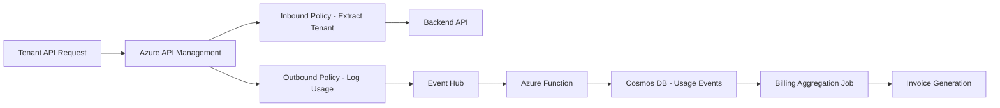

# How to Implement Per-Tenant Billing and Usage Tracking with Azure API Management and Cosmos DB

Author: [nawazdhandala](https://www.github.com/nawazdhandala)

Tags: Azure API Management, Cosmos DB, Billing, SaaS, Usage Tracking, Multi-Tenant, Metering

Description: Build a per-tenant billing and usage tracking system using Azure API Management policies and Cosmos DB for accurate SaaS metering.

---

Billing in a SaaS product is never simple. You are not just charging a flat monthly fee anymore - modern SaaS pricing involves usage tiers, API call quotas, overage charges, and per-feature metering. If you are running a multi-tenant SaaS on Azure, you need a way to track exactly how much each tenant is consuming and translate that into accurate invoices.

Azure API Management (APIM) sits in front of your APIs and gives you a natural place to count requests per tenant. Cosmos DB, with its fast writes and flexible schema, is a solid fit for storing high-volume usage events. In this guide, I will show you how to wire these two together to build a per-tenant billing and usage tracking system.

## Architecture Overview

Here is the flow from API request to invoice:



APIM handles the request, extracts the tenant identity, applies rate limits, and logs usage events. Those events flow through Event Hub into an Azure Function that writes them to Cosmos DB. A separate billing job aggregates the usage and generates invoices.

## Setting Up API Management with Tenant Identification

First, you need APIM to identify which tenant is making each request. The most common approach is to use a subscription key or JWT token that maps to a tenant:

```xml
<!-- APIM inbound policy that extracts tenant ID from the JWT token -->
<inbound>
    <base />
    <!-- Validate the JWT and extract tenant information -->
    <validate-jwt header-name="Authorization"
                  failed-validation-httpcode="401"
                  require-expiration-date="true"
                  require-signed-tokens="true">
        <openid-config url="https://login.microsoftonline.com/{tenant}/.well-known/openid-configuration" />
        <required-claims>
            <claim name="tenant_id" match="any" />
        </required-claims>
    </validate-jwt>

    <!-- Extract the tenant ID into a variable for later use -->
    <set-variable name="tenantId"
                  value="@(context.Request.Headers.GetValueOrDefault("Authorization","")
                    .AsJwt()?.Claims.GetValueOrDefault("tenant_id","unknown"))" />

    <!-- Apply per-tenant rate limiting -->
    <rate-limit-by-key calls="1000"
                       renewal-period="3600"
                       counter-key="@((string)context.Variables["tenantId"])" />
</inbound>
```

This policy does three things: validates the JWT, extracts the tenant ID, and applies per-tenant rate limiting. The rate limit ensures no single tenant can overwhelm your API.

## Logging Usage Events to Event Hub

After the request is processed, the outbound policy logs the usage event to an Azure Event Hub:

```xml
<!-- APIM outbound policy that logs usage data to Event Hub -->
<outbound>
    <base />
    <!-- Log the API call as a usage event -->
    <log-to-eventhub logger-id="usage-event-hub-logger">
    @{
        // Build a JSON usage event with tenant and request details
        return new JObject(
            new JProperty("eventType", "api-call"),
            new JProperty("tenantId", (string)context.Variables["tenantId"]),
            new JProperty("timestamp", DateTime.UtcNow.ToString("o")),
            new JProperty("apiId", context.Api.Id),
            new JProperty("operationId", context.Operation.Id),
            new JProperty("method", context.Request.Method),
            new JProperty("url", context.Request.Url.Path),
            new JProperty("responseCode", context.Response.StatusCode),
            new JProperty("responseTime", context.Elapsed.TotalMilliseconds),
            new JProperty("requestSize", context.Request.Body?.As<string>()?.Length ?? 0),
            new JProperty("responseSize", context.Response.Body?.As<string>()?.Length ?? 0)
        ).ToString();
    }
    </log-to-eventhub>
</outbound>
```

Event Hub is the right choice here because it can handle millions of events per second without breaking a sweat. You do not want your usage logging to slow down your API responses, and Event Hub's fire-and-forget semantics keep latency minimal.

## Processing Usage Events with Azure Functions

An Azure Function consumes events from Event Hub and writes them to Cosmos DB:

```csharp
// Azure Function that processes usage events from Event Hub and stores them in Cosmos DB
public class UsageEventProcessor
{
    private readonly CosmosClient _cosmosClient;
    private readonly Container _usageContainer;

    public UsageEventProcessor(CosmosClient cosmosClient)
    {
        _cosmosClient = cosmosClient;
        _usageContainer = cosmosClient.GetContainer("SaaSBilling", "UsageEvents");
    }

    [FunctionName("ProcessUsageEvents")]
    public async Task Run(
        [EventHubTrigger("usage-events", Connection = "EventHubConnection")]
        EventData[] events,
        ILogger log)
    {
        var tasks = new List<Task>();

        foreach (var eventData in events)
        {
            var json = Encoding.UTF8.GetString(eventData.Body.ToArray());
            var usageEvent = JsonConvert.DeserializeObject<UsageEvent>(json);

            // Add a unique ID and partition key for Cosmos DB
            usageEvent.Id = Guid.NewGuid().ToString();
            usageEvent.PartitionKey = $"{usageEvent.TenantId}_{usageEvent.Timestamp:yyyy-MM}";

            // Write to Cosmos DB with the tenant+month as partition key
            tasks.Add(_usageContainer.CreateItemAsync(
                usageEvent,
                new PartitionKey(usageEvent.PartitionKey)));
        }

        try
        {
            await Task.WhenAll(tasks);
            log.LogInformation($"Processed {events.Length} usage events");
        }
        catch (Exception ex)
        {
            log.LogError(ex, "Failed to process some usage events");
            throw; // Retry via Event Hub checkpoint
        }
    }
}
```

The partition key strategy of `tenantId_yyyy-MM` is deliberate. It groups all of a tenant's usage for a given month into the same logical partition, which makes billing queries efficient.

## Cosmos DB Container Design

Set up the Cosmos DB container with the right partition key and indexing policy:

```json
{
    "id": "UsageEvents",
    "partitionKey": {
        "paths": ["/partitionKey"],
        "kind": "Hash"
    },
    "indexingPolicy": {
        "indexingMode": "consistent",
        "automatic": true,
        "includedPaths": [
            { "path": "/tenantId/?" },
            { "path": "/timestamp/?" },
            { "path": "/apiId/?" },
            { "path": "/operationId/?" }
        ],
        "excludedPaths": [
            { "path": "/url/*" },
            { "path": "/method/*" },
            { "path": "/*" }
        ]
    },
    "defaultTtl": 7776000
}
```

The TTL of 7776000 seconds (90 days) automatically cleans up old usage events. You should archive them to Azure Data Lake before they expire if you need long-term analytics.

## Aggregating Usage for Billing

A scheduled Azure Function runs at the end of each billing period to aggregate usage into billing summaries:

```csharp
// Scheduled function that aggregates usage events into billing summaries
public class BillingAggregator
{
    private readonly Container _usageContainer;
    private readonly Container _billingContainer;

    public BillingAggregator(CosmosClient cosmosClient)
    {
        _usageContainer = cosmosClient.GetContainer("SaaSBilling", "UsageEvents");
        _billingContainer = cosmosClient.GetContainer("SaaSBilling", "BillingSummaries");
    }

    [FunctionName("AggregateBilling")]
    public async Task Run(
        [TimerTrigger("0 0 2 1 * *")] TimerInfo timer, // Runs at 2 AM on the 1st of each month
        ILogger log)
    {
        var lastMonth = DateTime.UtcNow.AddMonths(-1);
        var billingPeriod = lastMonth.ToString("yyyy-MM");

        // Get all tenants that had usage last month
        var tenantQuery = new QueryDefinition(
            "SELECT DISTINCT c.tenantId FROM c WHERE c.partitionKey LIKE @period")
            .WithParameter("@period", $"%_{billingPeriod}");

        var tenants = new List<string>();
        using var tenantIterator = _usageContainer.GetItemQueryIterator<dynamic>(tenantQuery);
        while (tenantIterator.HasMoreResults)
        {
            var response = await tenantIterator.ReadNextAsync();
            tenants.AddRange(response.Select(t => (string)t.tenantId));
        }

        foreach (var tenantId in tenants.Distinct())
        {
            // Aggregate usage for this tenant
            var usageQuery = new QueryDefinition(
                @"SELECT
                    c.apiId,
                    COUNT(1) as totalCalls,
                    SUM(c.responseTime) as totalResponseTime,
                    SUM(c.requestSize + c.responseSize) as totalDataTransfer
                  FROM c
                  WHERE c.partitionKey = @pk
                  GROUP BY c.apiId")
                .WithParameter("@pk", $"{tenantId}_{billingPeriod}");

            var usageBreakdown = new List<ApiUsageSummary>();
            using var usageIterator = _usageContainer
                .GetItemQueryIterator<ApiUsageSummary>(usageQuery);

            while (usageIterator.HasMoreResults)
            {
                var response = await usageIterator.ReadNextAsync();
                usageBreakdown.AddRange(response);
            }

            // Calculate the bill
            var summary = new BillingSummary
            {
                Id = $"{tenantId}_{billingPeriod}",
                TenantId = tenantId,
                BillingPeriod = billingPeriod,
                TotalApiCalls = usageBreakdown.Sum(u => u.TotalCalls),
                TotalDataTransferBytes = usageBreakdown.Sum(u => u.TotalDataTransfer),
                UsageBreakdown = usageBreakdown,
                AmountDue = CalculateAmount(usageBreakdown),
                GeneratedAt = DateTime.UtcNow
            };

            await _billingContainer.UpsertItemAsync(
                summary,
                new PartitionKey(tenantId));

            log.LogInformation(
                "Generated bill for tenant {TenantId}: {Amount:C}",
                tenantId, summary.AmountDue);
        }
    }

    private decimal CalculateAmount(List<ApiUsageSummary> usage)
    {
        var totalCalls = usage.Sum(u => u.TotalCalls);

        // Tiered pricing: first 10k free, then $0.001 per call
        if (totalCalls <= 10000) return 0;
        return (totalCalls - 10000) * 0.001m;
    }
}
```

## Exposing Usage Dashboards to Tenants

Tenants want to see their usage in real time, not wait for the monthly bill. Build an API endpoint that queries Cosmos DB for current-period usage:

```csharp
// API endpoint that returns real-time usage data for a tenant
[HttpGet("api/tenants/{tenantId}/usage")]
public async Task<IActionResult> GetUsage(string tenantId, [FromQuery] string period = null)
{
    period = period ?? DateTime.UtcNow.ToString("yyyy-MM");
    var partitionKey = $"{tenantId}_{period}";

    var query = new QueryDefinition(
        @"SELECT
            c.apiId,
            COUNT(1) as calls,
            AVG(c.responseTime) as avgResponseTime
          FROM c
          WHERE c.partitionKey = @pk
          GROUP BY c.apiId")
        .WithParameter("@pk", partitionKey);

    var results = new List<dynamic>();
    using var iterator = _usageContainer.GetItemQueryIterator<dynamic>(query);

    while (iterator.HasMoreResults)
    {
        var response = await iterator.ReadNextAsync();
        results.AddRange(response);
    }

    return Ok(new
    {
        tenantId,
        period,
        usage = results,
        requestUnits = results.Sum(r => (double)r.calls)
    });
}
```

## Handling Quota Enforcement

Beyond billing, you also need to enforce quotas. If a tenant is on a plan that allows 100,000 API calls per month, you need to block requests once they hit the limit. APIM policies can handle this with a combination of rate limiting and quota policies:

```xml
<!-- APIM policy that enforces monthly quota per tenant -->
<inbound>
    <base />
    <quota-by-key calls="100000"
                  bandwidth="1073741824"
                  renewal-period="2592000"
                  counter-key="@((string)context.Variables["tenantId"])" />
</inbound>
```

When the quota is exceeded, APIM automatically returns a 429 Too Many Requests response with a `Retry-After` header. You can customize the response body to include a link to the tenant's upgrade page.

## Cost Optimization Tips

Running this pipeline at scale requires attention to costs:

- Use Cosmos DB autoscale to handle traffic spikes without over-provisioning RU/s during quiet periods.
- Set the Event Hub partition count based on your expected event throughput. Start with 4 partitions and scale up as needed.
- Archive old usage events to Azure Blob Storage or Data Lake before they expire from Cosmos DB TTL.
- Use APIM's built-in caching to reduce backend calls and therefore reduce usage events for cacheable responses.

## Wrapping Up

Per-tenant billing and usage tracking is a fundamental requirement for any SaaS product, and the combination of Azure API Management, Event Hub, Azure Functions, and Cosmos DB provides a robust pipeline for it. APIM gives you the interception point for counting requests, Event Hub handles the high-volume event stream, Azure Functions process and store the events, and Cosmos DB's partition-based model aligns naturally with tenant-scoped billing queries. With this architecture in place, you can confidently offer tiered pricing, usage-based billing, and real-time usage dashboards to your tenants.
