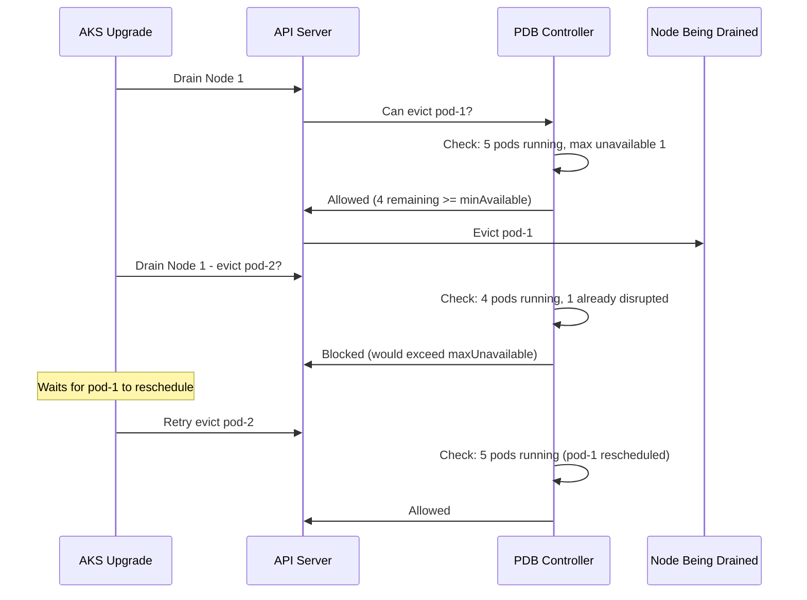

# How to Implement Pod Disruption Budgets on AKS for High Availability During Upgrades

Author: [nawazdhandala](https://www.github.com/nawazdhandala)

Tags: AKS, Pod Disruption Budgets, High Availability, Kubernetes, Upgrades, PDB, Reliability

Description: Learn how to configure Pod Disruption Budgets on AKS to maintain service availability during node upgrades, scaling, and maintenance.

---

Node upgrades, cluster scaling, and maintenance operations all involve draining nodes, which means evicting pods. Without Pod Disruption Budgets (PDBs), Kubernetes will happily evict every pod in your deployment at the same time if multiple nodes are drained simultaneously. Your users get an outage, your uptime SLA takes a hit, and someone gets paged. PDBs prevent this by telling Kubernetes how many pods can be unavailable at any given time during voluntary disruptions. In this post, I will show you how to set up PDBs on AKS to keep your services running smoothly through every kind of cluster operation.

## Voluntary vs Involuntary Disruptions

PDBs only protect against voluntary disruptions - things that are initiated by a human or automated system:

- Node drain during Kubernetes version upgrades
- Node pool scaling down
- Cluster autoscaler removing underutilized nodes
- Manual kubectl drain commands
- Spot instance evictions (these are treated as voluntary)

PDBs do not protect against involuntary disruptions like:

- Node hardware failure
- Kernel panic
- VM crashes
- OOM kills within the pod

For involuntary disruptions, you need replicas spread across multiple nodes and failure domains. PDBs handle the controlled disruptions.

## Step 1: Create a Basic PDB

A PDB specifies either the minimum number of available pods or the maximum number of unavailable pods. It uses a label selector to identify which pods it applies to.

Here is a PDB that ensures at least 2 pods are always available for a deployment with 3 replicas.

```yaml
# pdb-min-available.yaml
# PDB ensuring at least 2 pods are always running
apiVersion: policy/v1
kind: PodDisruptionBudget
metadata:
  name: web-app-pdb
  namespace: default
spec:
  # At least 2 pods must be available at all times
  minAvailable: 2
  selector:
    matchLabels:
      app: web-app
```

Alternatively, express it as maximum unavailable.

```yaml
# pdb-max-unavailable.yaml
# PDB allowing at most 1 pod to be unavailable
apiVersion: policy/v1
kind: PodDisruptionBudget
metadata:
  name: web-app-pdb
  namespace: default
spec:
  # At most 1 pod can be unavailable during disruptions
  maxUnavailable: 1
  selector:
    matchLabels:
      app: web-app
```

Both achieve similar results for a 3-replica deployment, but they behave differently when the deployment scales. `minAvailable: 2` always requires at least 2, regardless of total replicas. `maxUnavailable: 1` allows 1 down regardless of total. For most cases, `maxUnavailable` is more flexible.

## Step 2: Use Percentage-Based PDBs

For deployments that scale dynamically, use percentages instead of absolute numbers.

```yaml
# pdb-percentage.yaml
# PDB using percentage for flexible scaling
apiVersion: policy/v1
kind: PodDisruptionBudget
metadata:
  name: api-pdb
  namespace: default
spec:
  # At most 25% of pods can be unavailable
  maxUnavailable: "25%"
  selector:
    matchLabels:
      app: api-service
```

With 4 replicas, this allows 1 pod to be disrupted. With 8 replicas, it allows 2. The percentage scales with your deployment.

## Step 3: Apply PDBs to Your AKS Workloads

Let me set up a complete example with a deployment and its PDB.

```yaml
# deployment-with-pdb.yaml
# Web application deployment with 5 replicas
apiVersion: apps/v1
kind: Deployment
metadata:
  name: web-app
  namespace: default
spec:
  replicas: 5
  selector:
    matchLabels:
      app: web-app
  template:
    metadata:
      labels:
        app: web-app
    spec:
      # Spread pods across nodes for better availability
      topologySpreadConstraints:
        - maxSkew: 1
          topologyKey: kubernetes.io/hostname
          whenUnsatisfiable: DoNotSchedule
          labelSelector:
            matchLabels:
              app: web-app
      containers:
        - name: web-app
          image: myregistry.azurecr.io/web-app:v1
          ports:
            - containerPort: 8080
          resources:
            requests:
              cpu: 200m
              memory: 256Mi
            limits:
              cpu: 500m
              memory: 512Mi
---
# PDB for the web application
apiVersion: policy/v1
kind: PodDisruptionBudget
metadata:
  name: web-app-pdb
  namespace: default
spec:
  maxUnavailable: 1
  selector:
    matchLabels:
      app: web-app
```

Apply both.

```bash
# Apply the deployment and PDB
kubectl apply -f deployment-with-pdb.yaml

# Verify the PDB status
kubectl get pdb web-app-pdb
```

The output shows:

```
NAME          MIN AVAILABLE   MAX UNAVAILABLE   ALLOWED DISRUPTIONS   AGE
web-app-pdb   N/A             1                 1                     10s
```

`ALLOWED DISRUPTIONS` shows how many pods can currently be disrupted. If one pod is already down, this drops to 0, and Kubernetes will block further voluntary evictions until it recovers.

## How PDBs Affect Node Draining

Here is what happens when you upgrade a node pool on AKS with PDBs in place.



The drain operation respects the PDB and waits instead of forcefully evicting pods.

## Step 4: PDBs for Stateful Workloads

Stateful workloads like databases need even more careful handling since losing multiple replicas can cause data loss or split-brain scenarios.

```yaml
# statefulset-pdb.yaml
# PDB for a 3-node database cluster - never allow more than 1 down
apiVersion: policy/v1
kind: PodDisruptionBudget
metadata:
  name: database-pdb
  namespace: default
spec:
  # With a 3-replica database, losing 2 would break quorum
  maxUnavailable: 1
  selector:
    matchLabels:
      app: database
```

For a 3-node database cluster that requires quorum (2 out of 3 nodes), `maxUnavailable: 1` is the correct setting. This ensures at least 2 nodes are always available.

## Step 5: PDBs for System Components

Do not forget about cluster-critical workloads. CoreDNS, ingress controllers, and monitoring systems should all have PDBs.

```yaml
# system-pdbs.yaml
# PDB for CoreDNS
apiVersion: policy/v1
kind: PodDisruptionBudget
metadata:
  name: coredns-pdb
  namespace: kube-system
spec:
  minAvailable: 1
  selector:
    matchLabels:
      k8s-app: kube-dns
---
# PDB for NGINX Ingress Controller
apiVersion: policy/v1
kind: PodDisruptionBudget
metadata:
  name: ingress-pdb
  namespace: ingress-nginx
spec:
  maxUnavailable: 1
  selector:
    matchLabels:
      app.kubernetes.io/name: ingress-nginx
      app.kubernetes.io/component: controller
```

AKS automatically creates PDBs for some system components, but it is worth verifying.

```bash
# Check existing PDBs across all namespaces
kubectl get pdb -A
```

## Step 6: Test PDB Behavior

Simulate a node drain to verify your PDBs work correctly.

```bash
# Cordon a node to prevent new pods from scheduling
kubectl cordon <node-name>

# Attempt to drain the node
kubectl drain <node-name> --ignore-daemonsets --delete-emptydir-data

# If PDB blocks the drain, you will see:
# error when evicting pods "web-app-xxx": Cannot evict pod as it would violate the pod's disruption budget
```

The drain command will wait (up to the configured timeout) for the PDB to allow eviction. Once the previously evicted pod is rescheduled on another node, the drain can proceed.

## Step 7: Configure AKS Upgrade Behavior with PDBs

AKS respects PDBs during node pool upgrades. You can configure how the upgrade interacts with PDBs.

```bash
# Set the max surge for upgrades (how many extra nodes to create)
az aks nodepool update \
  --resource-group myResourceGroup \
  --cluster-name myCluster \
  --name nodepool1 \
  --max-surge 1

# Upgrade the node pool - will respect PDBs
az aks nodepool upgrade \
  --resource-group myResourceGroup \
  --cluster-name myCluster \
  --name nodepool1 \
  --kubernetes-version 1.28.0
```

During the upgrade, AKS creates surge nodes first, then drains old nodes one at a time. PDBs control how many pods can be evicted simultaneously during this process.

## Common Mistakes

**PDB that blocks all evictions.** Setting `maxUnavailable: 0` or `minAvailable` equal to the number of replicas means no pods can ever be voluntarily evicted. Node drains will hang forever.

```yaml
# DO NOT DO THIS - blocks all voluntary disruptions
spec:
  minAvailable: 3  # With 3 replicas, no room for disruption
```

**PDB label selector that matches nothing.** If the selector does not match any pods, the PDB does nothing. Always verify your selectors.

```bash
# Verify the PDB is matching pods
kubectl get pdb web-app-pdb -o yaml | grep -A5 selector
kubectl get pods -l app=web-app
```

**Single replica with a PDB.** A PDB on a single-replica deployment with `maxUnavailable: 0` means the pod can never be evicted. Either run more replicas or accept that single-replica services will have downtime during maintenance.

## PDB Design Guidelines

| Workload Type | Replicas | Recommended PDB |
|--------------|----------|-----------------|
| Web frontend | 3+ | maxUnavailable: 1 or 25% |
| API service | 3+ | maxUnavailable: 1 |
| Database | 3 | maxUnavailable: 1 |
| Worker queue | 5+ | maxUnavailable: 50% |
| Singleton | 1 | No PDB (cannot maintain availability) |

PDBs are a small amount of YAML that provide a significant availability improvement. Every multi-replica workload on AKS should have a PDB, especially in clusters where node upgrades, autoscaling, and spot instances are part of the normal operational flow.
