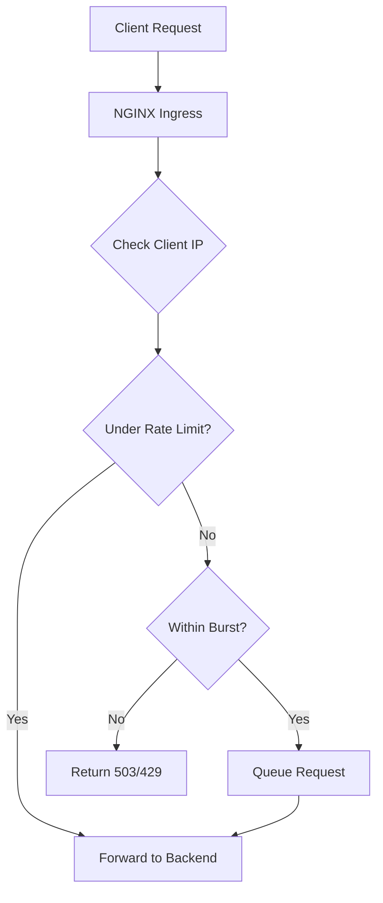

# How to Implement Rate Limiting on AKS Ingress Using NGINX Annotations

Author: [nawazdhandala](https://www.github.com/nawazdhandala)

Tags: AKS, Rate Limiting, NGINX Ingress, Kubernetes, API Security, Traffic Management, Azure

Description: Learn how to configure rate limiting on AKS NGINX Ingress using annotations to protect your services from traffic spikes and abuse.

---

Without rate limiting, a single misbehaving client can overwhelm your backend services, causing cascading failures that affect all users. Whether it is a DDoS attempt, a buggy client making infinite retry loops, or a legitimate traffic spike from a viral moment, rate limiting at the ingress layer is your first line of defense. NGINX Ingress Controller on AKS supports rate limiting through simple annotations, and in this post, I will show you how to configure it effectively.

## How NGINX Rate Limiting Works

NGINX rate limiting is based on the leaky bucket algorithm. Imagine a bucket with a hole in the bottom. Water (requests) flows in from the top, and drains out through the hole at a constant rate. If water comes in faster than it drains, the bucket fills up. Once it overflows, new water (requests) is rejected.

In NGINX terms, you define a rate (how fast the bucket drains) and a burst size (how big the bucket is). Requests within the rate are processed immediately. Requests that exceed the rate but fit in the burst buffer are queued. Requests that exceed both the rate and the burst are rejected with a 503 status code.

## Prerequisites

You need an AKS cluster with the NGINX Ingress Controller installed. If you do not have it yet, install it with Helm.

```bash
# Install NGINX Ingress Controller on AKS
helm repo add ingress-nginx https://kubernetes.github.io/ingress-nginx
helm repo update

helm install ingress-nginx ingress-nginx/ingress-nginx \
  --namespace ingress-nginx \
  --create-namespace
```

## Basic Rate Limiting with Annotations

The simplest form of rate limiting uses the `nginx.ingress.kubernetes.io/limit-rps` annotation to set requests per second per client IP.

```yaml
# rate-limited-ingress.yaml
# Ingress with basic rate limiting - 10 requests per second per IP
apiVersion: networking.k8s.io/v1
kind: Ingress
metadata:
  name: api-ingress
  namespace: default
  annotations:
    # Limit each client IP to 10 requests per second
    nginx.ingress.kubernetes.io/limit-rps: "10"
    # Allow bursts of up to 20 requests
    nginx.ingress.kubernetes.io/limit-burst-multiplier: "2"
    # Return 429 Too Many Requests instead of default 503
    nginx.ingress.kubernetes.io/custom-http-errors: "429"
spec:
  ingressClassName: nginx
  rules:
    - host: api.example.com
      http:
        paths:
          - path: /
            pathType: Prefix
            backend:
              service:
                name: api-service
                port:
                  number: 80
```

With this configuration, each client IP can make 10 requests per second. The burst multiplier of 2 means NGINX will allow bursts of up to 20 requests (10 x 2) before rejecting. Requests beyond the burst get a 503 response.

## Rate Limiting by Connections

Sometimes you want to limit the number of simultaneous connections rather than requests per second. This is useful for WebSocket endpoints or long-running downloads.

```yaml
# connection-limited-ingress.yaml
# Ingress limiting concurrent connections per IP
apiVersion: networking.k8s.io/v1
kind: Ingress
metadata:
  name: websocket-ingress
  namespace: default
  annotations:
    # Limit each IP to 5 concurrent connections
    nginx.ingress.kubernetes.io/limit-connections: "5"
spec:
  ingressClassName: nginx
  rules:
    - host: ws.example.com
      http:
        paths:
          - path: /
            pathType: Prefix
            backend:
              service:
                name: websocket-service
                port:
                  number: 80
```

## Rate Limiting by Request Rate and Connections Together

You can combine both types of limiting for comprehensive protection.

```yaml
# combined-limits-ingress.yaml
# Ingress with both request rate and connection limits
apiVersion: networking.k8s.io/v1
kind: Ingress
metadata:
  name: combined-ingress
  namespace: default
  annotations:
    # 20 requests per second per IP
    nginx.ingress.kubernetes.io/limit-rps: "20"
    # Allow burst of up to 40
    nginx.ingress.kubernetes.io/limit-burst-multiplier: "2"
    # Maximum 10 concurrent connections per IP
    nginx.ingress.kubernetes.io/limit-connections: "10"
    # Whitelist internal IPs from rate limiting
    nginx.ingress.kubernetes.io/limit-whitelist: "10.0.0.0/8,172.16.0.0/12"
spec:
  ingressClassName: nginx
  rules:
    - host: api.example.com
      http:
        paths:
          - path: /
            pathType: Prefix
            backend:
              service:
                name: api-service
                port:
                  number: 80
```

The `limit-whitelist` annotation is important - it excludes internal IPs from rate limiting. You do not want your health check probes or internal services getting rate limited.

## Rate Limiting by Request Size

For APIs that accept file uploads, you can limit the request body size to prevent resource exhaustion.

```yaml
# size-limited-ingress.yaml
# Ingress with request body size limits
apiVersion: networking.k8s.io/v1
kind: Ingress
metadata:
  name: upload-ingress
  namespace: default
  annotations:
    # Limit request body to 10 megabytes
    nginx.ingress.kubernetes.io/proxy-body-size: "10m"
    # Rate limit to 5 requests per second (uploads are heavy)
    nginx.ingress.kubernetes.io/limit-rps: "5"
    nginx.ingress.kubernetes.io/limit-burst-multiplier: "1"
spec:
  ingressClassName: nginx
  rules:
    - host: upload.example.com
      http:
        paths:
          - path: /
            pathType: Prefix
            backend:
              service:
                name: upload-service
                port:
                  number: 80
```

## Per-Path Rate Limiting

Different endpoints often need different rate limits. An authentication endpoint should have stricter limits than a public content endpoint. You can achieve this by creating separate ingress resources for different paths.

```yaml
# auth-ingress.yaml
# Strict rate limiting for authentication endpoints
apiVersion: networking.k8s.io/v1
kind: Ingress
metadata:
  name: auth-ingress
  namespace: default
  annotations:
    # Very strict limit for login endpoints
    nginx.ingress.kubernetes.io/limit-rps: "3"
    nginx.ingress.kubernetes.io/limit-burst-multiplier: "1"
spec:
  ingressClassName: nginx
  rules:
    - host: api.example.com
      http:
        paths:
          - path: /auth
            pathType: Prefix
            backend:
              service:
                name: auth-service
                port:
                  number: 80
---
# content-ingress.yaml
# More generous rate limiting for content endpoints
apiVersion: networking.k8s.io/v1
kind: Ingress
metadata:
  name: content-ingress
  namespace: default
  annotations:
    # Higher limit for content serving
    nginx.ingress.kubernetes.io/limit-rps: "50"
    nginx.ingress.kubernetes.io/limit-burst-multiplier: "3"
spec:
  ingressClassName: nginx
  rules:
    - host: api.example.com
      http:
        paths:
          - path: /content
            pathType: Prefix
            backend:
              service:
                name: content-service
                port:
                  number: 80
```

## Custom Error Responses

When a client hits the rate limit, they get a 503 by default. You can customize this to return a proper 429 Too Many Requests with a helpful message.

```yaml
# custom-error-configmap.yaml
# Custom error page for rate-limited requests
apiVersion: v1
kind: ConfigMap
metadata:
  name: custom-error-pages
  namespace: ingress-nginx
data:
  # Return a JSON response for rate-limited API requests
  429: |
    {
      "error": "Too Many Requests",
      "message": "Rate limit exceeded. Please retry after a short delay.",
      "retryAfter": 1
    }
```

## Testing Rate Limits

Use a tool like hey or wrk to test your rate limits.

```bash
# Install hey for HTTP load testing
go install github.com/rakyll/hey@latest

# Send 100 requests at 50 QPS to test the limit
hey -n 100 -q 50 -c 10 http://api.example.com/

# Check the response code distribution
# You should see 200s up to the limit and 503s after
```

You can also use curl to test manually.

```bash
# Rapid-fire 20 requests and check status codes
for i in $(seq 1 20); do
  curl -s -o /dev/null -w "%{http_code}\n" http://api.example.com/
done
```

## How the Rate Limiting Flow Works



## Global Rate Limiting with ConfigMap

If you want to set default rate limits for all ingress resources, configure them in the NGINX controller's ConfigMap.

```yaml
# nginx-configmap.yaml
# Global rate limiting defaults for all ingress resources
apiVersion: v1
kind: ConfigMap
metadata:
  name: ingress-nginx-controller
  namespace: ingress-nginx
data:
  # Global request rate limit
  limit-req-status-code: "429"
  # Shared memory zone size for rate limiting
  limit-req-zone-size: "10m"
```

## Monitoring Rate-Limited Requests

Keep track of how many requests are being rate limited to understand if your limits are too aggressive or too loose.

```bash
# Check NGINX controller metrics for rate limiting
kubectl exec -n ingress-nginx deploy/ingress-nginx-controller -- \
  curl -s localhost:10254/metrics | grep nginx_ingress

# Look for rejected connection metrics
kubectl logs -n ingress-nginx deploy/ingress-nginx-controller | \
  grep "limiting requests"
```

If you are using Prometheus, the NGINX Ingress Controller exports metrics like `nginx_ingress_controller_requests` with status code labels. Set up a Grafana dashboard to visualize rate-limited requests over time.

## Production Recommendations

**Start with generous limits and tighten.** It is better to start with limits that are too high and gradually reduce them based on observed traffic patterns than to start too tight and block legitimate users.

**Always whitelist internal traffic.** Health checks, internal service-to-service calls, and monitoring probes should not be subject to rate limits.

**Use different limits for different endpoints.** A login endpoint needs much tighter limits than a search endpoint. Apply limits based on the risk and cost of each endpoint.

**Monitor and adjust.** Rate limits are not set-and-forget. Traffic patterns change, and your limits should evolve with them. Review your rate limiting metrics regularly.

**Consider using external rate limiting for complex scenarios.** If you need per-user rate limiting (not per-IP), API key-based limits, or distributed rate limiting across multiple clusters, look at API gateway solutions like Kong or a dedicated rate limiting service with Redis.

Rate limiting at the ingress level is a fundamental protection for any production service. NGINX annotations make it straightforward to implement on AKS, and the combination of per-IP request rate limits, connection limits, and burst handling covers most common scenarios.
