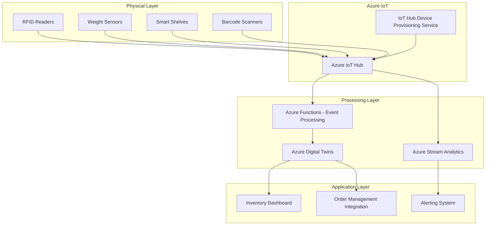

# How to Implement Real-Time Inventory Management with Azure IoT Hub and Azure Digital Twins

Author: [nawazdhandala](https://www.github.com/nawazdhandala)

Tags: Azure IoT Hub, Azure Digital Twins, Inventory Management, IoT, Retail, Supply Chain, Real-Time Monitoring

Description: Implement real-time inventory management using Azure IoT Hub for device connectivity and Azure Digital Twins for spatial modeling.

---

Traditional inventory management relies on periodic counts and manual updates. Someone walks through the warehouse with a scanner, counts items on shelves, and enters the data into a system. By the time the count is done, it is already outdated. Shipments arrive, orders ship out, and the numbers drift from reality.

IoT sensors change this. RFID readers, weight sensors, and smart shelves can track inventory movements in real time. Azure IoT Hub handles the device connectivity at scale, and Azure Digital Twins creates a virtual model of your physical spaces that updates continuously. Together, they give you an inventory system that always reflects what is actually on your shelves.

## Architecture



IoT devices send telemetry to IoT Hub. Azure Functions process the events and update the Digital Twins model. Stream Analytics handles real-time alerting for events like stockouts. The Digital Twins model feeds the dashboard and integrates with order management.

## Step 1 - Set Up Azure IoT Hub

IoT Hub is the central message broker for all your warehouse sensors. Start with a Standard tier hub since you need device-to-cloud messaging and device twins.

```bash
# Create IoT Hub
az iot hub create \
  --name inventory-iot-hub \
  --resource-group inventory-rg \
  --sku S1 \
  --unit 1 \
  --location eastus

# Create a consumer group for the processing pipeline
az iot hub consumer-group create \
  --hub-name inventory-iot-hub \
  --name inventory-processing

# Set up Device Provisioning Service for zero-touch enrollment
az iot dps create \
  --name inventory-dps \
  --resource-group inventory-rg \
  --location eastus

# Link DPS to IoT Hub
az iot dps linked-hub create \
  --dps-name inventory-dps \
  --resource-group inventory-rg \
  --connection-string "$(az iot hub connection-string show --hub-name inventory-iot-hub --query connectionString -o tsv)" \
  --location eastus
```

The Device Provisioning Service lets you onboard new sensors without manually registering each one. When a new RFID reader is installed in a warehouse, it connects to DPS, gets assigned to the correct IoT Hub, and starts sending data. This matters when you are deploying hundreds of sensors across multiple locations.

## Step 2 - Create the Digital Twins Model

Azure Digital Twins uses DTDL (Digital Twins Definition Language) to define the models for your physical environment. Here are the models for a warehouse inventory system.

```json
[
  {
    "@id": "dtmi:inventory:Warehouse;1",
    "@type": "Interface",
    "displayName": "Warehouse",
    "contents": [
      {
        "@type": "Property",
        "name": "name",
        "schema": "string"
      },
      {
        "@type": "Property",
        "name": "location",
        "schema": "string"
      },
      {
        "@type": "Property",
        "name": "totalCapacity",
        "schema": "integer"
      },
      {
        "@type": "Relationship",
        "name": "hasZone",
        "target": "dtmi:inventory:Zone;1"
      }
    ],
    "@context": "dtmi:dtdl:context;2"
  },
  {
    "@id": "dtmi:inventory:Zone;1",
    "@type": "Interface",
    "displayName": "Zone",
    "contents": [
      {
        "@type": "Property",
        "name": "zoneName",
        "schema": "string"
      },
      {
        "@type": "Property",
        "name": "zoneType",
        "schema": "string"
      },
      {
        "@type": "Relationship",
        "name": "hasShelf",
        "target": "dtmi:inventory:Shelf;1"
      }
    ],
    "@context": "dtmi:dtdl:context;2"
  },
  {
    "@id": "dtmi:inventory:Shelf;1",
    "@type": "Interface",
    "displayName": "Shelf",
    "contents": [
      {
        "@type": "Property",
        "name": "shelfId",
        "schema": "string"
      },
      {
        "@type": "Property",
        "name": "currentWeight",
        "schema": "double"
      },
      {
        "@type": "Property",
        "name": "maxWeight",
        "schema": "double"
      },
      {
        "@type": "Telemetry",
        "name": "weightReading",
        "schema": "double"
      },
      {
        "@type": "Relationship",
        "name": "holdsProduct",
        "target": "dtmi:inventory:Product;1"
      }
    ],
    "@context": "dtmi:dtdl:context;2"
  },
  {
    "@id": "dtmi:inventory:Product;1",
    "@type": "Interface",
    "displayName": "Product",
    "contents": [
      {
        "@type": "Property",
        "name": "sku",
        "schema": "string"
      },
      {
        "@type": "Property",
        "name": "productName",
        "schema": "string"
      },
      {
        "@type": "Property",
        "name": "currentQuantity",
        "schema": "integer"
      },
      {
        "@type": "Property",
        "name": "reorderPoint",
        "schema": "integer"
      },
      {
        "@type": "Property",
        "name": "unitWeight",
        "schema": "double"
      },
      {
        "@type": "Property",
        "name": "lastUpdated",
        "schema": "dateTime"
      }
    ],
    "@context": "dtmi:dtdl:context;2"
  }
]
```

Upload the models and create the twin graph.

```bash
# Create the Azure Digital Twins instance
az dt create \
  --dt-name inventory-twins \
  --resource-group inventory-rg \
  --location eastus

# Upload the DTDL models
az dt model create \
  --dt-name inventory-twins \
  --models @warehouse-models.json
```

## Step 3 - Build the Event Processing Pipeline

When IoT sensors send telemetry, an Azure Function processes the events and updates the Digital Twins model. Here is the function that handles weight sensor updates.

```python
import azure.functions as func
import json
from azure.digitaltwins.core import DigitalTwinsClient
from azure.identity import DefaultAzureCredential
from datetime import datetime

# Initialize Digital Twins client
credential = DefaultAzureCredential()
dt_client = DigitalTwinsClient(
    "https://inventory-twins.api.eus.digitaltwins.azure.net",
    credential
)

def main(event: func.EventHubEvent):
    """Process IoT telemetry and update Digital Twins."""
    body = json.loads(event.get_body().decode("utf-8"))
    device_id = event.iothub_metadata.get("connection-device-id")
    message_type = body.get("messageType")

    if message_type == "weightReading":
        handle_weight_update(device_id, body)
    elif message_type == "rfidScan":
        handle_rfid_scan(device_id, body)

def handle_weight_update(device_id: str, data: dict):
    """Update shelf weight and recalculate product quantity."""
    shelf_twin_id = f"shelf-{device_id}"
    new_weight = data["weight"]

    # Update the shelf's current weight in Digital Twins
    patch = [
        {
            "op": "replace",
            "path": "/currentWeight",
            "value": new_weight
        }
    ]
    dt_client.update_digital_twin(shelf_twin_id, patch)

    # Query the product on this shelf to calculate quantity
    query = f"""
        SELECT product
        FROM DIGITALTWINS shelf
        JOIN product RELATED shelf.holdsProduct
        WHERE shelf.$dtId = '{shelf_twin_id}'
    """
    products = dt_client.query_twins(query)

    for product in products:
        unit_weight = product["product"]["unitWeight"]
        if unit_weight > 0:
            estimated_quantity = int(new_weight / unit_weight)
            reorder_point = product["product"]["reorderPoint"]

            # Update product quantity
            product_patch = [
                {"op": "replace", "path": "/currentQuantity", "value": estimated_quantity},
                {"op": "replace", "path": "/lastUpdated", "value": datetime.utcnow().isoformat()}
            ]
            dt_client.update_digital_twin(product["product"]["$dtId"], product_patch)

            # Check if below reorder point
            if estimated_quantity <= reorder_point:
                trigger_reorder_alert(product["product"]["sku"], estimated_quantity, reorder_point)

def handle_rfid_scan(device_id: str, data: dict):
    """Process RFID tag reads to track item movements."""
    rfid_tags = data.get("tags", [])
    zone_id = data.get("zoneId")
    scan_type = data.get("scanType")  # "inbound" or "outbound"

    for tag in rfid_tags:
        sku = tag["sku"]
        quantity = tag.get("quantity", 1)

        # Find the product twin
        query = f"SELECT * FROM DIGITALTWINS WHERE sku = '{sku}'"
        results = list(dt_client.query_twins(query))

        if results:
            product = results[0]
            current_qty = product["currentQuantity"]

            if scan_type == "inbound":
                new_qty = current_qty + quantity
            else:
                new_qty = max(0, current_qty - quantity)

            patch = [
                {"op": "replace", "path": "/currentQuantity", "value": new_qty},
                {"op": "replace", "path": "/lastUpdated", "value": datetime.utcnow().isoformat()}
            ]
            dt_client.update_digital_twin(product["$dtId"], patch)

def trigger_reorder_alert(sku: str, current: int, reorder_point: int):
    """Send an alert when inventory drops below the reorder point."""
    # Send to Service Bus for downstream processing
    print(f"REORDER ALERT: {sku} at {current} units (threshold: {reorder_point})")
```

## Step 4 - Set Up Real-Time Alerting

Use Azure Stream Analytics to detect patterns that need immediate attention, like sudden inventory drops that could indicate theft or system errors.

```sql
-- Detect rapid inventory changes that might indicate problems
SELECT
    deviceId,
    AVG(weight) as avgWeight,
    MIN(weight) as minWeight,
    MAX(weight) as maxWeight,
    MAX(weight) - MIN(weight) as weightVariance
INTO AlertOutput
FROM IoTInput TIMESTAMP BY EventEnqueuedUtcTime
GROUP BY deviceId, TumblingWindow(minute, 5)
HAVING MAX(weight) - MIN(weight) > 50

-- Detect devices that stopped reporting (possible sensor failure)
SELECT
    deviceId,
    MAX(EventEnqueuedUtcTime) as lastSeen,
    DATEDIFF(minute, MAX(EventEnqueuedUtcTime), System.Timestamp()) as minutesSinceLastReport
INTO DeviceHealthOutput
FROM IoTInput TIMESTAMP BY EventEnqueuedUtcTime
GROUP BY deviceId, TumblingWindow(minute, 10)
HAVING DATEDIFF(minute, MAX(EventEnqueuedUtcTime), System.Timestamp()) > 5
```

## Step 5 - Build the Inventory Dashboard

Query the Digital Twins graph to power your inventory dashboard. The twin graph gives you a hierarchical view: warehouse, zone, shelf, and product.

```python
def get_warehouse_inventory(warehouse_id: str) -> dict:
    """Query Digital Twins for complete warehouse inventory."""
    query = f"""
        SELECT warehouse, zone, shelf, product
        FROM DIGITALTWINS warehouse
        JOIN zone RELATED warehouse.hasZone
        JOIN shelf RELATED zone.hasShelf
        JOIN product RELATED shelf.holdsProduct
        WHERE warehouse.$dtId = '{warehouse_id}'
    """
    results = list(dt_client.query_twins(query))

    # Aggregate by product for a summary view
    inventory = {}
    for row in results:
        sku = row["product"]["sku"]
        if sku not in inventory:
            inventory[sku] = {
                "productName": row["product"]["productName"],
                "totalQuantity": 0,
                "locations": [],
                "belowReorder": False
            }
        inventory[sku]["totalQuantity"] += row["product"]["currentQuantity"]
        inventory[sku]["locations"].append({
            "zone": row["zone"]["zoneName"],
            "shelf": row["shelf"]["shelfId"],
            "quantity": row["product"]["currentQuantity"]
        })
        if row["product"]["currentQuantity"] <= row["product"]["reorderPoint"]:
            inventory[sku]["belowReorder"] = True

    return inventory
```

## Benefits Over Traditional Systems

The combination of IoT Hub and Digital Twins provides several advantages over traditional inventory systems. First, you get continuous inventory visibility instead of point-in-time snapshots. Second, the Digital Twins model captures spatial relationships, so you know not just how much you have but exactly where it is. Third, automated alerts for reorder points and anomalies mean your team spends less time counting and more time managing. Fourth, the historical telemetry data enables analytics on inventory movement patterns, helping you optimize warehouse layouts and stocking strategies.

## Wrapping Up

Real-time inventory management with Azure IoT Hub and Digital Twins replaces periodic manual counts with continuous automated tracking. IoT sensors monitor stock levels and movements. IoT Hub provides reliable device connectivity at scale. Digital Twins models your physical environment as a queryable graph. Azure Functions process events and keep the digital model synchronized. The result is an inventory system that always reflects reality, catches problems immediately, and provides the data you need for smarter supply chain decisions.
