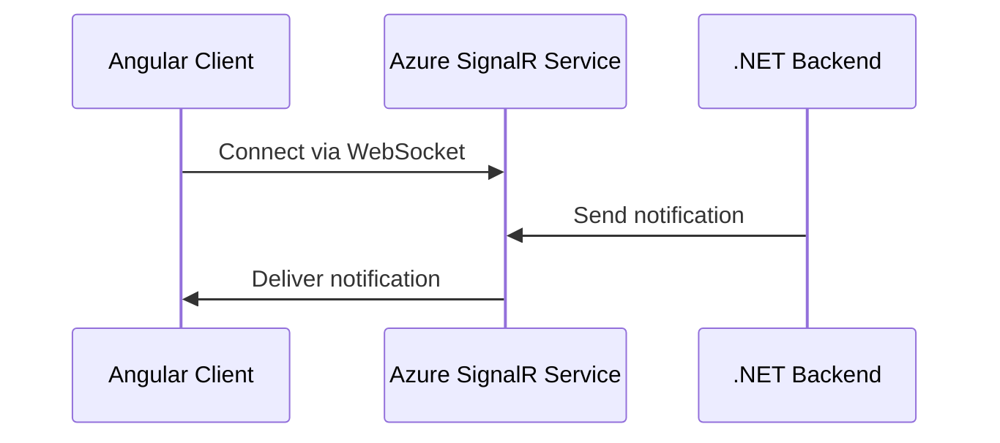

# How to Implement Real-Time Notifications with Azure SignalR Service and Angular

Author: [nawazdhandala](https://www.github.com/nawazdhandala)

Tags: Azure SignalR, Angular, Real-Time, Notifications, WebSocket, .NET, TypeScript

Description: Implement a real-time notification system using Azure SignalR Service with an Angular frontend and a .NET backend for push-based updates.

---

Push notifications are a core feature of modern web applications. Whether it is alerting users about new messages, order updates, or system alerts, users expect to see information the moment it becomes available - not when they refresh the page. Azure SignalR Service is a managed real-time messaging service that makes this straightforward to implement.

In this post, we will build a notification system with a .NET backend that pushes updates through Azure SignalR Service to an Angular frontend. We will cover SignalR hub configuration, Angular client setup, notification groups, and targeted user notifications.

## How Azure SignalR Service Works

Without Azure SignalR, your .NET server manages WebSocket connections directly. This works fine for small scale, but at thousands of connections, it becomes a bottleneck. Azure SignalR Service acts as a proxy - your server sends messages to the service, and the service delivers them to connected clients. Your server never holds a WebSocket connection.



## Prerequisites

- .NET 8 SDK
- Node.js 18+
- Angular CLI
- An Azure SignalR Service resource

## Step 1: Create the Azure SignalR Resource

```bash
# Create the SignalR Service
az signalr create \
  --name notifications-signalr \
  --resource-group notifications-rg \
  --sku Standard_S1 \
  --service-mode Default \
  --location eastus

# Get the connection string
az signalr key list \
  --name notifications-signalr \
  --resource-group notifications-rg \
  --query primaryConnectionString -o tsv
```

## Step 2: Build the .NET Backend

Create a new ASP.NET Core project with SignalR support.

```bash
dotnet new webapi -n NotificationServer
cd NotificationServer
dotnet add package Microsoft.Azure.SignalR
```

Define the SignalR Hub for notifications.

```csharp
// Hubs/NotificationHub.cs
// SignalR hub that manages notification subscriptions
using Microsoft.AspNetCore.SignalR;

namespace NotificationServer.Hubs;

public class NotificationHub : Hub
{
    // Called when a client connects
    public override async Task OnConnectedAsync()
    {
        var userId = Context.UserIdentifier ?? Context.ConnectionId;
        Console.WriteLine($"Client connected: {userId}");
        await base.OnConnectedAsync();
    }

    // Allow clients to subscribe to specific notification channels
    public async Task SubscribeToChannel(string channel)
    {
        // Add the connection to a SignalR group
        await Groups.AddToGroupAsync(Context.ConnectionId, channel);
        Console.WriteLine($"Connection {Context.ConnectionId} subscribed to {channel}");
    }

    // Allow clients to unsubscribe from a channel
    public async Task UnsubscribeFromChannel(string channel)
    {
        await Groups.RemoveFromGroupAsync(Context.ConnectionId, channel);
    }

    // Called when a client disconnects
    public override async Task OnDisconnectedAsync(Exception? exception)
    {
        Console.WriteLine($"Client disconnected: {Context.ConnectionId}");
        await base.OnDisconnectedAsync(exception);
    }
}
```

Define the notification model and service.

```csharp
// Models/Notification.cs
// Data model for notifications
namespace NotificationServer.Models;

public class Notification
{
    public string Id { get; set; } = Guid.NewGuid().ToString();
    public string Title { get; set; } = string.Empty;
    public string Message { get; set; } = string.Empty;
    public string Type { get; set; } = "info";  // info, warning, error, success
    public string? Channel { get; set; }
    public string? TargetUserId { get; set; }
    public DateTime CreatedAt { get; set; } = DateTime.UtcNow;
    public bool Read { get; set; } = false;
}
```

```csharp
// Services/NotificationService.cs
// Service that sends notifications through SignalR
using Microsoft.AspNetCore.SignalR;
using NotificationServer.Hubs;
using NotificationServer.Models;

namespace NotificationServer.Services;

public class NotificationService
{
    private readonly IHubContext<NotificationHub> _hubContext;
    private readonly List<Notification> _notifications = new(); // In-memory store

    public NotificationService(IHubContext<NotificationHub> hubContext)
    {
        _hubContext = hubContext;
    }

    // Send a notification to all connected clients
    public async Task SendToAll(Notification notification)
    {
        _notifications.Add(notification);
        await _hubContext.Clients.All.SendAsync("ReceiveNotification", notification);
    }

    // Send a notification to a specific channel (group)
    public async Task SendToChannel(string channel, Notification notification)
    {
        notification.Channel = channel;
        _notifications.Add(notification);
        await _hubContext.Clients.Group(channel).SendAsync("ReceiveNotification", notification);
    }

    // Send a notification to a specific user
    public async Task SendToUser(string userId, Notification notification)
    {
        notification.TargetUserId = userId;
        _notifications.Add(notification);
        await _hubContext.Clients.User(userId).SendAsync("ReceiveNotification", notification);
    }

    // Get notification history for a user
    public List<Notification> GetHistory(string? userId = null, int limit = 50)
    {
        var query = _notifications.AsEnumerable();
        if (userId != null)
        {
            query = query.Where(n => n.TargetUserId == userId || n.TargetUserId == null);
        }
        return query.OrderByDescending(n => n.CreatedAt).Take(limit).ToList();
    }
}
```

Set up the API controllers and configure SignalR.

```csharp
// Controllers/NotificationsController.cs
// REST API for triggering notifications
using Microsoft.AspNetCore.Mvc;
using NotificationServer.Models;
using NotificationServer.Services;

namespace NotificationServer.Controllers;

[ApiController]
[Route("api/[controller]")]
public class NotificationsController : ControllerBase
{
    private readonly NotificationService _service;

    public NotificationsController(NotificationService service)
    {
        _service = service;
    }

    // Send a notification to all users
    [HttpPost("broadcast")]
    public async Task<IActionResult> Broadcast([FromBody] Notification notification)
    {
        await _service.SendToAll(notification);
        return Ok(new { sent = true, notification.Id });
    }

    // Send a notification to a specific channel
    [HttpPost("channel/{channel}")]
    public async Task<IActionResult> SendToChannel(string channel, [FromBody] Notification notification)
    {
        await _service.SendToChannel(channel, notification);
        return Ok(new { sent = true, channel, notification.Id });
    }

    // Send a notification to a specific user
    [HttpPost("user/{userId}")]
    public async Task<IActionResult> SendToUser(string userId, [FromBody] Notification notification)
    {
        await _service.SendToUser(userId, notification);
        return Ok(new { sent = true, userId, notification.Id });
    }

    // Get notification history
    [HttpGet("history")]
    public IActionResult GetHistory([FromQuery] string? userId, [FromQuery] int limit = 50)
    {
        var history = _service.GetHistory(userId, limit);
        return Ok(history);
    }
}
```

```csharp
// Program.cs
// Configure the application with Azure SignalR
var builder = WebApplication.CreateBuilder(args);

builder.Services.AddControllers();
builder.Services.AddSingleton<NotificationService>();

// Add SignalR with Azure SignalR Service
builder.Services.AddSignalR().AddAzureSignalR(options =>
{
    options.ConnectionString = builder.Configuration["Azure:SignalR:ConnectionString"];
});

// Configure CORS for the Angular frontend
builder.Services.AddCors(options =>
{
    options.AddPolicy("Angular", policy =>
    {
        policy.WithOrigins("http://localhost:4200")
            .AllowAnyHeader()
            .AllowAnyMethod()
            .AllowCredentials();
    });
});

var app = builder.Build();

app.UseCors("Angular");
app.MapControllers();
app.MapHub<NotificationHub>("/notificationhub");

app.Run();
```

## Step 3: Build the Angular Frontend

Create the Angular project and install the SignalR client library.

```bash
ng new notification-client --routing --style=css
cd notification-client
npm install @microsoft/signalr
```

Create a notification service that manages the SignalR connection.

```typescript
// src/app/services/notification.service.ts
// Angular service that manages the SignalR connection
import { Injectable } from '@angular/core';
import { BehaviorSubject, Observable } from 'rxjs';
import * as signalR from '@microsoft/signalr';

export interface Notification {
  id: string;
  title: string;
  message: string;
  type: 'info' | 'warning' | 'error' | 'success';
  channel?: string;
  createdAt: string;
  read: boolean;
}

@Injectable({ providedIn: 'root' })
export class NotificationService {
  private hubConnection!: signalR.HubConnection;

  // Observable stream of notifications
  private notifications$ = new BehaviorSubject<Notification[]>([]);
  private unreadCount$ = new BehaviorSubject<number>(0);

  get notifications(): Observable<Notification[]> {
    return this.notifications$.asObservable();
  }

  get unreadCount(): Observable<number> {
    return this.unreadCount$.asObservable();
  }

  // Initialize the SignalR connection
  async connect(): Promise<void> {
    this.hubConnection = new signalR.HubConnectionBuilder()
      .withUrl('http://localhost:5000/notificationhub')
      .withAutomaticReconnect([0, 2000, 5000, 10000, 30000]) // Retry intervals
      .configureLogging(signalR.LogLevel.Information)
      .build();

    // Register the handler for incoming notifications
    this.hubConnection.on('ReceiveNotification', (notification: Notification) => {
      const current = this.notifications$.value;
      this.notifications$.next([notification, ...current]);
      this.unreadCount$.next(this.unreadCount$.value + 1);
    });

    // Handle reconnection events
    this.hubConnection.onreconnecting((error) => {
      console.log('Reconnecting to SignalR...', error);
    });

    this.hubConnection.onreconnected((connectionId) => {
      console.log('Reconnected to SignalR:', connectionId);
    });

    try {
      await this.hubConnection.start();
      console.log('SignalR connected');
    } catch (err) {
      console.error('SignalR connection failed:', err);
      // Retry after 5 seconds
      setTimeout(() => this.connect(), 5000);
    }
  }

  // Subscribe to a notification channel
  async subscribeToChannel(channel: string): Promise<void> {
    await this.hubConnection.invoke('SubscribeToChannel', channel);
  }

  // Unsubscribe from a notification channel
  async unsubscribeFromChannel(channel: string): Promise<void> {
    await this.hubConnection.invoke('UnsubscribeFromChannel', channel);
  }

  // Mark a notification as read
  markAsRead(id: string): void {
    const notifications = this.notifications$.value.map((n) =>
      n.id === id ? { ...n, read: true } : n
    );
    this.notifications$.next(notifications);
    this.unreadCount$.next(notifications.filter((n) => !n.read).length);
  }

  // Mark all notifications as read
  markAllAsRead(): void {
    const notifications = this.notifications$.value.map((n) => ({ ...n, read: true }));
    this.notifications$.next(notifications);
    this.unreadCount$.next(0);
  }

  // Disconnect from SignalR
  async disconnect(): Promise<void> {
    if (this.hubConnection) {
      await this.hubConnection.stop();
    }
  }
}
```

Create the notification component.

```typescript
// src/app/components/notification-panel/notification-panel.component.ts
// Component that displays the notification panel
import { Component, OnInit, OnDestroy } from '@angular/core';
import { Subscription } from 'rxjs';
import { NotificationService, Notification } from '../../services/notification.service';

@Component({
  selector: 'app-notification-panel',
  template: `
    <div class="notification-bell" (click)="togglePanel()">
      Notifications
      <span *ngIf="unreadCount > 0" class="badge">{{ unreadCount }}</span>
    </div>

    <div *ngIf="showPanel" class="notification-panel">
      <div class="panel-header">
        <h3>Notifications</h3>
        <button (click)="notificationService.markAllAsRead()">Mark all read</button>
      </div>

      <div *ngFor="let notification of notifications"
           class="notification-item"
           [class.unread]="!notification.read"
           (click)="notificationService.markAsRead(notification.id)">
        <div class="notification-type" [class]="notification.type">
          {{ notification.type }}
        </div>
        <div class="notification-content">
          <strong>{{ notification.title }}</strong>
          <p>{{ notification.message }}</p>
          <small>{{ notification.createdAt | date:'short' }}</small>
        </div>
      </div>

      <div *ngIf="notifications.length === 0" class="empty-state">
        No notifications yet
      </div>
    </div>
  `,
})
export class NotificationPanelComponent implements OnInit, OnDestroy {
  notifications: Notification[] = [];
  unreadCount = 0;
  showPanel = false;
  private subscriptions: Subscription[] = [];

  constructor(public notificationService: NotificationService) {}

  ngOnInit(): void {
    // Connect to SignalR when the component initializes
    this.notificationService.connect();

    // Subscribe to notification updates
    this.subscriptions.push(
      this.notificationService.notifications.subscribe(
        (notifications) => (this.notifications = notifications)
      ),
      this.notificationService.unreadCount.subscribe(
        (count) => (this.unreadCount = count)
      )
    );

    // Subscribe to relevant channels
    this.notificationService.subscribeToChannel('system-alerts');
    this.notificationService.subscribeToChannel('order-updates');
  }

  togglePanel(): void {
    this.showPanel = !this.showPanel;
  }

  ngOnDestroy(): void {
    this.subscriptions.forEach((s) => s.unsubscribe());
    this.notificationService.disconnect();
  }
}
```

## Testing the System

With both the backend and frontend running, you can trigger notifications via the REST API.

```bash
# Broadcast a notification to all users
curl -X POST http://localhost:5000/api/notifications/broadcast \
  -H "Content-Type: application/json" \
  -d '{"title":"System Update","message":"Scheduled maintenance tonight at 10 PM","type":"warning"}'

# Send to a specific channel
curl -X POST http://localhost:5000/api/notifications/channel/order-updates \
  -H "Content-Type: application/json" \
  -d '{"title":"Order Shipped","message":"Your order #12345 has shipped","type":"success"}'
```

## Summary

Azure SignalR Service combined with Angular gives you a production-ready notification system without managing WebSocket infrastructure. The .NET backend pushes messages through the service, and the Angular client receives them in real time. SignalR's automatic reconnection, group management, and user targeting features cover the common notification patterns out of the box. The managed service handles the connection scaling, letting you focus on the notification logic rather than the plumbing.
