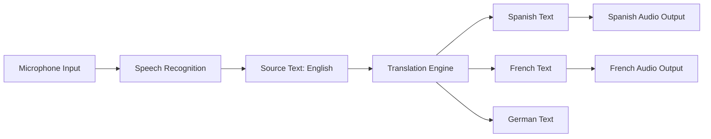

# How to Implement Real-Time Speech Translation with Azure Speech Services

Author: [nawazdhandala](https://www.github.com/nawazdhandala)

Tags: Azure Speech Services, Speech Translation, Real-Time Translation, Multilingual, Python, Audio Processing, Azure AI

Description: Build a real-time speech translation application using Azure Speech Services that translates spoken language into text and audio in another language.

---

Real-time speech translation used to be science fiction. Now it is a few API calls. Azure Speech Services provides a translation API that takes audio input in one language, transcribes it, translates it, and optionally synthesizes the translated text back into speech - all in near real time.

This capability is valuable for international meetings, customer support across language barriers, live event translation, and educational applications. In this guide, I will build a real-time speech translator that listens to English speech and produces translated text and audio in Spanish, French, and German simultaneously.

## How Speech Translation Works

The Azure Speech Translation pipeline has three stages:

1. **Speech recognition**: The audio is transcribed to text in the source language
2. **Translation**: The transcribed text is translated to one or more target languages
3. **Speech synthesis** (optional): The translated text is synthesized into audio in the target language

All three stages happen continuously as the user speaks, producing partial results that get refined as more audio comes in.



## Prerequisites

- An Azure Speech Services resource (or a multi-service Cognitive Services resource)
- Python 3.9+
- A working microphone for live audio input
- The Azure Speech SDK for Python

```bash
# Install the Azure Speech SDK
pip install azure-cognitiveservices-speech
```

## Step 1: Basic Speech Translation Setup

Start with a simple translator that listens to the microphone and outputs translated text:

```python
# basic_translator.py - Simple real-time speech translator
import azure.cognitiveservices.speech as speechsdk

def create_translator():
    """Set up and run a basic speech translator."""

    # Configure the speech translation settings
    translation_config = speechsdk.translation.SpeechTranslationConfig(
        subscription="your-speech-key",
        region="eastus"
    )

    # Set the source language (what the user speaks)
    translation_config.speech_recognition_language = "en-US"

    # Add target languages for translation
    # Use BCP-47 language codes
    translation_config.add_target_language("es")  # Spanish
    translation_config.add_target_language("fr")  # French
    translation_config.add_target_language("de")  # German

    # Use the default microphone as audio input
    audio_config = speechsdk.audio.AudioConfig(use_default_microphone=True)

    # Create the translation recognizer
    recognizer = speechsdk.translation.TranslationRecognizer(
        translation_config=translation_config,
        audio_config=audio_config
    )

    print("Speak into your microphone. Say 'stop' to end.")
    print("-" * 50)

    # Perform a single recognition (waits for one complete utterance)
    result = recognizer.recognize_once()

    if result.reason == speechsdk.ResultReason.TranslatedSpeech:
        print(f"Recognized: {result.text}")
        print(f"Spanish: {result.translations['es']}")
        print(f"French: {result.translations['fr']}")
        print(f"German: {result.translations['de']}")

    elif result.reason == speechsdk.ResultReason.NoMatch:
        print("No speech could be recognized")

    elif result.reason == speechsdk.ResultReason.Canceled:
        cancellation = result.cancellation_details
        print(f"Canceled: {cancellation.reason}")
        if cancellation.error_details:
            print(f"Error: {cancellation.error_details}")

if __name__ == "__main__":
    create_translator()
```

## Step 2: Continuous Translation with Event Handlers

For real-time translation, you need continuous recognition that processes speech as a stream rather than waiting for a single utterance.

```python
# continuous_translator.py - Real-time continuous speech translation
import azure.cognitiveservices.speech as speechsdk
import threading
import time

class RealtimeTranslator:
    """Continuously translates speech in real time using event-driven processing."""

    def __init__(self, speech_key: str, region: str,
                 source_lang: str, target_langs: list):
        # Configure translation settings
        self.config = speechsdk.translation.SpeechTranslationConfig(
            subscription=speech_key,
            region=region
        )
        self.config.speech_recognition_language = source_lang

        # Add all target languages
        for lang in target_langs:
            self.config.add_target_language(lang)

        # Optional: enable profanity filtering
        self.config.set_profanity(speechsdk.ProfanityOption.Masked)

        # Use the default microphone
        audio_config = speechsdk.audio.AudioConfig(use_default_microphone=True)

        # Create the recognizer
        self.recognizer = speechsdk.translation.TranslationRecognizer(
            translation_config=self.config,
            audio_config=audio_config
        )

        # Event to signal when translation should stop
        self.stop_event = threading.Event()

        # Connect event handlers for different recognition events
        self._connect_events()

    def _connect_events(self):
        """Wire up event handlers for recognition events."""

        # Fired when a partial (interim) result is available
        def on_recognizing(evt):
            if evt.result.reason == speechsdk.ResultReason.TranslatingSpeech:
                print(f"\r[Partial] {evt.result.text}", end="", flush=True)

        # Fired when a final result is available (end of an utterance)
        def on_recognized(evt):
            if evt.result.reason == speechsdk.ResultReason.TranslatedSpeech:
                print(f"\n{'=' * 50}")
                print(f"Original ({self.config.speech_recognition_language}): {evt.result.text}")
                for lang, translation in evt.result.translations.items():
                    print(f"  [{lang}]: {translation}")
                print(f"{'=' * 50}")

            elif evt.result.reason == speechsdk.ResultReason.NoMatch:
                print("\n[No speech detected]")

        # Fired when the session ends
        def on_session_stopped(evt):
            print("\nSession stopped")
            self.stop_event.set()

        # Fired when recognition is canceled (error or end of stream)
        def on_canceled(evt):
            print(f"\nCanceled: {evt.cancellation_details.reason}")
            if evt.cancellation_details.error_details:
                print(f"Error: {evt.cancellation_details.error_details}")
            self.stop_event.set()

        # Connect all the event handlers
        self.recognizer.recognizing.connect(on_recognizing)
        self.recognizer.recognized.connect(on_recognized)
        self.recognizer.session_stopped.connect(on_session_stopped)
        self.recognizer.canceled.connect(on_canceled)

    def start(self):
        """Start continuous translation."""
        print("Starting real-time translation...")
        print("Speak into your microphone. Press Ctrl+C to stop.")
        print("-" * 50)

        # Start continuous recognition
        self.recognizer.start_continuous_recognition()

        try:
            # Keep running until stop event is set or user interrupts
            while not self.stop_event.is_set():
                time.sleep(0.5)
        except KeyboardInterrupt:
            print("\nStopping...")

        # Stop recognition
        self.recognizer.stop_continuous_recognition()

if __name__ == "__main__":
    translator = RealtimeTranslator(
        speech_key="your-speech-key",
        region="eastus",
        source_lang="en-US",
        target_langs=["es", "fr", "de"]
    )
    translator.start()
```

## Step 3: Add Translated Speech Output

To produce audio output in the translated language, configure voice synthesis on the translation:

```python
# translator_with_audio.py - Translation with synthesized speech output
import azure.cognitiveservices.speech as speechsdk

def translate_with_audio():
    """Translate speech and play the translation as audio."""

    config = speechsdk.translation.SpeechTranslationConfig(
        subscription="your-speech-key",
        region="eastus"
    )

    config.speech_recognition_language = "en-US"
    config.add_target_language("es")

    # Specify the voice for synthesized speech output
    # Each language has multiple voice options
    config.voice_name = "es-ES-ElviraNeural"

    audio_config = speechsdk.audio.AudioConfig(use_default_microphone=True)

    recognizer = speechsdk.translation.TranslationRecognizer(
        translation_config=config,
        audio_config=audio_config
    )

    def on_synthesizing(evt):
        """Handle synthesized audio data."""
        audio_data = evt.result.audio
        if audio_data and len(audio_data) > 0:
            # In a real app, play this through speakers or send to a client
            print(f"  Received {len(audio_data)} bytes of translated audio")

    # Connect the synthesis event handler
    recognizer.synthesizing.connect(on_synthesizing)

    def on_recognized(evt):
        if evt.result.reason == speechsdk.ResultReason.TranslatedSpeech:
            print(f"English: {evt.result.text}")
            print(f"Spanish: {evt.result.translations['es']}")

    recognizer.recognized.connect(on_recognized)

    print("Speak in English. You will hear the Spanish translation.")
    recognizer.start_continuous_recognition()

    import time
    try:
        while True:
            time.sleep(0.5)
    except KeyboardInterrupt:
        recognizer.stop_continuous_recognition()

if __name__ == "__main__":
    translate_with_audio()
```

## Step 4: Translate from Audio Files

For processing recorded audio (like meeting recordings), use a file-based audio configuration:

```python
# file_translator.py - Translate speech from an audio file
import azure.cognitiveservices.speech as speechsdk

def translate_audio_file(file_path: str):
    """Translate speech from a WAV audio file."""

    config = speechsdk.translation.SpeechTranslationConfig(
        subscription="your-speech-key",
        region="eastus"
    )

    config.speech_recognition_language = "en-US"
    config.add_target_language("es")
    config.add_target_language("fr")

    # Use an audio file instead of the microphone
    audio_config = speechsdk.audio.AudioConfig(filename=file_path)

    recognizer = speechsdk.translation.TranslationRecognizer(
        translation_config=config,
        audio_config=audio_config
    )

    # Collect all translations
    translations = {"original": [], "es": [], "fr": []}
    done = threading.Event()

    def on_recognized(evt):
        if evt.result.reason == speechsdk.ResultReason.TranslatedSpeech:
            translations["original"].append(evt.result.text)
            translations["es"].append(evt.result.translations.get("es", ""))
            translations["fr"].append(evt.result.translations.get("fr", ""))

    def on_stopped(evt):
        done.set()

    recognizer.recognized.connect(on_recognized)
    recognizer.session_stopped.connect(on_stopped)
    recognizer.canceled.connect(on_stopped)

    # Process the entire audio file
    recognizer.start_continuous_recognition()
    done.wait()  # Wait until the file is fully processed
    recognizer.stop_continuous_recognition()

    # Print the full translated transcript
    print("Original English:")
    print(" ".join(translations["original"]))
    print("\nSpanish Translation:")
    print(" ".join(translations["es"]))
    print("\nFrench Translation:")
    print(" ".join(translations["fr"]))

    return translations
```

## Supported Languages

Azure Speech Translation supports over 70 languages for text translation and 40+ languages for speech-to-speech translation. Some common language codes:

| Language | Code | Neural Voice Available |
|----------|------|----------------------|
| Spanish | es | Yes |
| French | fr | Yes |
| German | de | Yes |
| Japanese | ja | Yes |
| Chinese (Mandarin) | zh-Hans | Yes |
| Portuguese (Brazil) | pt-BR | Yes |
| Arabic | ar | Yes |
| Hindi | hi | Yes |
| Korean | ko | Yes |

## Performance Considerations

For production deployments, keep these points in mind:

- **Latency**: The translation adds roughly 200-500ms on top of the speech recognition latency. For live conversations, this is generally acceptable.
- **Audio quality**: Better audio input means better recognition. Use a quality microphone and minimize background noise.
- **Connection stability**: Use continuous recognition with reconnection logic for long sessions. Network interruptions can break the WebSocket connection to the service.
- **Concurrency**: Each translation session holds a WebSocket connection. Plan your capacity based on the number of concurrent sessions you expect.

## Summary

Real-time speech translation with Azure Speech Services enables cross-language communication with minimal latency. The SDK handles the complexity of streaming audio, recognizing speech, translating text, and synthesizing audio in the target language. Whether you are building a live meeting translator, a customer support tool that handles callers in multiple languages, or a language learning application, the building blocks are the same: configure the source and target languages, set up event handlers for interim and final results, and start continuous recognition.
