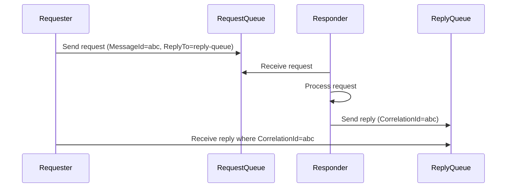

# How to Implement Request-Reply Pattern with Azure Service Bus

Author: [nawazdhandala](https://www.github.com/nawazdhandala)

Tags: Azure, Service Bus, Request-Reply, Messaging Patterns, Async Communication, Cloud Architecture, Microservices

Description: Step-by-step guide to implementing the request-reply messaging pattern using Azure Service Bus queues with correlation and reply-to support.

---

Most messaging patterns are fire-and-forget. A producer sends a message and moves on. But sometimes you need a response back - think of a service asking another service to validate an address, calculate a price, or check inventory. HTTP works for synchronous calls, but when you want the reliability and decoupling that a message broker provides, the request-reply pattern over Azure Service Bus is the way to go.

## How Request-Reply Works

The pattern involves two queues: a request queue and a reply queue. The requester sends a message to the request queue, setting the `ReplyTo` property to indicate where the reply should go and the `MessageId` (or a custom `SessionId`) to correlate the response. The responder picks up the request, processes it, and sends the result to the reply queue with the `CorrelationId` set to match the original request's `MessageId`.



## Setting Up the Queues

You need two queues. The request queue is a normal queue. The reply queue can either be a normal queue (if you have a single requester instance) or a session-enabled queue (if you have multiple requester instances and need to route replies to the correct one).

```csharp
// Create both queues using the Service Bus admin client
using Azure.Messaging.ServiceBus.Administration;

var adminClient = new ServiceBusAdministrationClient("your-connection-string");

// Create the request queue - standard settings
if (!await adminClient.QueueExistsAsync("price-requests"))
{
    await adminClient.CreateQueueAsync(new CreateQueueOptions("price-requests")
    {
        MaxDeliveryCount = 5,
        DefaultMessageTimeToLive = TimeSpan.FromMinutes(30),
        DeadLetteringOnMessageExpiration = true
    });
}

// Create the reply queue with sessions enabled
// Sessions let us route replies to the correct requester instance
if (!await adminClient.QueueExistsAsync("price-replies"))
{
    await adminClient.CreateQueueAsync(new CreateQueueOptions("price-replies")
    {
        RequiresSession = true,
        DefaultMessageTimeToLive = TimeSpan.FromMinutes(10),
        DeadLetteringOnMessageExpiration = true
    });
}
```

## The Requester Side

The requester sends a message and then waits for a correlated reply. Using sessions on the reply queue means each requester instance can listen for replies meant specifically for it.

```csharp
using Azure.Messaging.ServiceBus;
using System.Text.Json;

public class PriceRequester : IAsyncDisposable
{
    private readonly ServiceBusClient _client;
    private readonly ServiceBusSender _sender;
    private readonly string _sessionId;

    public PriceRequester(string connectionString)
    {
        _client = new ServiceBusClient(connectionString);
        _sender = _client.CreateSender("price-requests");
        // Each requester instance gets a unique session ID
        _sessionId = Guid.NewGuid().ToString();
    }

    public async Task<PriceResponse> RequestPriceAsync(PriceRequest request, TimeSpan timeout)
    {
        var messageId = Guid.NewGuid().ToString();

        // Build the request message with reply-to information
        var message = new ServiceBusMessage(JsonSerializer.Serialize(request))
        {
            MessageId = messageId,
            ReplyTo = "price-replies",
            // Session ID tells the responder which session to reply to
            ReplyToSessionId = _sessionId,
            ContentType = "application/json",
            // Set a TTL so abandoned requests don't pile up
            TimeToLive = timeout
        };

        // Send the request
        await _sender.SendMessageAsync(message);

        // Now wait for the reply on our session
        var receiver = await _client.AcceptSessionAsync(
            "price-replies",
            _sessionId,
            new ServiceBusSessionReceiverOptions
            {
                ReceiveMode = ServiceBusReceiveMode.ReceiveAndDelete
            }
        );

        try
        {
            // Wait for a reply with the matching correlation ID
            var reply = await receiver.ReceiveMessageAsync(timeout);

            if (reply == null)
                throw new TimeoutException($"No reply received within {timeout}");

            if (reply.CorrelationId != messageId)
                throw new InvalidOperationException("Received reply for wrong request");

            return JsonSerializer.Deserialize<PriceResponse>(reply.Body.ToString());
        }
        finally
        {
            await receiver.DisposeAsync();
        }
    }

    public async ValueTask DisposeAsync()
    {
        await _sender.DisposeAsync();
        await _client.DisposeAsync();
    }
}
```

## The Responder Side

The responder listens on the request queue, processes each request, and sends the reply to the queue and session specified in the incoming message's `ReplyTo` and `ReplyToSessionId` properties.

```csharp
using Azure.Messaging.ServiceBus;
using System.Text.Json;

public class PriceResponder : IAsyncDisposable
{
    private readonly ServiceBusClient _client;
    private readonly ServiceBusProcessor _processor;

    public PriceResponder(string connectionString)
    {
        _client = new ServiceBusClient(connectionString);
        _processor = _client.CreateProcessor("price-requests", new ServiceBusProcessorOptions
        {
            MaxConcurrentCalls = 10,
            AutoCompleteMessages = false
        });

        _processor.ProcessMessageAsync += HandleRequestAsync;
        _processor.ProcessErrorAsync += HandleErrorAsync;
    }

    private async Task HandleRequestAsync(ProcessMessageEventArgs args)
    {
        var request = JsonSerializer.Deserialize<PriceRequest>(
            args.Message.Body.ToString()
        );

        // Process the request - calculate the price
        var response = await CalculatePrice(request);

        // Build the reply message
        var replyMessage = new ServiceBusMessage(JsonSerializer.Serialize(response))
        {
            // Correlate this reply with the original request
            CorrelationId = args.Message.MessageId,
            // Set the session ID so it reaches the right requester
            SessionId = args.Message.ReplyToSessionId,
            ContentType = "application/json"
        };

        // Send the reply to the queue specified in ReplyTo
        var replySender = _client.CreateSender(args.Message.ReplyTo);
        try
        {
            await replySender.SendMessageAsync(replyMessage);
        }
        finally
        {
            await replySender.DisposeAsync();
        }

        // Complete the original request message
        await args.CompleteMessageAsync(args.Message);
    }

    private Task HandleErrorAsync(ProcessErrorEventArgs args)
    {
        Console.WriteLine($"Processing error: {args.Exception.Message}");
        return Task.CompletedTask;
    }

    private async Task<PriceResponse> CalculatePrice(PriceRequest request)
    {
        // Your pricing logic goes here
        await Task.Delay(100); // Simulate work
        return new PriceResponse
        {
            ProductId = request.ProductId,
            Price = 29.99m,
            Currency = "USD",
            ValidUntil = DateTimeOffset.UtcNow.AddHours(1)
        };
    }

    public async Task StartAsync() => await _processor.StartProcessingAsync();
    public async Task StopAsync() => await _processor.StopProcessingAsync();

    public async ValueTask DisposeAsync()
    {
        await _processor.DisposeAsync();
        await _client.DisposeAsync();
    }
}
```

## The Data Models

Here are the request and response models used in the examples above.

```csharp
// Request sent by the requester
public class PriceRequest
{
    public string ProductId { get; set; }
    public int Quantity { get; set; }
    public string CustomerTier { get; set; }
}

// Response sent by the responder
public class PriceResponse
{
    public string ProductId { get; set; }
    public decimal Price { get; set; }
    public string Currency { get; set; }
    public DateTimeOffset ValidUntil { get; set; }
}
```

## Handling Timeouts

Timeouts are critical in request-reply. If the responder is down or slow, the requester should not wait forever. Set a reasonable timeout on the `ReceiveMessageAsync` call and set a matching TTL on the request message so it does not sit in the queue indefinitely.

You should also consider what happens when a reply arrives after the requester has already timed out. The reply message will sit in the session until it expires. Setting a short TTL on reply messages prevents them from accumulating.

## Alternative: Temporary Reply Queues

Instead of using sessions on a shared reply queue, some teams create a temporary queue per requester instance. The requester creates a queue with a unique name, sets `ReplyTo` to that queue name, and deletes the queue when it is done. This approach works but has downsides - creating and deleting queues is slow and can hit Azure throttling limits if you do it frequently.

Sessions on a single reply queue are almost always the better choice.

## Error Handling Strategies

What happens when the responder cannot process a request? You have a few options:

1. **Send an error reply.** Include a status field in your reply model (success/failure) and let the requester handle it.
2. **Dead-letter the request.** If the request is malformed or impossible to fulfill, dead-letter it for investigation.
3. **Let Service Bus retry.** If it is a transient error, abandon the message and let Service Bus redeliver it.

A combination of all three is typical. Use retries for transient failures, error replies for business logic failures, and dead-lettering for poison messages.

## Performance Tips

Cache your `ServiceBusSender` instances. Creating a new sender for every reply is wasteful. Use a `ConcurrentDictionary` to pool senders by queue name.

Keep request and reply messages small. If you need to pass large data, combine this pattern with the claim check pattern discussed elsewhere.

Monitor the depth of both queues. A growing request queue means your responders cannot keep up. A growing reply queue means requesters are not consuming replies fast enough (or they have crashed).

## When to Use Request-Reply vs HTTP

Use HTTP when the call is synchronous, latency-sensitive, and both services are highly available. Use request-reply over Service Bus when you need durability (the request should survive a service restart), when the responder might be temporarily unavailable, or when you want to decouple the requester from the responder's lifecycle. The message broker acts as a buffer, absorbing load spikes and smoothing out processing.

Request-reply over a message broker is not a replacement for HTTP APIs. It is a tool for specific scenarios where reliability and decoupling matter more than raw latency.
