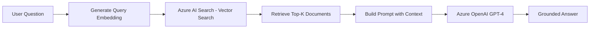

# How to Implement Retrieval-Augmented Generation (RAG) with Azure OpenAI and Azure AI Search

Author: [nawazdhandala](https://www.github.com/nawazdhandala)

Tags: Azure, OpenAI, RAG, AI Search, GPT-4, Embeddings, Vector Search

Description: Learn how to build a Retrieval-Augmented Generation pipeline using Azure OpenAI and Azure AI Search for grounded, accurate AI responses.

---

Large language models are powerful, but they have a fundamental limitation: they can only work with the knowledge baked into their training data. If you ask GPT-4 about your company's internal documentation or last week's product release notes, it will not know the answer. Retrieval-Augmented Generation, commonly called RAG, solves this problem by first searching a knowledge base for relevant documents and then passing those documents to the language model as context. The model generates its answer based on the retrieved content rather than relying solely on its training data.

In this post, I will show you how to build a RAG pipeline using Azure OpenAI for the language model and Azure AI Search (formerly Azure Cognitive Search) as the retrieval layer.

## Architecture Overview

The RAG pipeline has three main stages:

1. **Indexing**: Your documents are chunked, embedded into vectors using Azure OpenAI's embedding model, and stored in an Azure AI Search index.
2. **Retrieval**: When a user asks a question, the question is converted into an embedding, and Azure AI Search finds the most relevant document chunks using vector similarity search.
3. **Generation**: The retrieved chunks are passed to GPT-4 as context, and the model generates an answer grounded in those documents.

Here is a visual overview of the flow:



## Prerequisites

You will need the following Azure resources:

- An Azure OpenAI resource with a GPT-4 deployment and a text-embedding-ada-002 deployment
- An Azure AI Search resource (Basic tier or higher for vector search)
- Python 3.9 or later
- The following Python packages: `openai`, `azure-search-documents`, `azure-identity`

Install the dependencies:

```bash
# Install required Python packages
pip install openai azure-search-documents azure-identity
```

## Step 1: Prepare and Chunk Your Documents

Before indexing, you need to break your documents into smaller chunks. Language models have token limits, and smaller chunks produce more precise search results. A common approach is to split documents into chunks of 500-1000 tokens with some overlap between chunks.

```python
def chunk_text(text, chunk_size=800, overlap=100):
    """
    Split a document into overlapping chunks.
    Overlap ensures context is not lost at chunk boundaries.
    """
    words = text.split()
    chunks = []
    start = 0
    while start < len(words):
        end = start + chunk_size
        chunk = " ".join(words[start:end])
        chunks.append(chunk)
        start += chunk_size - overlap  # Move forward with overlap
    return chunks
```

In a real application, you would also want to preserve document metadata like the file name, page number, or section heading so you can cite sources in your responses.

## Step 2: Generate Embeddings

Use Azure OpenAI's embedding model to convert each chunk into a vector. The text-embedding-ada-002 model produces 1536-dimensional vectors.

```python
import openai

# Initialize the Azure OpenAI client
client = openai.AzureOpenAI(
    api_key="your-api-key",
    api_version="2024-02-01",
    azure_endpoint="https://your-resource.openai.azure.com/"
)

def get_embedding(text):
    """
    Generate an embedding vector for a text string using Azure OpenAI.
    The model returns a 1536-dimensional float vector.
    """
    response = client.embeddings.create(
        model="text-embedding-ada-002",  # Your embedding deployment name
        input=text
    )
    return response.data[0].embedding
```

Generate embeddings for all your chunks and store them alongside the text content.

## Step 3: Create an Azure AI Search Index

Set up an index in Azure AI Search that supports both traditional keyword search and vector search. This hybrid approach gives you the best of both worlds.

```python
from azure.search.documents.indexes import SearchIndexClient
from azure.search.documents.indexes.models import (
    SearchIndex,
    SearchField,
    SearchFieldDataType,
    VectorSearch,
    HnswAlgorithmConfiguration,
    VectorSearchProfile,
    SearchableField,
    SimpleField,
)
from azure.core.credentials import AzureKeyCredential

# Connect to Azure AI Search
index_client = SearchIndexClient(
    endpoint="https://your-search-service.search.windows.net",
    credential=AzureKeyCredential("your-search-admin-key")
)

# Define the index schema with vector search support
fields = [
    SimpleField(name="id", type=SearchFieldDataType.String, key=True),
    SearchableField(name="content", type=SearchFieldDataType.String),  # Full text search
    SimpleField(name="source", type=SearchFieldDataType.String, filterable=True),
    SearchField(
        name="content_vector",
        type=SearchFieldDataType.Collection(SearchFieldDataType.Single),
        searchable=True,
        vector_search_dimensions=1536,  # Must match embedding model dimensions
        vector_search_profile_name="my-vector-profile"
    ),
]

# Configure the vector search algorithm (HNSW is recommended for most cases)
vector_search = VectorSearch(
    algorithms=[HnswAlgorithmConfiguration(name="my-hnsw")],
    profiles=[VectorSearchProfile(name="my-vector-profile", algorithm_configuration_name="my-hnsw")]
)

# Create the index
index = SearchIndex(name="rag-index", fields=fields, vector_search=vector_search)
index_client.create_or_update_index(index)
print("Index created successfully")
```

## Step 4: Upload Documents to the Index

Now upload your chunked and embedded documents to the search index.

```python
from azure.search.documents import SearchClient

# Initialize the search client for document operations
search_client = SearchClient(
    endpoint="https://your-search-service.search.windows.net",
    index_name="rag-index",
    credential=AzureKeyCredential("your-search-admin-key")
)

# Prepare documents for upload
documents = []
for i, chunk in enumerate(all_chunks):
    documents.append({
        "id": str(i),
        "content": chunk["text"],
        "source": chunk["source_file"],
        "content_vector": chunk["embedding"]  # The 1536-dim vector from Step 2
    })

# Upload in batches of 1000 (Azure AI Search limit per request)
batch_size = 1000
for i in range(0, len(documents), batch_size):
    batch = documents[i:i + batch_size]
    search_client.upload_documents(batch)
    print(f"Uploaded batch {i // batch_size + 1}")
```

## Step 5: Implement the Retrieval Step

When a user asks a question, convert it to an embedding and search the index for the most relevant chunks.

```python
from azure.search.documents.models import VectorizedQuery

def retrieve_documents(query, top_k=5):
    """
    Search the index using both vector similarity and keyword matching.
    Returns the top-k most relevant document chunks.
    """
    # Generate embedding for the user's query
    query_vector = get_embedding(query)

    # Perform hybrid search (vector + keyword)
    results = search_client.search(
        search_text=query,  # Keyword search component
        vector_queries=[
            VectorizedQuery(
                vector=query_vector,
                k_nearest_neighbors=top_k,
                fields="content_vector"
            )
        ],
        top=top_k
    )

    # Collect the retrieved chunks
    retrieved = []
    for result in results:
        retrieved.append({
            "content": result["content"],
            "source": result["source"],
            "score": result["@search.score"]
        })
    return retrieved
```

## Step 6: Build the RAG Prompt and Generate an Answer

Combine the retrieved documents with the user's question and send everything to GPT-4.

```python
def generate_answer(question):
    """
    Full RAG pipeline: retrieve relevant docs, build a prompt, and generate an answer.
    """
    # Step 1: Retrieve relevant documents
    docs = retrieve_documents(question, top_k=5)

    # Step 2: Build context from retrieved documents
    context_parts = []
    for doc in docs:
        context_parts.append(f"Source: {doc['source']}\n{doc['content']}")
    context = "\n\n---\n\n".join(context_parts)

    # Step 3: Create the prompt with retrieved context
    system_message = """You are a helpful assistant that answers questions based on the provided context.
    If the context does not contain enough information to answer the question, say so.
    Always cite the source documents when possible."""

    user_message = f"""Context:\n{context}\n\nQuestion: {question}\n\nAnswer:"""

    # Step 4: Generate the answer using GPT-4
    response = client.chat.completions.create(
        model="gpt4-production",  # Your GPT-4 deployment name
        messages=[
            {"role": "system", "content": system_message},
            {"role": "user", "content": user_message}
        ],
        temperature=0.3,  # Lower temperature for more factual responses
        max_tokens=800
    )

    return response.choices[0].message.content
```

## Hybrid Search vs. Pure Vector Search

Azure AI Search supports three retrieval modes:

- **Keyword search**: Traditional BM25 text matching. Good for exact term matching but misses semantic similarity.
- **Vector search**: Embedding-based similarity. Catches semantically similar content even when different words are used.
- **Hybrid search**: Combines both approaches. This is generally the best choice for RAG because it captures both exact matches and semantic relevance.

In the retrieval function above, we use hybrid search by providing both `search_text` and `vector_queries`. Azure AI Search automatically fuses the scores from both retrieval methods using Reciprocal Rank Fusion (RRF).

## Tips for Production RAG Systems

**Chunk size matters.** Smaller chunks (300-500 tokens) give more precise retrieval but may lose context. Larger chunks (800-1500 tokens) preserve more context but may dilute the relevance signal. Experiment with your specific data.

**Overlap between chunks.** Using 10-20% overlap prevents important information from being split across chunk boundaries.

**Metadata filtering.** Add filterable metadata fields (like category, date, or department) to your index. This lets you narrow the search scope before running vector similarity, which improves both relevance and performance.

**Prompt engineering.** The system message in the generation step is critical. Tell the model to answer only from the provided context and to say "I don't know" when the context is insufficient. This reduces hallucinations.

**Evaluate and iterate.** Build a test set of questions with known correct answers. Measure retrieval recall (are the right documents being retrieved?) and generation quality (is the answer correct and grounded?) separately. This helps you identify whether problems are in the retrieval or generation phase.

## Wrapping Up

RAG with Azure OpenAI and Azure AI Search gives you a robust pattern for building AI applications that can answer questions about your own data. The combination of vector search for semantic retrieval and GPT-4 for natural language generation produces high-quality, grounded answers. Start with a small document set, get the pipeline working end to end, and then scale up from there. The hardest part is usually getting the chunking and retrieval quality right, so spend time tuning those components before worrying about prompt optimization.
