# How to Implement Retry and Exponential Backoff in Azure Event Grid Subscriptions

Author: [nawazdhandala](https://www.github.com/nawazdhandala)

Tags: Azure, Event Grid, Retry Policy, Exponential Backoff, Reliability, Error Handling, Event Delivery

Description: Configure Azure Event Grid retry policies and understand the built-in exponential backoff behavior to build resilient event-driven systems.

---

Azure Event Grid does not give up after one failed delivery attempt. It retries with an exponential backoff strategy, giving your subscriber time to recover from transient failures. Understanding how this retry mechanism works - and how to configure it - is essential for building reliable event-driven applications.

## How Event Grid Retries Work

When Event Grid tries to deliver an event and the subscriber returns an error (or does not respond), it retries using a fixed exponential backoff schedule. The retry intervals are not configurable - they are built into the service. But you can control two things: the maximum number of delivery attempts and the event time-to-live (TTL).

The retry schedule follows roughly this pattern:

- Retry 1: 10 seconds after failure
- Retry 2: 30 seconds
- Retry 3: 1 minute
- Retry 4: 5 minutes
- Retry 5: 10 minutes
- Retry 6: 30 minutes
- Retry 7 and beyond: 60 minutes (up to the max attempts or TTL)

Event Grid uses a jittered exponential backoff, meaning the exact timing varies slightly to avoid thundering herd problems when many events fail at the same time.

## Configuring the Retry Policy

You can configure two parameters on each event subscription:

- **maxDeliveryAttempts**: The maximum number of times Event Grid will try to deliver the event (1-30, default 30)
- **eventTimeToLiveInMinutes**: How long the event stays alive for retry (1-1440, default 1440 which is 24 hours)

Whichever limit is hit first determines when Event Grid stops retrying.

```bash
# Create a subscription with custom retry policy
az eventgrid event-subscription create \
  --name sub-orders-resilient \
  --source-resource-id "/subscriptions/{sub-id}/resourceGroups/rg-events/providers/Microsoft.EventGrid/topics/topic-orders" \
  --endpoint "https://myapp.azurewebsites.net/api/events" \
  --max-delivery-attempts 15 \
  --event-ttl 720
```

In this example, Event Grid will retry up to 15 times or for up to 12 hours, whichever comes first.

## Choosing the Right Retry Settings

The default settings (30 attempts, 24 hours) are aggressive. They work well when:

- Your subscriber occasionally goes down for maintenance
- Transient network issues cause brief outages
- You absolutely cannot afford to lose events

But sometimes you want faster failure. For time-sensitive events that lose value quickly, lower both settings.

```bash
# For time-sensitive events: fewer retries, shorter TTL
az eventgrid event-subscription create \
  --name sub-realtime-alerts \
  --source-resource-id "/subscriptions/{sub-id}/resourceGroups/rg-events/providers/Microsoft.EventGrid/topics/topic-alerts" \
  --endpoint "https://alert-handler.azurewebsites.net/api/handle" \
  --max-delivery-attempts 5 \
  --event-ttl 60 \
  --deadletter-endpoint "${STORAGE_ID}/blobServices/default/containers/deadletters"
```

This configuration retries up to 5 times within 1 hour. After that, the event is dead-lettered (if configured) or dropped.

## Retry Policy with Bicep

Here is the Bicep definition for subscriptions with different retry profiles.

```bicep
// Aggressive retry for critical events
resource criticalSubscription 'Microsoft.EventGrid/topics/eventSubscriptions@2022-06-15' = {
  name: '${topicName}/sub-critical'
  properties: {
    destination: {
      endpointType: 'WebHook'
      properties: {
        endpointUrl: 'https://critical-handler.azurewebsites.net/api/handle'
      }
    }
    retryPolicy: {
      maxDeliveryAttempts: 30 // Maximum retries
      eventTimeToLiveInMinutes: 1440 // Full 24 hours
    }
    deadLetterDestination: {
      endpointType: 'StorageBlob'
      properties: {
        resourceId: storageAccountId
        blobContainerName: 'deadletters'
      }
    }
  }
}

// Fast-fail for time-sensitive events
resource realtimeSubscription 'Microsoft.EventGrid/topics/eventSubscriptions@2022-06-15' = {
  name: '${topicName}/sub-realtime'
  properties: {
    destination: {
      endpointType: 'WebHook'
      properties: {
        endpointUrl: 'https://realtime-handler.azurewebsites.net/api/handle'
      }
    }
    retryPolicy: {
      maxDeliveryAttempts: 3
      eventTimeToLiveInMinutes: 30
    }
    deadLetterDestination: {
      endpointType: 'StorageBlob'
      properties: {
        resourceId: storageAccountId
        blobContainerName: 'deadletters-realtime'
      }
    }
  }
}
```

## HTTP Status Codes and Retry Behavior

Event Grid's retry behavior depends on the HTTP status code returned by your subscriber:

**Retried (transient errors):**
- 429 Too Many Requests
- 500 Internal Server Error
- 502 Bad Gateway
- 503 Service Unavailable
- 504 Gateway Timeout

**Not retried (permanent errors):**
- 400 Bad Request
- 401 Unauthorized
- 403 Forbidden
- 404 Not Found
- 413 Request Entity Too Large

**Success (event is completed):**
- 200 OK
- 201 Created
- 202 Accepted

This means your subscriber can control retry behavior by choosing the right status code. If you receive a malformed event you cannot process, return 400 and Event Grid will not waste time retrying. If you are temporarily overloaded, return 429 or 503 and Event Grid will back off and retry.

```csharp
// Azure Function with intentional status code control
[Function("HandleEvent")]
public async Task<HttpResponseData> Run(
    [HttpTrigger(AuthorizationLevel.Function, "post")] HttpRequestData req)
{
    var response = req.CreateResponse();

    try
    {
        var events = await req.ReadFromJsonAsync<EventGridEvent[]>();

        foreach (var ev in events)
        {
            await ProcessEvent(ev);
        }

        // Success - Event Grid marks this as delivered
        response.StatusCode = System.Net.HttpStatusCode.OK;
    }
    catch (InvalidDataException ex)
    {
        // Bad data - do NOT retry, it will never succeed
        _logger.LogError(ex, "Invalid event data");
        response.StatusCode = System.Net.HttpStatusCode.BadRequest;
    }
    catch (Exception ex)
    {
        // Transient error - return 500 so Event Grid retries
        _logger.LogError(ex, "Transient processing error");
        response.StatusCode = System.Net.HttpStatusCode.InternalServerError;
    }

    return response;
}
```

## Visualizing the Retry Timeline

Here is what a retry sequence looks like for an event that fails repeatedly.

```mermaid
gantt
    title Event Grid Retry Timeline
    dateFormat HH:mm
    axisFormat %H:%M

    section Delivery Attempts
    Attempt 1 (fail)     :done, 10:00, 1m
    Wait 10s             :active, 10:01, 1m
    Attempt 2 (fail)     :done, 10:02, 1m
    Wait 30s             :active, 10:03, 2m
    Attempt 3 (fail)     :done, 10:05, 1m
    Wait 1m              :active, 10:06, 3m
    Attempt 4 (fail)     :done, 10:09, 1m
    Wait 5m              :active, 10:10, 5m
    Attempt 5 (success)  :crit, 10:15, 1m
```



## Implementing Client-Side Retry Logic

While Event Grid handles retries at the delivery level, your subscriber might also need internal retry logic for downstream dependencies. For example, if your event handler needs to write to a database that is temporarily unavailable, you want to retry the database call without failing the entire event delivery.

```csharp
using Polly;
using Polly.Retry;

public class OrderEventProcessor
{
    // Define a retry policy for database operations
    private readonly AsyncRetryPolicy _dbRetryPolicy = Policy
        .Handle<SqlException>(ex => ex.IsTransient)
        .WaitAndRetryAsync(
            retryCount: 3,
            sleepDurationProvider: attempt =>
                TimeSpan.FromSeconds(Math.Pow(2, attempt)) // 2, 4, 8 seconds
        );

    public async Task ProcessOrderEvent(EventGridEvent ev)
    {
        var orderData = ev.Data.ToObjectFromJson<OrderData>();

        // Retry database writes with exponential backoff
        await _dbRetryPolicy.ExecuteAsync(async () =>
        {
            await SaveToDatabase(orderData);
        });

        // If this throws after all retries, return 500 to Event Grid
        // and it will retry the entire event delivery
    }
}
```

## Monitoring Retry Activity

Track delivery attempts and failures using Azure Monitor metrics. Key metrics to watch:

- **DeliveryAttemptFailCount**: Number of failed delivery attempts (includes retries)
- **DeliverySuccessCount**: Number of successful deliveries
- **DroppedEventCount**: Events dropped after exhausting retries (without dead-lettering)
- **DeadLetteredCount**: Events sent to dead-letter storage

```bash
# Query retry-related metrics for the last hour
az monitor metrics list \
  --resource "/subscriptions/{sub-id}/resourceGroups/rg-events/providers/Microsoft.EventGrid/topics/topic-orders" \
  --metric "DeliveryAttemptFailCount" "DeliverySuccessCount" "DroppedEventCount" \
  --interval PT5M \
  --start-time "$(date -u -d '1 hour ago' +%Y-%m-%dT%H:%M:%SZ)"
```

## Best Practices

Here are the retry-related practices that work well in production.

Always enable dead-lettering alongside your retry policy. Without it, events that exhaust retries are silently lost.

Return the correct HTTP status codes from your subscriber. Use 4xx for permanent failures and 5xx for transient failures. This gives Event Grid the information it needs to make good retry decisions.

Keep your event handler idempotent. Since Event Grid uses at-least-once delivery and retries can cause duplicate deliveries, your handler must be able to process the same event multiple times safely.

Set realistic TTL values. A 24-hour TTL is rarely needed. If your subscriber has been down for 24 hours, there are probably bigger problems to solve first.

Do not rely solely on Event Grid retries for critical data. If you absolutely cannot lose an event, use dead-lettering plus a dead-letter processing pipeline to ensure nothing falls through the cracks.

## Summary

Event Grid's built-in exponential backoff retry mechanism handles transient failures gracefully. Configure the max delivery attempts and TTL to match your event's urgency, return appropriate HTTP status codes to guide retry behavior, implement idempotent handlers for duplicate safety, and always combine retries with dead-lettering for a complete reliability story.
