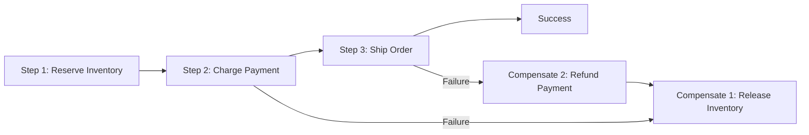

# How to Implement Saga Pattern with Azure Durable Functions

Author: [nawazdhandala](https://www.github.com/nawazdhandala)

Tags: Azure, Durable Functions, Saga Pattern, Distributed Transactions, Microservices, Orchestration, Compensation

Description: Implement the Saga pattern using Azure Durable Functions to manage distributed transactions with compensation logic across microservices.

---

Distributed transactions across microservices are hard. You cannot just wrap everything in a database transaction when the operations span multiple services, each with its own data store. The Saga pattern solves this by breaking a transaction into a sequence of local transactions, each paired with a compensating action that undoes its effect if something goes wrong later in the chain.

Azure Durable Functions is a natural fit for implementing sagas. The orchestrator function coordinates the sequence, tracks which steps have completed, and runs compensating actions if any step fails. In this post, I will walk through implementing the Saga pattern from scratch with a real-world example: an order processing workflow.

## What Is the Saga Pattern?

A saga is a sequence of steps where each step has a compensating action. If step 3 fails, the saga runs the compensations for steps 2 and 1 in reverse order, undoing their effects.



There are two saga styles:

- **Orchestration-based**: A central coordinator (the orchestrator) controls the sequence. This is what Durable Functions gives you.
- **Choreography-based**: Each service publishes events and reacts to events from other services. No central coordinator.

Durable Functions excels at the orchestration approach because the orchestrator function naturally maintains the state of which steps have completed.

## The Order Processing Saga

Let us build a saga for processing an e-commerce order. The steps are:

1. Reserve inventory for the ordered items.
2. Process the payment.
3. Create the shipment.

If any step fails, we need to undo the previous steps.

### The Orchestrator

```javascript
// order-saga.js - Durable Functions orchestrator implementing the Saga pattern
const df = require('durable-functions');

module.exports = df.orchestrator(function* (context) {
  const order = context.df.getInput();
  const completedSteps = []; // Track completed steps for compensation

  try {
    // Step 1: Reserve inventory
    context.log(`Saga: Reserving inventory for order ${order.orderId}`);
    const reservationId = yield context.df.callActivity('ReserveInventory', {
      orderId: order.orderId,
      items: order.items
    });
    completedSteps.push({ step: 'inventory', reservationId });

    // Step 2: Process payment
    context.log(`Saga: Processing payment for order ${order.orderId}`);
    const paymentId = yield context.df.callActivity('ProcessPayment', {
      orderId: order.orderId,
      amount: order.totalAmount,
      paymentMethod: order.paymentMethod
    });
    completedSteps.push({ step: 'payment', paymentId });

    // Step 3: Create shipment
    context.log(`Saga: Creating shipment for order ${order.orderId}`);
    const shipmentId = yield context.df.callActivity('CreateShipment', {
      orderId: order.orderId,
      address: order.shippingAddress,
      items: order.items
    });
    completedSteps.push({ step: 'shipment', shipmentId });

    // All steps succeeded
    yield context.df.callActivity('UpdateOrderStatus', {
      orderId: order.orderId,
      status: 'completed',
      reservationId,
      paymentId,
      shipmentId
    });

    return {
      success: true,
      orderId: order.orderId,
      reservationId,
      paymentId,
      shipmentId
    };

  } catch (error) {
    // A step failed - run compensating actions in reverse order
    context.log.error(`Saga failed at step: ${error.message}`);
    context.log(`Running ${completedSteps.length} compensation(s)`);

    // Reverse the completed steps and compensate
    for (let i = completedSteps.length - 1; i >= 0; i--) {
      const step = completedSteps[i];

      try {
        switch (step.step) {
          case 'shipment':
            yield context.df.callActivity('CancelShipment', {
              orderId: order.orderId,
              shipmentId: step.shipmentId
            });
            context.log('Compensated: shipment canceled');
            break;

          case 'payment':
            yield context.df.callActivity('RefundPayment', {
              orderId: order.orderId,
              paymentId: step.paymentId
            });
            context.log('Compensated: payment refunded');
            break;

          case 'inventory':
            yield context.df.callActivity('ReleaseInventory', {
              orderId: order.orderId,
              reservationId: step.reservationId
            });
            context.log('Compensated: inventory released');
            break;
        }
      } catch (compensationError) {
        // Compensation failed - log for manual resolution
        context.log.error(
          `CRITICAL: Compensation for ${step.step} failed: ${compensationError.message}`
        );
      }
    }

    // Update order status to failed
    yield context.df.callActivity('UpdateOrderStatus', {
      orderId: order.orderId,
      status: 'failed',
      reason: error.message
    });

    return {
      success: false,
      orderId: order.orderId,
      error: error.message,
      compensatedSteps: completedSteps.map(s => s.step)
    };
  }
});
```

### The Activity Functions

Each activity function handles one step of the saga.

```javascript
// reserve-inventory.js - Reserve inventory for the order
module.exports = async function (context, input) {
  const { orderId, items } = input;

  // Check if all items are in stock
  for (const item of items) {
    const available = await checkStock(item.productId);
    if (available < item.quantity) {
      throw new Error(`Insufficient stock for product ${item.productId}: need ${item.quantity}, have ${available}`);
    }
  }

  // Reserve the inventory
  const reservationId = await createReservation(orderId, items);
  return reservationId;
};

// process-payment.js - Charge the customer
module.exports = async function (context, input) {
  const { orderId, amount, paymentMethod } = input;

  // Call the payment service
  const result = await chargePayment(paymentMethod, amount, orderId);

  if (!result.success) {
    throw new Error(`Payment failed: ${result.error}`);
  }

  return result.paymentId;
};

// create-shipment.js - Create a shipping order
module.exports = async function (context, input) {
  const { orderId, address, items } = input;

  const shipmentId = await createShippingOrder(orderId, address, items);
  return shipmentId;
};
```

And the compensation functions:

```javascript
// release-inventory.js - Compensation: release reserved inventory
module.exports = async function (context, input) {
  const { orderId, reservationId } = input;
  await cancelReservation(reservationId);
  context.log(`Released inventory reservation ${reservationId} for order ${orderId}`);
};

// refund-payment.js - Compensation: refund the payment
module.exports = async function (context, input) {
  const { orderId, paymentId } = input;
  await issueRefund(paymentId);
  context.log(`Refunded payment ${paymentId} for order ${orderId}`);
};

// cancel-shipment.js - Compensation: cancel the shipment
module.exports = async function (context, input) {
  const { orderId, shipmentId } = input;
  await cancelShippingOrder(shipmentId);
  context.log(`Canceled shipment ${shipmentId} for order ${orderId}`);
};
```

## Making the Saga Reusable

You can create a generic saga executor that works with any sequence of steps and compensations.

```javascript
// saga-executor.js - Generic saga executor for Durable Functions
const df = require('durable-functions');

module.exports = df.orchestrator(function* (context) {
  const { steps, input } = context.df.getInput();
  const completedSteps = [];
  let result = { ...input };

  try {
    for (const step of steps) {
      context.log(`Executing step: ${step.name}`);

      // Run the step activity, passing accumulated result
      const stepResult = yield context.df.callActivity(step.activity, {
        ...result,
        stepName: step.name
      });

      // Merge step result into accumulated result
      result = { ...result, ...stepResult };

      // Track the completed step with its compensation activity
      completedSteps.push({
        name: step.name,
        compensationActivity: step.compensation,
        result: stepResult
      });
    }

    return { success: true, result };

  } catch (error) {
    context.log.error(`Saga failed: ${error.message}`);

    // Run compensations in reverse order
    const compensationResults = [];
    for (let i = completedSteps.length - 1; i >= 0; i--) {
      const step = completedSteps[i];

      if (step.compensationActivity) {
        try {
          yield context.df.callActivity(step.compensationActivity, {
            ...result,
            stepResult: step.result,
            failureReason: error.message
          });
          compensationResults.push({ step: step.name, compensated: true });
        } catch (compErr) {
          compensationResults.push({
            step: step.name,
            compensated: false,
            error: compErr.message
          });
        }
      }
    }

    return {
      success: false,
      error: error.message,
      compensationResults
    };
  }
});
```

Usage:

```javascript
// Start a saga with the generic executor
const sagaInput = {
  steps: [
    { name: 'reserve', activity: 'ReserveInventory', compensation: 'ReleaseInventory' },
    { name: 'pay', activity: 'ProcessPayment', compensation: 'RefundPayment' },
    { name: 'ship', activity: 'CreateShipment', compensation: 'CancelShipment' }
  ],
  input: {
    orderId: 'order-123',
    items: [{ productId: 'prod-1', quantity: 2 }],
    totalAmount: 49.99
  }
};

await client.startNew('SagaExecutor', undefined, sagaInput);
```

## Adding Retry Logic to Steps

Some failures are transient. Before giving up and compensating, retry the failed step.

```javascript
// saga-with-retry.js - Saga steps with retry policies
const retryOptions = new df.RetryOptions(5000, 3); // 5s interval, 3 attempts
retryOptions.backoffCoefficient = 2; // Exponential backoff

// In the orchestrator, use callActivityWithRetry
const paymentId = yield context.df.callActivityWithRetry(
  'ProcessPayment',
  retryOptions,
  { orderId: order.orderId, amount: order.totalAmount }
);
```

This way, transient failures (network timeouts, temporary service unavailability) are handled automatically. The saga only compensates when the retry policy is exhausted.

## When Compensation Fails

The hardest part of the saga pattern is handling compensation failures. If the refund call fails, you are in an inconsistent state: the customer was charged but the inventory was not shipped.

The best approach is:

1. Log the failure with full context.
2. Send an alert to a human operator.
3. Store the failed compensation in a dead letter queue for manual resolution.
4. Have a separate process that retries failed compensations periodically.

Never silently swallow compensation errors. They represent real business problems that need attention.

## Wrapping Up

The Saga pattern with Azure Durable Functions gives you a reliable way to manage distributed transactions across microservices. The orchestrator tracks the state of each step, and if anything fails, it runs compensating actions in reverse order to maintain consistency. The key is keeping each step and compensation idempotent, handling compensation failures seriously, and using retry policies for transient errors before triggering compensations. Durable Functions makes this pattern straightforward to implement because the orchestrator naturally maintains the execution state, handles retries, and survives process restarts.
