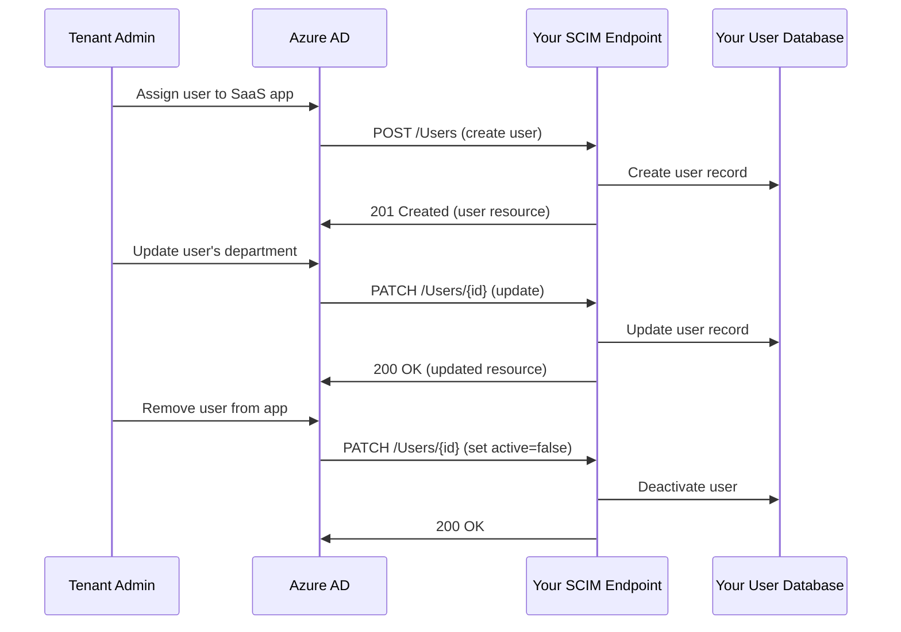

# How to Implement SCIM Provisioning for SaaS Apps with Azure AD and Azure Functions

Author: [nawazdhandala](https://www.github.com/nawazdhandala)

Tags: SCIM, Azure AD, Azure Functions, SaaS, User Provisioning, Identity Management, Automation

Description: Implement SCIM provisioning for SaaS applications using Azure AD as the identity source and Azure Functions as the SCIM endpoint.

---

When a company starts using your SaaS product, their IT admin does not want to manually create accounts for every employee. They want to connect their Azure AD directory to your app so that users are automatically provisioned when they join the company and deprovisioned when they leave. This is what SCIM (System for Cross-domain Identity Management) provides.

SCIM is an open standard that defines how identity data should be exchanged between systems. Azure AD has built-in support for SCIM provisioning. If your SaaS app exposes a SCIM endpoint, Azure AD can automatically create, update, and delete user accounts in your system. In this guide, I will build a SCIM endpoint using Azure Functions.

## How SCIM Provisioning Works



Azure AD polls your SCIM endpoint periodically (about every 40 minutes) and whenever an admin makes a change. It sends standard HTTP requests to create, read, update, and delete users and groups.

## Step 1 - Understand the SCIM Protocol

SCIM uses REST with JSON payloads. The key endpoints are:

- `GET /Users` - List users (with filtering)
- `POST /Users` - Create a user
- `GET /Users/{id}` - Get a specific user
- `PATCH /Users/{id}` - Update a user
- `DELETE /Users/{id}` - Delete a user
- `GET /Groups` - List groups
- `POST /Groups` - Create a group
- `PATCH /Groups/{id}` - Update group membership

A SCIM user resource looks like this:

```json
{
  "schemas": ["urn:ietf:params:scim:schemas:core:2.0:User"],
  "id": "abc-123",
  "externalId": "user@contoso.com",
  "userName": "user@contoso.com",
  "name": {
    "givenName": "Jane",
    "familyName": "Doe"
  },
  "emails": [
    {
      "primary": true,
      "value": "jane.doe@contoso.com",
      "type": "work"
    }
  ],
  "displayName": "Jane Doe",
  "active": true,
  "meta": {
    "resourceType": "User",
    "created": "2026-01-15T10:00:00Z",
    "lastModified": "2026-02-16T14:30:00Z"
  }
}
```

## Step 2 - Build the SCIM Endpoint with Azure Functions

Here is the SCIM endpoint implemented as an Azure Functions HTTP trigger. This handles all the operations Azure AD needs.

```python
import azure.functions as func
import json
import uuid
from datetime import datetime

app = func.FunctionApp()

# In production, use a real database. This is simplified for clarity.
# Azure SQL, Cosmos DB, or PostgreSQL would be appropriate choices.

@app.route(route="scim/Users", methods=["GET"])
def list_users(req: func.HttpRequest) -> func.HttpResponse:
    """Handle SCIM user list and filter requests."""
    # Parse the filter parameter - Azure AD sends filters like:
    # filter=userName eq "user@contoso.com"
    filter_param = req.params.get("filter", "")
    start_index = int(req.params.get("startIndex", "1"))
    count = int(req.params.get("count", "100"))

    if filter_param:
        users = apply_scim_filter(filter_param)
    else:
        users = get_all_users(start_index, count)

    # Return SCIM ListResponse format
    response = {
        "schemas": ["urn:ietf:params:scim:api:messages:2.0:ListResponse"],
        "totalResults": len(users),
        "startIndex": start_index,
        "itemsPerPage": count,
        "Resources": [format_user_resource(u) for u in users]
    }

    return func.HttpResponse(
        json.dumps(response),
        status_code=200,
        mimetype="application/scim+json"
    )

@app.route(route="scim/Users", methods=["POST"])
def create_user(req: func.HttpRequest) -> func.HttpResponse:
    """Handle SCIM user creation."""
    body = req.get_json()

    # Extract user attributes from the SCIM request
    user_data = {
        "id": str(uuid.uuid4()),
        "externalId": body.get("externalId"),
        "userName": body.get("userName"),
        "givenName": body.get("name", {}).get("givenName", ""),
        "familyName": body.get("name", {}).get("familyName", ""),
        "displayName": body.get("displayName", ""),
        "email": extract_primary_email(body.get("emails", [])),
        "active": body.get("active", True),
        "tenantId": get_tenant_from_token(req),
        "createdAt": datetime.utcnow().isoformat(),
        "updatedAt": datetime.utcnow().isoformat()
    }

    # Check if user already exists (by externalId or userName)
    existing = find_user_by_external_id(user_data["externalId"], user_data["tenantId"])
    if existing:
        return func.HttpResponse(
            json.dumps({
                "schemas": ["urn:ietf:params:scim:api:messages:2.0:Error"],
                "detail": "User already exists",
                "status": 409
            }),
            status_code=409,
            mimetype="application/scim+json"
        )

    # Create the user in your database
    save_user(user_data)

    # Return the created user in SCIM format
    resource = format_user_resource(user_data)
    return func.HttpResponse(
        json.dumps(resource),
        status_code=201,
        mimetype="application/scim+json",
        headers={"Location": f"/scim/Users/{user_data['id']}"}
    )

@app.route(route="scim/Users/{user_id}", methods=["GET"])
def get_user(req: func.HttpRequest) -> func.HttpResponse:
    """Get a specific user by ID."""
    user_id = req.route_params.get("user_id")
    tenant_id = get_tenant_from_token(req)

    user = find_user_by_id(user_id, tenant_id)
    if not user:
        return func.HttpResponse(
            json.dumps({
                "schemas": ["urn:ietf:params:scim:api:messages:2.0:Error"],
                "detail": "User not found",
                "status": 404
            }),
            status_code=404,
            mimetype="application/scim+json"
        )

    return func.HttpResponse(
        json.dumps(format_user_resource(user)),
        status_code=200,
        mimetype="application/scim+json"
    )

@app.route(route="scim/Users/{user_id}", methods=["PATCH"])
def update_user(req: func.HttpRequest) -> func.HttpResponse:
    """Handle SCIM PATCH operations for user updates."""
    user_id = req.route_params.get("user_id")
    tenant_id = get_tenant_from_token(req)
    body = req.get_json()

    user = find_user_by_id(user_id, tenant_id)
    if not user:
        return func.HttpResponse(status_code=404)

    # Process SCIM PATCH operations
    operations = body.get("Operations", [])
    for op in operations:
        operation = op.get("op", "").lower()
        path = op.get("path", "")
        value = op.get("value")

        if operation == "replace":
            apply_replace_operation(user, path, value)
        elif operation == "add":
            apply_add_operation(user, path, value)
        elif operation == "remove":
            apply_remove_operation(user, path)

    user["updatedAt"] = datetime.utcnow().isoformat()
    save_user(user)

    return func.HttpResponse(
        json.dumps(format_user_resource(user)),
        status_code=200,
        mimetype="application/scim+json"
    )

@app.route(route="scim/Users/{user_id}", methods=["DELETE"])
def delete_user(req: func.HttpRequest) -> func.HttpResponse:
    """Handle user deletion (or soft delete)."""
    user_id = req.route_params.get("user_id")
    tenant_id = get_tenant_from_token(req)

    # Soft delete - mark as inactive rather than removing data
    user = find_user_by_id(user_id, tenant_id)
    if user:
        user["active"] = False
        user["updatedAt"] = datetime.utcnow().isoformat()
        save_user(user)

    return func.HttpResponse(status_code=204)
```

## Step 3 - Implement SCIM Filtering

Azure AD sends filter queries to find existing users before creating new ones. The most common filter is by `userName`. You need to parse and execute these filters.

```python
import re

def apply_scim_filter(filter_string: str) -> list:
    """Parse and apply a SCIM filter expression."""
    # Common filter patterns from Azure AD:
    # userName eq "user@contoso.com"
    # externalId eq "some-id"
    # displayName co "Jane"

    # Parse the filter using regex
    match = re.match(r'(\w+)\s+(eq|co|sw)\s+"(.+)"', filter_string)
    if not match:
        return []

    attribute = match.group(1)
    operator = match.group(2)
    value = match.group(3)

    # Map SCIM attributes to database columns
    attribute_map = {
        "userName": "userName",
        "externalId": "externalId",
        "displayName": "displayName",
        "emails.value": "email"
    }

    db_column = attribute_map.get(attribute, attribute)

    # Build the query based on the operator
    if operator == "eq":
        return query_users_exact(db_column, value)
    elif operator == "co":
        return query_users_contains(db_column, value)
    elif operator == "sw":
        return query_users_starts_with(db_column, value)

    return []

def format_user_resource(user: dict) -> dict:
    """Format a user record into SCIM User resource format."""
    return {
        "schemas": ["urn:ietf:params:scim:schemas:core:2.0:User"],
        "id": user["id"],
        "externalId": user.get("externalId"),
        "userName": user["userName"],
        "name": {
            "givenName": user.get("givenName", ""),
            "familyName": user.get("familyName", "")
        },
        "displayName": user.get("displayName", ""),
        "emails": [
            {
                "primary": True,
                "value": user.get("email", user["userName"]),
                "type": "work"
            }
        ],
        "active": user.get("active", True),
        "meta": {
            "resourceType": "User",
            "created": user.get("createdAt", ""),
            "lastModified": user.get("updatedAt", "")
        }
    }

def apply_replace_operation(user: dict, path: str, value):
    """Apply a SCIM PATCH replace operation."""
    # Handle common paths Azure AD sends
    if path == "active":
        user["active"] = value
    elif path == "displayName":
        user["displayName"] = value
    elif path == "name.givenName":
        user["givenName"] = value
    elif path == "name.familyName":
        user["familyName"] = value
    elif path == "userName":
        user["userName"] = value
    elif not path and isinstance(value, dict):
        # No path means replace at the root level
        if "active" in value:
            user["active"] = value["active"]
        if "displayName" in value:
            user["displayName"] = value["displayName"]
```

## Step 4 - Secure the SCIM Endpoint

Azure AD authenticates to your SCIM endpoint using a bearer token. You configure this token when setting up the provisioning in Azure AD.

```python
def get_tenant_from_token(req: func.HttpRequest) -> str:
    """Validate the bearer token and extract the tenant ID."""
    auth_header = req.headers.get("Authorization", "")
    if not auth_header.startswith("Bearer "):
        raise ValueError("Missing or invalid authorization header")

    token = auth_header[7:]

    # Option 1: Use a long-lived secret token (simpler but less secure)
    # configured in Azure AD provisioning settings
    if token == os.environ.get("SCIM_BEARER_TOKEN"):
        # Extract tenant from a custom header or token claim
        return req.headers.get("X-Tenant-Id", "default")

    # Option 2: Validate an OAuth token from Azure AD (more secure)
    # This requires configuring your SCIM app in Azure AD
    decoded = validate_azure_ad_token(token)
    return decoded.get("tid", "unknown")
```

For production, use OAuth 2.0 token validation. Configure your SCIM endpoint as an API in Azure AD, and Azure AD will authenticate using client credentials.

## Step 5 - Configure Azure AD Provisioning

Once your SCIM endpoint is deployed, configure Azure AD to use it.

In the Azure portal:
1. Go to Azure AD > Enterprise Applications
2. Find your SaaS application
3. Go to Provisioning
4. Set provisioning mode to "Automatic"
5. Enter your SCIM endpoint URL (e.g., `https://your-functions.azurewebsites.net/api/scim`)
6. Enter the bearer token or OAuth credentials
7. Test the connection
8. Map Azure AD attributes to SCIM attributes
9. Set the provisioning scope (all users or assigned users only)
10. Enable provisioning

Azure AD will run an initial sync that provisions all users in scope, then switch to incremental syncs every 40 minutes.

## Common Pitfalls

First, handle the soft-delete correctly. Azure AD's default behavior when deprovisioning a user is to send a PATCH setting `active` to `false`, not a DELETE. Make sure your endpoint handles this.

Second, implement idempotent operations. Azure AD may retry failed requests. Creating a user that already exists should not fail with a 500 error - return the existing user or a 409 Conflict.

Third, support the `externalId` attribute. Azure AD uses this to match users between systems. Without it, Azure AD cannot determine if a user in your system corresponds to a user in their directory.

## Wrapping Up

SCIM provisioning transforms your SaaS onboarding from a manual process to an automated one. When a customer connects their Azure AD to your SCIM endpoint, user lifecycle management happens automatically. New hires get access on day one. Departing employees lose access immediately. Department changes and name updates flow through without anyone lifting a finger. Build the SCIM endpoint with Azure Functions, handle the core operations (create, read, update, soft-delete), implement proper filtering, and secure it with bearer tokens. The initial implementation takes some work, but it removes the ongoing burden of manual user management for every customer.
