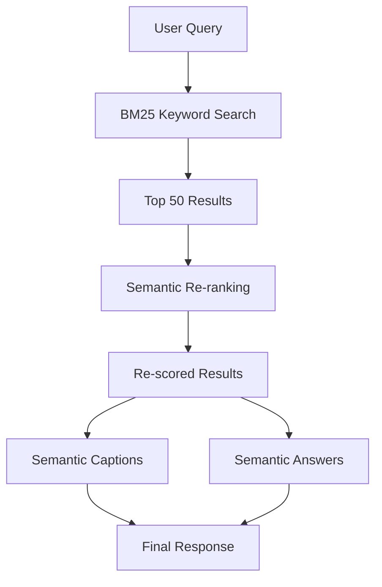

# How to Implement Semantic Ranking in Azure AI Search for Better Relevance

Author: [nawazdhandala](https://www.github.com/nawazdhandala)

Tags: Azure AI Search, Semantic Ranking, Search Relevance, NLP, Azure, Search, AI

Description: A practical guide to implementing semantic ranking in Azure AI Search to improve search result relevance using natural language understanding.

---

Traditional keyword-based search relies on term frequency and exact matches. That works fine when users know the exact terminology in your documents, but it falls apart when people use natural language queries. Semantic ranking in Azure AI Search fixes this by re-ranking results using deep learning models that actually understand the meaning behind queries and documents.

In this guide, I will walk through how to enable and configure semantic ranking, how it works under the hood, and how to get the most out of it in your search application.

## What Is Semantic Ranking?

Semantic ranking is a feature in Azure AI Search that applies a secondary ranking pass on top of the standard BM25 results. After the initial keyword-based retrieval returns a set of candidate documents, the semantic ranker uses Microsoft's language understanding models to re-score those results based on how well they actually answer the query.

This means a query like "how do I fix a slow database" can properly rank a document titled "Optimizing Database Performance" even if the exact words "fix" and "slow" do not appear together in that document.

The semantic ranker also generates:
- **Semantic captions** - the most relevant passages from the document
- **Semantic answers** - a direct answer extracted from the top results (similar to featured snippets in web search)

## Prerequisites

Before you can use semantic ranking, you need:

1. An Azure AI Search service on the **Basic tier or higher** (semantic ranking is not available on the Free tier)
2. A search index with text content in searchable fields
3. The semantic ranker enabled on your search service

Note that semantic ranking is billed separately. Check Azure's pricing page for the latest details on costs per query.

## Step 1: Enable Semantic Ranking on Your Service

First, make sure semantic ranking is enabled at the service level. Go to the Azure portal, open your Azure AI Search resource, and navigate to **Settings > Semantic ranker**. Set it to either the Free plan (limited queries per month) or the Standard plan.

You can also enable it via the Management REST API.

```bash
# Enable semantic ranking on your search service using the Azure CLI
az rest --method PATCH \
  --url "https://management.azure.com/subscriptions/<sub-id>/resourceGroups/<rg>/providers/Microsoft.Search/searchServices/<service-name>?api-version=2024-06-01-preview" \
  --body '{"properties": {"semanticSearch": "standard"}}'
```

## Step 2: Create a Semantic Configuration

A semantic configuration tells the ranker which fields in your index contain the title, content, and keywords. This helps the model understand the structure of your documents.

You define a semantic configuration as part of your index definition.

```json
// PUT to update your index definition with a semantic configuration
// https://<search-service>.search.windows.net/indexes/my-index?api-version=2024-07-01
{
  "name": "my-index",
  "fields": [
    { "name": "id", "type": "Edm.String", "key": true },
    { "name": "title", "type": "Edm.String", "searchable": true },
    { "name": "content", "type": "Edm.String", "searchable": true },
    { "name": "category", "type": "Edm.String", "filterable": true, "searchable": true }
  ],
  "semantic": {
    "configurations": [
      {
        "name": "my-semantic-config",
        // Tell the ranker which field is the title
        "prioritizedFields": {
          "titleField": {
            "fieldName": "title"
          },
          // These fields contain the main content to analyze
          "contentFields": [
            { "fieldName": "content" }
          ],
          // Optional keyword fields help with context
          "keywordsFields": [
            { "fieldName": "category" }
          ]
        }
      }
    ]
  }
}
```

You can define multiple semantic configurations on the same index. This is useful when you have different document types with different field structures.

## Step 3: Query with Semantic Ranking

To use semantic ranking at query time, you add the `queryType` and `semanticConfiguration` parameters to your search request.

```json
// POST to https://<search-service>.search.windows.net/indexes/my-index/docs/search?api-version=2024-07-01
{
  "search": "how do I fix a slow database",
  "queryType": "semantic",
  "semanticConfiguration": "my-semantic-config",
  // Request captions and answers
  "captions": "extractive",
  "answers": "extractive|count-3",
  // Number of results to consider for re-ranking
  "top": 10
}
```

The response will include the standard search results, but re-ranked by semantic relevance. Each result will also include a `@search.rerankerScore` that reflects the semantic relevance score.

## Understanding the Response

Here is what a typical semantic search response looks like.

```json
{
  "@search.answers": [
    {
      "key": "doc-42",
      "text": "To resolve slow query performance, start by analyzing the query execution plan and adding appropriate indexes on frequently queried columns.",
      "score": 0.92,
      "highlights": "To resolve <em>slow query performance</em>, start by analyzing..."
    }
  ],
  "value": [
    {
      "@search.score": 8.75,
      "@search.rerankerScore": 3.21,
      "@search.captions": [
        {
          "text": "Database performance issues are often caused by missing indexes, inefficient queries, or resource constraints.",
          "highlights": "<em>Database performance</em> issues are often caused by..."
        }
      ],
      "id": "doc-42",
      "title": "Optimizing Database Performance",
      "content": "..."
    }
  ]
}
```

A few things to notice:
- `@search.answers` appears at the top level and contains extracted answers
- `@search.rerankerScore` is the semantic score (ranges from 0 to 4)
- `@search.captions` contains the most relevant excerpts with highlight markers

## How the Ranking Pipeline Works

Understanding the two-pass ranking helps you make better decisions about configuration.



The first pass uses the standard BM25 algorithm to retrieve up to 50 candidate results. The semantic ranker then processes these candidates using transformer-based language models. This two-pass approach is efficient because the expensive language model only processes a small number of documents.

## Tuning Semantic Ranking

Here are some practical tips for getting better results from semantic ranking.

### Choose Fields Carefully

The fields you put in your semantic configuration matter a lot. The title field should be a short, descriptive field. The content fields should contain the main body text. Avoid putting metadata fields like IDs or dates in the content fields - they just add noise.

### Combine with Filters

Semantic ranking works on top of any filters you apply. Use filters to narrow down the candidate set before semantic re-ranking kicks in.

```json
{
  "search": "how to improve query performance",
  "queryType": "semantic",
  "semanticConfiguration": "my-semantic-config",
  "filter": "category eq 'database'",
  "captions": "extractive",
  "answers": "extractive"
}
```

### Use Natural Language Queries

Semantic ranking shines with natural language queries. Instead of keyword queries like "database performance optimization", encourage users to ask full questions like "how do I make my database queries faster?" The language model handles these much better.

### Monitor Reranker Scores

The `@search.rerankerScore` is a good indicator of result quality. If your top results consistently have low reranker scores (below 1.0), it might mean your content does not match what users are searching for, or your semantic configuration needs adjustment.

## Combining Semantic Ranking with Other Features

Semantic ranking works well alongside other Azure AI Search features:

- **Vector search** - use hybrid search to combine keyword, vector, and semantic ranking for the best possible relevance
- **Skillset enrichment** - enrich documents with AI-extracted data, then use semantic ranking at query time
- **Scoring profiles** - the initial BM25 scoring can be influenced by scoring profiles, which affects what candidates the semantic ranker sees

## Cost Considerations

Semantic ranking adds a per-query cost on top of your base search service pricing. The free tier gives you 1,000 semantic queries per month, which is fine for development and testing. For production workloads, the standard plan charges per 1,000 queries.

To manage costs:
- Only enable semantic ranking on queries that need it (not every query benefits from it)
- Use filters to reduce the candidate set before re-ranking
- Cache results for repeated queries

## When to Use Semantic Ranking

Semantic ranking is most valuable when:
- Your users write natural language queries rather than keyword searches
- Your documents use diverse vocabulary to describe the same concepts
- You need to extract direct answers from your content
- Standard BM25 ranking is not providing satisfactory relevance

It is less useful when:
- Your queries are simple keyword lookups
- Your documents are highly structured with consistent terminology
- Latency is extremely critical (semantic ranking adds a small amount of processing time)

## Wrapping Up

Semantic ranking in Azure AI Search is one of the most impactful features you can enable to improve search quality. The setup is straightforward - define a semantic configuration on your index and add a few parameters to your queries. The language understanding models handle the heavy lifting of matching user intent to document content. Start with the free tier to evaluate the improvement in your specific scenario, then move to the standard plan once you have confirmed the relevance gains justify the cost.
