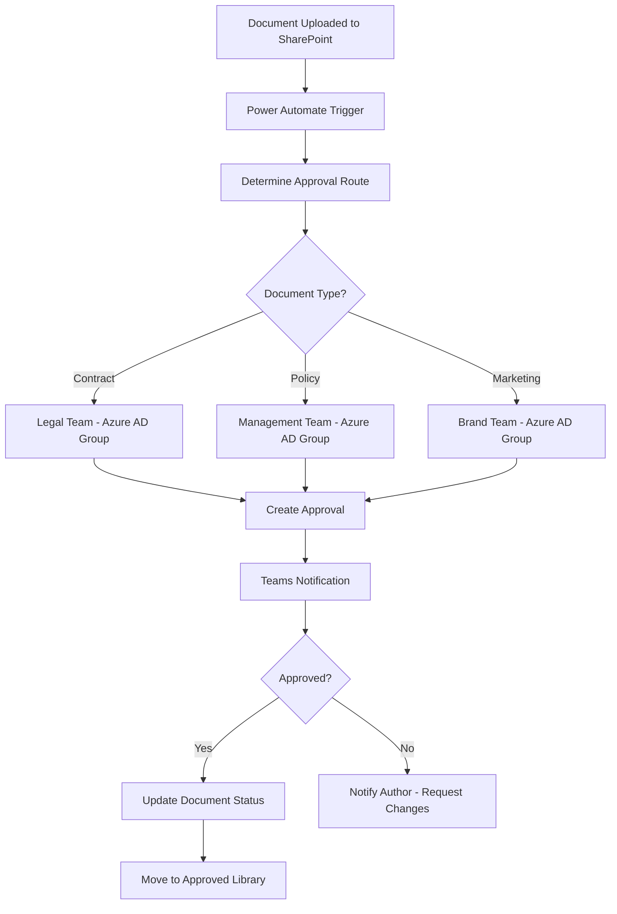

# How to Implement SharePoint Document Approval Workflows with Power Automate and Azure AD Groups

Author: [nawazdhandala](https://www.github.com/nawazdhandala)

Tags: SharePoint, Power Automate, Azure AD, Document Approval, Workflows, Microsoft 365, Automation

Description: Implement document approval workflows in SharePoint using Power Automate with Azure AD group-based routing for dynamic approver assignment.

---

Document approval workflows are one of the most common business processes in SharePoint. Contracts need legal review, policies need management sign-off, marketing materials need brand team approval, and expense reports need manager authorization. The challenge is not the approval itself - it is routing the right document to the right approver at the right time.

Using Azure AD groups as the basis for approver assignment makes workflows dynamic and maintainable. When someone joins or leaves the legal team, you update the Azure AD group once, and all workflows that route to "Legal Approvers" automatically reflect the change. No need to edit dozens of individual flows.

In this guide, I will build a comprehensive document approval workflow in Power Automate that uses SharePoint document library events as triggers and Azure AD groups for approver routing.

## Workflow Architecture



## Setting Up the SharePoint Document Library

First, configure the document library with the columns needed for the approval workflow:

The library needs these columns:
- **Approval Status** (Choice): Draft, Pending Approval, Approved, Rejected, Needs Revision
- **Document Type** (Choice): Contract, Policy, Marketing Material, Technical Document
- **Approver Comments** (Multi-line text): Comments from the approver
- **Approved By** (Person): Who approved the document
- **Approved Date** (Date): When it was approved
- **Approval Route** (Text): Which approval path was used

You can create these columns through the SharePoint UI or through a PowerShell script:

```powershell
# Connect to SharePoint Online
Connect-PnPOnline -Url "https://yourcompany.sharepoint.com/sites/documents" -Interactive

# Add approval workflow columns to the library
Add-PnPField -List "Documents" -DisplayName "Approval Status" -InternalName "ApprovalStatus" `
    -Type Choice -Choices "Draft","Pending Approval","Approved","Rejected","Needs Revision" `
    -DefaultValue "Draft"

Add-PnPField -List "Documents" -DisplayName "Document Type" -InternalName "DocumentType" `
    -Type Choice -Choices "Contract","Policy","Marketing Material","Technical Document"

Add-PnPField -List "Documents" -DisplayName "Approver Comments" -InternalName "ApproverComments" `
    -Type Note

Add-PnPField -List "Documents" -DisplayName "Approved By" -InternalName "ApprovedBy" `
    -Type User

Add-PnPField -List "Documents" -DisplayName "Approved Date" -InternalName "ApprovedDate" `
    -Type DateTime

Add-PnPField -List "Documents" -DisplayName "Approval Route" -InternalName "ApprovalRoute" `
    -Type Text
```

## Creating the Azure AD Groups

Create the Azure AD groups that represent your approval teams:

```bash
# Create approval groups in Azure AD
az ad group create \
  --display-name "Doc Approvers - Legal" \
  --mail-nickname "doc-approvers-legal" \
  --description "Approvers for contract and legal documents"

az ad group create \
  --display-name "Doc Approvers - Management" \
  --mail-nickname "doc-approvers-management" \
  --description "Approvers for policy documents"

az ad group create \
  --display-name "Doc Approvers - Brand" \
  --mail-nickname "doc-approvers-brand" \
  --description "Approvers for marketing materials"

# Add members to the groups
az ad group member add \
  --group "Doc Approvers - Legal" \
  --member-id $(az ad user show --id jane.legal@yourcompany.com --query id -o tsv)
```

## Building the Power Automate Flow

Here is the main approval flow. I will describe each action and its configuration.

The flow triggers when a document's "Approval Status" column is set to "Pending Approval":

```json
{
    "definition": {
        "triggers": {
            "When_a_file_is_modified": {
                "type": "ApiConnection",
                "inputs": {
                    "host": {
                        "connection": { "name": "@parameters('$connections')['sharepointonline']['connectionId']" }
                    },
                    "method": "get",
                    "path": "/datasets/{site-url}/tables/{library-id}/onupdateditems"
                },
                "conditions": [
                    {
                        "expression": "@equals(triggerOutputs()?['body/ApprovalStatus/Value'], 'Pending Approval')"
                    }
                ]
            }
        }
    }
}
```

## Resolving Approvers from Azure AD Groups

The critical piece is dynamically resolving which Azure AD group should approve the document based on its type. Use the Microsoft Graph connector in Power Automate:

```json
{
    "Determine_Approval_Group": {
        "type": "Switch",
        "expression": "@triggerOutputs()?['body/DocumentType/Value']",
        "cases": {
            "Contract": {
                "actions": {
                    "Set_GroupId_Legal": {
                        "type": "SetVariable",
                        "inputs": {
                            "name": "approvalGroupId",
                            "value": "legal-group-object-id"
                        }
                    },
                    "Set_RouteName_Legal": {
                        "type": "SetVariable",
                        "inputs": {
                            "name": "routeName",
                            "value": "Legal Review"
                        }
                    }
                }
            },
            "Policy": {
                "actions": {
                    "Set_GroupId_Management": {
                        "type": "SetVariable",
                        "inputs": {
                            "name": "approvalGroupId",
                            "value": "management-group-object-id"
                        }
                    }
                }
            },
            "Marketing_Material": {
                "actions": {
                    "Set_GroupId_Brand": {
                        "type": "SetVariable",
                        "inputs": {
                            "name": "approvalGroupId",
                            "value": "brand-group-object-id"
                        }
                    }
                }
            }
        }
    },
    "Get_Group_Members": {
        "type": "ApiConnection",
        "inputs": {
            "host": {
                "connection": { "name": "@parameters('$connections')['microsoftgraph']['connectionId']" }
            },
            "method": "get",
            "path": "/v1.0/groups/@{variables('approvalGroupId')}/members"
        }
    },
    "Build_Approver_List": {
        "type": "Select",
        "inputs": {
            "from": "@body('Get_Group_Members')?['value']",
            "select": "@item()?['mail']"
        }
    },
    "Join_Approver_Emails": {
        "type": "Compose",
        "inputs": "@join(body('Build_Approver_List'), ';')"
    }
}
```

## Creating the Approval Request

Now create the actual approval request and send it to the resolved group members:

```json
{
    "Start_Approval": {
        "type": "ApiConnection",
        "inputs": {
            "host": {
                "connection": { "name": "@parameters('$connections')['approvals']['connectionId']" }
            },
            "method": "post",
            "path": "/approvals/create",
            "body": {
                "title": "Document Approval: @{triggerOutputs()?['body/{FilenameWithExtension}']}",
                "assignedTo": "@{outputs('Join_Approver_Emails')}",
                "details": "**Document:** @{triggerOutputs()?['body/{FilenameWithExtension}']}\n\n**Type:** @{triggerOutputs()?['body/DocumentType/Value']}\n\n**Author:** @{triggerOutputs()?['body/Author/DisplayName']}\n\n**Approval Route:** @{variables('routeName')}\n\nPlease review the document and approve or reject.",
                "itemLink": "@{triggerOutputs()?['body/{Link}']}",
                "itemLinkDescription": "Open Document",
                "enableNotifications": true,
                "responseOptions": "Approve, Reject, Request Changes"
            }
        }
    }
}
```

## Handling the Approval Response

After the approver responds, update the SharePoint document with the result:

```json
{
    "Handle_Approval_Response": {
        "type": "Switch",
        "expression": "@body('Start_Approval')?['outcome']",
        "cases": {
            "Approve": {
                "actions": {
                    "Update_Status_Approved": {
                        "type": "ApiConnection",
                        "inputs": {
                            "method": "patch",
                            "path": "/datasets/{site-url}/tables/{library-id}/items/@{triggerOutputs()?['body/ID']}",
                            "body": {
                                "ApprovalStatus": { "Value": "Approved" },
                                "ApproverComments": "@{body('Start_Approval')?['responses'][0]?['comments']}",
                                "ApprovedById": "@{body('Start_Approval')?['responses'][0]?['responder']['userId']}",
                                "ApprovedDate": "@{utcNow()}",
                                "ApprovalRoute": "@{variables('routeName')}"
                            }
                        }
                    },
                    "Notify_Author_Approved": {
                        "type": "ApiConnection",
                        "inputs": {
                            "method": "post",
                            "body": {
                                "to": "@{triggerOutputs()?['body/Author/Email']}",
                                "subject": "Document Approved: @{triggerOutputs()?['body/{FilenameWithExtension}']}",
                                "body": "Your document has been approved by the @{variables('routeName')} team."
                            }
                        }
                    }
                }
            },
            "Reject": {
                "actions": {
                    "Update_Status_Rejected": {
                        "type": "ApiConnection",
                        "inputs": {
                            "method": "patch",
                            "path": "/datasets/{site-url}/tables/{library-id}/items/@{triggerOutputs()?['body/ID']}",
                            "body": {
                                "ApprovalStatus": { "Value": "Rejected" },
                                "ApproverComments": "@{body('Start_Approval')?['responses'][0]?['comments']}"
                            }
                        }
                    }
                }
            },
            "Request_Changes": {
                "actions": {
                    "Update_Status_Revision": {
                        "type": "ApiConnection",
                        "inputs": {
                            "method": "patch",
                            "body": {
                                "ApprovalStatus": { "Value": "Needs Revision" },
                                "ApproverComments": "@{body('Start_Approval')?['responses'][0]?['comments']}"
                            }
                        }
                    },
                    "Notify_Author_Changes_Needed": {
                        "type": "ApiConnection",
                        "inputs": {
                            "body": {
                                "to": "@{triggerOutputs()?['body/Author/Email']}",
                                "subject": "Changes Requested: @{triggerOutputs()?['body/{FilenameWithExtension}']}",
                                "body": "Changes have been requested for your document.\n\nComments: @{body('Start_Approval')?['responses'][0]?['comments']}\n\nPlease revise and resubmit for approval."
                            }
                        }
                    }
                }
            }
        }
    }
}
```

## Adding an Approval Audit Trail

Create a separate SharePoint list to maintain a complete audit trail:

```powershell
# Create the audit trail list
New-PnPList -Title "Approval Audit Log" -Template GenericList

Add-PnPField -List "Approval Audit Log" -DisplayName "Document Name" -InternalName "DocumentName" -Type Text
Add-PnPField -List "Approval Audit Log" -DisplayName "Action" -InternalName "Action" -Type Choice `
    -Choices "Submitted","Approved","Rejected","Changes Requested","Resubmitted"
Add-PnPField -List "Approval Audit Log" -DisplayName "Actor" -InternalName "Actor" -Type User
Add-PnPField -List "Approval Audit Log" -DisplayName "Comments" -InternalName "Comments" -Type Note
Add-PnPField -List "Approval Audit Log" -DisplayName "Approval Route" -InternalName "AuditApprovalRoute" -Type Text
Add-PnPField -List "Approval Audit Log" -DisplayName "Document Link" -InternalName "DocumentLink" -Type URL
```

Add audit trail entries in your Power Automate flow at every decision point. This gives you a complete history of every approval action taken on every document.

## Handling Escalation and Timeouts

Configure the approval to have a timeout with automatic escalation:

```json
{
    "Approval_With_Timeout": {
        "type": "Scope",
        "actions": {
            "Start_Approval_With_Timeout": {
                "type": "ApiConnection",
                "inputs": {
                    "body": {
                        "title": "Document Approval (3 day deadline): @{triggerOutputs()?['body/{FilenameWithExtension}']}",
                        "assignedTo": "@{outputs('Join_Approver_Emails')}",
                        "enableNotifications": true
                    }
                }
            },
            "Wait_For_Response": {
                "type": "Delay",
                "inputs": {
                    "interval": {
                        "count": 3,
                        "unit": "Day"
                    }
                }
            }
        }
    },
    "Check_If_Timed_Out": {
        "type": "If",
        "expression": "@equals(body('Start_Approval_With_Timeout')?['outcome'], null)",
        "actions": {
            "Escalate_To_Manager": {
                "type": "ApiConnection",
                "inputs": {
                    "body": {
                        "title": "ESCALATED: Document Approval - @{triggerOutputs()?['body/{FilenameWithExtension}']}",
                        "assignedTo": "department.manager@yourcompany.com",
                        "details": "This approval has been pending for 3 days without a response. Please review and respond."
                    }
                }
            }
        }
    }
}
```

## Wrapping Up

SharePoint document approval workflows powered by Power Automate and Azure AD groups provide a maintainable, scalable approach to document governance. Azure AD groups keep approver assignments current without touching the workflow. Power Automate handles the routing logic, notification delivery, and status updates. The audit trail list gives you compliance-grade tracking of every approval decision. Start with one document type and one approval route, get it working well, and then expand to cover additional document types and multi-stage approval chains.
