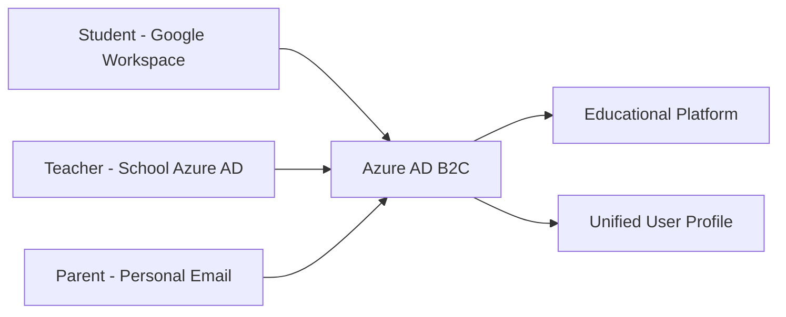

# How to Implement Single Sign-On for Educational Platforms Using Azure AD B2C

Author: [nawazdhandala](https://www.github.com/nawazdhandala)

Tags: Azure AD B2C, Single Sign-On, Education, Identity Management, Authentication, OAuth, SAML

Description: Implement single sign-on for educational platforms using Azure AD B2C with support for Google, Microsoft, and institutional identity providers.

---

Educational platforms serve diverse user populations. Students might log in with their school Google accounts. Teachers use their institutional Microsoft accounts. Parents might only have personal email addresses. Expecting everyone to create yet another username and password is a recipe for support tickets and frustrated users.

Azure AD B2C provides a single sign-on solution that handles multiple identity providers through one configuration. Students and teachers sign in with their existing accounts, and your platform gets a unified user identity regardless of which provider they used. In this guide, I will set up Azure AD B2C for an educational platform with support for the most common login methods.

## Why Azure AD B2C for Education

Azure AD B2C is designed for consumer-facing applications (the "B2C" stands for business-to-consumer). Unlike regular Azure AD which manages employees within an organization, B2C lets external users authenticate against your application using their own identity providers.

For education, this means:
- Students sign in with their school Google Workspace accounts
- Teachers sign in with their institutional Azure AD accounts
- Parents sign in with personal Google, Microsoft, or email accounts
- All users get a unified profile in your system



## Step 1 - Create the Azure AD B2C Tenant

B2C uses a separate tenant from your regular Azure AD. Create one specifically for your educational platform.

```bash
# Create a new Azure AD B2C tenant
# Note: This must be done through the Azure portal initially
# Navigate to: Azure Portal > Create a resource > Azure Active Directory B2C

# After creation, register the CLI to manage it
az login --tenant your-b2c-tenant.onmicrosoft.com
```

After creating the tenant through the portal, register your application.

```bash
# Register your educational platform as an application in B2C
az ad app create \
  --display-name "EduPlatform" \
  --web-redirect-uris "https://edu-platform.azurewebsites.net/auth/callback" \
  --enable-id-token-issuance true \
  --sign-in-audience AzureADandPersonalMicrosoftAccount
```

Note the Application (client) ID and create a client secret. You will need both for the OIDC configuration.

## Step 2 - Configure Identity Providers

Add the identity providers your users will use.

### Google Identity Provider

Students with Google Workspace accounts (common in K-12 and many universities) need Google as an identity provider.

First, create a Google OAuth application at console.developers.google.com. Set the authorized redirect URI to `https://your-b2c-tenant.b2clogin.com/your-b2c-tenant.onmicrosoft.com/oauth2/authresp`.

Then configure it in B2C through the Azure portal:

1. Go to your B2C tenant > Identity Providers
2. Select Google
3. Enter the Google Client ID and Client Secret
4. Save

### Microsoft Account Provider

For users with personal Microsoft accounts or school Office 365 accounts.

1. Go to Identity Providers > Microsoft Account
2. Enter the Application ID and Secret from an Azure AD app registration
3. Save

### Email Sign-Up for Parents

Some users will not have a Google or Microsoft account. Configure local email sign-up so they can create an account with just their email address.

This is enabled by default in B2C user flows. No additional configuration needed.

## Step 3 - Create User Flows

User flows define the authentication experience - what happens when someone signs up, signs in, or resets their password.

Create a sign-up and sign-in user flow that combines all your identity providers.

```json
{
  "userFlowType": "signUpOrSignIn",
  "userFlowTypeVersion": 1,
  "identityProviders": [
    "Google-OAuth2",
    "MicrosoftAccount",
    "EmailAddress"
  ],
  "userAttributes": {
    "displayName": {
      "required": true,
      "userInputType": "textBox"
    },
    "givenName": {
      "required": true,
      "userInputType": "textBox"
    },
    "surname": {
      "required": true,
      "userInputType": "textBox"
    },
    "role": {
      "required": true,
      "userInputType": "dropdownSingleSelect",
      "options": ["Student", "Teacher", "Parent", "Administrator"]
    },
    "schoolName": {
      "required": false,
      "userInputType": "textBox"
    }
  },
  "applicationClaims": [
    "displayName",
    "email",
    "givenName",
    "surname",
    "identityProvider",
    "objectId",
    "role",
    "schoolName"
  ]
}
```

The `role` attribute is crucial for educational platforms. When users sign up, they select their role (student, teacher, parent, administrator). Your application uses this to determine what features and content they can access.

## Step 4 - Integrate B2C with Your Application

Here is how to integrate Azure AD B2C authentication in a Node.js Express application using the MSAL (Microsoft Authentication Library) package.

```javascript
const express = require('express');
const msal = require('@azure/msal-node');
const session = require('express-session');

const app = express();

// Configure session middleware
app.use(session({
    secret: process.env.SESSION_SECRET,
    resave: false,
    saveUninitialized: false,
    cookie: { secure: true }
}));

// MSAL configuration for Azure AD B2C
const msalConfig = {
    auth: {
        clientId: process.env.B2C_CLIENT_ID,
        authority: `https://${process.env.B2C_TENANT_NAME}.b2clogin.com/${process.env.B2C_TENANT_NAME}.onmicrosoft.com/${process.env.B2C_SIGNIN_POLICY}`,
        clientSecret: process.env.B2C_CLIENT_SECRET,
        knownAuthorities: [`${process.env.B2C_TENANT_NAME}.b2clogin.com`]
    }
};

const confidentialClient = new msal.ConfidentialClientApplication(msalConfig);

// Login route - redirect to B2C sign-in page
app.get('/auth/login', async (req, res) => {
    const authCodeUrlParameters = {
        scopes: ['openid', 'profile', 'offline_access'],
        redirectUri: process.env.REDIRECT_URI,
        prompt: 'select_account'  // Let users choose which account to use
    };

    try {
        const authUrl = await confidentialClient.getAuthCodeUrl(authCodeUrlParameters);
        res.redirect(authUrl);
    } catch (error) {
        console.error('Login error:', error);
        res.status(500).send('Authentication error');
    }
});

// Callback route - handle the response from B2C
app.get('/auth/callback', async (req, res) => {
    const tokenRequest = {
        code: req.query.code,
        scopes: ['openid', 'profile'],
        redirectUri: process.env.REDIRECT_URI
    };

    try {
        const response = await confidentialClient.acquireTokenByCode(tokenRequest);

        // Extract user information from the ID token claims
        const claims = response.idTokenClaims;
        req.session.user = {
            id: claims.oid || claims.sub,
            email: claims.emails ? claims.emails[0] : claims.email,
            name: claims.name || `${claims.given_name} ${claims.family_name}`,
            role: claims.extension_role || 'Student',
            school: claims.extension_schoolName || '',
            identityProvider: claims.idp || 'local',
            accessToken: response.accessToken
        };

        console.log(`User logged in: ${req.session.user.email} via ${req.session.user.identityProvider}`);

        // Redirect based on role
        switch (req.session.user.role) {
            case 'Teacher':
                res.redirect('/dashboard/teacher');
                break;
            case 'Parent':
                res.redirect('/dashboard/parent');
                break;
            case 'Administrator':
                res.redirect('/dashboard/admin');
                break;
            default:
                res.redirect('/dashboard/student');
        }
    } catch (error) {
        console.error('Token acquisition error:', error);
        res.redirect('/auth/login');
    }
});

// Logout route
app.get('/auth/logout', (req, res) => {
    req.session.destroy();
    const logoutUri = `https://${process.env.B2C_TENANT_NAME}.b2clogin.com/${process.env.B2C_TENANT_NAME}.onmicrosoft.com/${process.env.B2C_SIGNIN_POLICY}/oauth2/v2.0/logout?post_logout_redirect_uri=${encodeURIComponent(process.env.LOGOUT_REDIRECT_URI)}`;
    res.redirect(logoutUri);
});

// Middleware to protect routes
function requireAuth(role) {
    return (req, res, next) => {
        if (!req.session.user) {
            return res.redirect('/auth/login');
        }
        if (role && req.session.user.role !== role) {
            return res.status(403).send('Access denied');
        }
        next();
    };
}

// Protected routes
app.get('/dashboard/student', requireAuth('Student'), (req, res) => {
    res.render('student-dashboard', { user: req.session.user });
});

app.get('/dashboard/teacher', requireAuth('Teacher'), (req, res) => {
    res.render('teacher-dashboard', { user: req.session.user });
});

app.listen(3000);
```

## Step 5 - Add Federation with School Azure AD

Many schools have their own Azure AD or Google Workspace tenant. Instead of individual accounts, you can federate with the school's identity provider so their entire organization can sign in.

For Azure AD federation, add the school's tenant as an identity provider in your B2C configuration.

```json
{
  "identityProvider": {
    "type": "OpenIdConnect",
    "name": "Springfield School District",
    "clientId": "<app-registered-in-school-tenant>",
    "metadata": {
      "url": "https://login.microsoftonline.com/<school-tenant-id>/v2.0/.well-known/openid-configuration"
    },
    "claimsMappings": {
      "userId": "oid",
      "displayName": "name",
      "email": "preferred_username",
      "givenName": "given_name",
      "surname": "family_name"
    },
    "scope": "openid profile email"
  }
}
```

This way, every teacher and student in the Springfield School District can sign in using their existing school credentials. No separate registration needed. The school's IT department controls who has access, and when someone leaves the school, their access to your platform is automatically revoked when their school account is disabled.

## Step 6 - Customize the Sign-In Experience

B2C lets you customize the login page to match your educational platform's branding. Upload custom HTML and CSS to replace the default B2C sign-in page.

Create a custom page template hosted on your web server or Azure Blob Storage.

```html
<!DOCTYPE html>
<html>
<head>
    <title>EduPlatform - Sign In</title>
    <style>
        body {
            font-family: 'Segoe UI', sans-serif;
            background-color: #f0f4f8;
            display: flex;
            justify-content: center;
            align-items: center;
            min-height: 100vh;
        }
        .login-container {
            background: white;
            border-radius: 8px;
            padding: 40px;
            box-shadow: 0 2px 10px rgba(0,0,0,0.1);
            max-width: 400px;
            width: 100%;
        }
        .logo {
            text-align: center;
            margin-bottom: 20px;
        }
        /* B2C injects its content into the div with id "api" */
        #api {
            margin-top: 20px;
        }
    </style>
</head>
<body>
    <div class="login-container">
        <div class="logo">
            
            <h2>Welcome to EduPlatform</h2>
            <p>Sign in with your school account or email</p>
        </div>
        <div id="api"></div>
    </div>
</body>
</html>
```

Upload this template and configure B2C to use it in the user flow's page layout settings. Students and parents see your branded page instead of the generic Microsoft login screen.

## Security Considerations

For educational platforms that handle student data, there are additional compliance requirements like FERPA (in the US) and COPPA (for children under 13).

Configure B2C to require parental consent for accounts belonging to minors. Use age-gating in your sign-up flow to determine whether a user needs parental consent. Store the minimum necessary personal information and ensure your B2C tenant is configured with the correct data residency settings for your region.

Enable MFA for administrator and teacher accounts. Students can use a simpler flow, but staff accounts that access student data should have an additional authentication factor.

## Wrapping Up

Azure AD B2C gives educational platforms a flexible authentication system that works with the diverse identity landscape of schools. Students use their school Google or Microsoft accounts. Teachers use their institutional credentials. Parents use whatever they have. B2C unifies all of these into a consistent user profile for your application. The federation capability is especially valuable for working with school districts since it gives you zero-friction onboarding for entire organizations. Customize the sign-in experience to match your brand, add role-based access control, and layer on compliance measures for student data protection.
