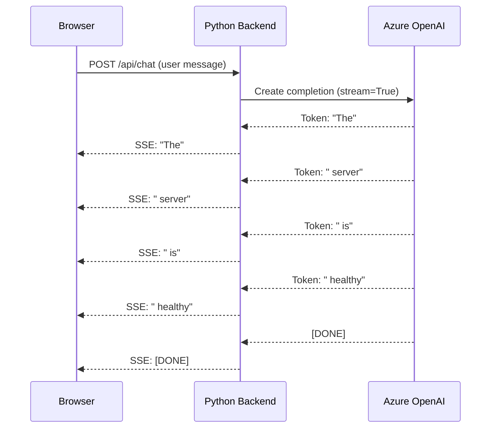

# How to Implement Streaming Responses with Azure OpenAI API in a Web Application

Author: [nawazdhandala](https://www.github.com/nawazdhandala)

Tags: Azure OpenAI, Streaming, Server-Sent Events, Web Development, Python, JavaScript, Real-Time

Description: Implement streaming responses from Azure OpenAI API in a web application using Server-Sent Events for a responsive chat experience.

---

When you use the Azure OpenAI API without streaming, the user sends a message and then stares at a blank screen for several seconds while the model generates the entire response. That silence feels slow and unresponsive, even though the model starts producing tokens almost immediately. Streaming fixes this by sending tokens to the client as they are generated, creating the familiar typewriter effect you see in ChatGPT.

In this guide, I will build a complete streaming setup: a Python backend that streams from Azure OpenAI, and a JavaScript frontend that displays tokens in real time using Server-Sent Events (SSE).

## How Streaming Works

Without streaming, the API waits until the full response is generated and then returns it in one HTTP response. With streaming enabled, the API sends tokens as a series of server-sent events. Each event contains a small chunk of the response, and your frontend can display each chunk immediately.



## Prerequisites

- An Azure OpenAI resource with a deployed model (gpt-4o or gpt-4o-mini)
- Python 3.9+ with Flask or FastAPI
- A modern web browser (all major browsers support SSE and EventSource)

## Step 1: Set Up the Backend with FastAPI

FastAPI has excellent support for streaming responses through its `StreamingResponse` class.

```bash
# Install the required packages
pip install fastapi uvicorn openai
```

Create the backend server:

```python
# server.py - FastAPI backend that streams Azure OpenAI responses
from fastapi import FastAPI, Request
from fastapi.responses import StreamingResponse, HTMLResponse
from fastapi.staticfiles import StaticFiles
from openai import AzureOpenAI
import json

app = FastAPI()

# Initialize the Azure OpenAI client
client = AzureOpenAI(
    azure_endpoint="https://your-resource.openai.azure.com/",
    api_key="your-api-key",
    api_version="2024-06-01"
)

DEPLOYMENT_NAME = "gpt-4o-mini"

async def generate_stream(messages: list):
    """
    Generator function that yields SSE-formatted chunks
    from the Azure OpenAI streaming response.
    """
    try:
        # Create a streaming completion request
        stream = client.chat.completions.create(
            model=DEPLOYMENT_NAME,
            messages=messages,
            max_tokens=1000,
            temperature=0.7,
            stream=True  # This enables streaming
        )

        # Iterate over the streaming chunks
        for chunk in stream:
            if chunk.choices and len(chunk.choices) > 0:
                delta = chunk.choices[0].delta

                # Check if this chunk contains content
                if delta.content is not None:
                    # Format as a server-sent event
                    data = json.dumps({"content": delta.content})
                    yield f"data: {data}\n\n"

                # Check if the stream is finished
                if chunk.choices[0].finish_reason is not None:
                    yield f"data: {json.dumps({'done': True})}\n\n"

    except Exception as e:
        # Send error as an SSE event so the frontend can handle it
        error_data = json.dumps({"error": str(e)})
        yield f"data: {error_data}\n\n"


@app.post("/api/chat")
async def chat(request: Request):
    """
    Accept a chat message and return a streaming SSE response.
    The client sends a JSON body with a 'messages' array.
    """
    body = await request.json()
    messages = body.get("messages", [])

    # Add a system message if not already present
    if not messages or messages[0].get("role") != "system":
        messages.insert(0, {
            "role": "system",
            "content": "You are a helpful assistant. Be concise and clear."
        })

    # Return a streaming response with SSE content type
    return StreamingResponse(
        generate_stream(messages),
        media_type="text/event-stream",
        headers={
            "Cache-Control": "no-cache",
            "Connection": "keep-alive",
            "X-Accel-Buffering": "no"  # Disable nginx buffering if applicable
        }
    )
```

## Step 2: Build the Frontend

The frontend uses the Fetch API to read the streaming response and update the UI in real time.

```html
<!-- index.html - Chat interface with streaming support -->
<!DOCTYPE html>
<html lang="en">
<head>
    <meta charset="UTF-8">
    <meta name="viewport" content="width=device-width, initial-scale=1.0">
    <title>Chat with Streaming</title>
    <style>
        body {
            font-family: -apple-system, BlinkMacSystemFont, 'Segoe UI', sans-serif;
            max-width: 800px;
            margin: 0 auto;
            padding: 20px;
            background: #f5f5f5;
        }
        .chat-container {
            background: white;
            border-radius: 8px;
            padding: 20px;
            height: 500px;
            overflow-y: auto;
            margin-bottom: 20px;
            box-shadow: 0 2px 4px rgba(0,0,0,0.1);
        }
        .message {
            margin-bottom: 16px;
            padding: 10px 14px;
            border-radius: 8px;
            max-width: 80%;
        }
        .user-message {
            background: #007bff;
            color: white;
            margin-left: auto;
            text-align: right;
        }
        .assistant-message {
            background: #e9ecef;
            color: #333;
        }
        .input-area {
            display: flex;
            gap: 10px;
        }
        input[type="text"] {
            flex: 1;
            padding: 12px;
            border: 1px solid #ddd;
            border-radius: 8px;
            font-size: 16px;
        }
        button {
            padding: 12px 24px;
            background: #007bff;
            color: white;
            border: none;
            border-radius: 8px;
            cursor: pointer;
            font-size: 16px;
        }
        button:disabled {
            background: #ccc;
            cursor: not-allowed;
        }
        .cursor {
            display: inline-block;
            width: 8px;
            height: 16px;
            background: #333;
            animation: blink 1s infinite;
            vertical-align: text-bottom;
        }
    </style>
</head>
<body>
    <h1>Streaming Chat</h1>
    <div class="chat-container" id="chatContainer"></div>
    <div class="input-area">
        <input type="text" id="messageInput" placeholder="Type your message..."
               onkeypress="if(event.key === 'Enter') sendMessage()">
        <button id="sendBtn" onclick="sendMessage()">Send</button>
    </div>

    <script>
        // Keep track of the conversation history
        const conversationHistory = [];
        const chatContainer = document.getElementById('chatContainer');
        const messageInput = document.getElementById('messageInput');
        const sendBtn = document.getElementById('sendBtn');

        function addMessage(role, content) {
            // Create a message element in the chat container
            const div = document.createElement('div');
            div.className = `message ${role}-message`;
            div.textContent = content;
            chatContainer.appendChild(div);
            chatContainer.scrollTop = chatContainer.scrollHeight;
            return div;
        }

        async function sendMessage() {
            const text = messageInput.value.trim();
            if (!text) return;

            // Disable input while processing
            sendBtn.disabled = true;
            messageInput.value = '';

            // Add user message to UI and history
            addMessage('user', text);
            conversationHistory.push({ role: 'user', content: text });

            // Create a placeholder for the assistant response
            const assistantDiv = addMessage('assistant', '');

            try {
                // Send the request to our streaming endpoint
                const response = await fetch('/api/chat', {
                    method: 'POST',
                    headers: { 'Content-Type': 'application/json' },
                    body: JSON.stringify({ messages: conversationHistory })
                });

                // Read the streaming response using a reader
                const reader = response.body.getReader();
                const decoder = new TextDecoder();
                let fullResponse = '';

                while (true) {
                    const { done, value } = await reader.read();
                    if (done) break;

                    // Decode the chunk and parse SSE events
                    const chunk = decoder.decode(value, { stream: true });
                    const lines = chunk.split('\n');

                    for (const line of lines) {
                        // SSE events start with "data: "
                        if (line.startsWith('data: ')) {
                            const jsonStr = line.slice(6);
                            try {
                                const data = JSON.parse(jsonStr);

                                if (data.content) {
                                    // Append the new token to the response
                                    fullResponse += data.content;
                                    assistantDiv.textContent = fullResponse;
                                    chatContainer.scrollTop = chatContainer.scrollHeight;
                                }

                                if (data.error) {
                                    assistantDiv.textContent = `Error: ${data.error}`;
                                }
                            } catch (e) {
                                // Skip malformed JSON (can happen with partial chunks)
                            }
                        }
                    }
                }

                // Add the complete response to conversation history
                conversationHistory.push({ role: 'assistant', content: fullResponse });

            } catch (error) {
                assistantDiv.textContent = `Error: ${error.message}`;
            }

            // Re-enable input
            sendBtn.disabled = false;
            messageInput.focus();
        }
    </script>
</body>
</html>
```

## Step 3: Serve the Frontend from FastAPI

Add a route to serve the HTML file:

```python
# Add this to server.py to serve the frontend
from fastapi.responses import FileResponse

@app.get("/")
async def root():
    """Serve the chat interface."""
    return FileResponse("index.html")
```

Run the application:

```bash
# Start the server
uvicorn server:app --host 0.0.0.0 --port 8000
```

Open `http://localhost:8000` in your browser and start chatting. You should see responses appear token by token.

## Step 4: Handle Token Counting and Rate Limits

When streaming, you still consume tokens just like non-streaming requests. The difference is that you get the token count at the end of the stream rather than upfront. Track usage for cost monitoring:

```python
# Enhanced streaming generator with token tracking
async def generate_stream_with_tracking(messages: list):
    """Stream response and track token usage."""
    total_completion_tokens = 0

    stream = client.chat.completions.create(
        model=DEPLOYMENT_NAME,
        messages=messages,
        max_tokens=1000,
        stream=True,
        stream_options={"include_usage": True}  # Request usage stats
    )

    for chunk in stream:
        if chunk.choices and len(chunk.choices) > 0:
            delta = chunk.choices[0].delta
            if delta.content:
                data = json.dumps({"content": delta.content})
                yield f"data: {data}\n\n"

        # The last chunk includes usage information
        if chunk.usage:
            usage_data = {
                "done": True,
                "usage": {
                    "prompt_tokens": chunk.usage.prompt_tokens,
                    "completion_tokens": chunk.usage.completion_tokens,
                    "total_tokens": chunk.usage.total_tokens
                }
            }
            yield f"data: {json.dumps(usage_data)}\n\n"
```

## Step 5: Add Abort Capability

Users should be able to cancel a response mid-stream. On the frontend, use an `AbortController`:

```javascript
// Add abort support to the chat
let currentController = null;

async function sendMessage() {
    // ... (existing code to set up the message) ...

    // Create an AbortController for this request
    currentController = new AbortController();

    try {
        const response = await fetch('/api/chat', {
            method: 'POST',
            headers: { 'Content-Type': 'application/json' },
            body: JSON.stringify({ messages: conversationHistory }),
            signal: currentController.signal  // Pass the abort signal
        });

        // ... (existing streaming reader code) ...

    } catch (error) {
        if (error.name === 'AbortError') {
            // User cancelled the request
            assistantDiv.textContent += ' [cancelled]';
        } else {
            assistantDiv.textContent = 'Error: ' + error.message;
        }
    }

    currentController = null;
    sendBtn.disabled = false;
}

function cancelResponse() {
    // Call this when the user clicks a cancel button
    if (currentController) {
        currentController.abort();
    }
}
```

## Performance Considerations

A few things matter for production streaming deployments:

**Buffering**: Make sure nothing between Azure OpenAI and the browser is buffering the SSE stream. Set `X-Accel-Buffering: no` for Nginx, and configure any CDN or reverse proxy to pass through streaming responses.

**Connection timeouts**: Long responses can take 30-60 seconds to fully generate. Configure your load balancer and proxy timeouts accordingly. The default timeout of many reverse proxies is 60 seconds, which might not be enough for long completions.

**Concurrent connections**: Each streaming request holds an HTTP connection open for the duration of the generation. Plan your connection pool sizes accordingly.

**Retry logic**: If the stream is interrupted, your frontend should detect the disconnection and offer to retry. The SSE protocol has built-in reconnection, but since we are using fetch with a reader, you need to handle this manually.

## Summary

Streaming transforms the user experience of AI-powered chat applications from "wait for a wall of text" to "watch the response appear in real time." The implementation involves enabling `stream=True` on the Azure OpenAI API call, formatting the output as Server-Sent Events on the backend, and reading the stream with a fetch reader on the frontend. The result feels fast and responsive, even when the model takes several seconds to generate a full response.
