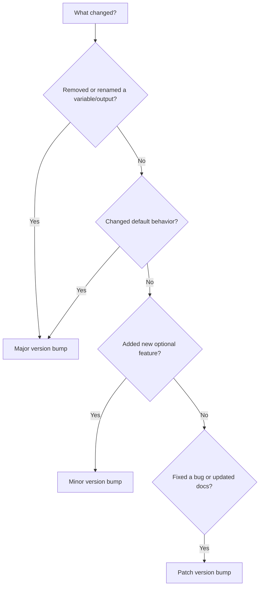

# How to Implement Terraform Module Versioning for Azure Infrastructure with Git Tags

Author: [nawazdhandala](https://www.github.com/nawazdhandala)

Tags: Terraform, Azure, Module Versioning, Git, IaC, DevOps, Semantic Versioning

Description: Implement proper versioning for Terraform modules using Git tags and semantic versioning to manage Azure infrastructure safely across teams.

---

When your Terraform modules are used by multiple teams or deployed across multiple environments, versioning becomes critical. Without it, a change to a shared module can break every project that references it. Module versioning with Git tags gives you stability - consumers pin to a specific version and only upgrade when they are ready. Meanwhile, module authors can iterate without fear of breaking downstream users.

This post covers how to set up module versioning using Git tags, semantic versioning conventions, and the workflows for publishing and consuming versioned modules.

## Why Version Your Modules

Imagine your team maintains a Terraform module that creates an Azure Kubernetes Service cluster. Fifteen projects across the organization use it. You need to add a new parameter for node pool autoscaling. Without versioning, that change immediately affects all fifteen projects the next time they run `terraform init`.

With versioning, those fifteen projects stay on their current version until they explicitly upgrade. You publish the new version, document the changes, and teams upgrade on their own schedule after testing.

## Module Repository Structure

Each Terraform module lives in its own Git repository. This is the standard convention that the Terraform Registry uses, and it works well for private modules too.

```
terraform-azurerm-aks/
  main.tf
  variables.tf
  outputs.tf
  versions.tf
  README.md
  examples/
    basic/
      main.tf
    advanced/
      main.tf
  test/
    aks_test.go
```

The repository name follows the `terraform-<provider>-<name>` convention. This is required if you want to publish to the Terraform Registry, and it is a good practice even for private modules.

## Semantic Versioning for Modules

Follow semantic versioning (semver) for your module tags:

- **Major version** (v2.0.0) - Breaking changes. Removed variables, renamed outputs, changed resource behavior that requires consumer action.
- **Minor version** (v1.1.0) - New features that are backward compatible. New optional variables with defaults, new outputs, additional resources that do not affect existing ones.
- **Patch version** (v1.0.1) - Bug fixes. Corrected default values, fixed resource configurations, documentation updates.

Here is a practical decision tree:



## Creating Your First Version

Start with v1.0.0 when your module is production-ready.

```bash
# Make sure you are on the main branch with all changes committed
git checkout main
git pull origin main

# Create an annotated tag with a description
git tag -a v1.0.0 -m "v1.0.0: Initial stable release

- AKS cluster with system and user node pools
- Azure CNI networking with Calico network policy
- RBAC enabled with Azure AD integration
- Autoscaling support for all node pools
- Log Analytics workspace integration"

# Push the tag to the remote
git push origin v1.0.0
```

Use annotated tags (with `-a`) rather than lightweight tags. Annotated tags store the tagger, date, and message, which is useful for auditing.

## Consuming Versioned Modules

Consumers reference your module with a specific version.

```hcl
# Using a module from a Git repository with a version tag
module "aks" {
  source  = "git::https://github.com/yourorg/terraform-azurerm-aks.git?ref=v1.0.0"

  resource_group_name = "rg-aks-prod"
  location            = "eastus"
  cluster_name        = "aks-prod"
  kubernetes_version  = "1.29"
  node_count          = 5
}
```

The `?ref=v1.0.0` pins the module to that exact Git tag. Even if new versions are published, this configuration will always use v1.0.0 until someone explicitly updates the ref.

For SSH-based Git access:

```hcl
module "aks" {
  source = "git::ssh://git@github.com/yourorg/terraform-azurerm-aks.git?ref=v1.0.0"
  # ...
}
```

## Release Workflow

Here is a practical workflow for releasing new module versions.

### Step 1: Make Changes on a Feature Branch

```bash
git checkout -b feature/add-spot-node-pool
# Make your changes
git add .
git commit -m "Add support for spot node pools"
```

### Step 2: Open a Pull Request

The PR should include:
- The code changes
- Updated variable descriptions
- Updated README with examples of the new feature
- Tests covering the new functionality

### Step 3: After Merge, Create the Tag

```bash
# Pull the latest main
git checkout main
git pull origin main

# Create the new version tag
git tag -a v1.1.0 -m "v1.1.0: Add spot node pool support

New features:
- Added enable_spot_pool variable (default: false)
- Added spot_pool_vm_size variable
- Added spot_pool_max_count variable
- Spot pools use Delete eviction policy"

git push origin v1.1.0
```

### Step 4: Write a Changelog Entry

Maintain a CHANGELOG.md in the repository root.

```markdown
## v1.1.0 (2026-02-16)

### Added
- Support for spot instance node pools via `enable_spot_pool` variable
- `spot_pool_vm_size` variable for configuring spot node VM size
- `spot_pool_max_count` variable for autoscaler maximum

### No breaking changes
```

## Automating Version Tags with CI/CD

You can automate the tagging process with a GitHub Actions workflow that creates tags based on PR labels or commit messages.

```yaml
# .github/workflows/release.yml
name: Release

on:
  push:
    branches:
      - main

jobs:
  release:
    runs-on: ubuntu-latest
    steps:
      - uses: actions/checkout@v4
        with:
          fetch-depth: 0

      # Determine version bump from commit messages
      - name: Determine Version
        id: version
        run: |
          # Get the latest tag
          LATEST_TAG=$(git describe --tags --abbrev=0 2>/dev/null || echo "v0.0.0")
          echo "Latest tag: $LATEST_TAG"

          # Parse version components
          MAJOR=$(echo $LATEST_TAG | sed 's/v//' | cut -d. -f1)
          MINOR=$(echo $LATEST_TAG | sed 's/v//' | cut -d. -f2)
          PATCH=$(echo $LATEST_TAG | sed 's/v//' | cut -d. -f3)

          # Check commit messages since last tag for version hints
          COMMITS=$(git log $LATEST_TAG..HEAD --oneline)

          if echo "$COMMITS" | grep -iq "breaking"; then
            MAJOR=$((MAJOR + 1))
            MINOR=0
            PATCH=0
          elif echo "$COMMITS" | grep -iq "feat"; then
            MINOR=$((MINOR + 1))
            PATCH=0
          else
            PATCH=$((PATCH + 1))
          fi

          NEW_TAG="v${MAJOR}.${MINOR}.${PATCH}"
          echo "new_tag=$NEW_TAG" >> $GITHUB_OUTPUT

      - name: Create Tag
        run: |
          git tag -a ${{ steps.version.outputs.new_tag }} -m "Release ${{ steps.version.outputs.new_tag }}"
          git push origin ${{ steps.version.outputs.new_tag }}
```

## Using a Private Terraform Registry

For organizations with many modules, a private Terraform Registry provides a better experience than raw Git references. Terraform Cloud, Spacelift, and other platforms offer private registries. With a registry, consumers use cleaner source references:

```hcl
module "aks" {
  source  = "app.terraform.io/yourorg/aks/azurerm"
  version = "~> 1.1"

  # ... variables
}
```

The `~> 1.1` constraint means "any version >= 1.1.0 and < 2.0.0", which gives you automatic patch and minor updates while protecting against breaking changes.

## Version Constraints

Terraform supports several version constraint operators:

- `= 1.0.0` - Exact version
- `>= 1.0.0` - Minimum version
- `~> 1.0` - Allows minor and patch updates (>= 1.0.0, < 2.0.0)
- `~> 1.0.0` - Allows only patch updates (>= 1.0.0, < 1.1.0)
- `>= 1.0.0, < 1.5.0` - Range constraint

For production, use `~> 1.0` or exact versions. Avoid unconstrained versions - they will eventually break.

## Testing Before Releasing

Always test your module before tagging a release. Use Terratest or the built-in `terraform test` framework.

```bash
# Run terraform validate on all examples
for example in examples/*/; do
  echo "Validating $example"
  cd "$example"
  terraform init
  terraform validate
  cd ../..
done

# Run integration tests with Terratest
cd test
go test -v -timeout 60m
```

## Conclusion

Module versioning with Git tags is the foundation for using Terraform modules safely across teams and environments. It gives module authors the freedom to iterate, and it gives consumers the stability to deploy with confidence. Combined with semantic versioning, changelogs, and automated release workflows, you end up with a module ecosystem that scales as your organization and Azure infrastructure grows.
