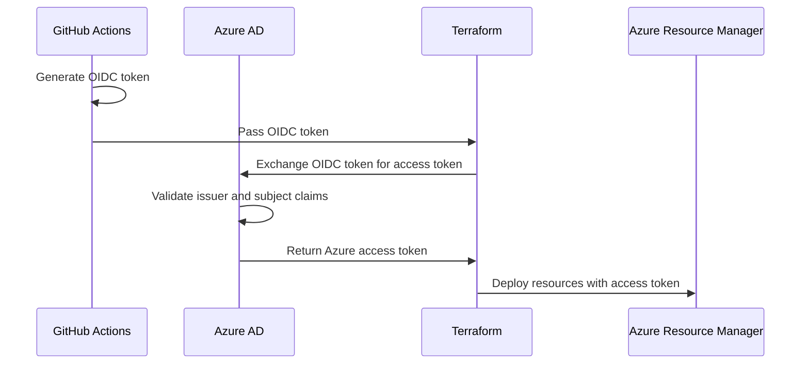

# How to Implement Terraform Workload Identity Federation for Azure Service Principal Authentication

Author: [nawazdhandala](https://www.github.com/nawazdhandala)

Tags: Terraform, Azure, Workload Identity, Authentication, Security, CI/CD, OIDC

Description: Learn how to configure Terraform with Azure Workload Identity Federation to eliminate stored secrets and authenticate using OIDC tokens from CI/CD systems.

---

Managing secrets for Terraform's Azure authentication has always been a pain point. You create a service principal, generate a client secret, store it in your CI/CD system, and then worry about rotation schedules and potential leaks. Workload Identity Federation changes this by letting your CI/CD pipeline authenticate with Azure using short-lived OIDC tokens instead of long-lived secrets.

The idea is simple: your CI/CD provider (GitHub Actions, Azure DevOps, GitLab) issues a signed JWT token that Azure trusts based on a pre-configured federation. No client secrets are created, stored, or rotated. This post covers setting up the entire chain - from creating the Azure AD application with federated credentials to configuring Terraform to use it.

## How Workload Identity Federation Works

The authentication flow has three participants:

1. Your CI/CD system (the identity provider) issues an OIDC token
2. Azure AD trusts the CI/CD system's OIDC endpoint based on federated credentials you configure
3. Terraform exchanges the OIDC token for an Azure access token



The key security benefit is that there are no persistent credentials. The OIDC token is scoped to a specific workflow run and expires quickly.

## Setting Up the Azure AD Application

First, create the Azure AD application and service principal that Terraform will authenticate as. This part you can do with the Azure CLI or even Terraform itself (bootstrapping problem aside).

```bash
#!/bin/bash
# setup-workload-identity.sh - Create the Azure AD app and federated credential

# Create the Azure AD application
APP_ID=$(az ad app create \
  --display-name "terraform-github-actions" \
  --query appId \
  --output tsv)

echo "Application ID: $APP_ID"

# Create the service principal
SP_OBJECT_ID=$(az ad sp create \
  --id "$APP_ID" \
  --query id \
  --output tsv)

echo "Service Principal Object ID: $SP_OBJECT_ID"

# Get your subscription ID
SUBSCRIPTION_ID=$(az account show --query id --output tsv)

# Assign the Contributor role on the subscription
az role assignment create \
  --assignee "$SP_OBJECT_ID" \
  --role "Contributor" \
  --scope "/subscriptions/$SUBSCRIPTION_ID"
```

## Creating the Federated Credential

The federated credential tells Azure AD to trust tokens from a specific OIDC issuer. Each CI/CD system has a different issuer URL and subject claim format.

For GitHub Actions, create a federated credential for your repository and branch.

```bash
# Create federated credential for GitHub Actions on the main branch
az ad app federated-credential create \
  --id "$APP_ID" \
  --parameters '{
    "name": "github-actions-main",
    "issuer": "https://token.actions.githubusercontent.com",
    "subject": "repo:your-org/your-repo:ref:refs/heads/main",
    "description": "GitHub Actions - main branch",
    "audiences": ["api://AzureADTokenExchange"]
  }'

# Create another for pull requests
az ad app federated-credential create \
  --id "$APP_ID" \
  --parameters '{
    "name": "github-actions-pr",
    "issuer": "https://token.actions.githubusercontent.com",
    "subject": "repo:your-org/your-repo:pull_request",
    "description": "GitHub Actions - pull requests",
    "audiences": ["api://AzureADTokenExchange"]
  }'

# Create one for a specific environment
az ad app federated-credential create \
  --id "$APP_ID" \
  --parameters '{
    "name": "github-actions-production",
    "issuer": "https://token.actions.githubusercontent.com",
    "subject": "repo:your-org/your-repo:environment:production",
    "description": "GitHub Actions - production environment",
    "audiences": ["api://AzureADTokenExchange"]
  }'
```

The `subject` claim is critical. It controls which GitHub Actions workflows can authenticate. The format is different depending on whether the workflow runs on a branch, a pull request, or a GitHub environment. Getting this wrong is the most common cause of authentication failures.

## Configuring Terraform to Use OIDC

Now configure the Azure provider in Terraform to use OIDC authentication instead of client secrets.

```hcl
# versions.tf - Provider configuration with OIDC authentication
terraform {
  required_version = ">= 1.5.0"

  required_providers {
    azurerm = {
      source  = "hashicorp/azurerm"
      version = "~> 3.80"
    }
  }

  # Backend configuration (state storage)
  backend "azurerm" {
    resource_group_name  = "rg-terraform-state"
    storage_account_name = "sttfstate"
    container_name       = "tfstate"
    key                  = "infra.tfstate"
    use_oidc             = true   # Use OIDC for backend authentication too
  }
}

# Configure the provider to use OIDC authentication
provider "azurerm" {
  features {}

  # These can be set via environment variables instead
  use_oidc        = true
  client_id       = var.azure_client_id
  tenant_id       = var.azure_tenant_id
  subscription_id = var.azure_subscription_id

  # The OIDC token is automatically picked up from the
  # ARM_OIDC_TOKEN environment variable
}

variable "azure_client_id" {
  type        = string
  description = "The Azure AD Application (client) ID"
}

variable "azure_tenant_id" {
  type        = string
  description = "The Azure AD tenant ID"
}

variable "azure_subscription_id" {
  type        = string
  description = "The Azure subscription ID"
}
```

The `use_oidc = true` flag tells the provider to look for an OIDC token in the `ARM_OIDC_TOKEN` environment variable. When running in GitHub Actions, this token is provided automatically by the actions/azure-login action.

## GitHub Actions Workflow

Here is a complete GitHub Actions workflow that uses workload identity federation to run Terraform.

```yaml
# .github/workflows/terraform.yml
name: Terraform Deploy

on:
  push:
    branches: [main]
  pull_request:
    branches: [main]

# These permissions are required for OIDC token generation
permissions:
  id-token: write    # Required for requesting the OIDC JWT
  contents: read     # Required for actions/checkout

env:
  ARM_CLIENT_ID: ${{ secrets.AZURE_CLIENT_ID }}
  ARM_TENANT_ID: ${{ secrets.AZURE_TENANT_ID }}
  ARM_SUBSCRIPTION_ID: ${{ secrets.AZURE_SUBSCRIPTION_ID }}
  ARM_USE_OIDC: true

jobs:
  terraform-plan:
    name: Terraform Plan
    runs-on: ubuntu-latest
    environment: production

    steps:
      - name: Checkout code
        uses: actions/checkout@v4

      - name: Setup Terraform
        uses: hashicorp/setup-terraform@v3
        with:
          terraform_version: 1.6.0

      # Authenticate with Azure using OIDC
      - name: Azure Login
        uses: azure/login@v2
        with:
          client-id: ${{ secrets.AZURE_CLIENT_ID }}
          tenant-id: ${{ secrets.AZURE_TENANT_ID }}
          subscription-id: ${{ secrets.AZURE_SUBSCRIPTION_ID }}

      - name: Terraform Init
        run: terraform init
        working-directory: infrastructure

      - name: Terraform Plan
        run: terraform plan -out=tfplan
        working-directory: infrastructure

      # Save the plan for the apply job
      - name: Upload Plan
        uses: actions/upload-artifact@v4
        with:
          name: tfplan
          path: infrastructure/tfplan

  terraform-apply:
    name: Terraform Apply
    needs: terraform-plan
    runs-on: ubuntu-latest
    environment: production
    if: github.ref == 'refs/heads/main'

    steps:
      - name: Checkout code
        uses: actions/checkout@v4

      - name: Setup Terraform
        uses: hashicorp/setup-terraform@v3
        with:
          terraform_version: 1.6.0

      - name: Azure Login
        uses: azure/login@v2
        with:
          client-id: ${{ secrets.AZURE_CLIENT_ID }}
          tenant-id: ${{ secrets.AZURE_TENANT_ID }}
          subscription-id: ${{ secrets.AZURE_SUBSCRIPTION_ID }}

      - name: Download Plan
        uses: actions/download-artifact@v4
        with:
          name: tfplan
          path: infrastructure

      - name: Terraform Init
        run: terraform init
        working-directory: infrastructure

      - name: Terraform Apply
        run: terraform apply tfplan
        working-directory: infrastructure
```

The `permissions.id-token: write` setting is what enables the workflow to request an OIDC token from GitHub. Without it, the authentication will fail with a permissions error.

## Setting Up for Azure DevOps

If you use Azure DevOps instead of GitHub Actions, the setup is similar but with a different issuer and subject format.

```bash
# Create federated credential for Azure DevOps
az ad app federated-credential create \
  --id "$APP_ID" \
  --parameters '{
    "name": "azure-devops-pipeline",
    "issuer": "https://vstoken.dev.azure.com/<AZURE_DEVOPS_ORG_ID>",
    "subject": "sc://your-org/your-project/your-service-connection",
    "description": "Azure DevOps Pipeline",
    "audiences": ["api://AzureADTokenExchange"]
  }'
```

In the Azure DevOps pipeline YAML, use the `AzureCLI` task with the `addSpnToEnvironment` option.

```yaml
# azure-pipelines.yml
steps:
  - task: AzureCLI@2
    displayName: 'Terraform Apply'
    inputs:
      azureSubscription: 'terraform-service-connection'
      scriptType: 'bash'
      addSpnToEnvironment: true
      scriptLocation: 'inlineScript'
      inlineScript: |
        # The AzureCLI task sets these variables automatically
        export ARM_CLIENT_ID=$servicePrincipalId
        export ARM_TENANT_ID=$tenantId
        export ARM_OIDC_TOKEN=$idToken
        export ARM_USE_OIDC=true

        terraform init
        terraform apply -auto-approve
```

## Managing Multiple Federated Credentials with Terraform

If you want to manage the federated credentials themselves with Terraform (the bootstrapping step aside), here is how to do it.

```hcl
# Manage federated credentials with Terraform
resource "azuread_application" "terraform" {
  display_name = "terraform-ci-cd"
}

resource "azuread_service_principal" "terraform" {
  client_id = azuread_application.terraform.client_id
}

# Federated credential for each environment
locals {
  github_environments = ["development", "staging", "production"]
  github_repo         = "your-org/infrastructure"
}

resource "azuread_application_federated_identity_credential" "github_env" {
  for_each = toset(local.github_environments)

  application_id = azuread_application.terraform.id
  display_name   = "github-${each.value}"
  description    = "GitHub Actions - ${each.value} environment"
  audiences      = ["api://AzureADTokenExchange"]
  issuer         = "https://token.actions.githubusercontent.com"
  subject        = "repo:${local.github_repo}:environment:${each.value}"
}

# Role assignment scoped to the appropriate subscription
resource "azurerm_role_assignment" "terraform_contributor" {
  scope                = "/subscriptions/${data.azurerm_client_config.current.subscription_id}"
  role_definition_name = "Contributor"
  principal_id         = azuread_service_principal.terraform.object_id
}
```

## Troubleshooting Common Issues

When things go wrong with workload identity federation, the error messages are not always helpful. Here are the most common problems:

**Token validation failed** - The subject claim in your federated credential does not match the subject in the OIDC token. Double-check the exact format. For GitHub Actions, use `repo:org/repo:ref:refs/heads/main` for branch-based triggers.

**Audience mismatch** - The audience in the federated credential must be `api://AzureADTokenExchange`. Some older documentation shows different values.

**Missing permissions** - The GitHub Actions workflow needs `permissions.id-token: write`. This is not set by default.

**Backend authentication** - Remember to set `use_oidc = true` in the backend configuration as well. The backend and provider authentication are separate.

## Wrapping Up

Workload Identity Federation eliminates the biggest security concern with Terraform CI/CD pipelines - long-lived service principal secrets. The setup involves creating an Azure AD application, configuring federated credentials for your CI/CD system, and telling the Terraform Azure provider to use OIDC. Once configured, your pipelines authenticate with short-lived tokens that cannot be leaked or need rotation. The initial setup is more involved than generating a client secret, but the ongoing security improvement is worth the effort.
