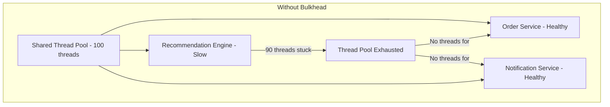

# How to Implement the Bulkhead Pattern to Isolate Failures in Azure Microservices

Author: [nawazdhandala](https://www.github.com/nawazdhandala)

Tags: Azure, Bulkhead Pattern, Resilience, Microservices, Fault Isolation, Cloud Patterns, Polly

Description: Implement the bulkhead pattern in Azure microservices to isolate failures and prevent one slow dependency from taking down your entire application.

---

The name comes from the compartments in a ship's hull. If one compartment floods, the bulkheads prevent water from spreading to adjacent compartments, keeping the ship afloat. The same principle applies to software. If one part of your application starts failing or consuming excessive resources, the bulkhead pattern prevents that failure from cascading to other parts.

Without bulkheads, a single slow database query or an unresponsive external API can consume all your application's threads or connections, bringing down every feature - even those that do not depend on the failing component.

## The Problem Without Bulkheads

Consider a web application that calls three backend services: an order service, a recommendation engine, and a notification service. All three share the same HTTP client thread pool.

If the recommendation engine becomes slow and starts timing out, all threads in the shared pool get tied up waiting for responses. Now requests to the perfectly healthy order service also fail because there are no threads available to handle them.



## Implementing Thread Pool Isolation with Polly

In .NET applications on Azure, the Polly library provides a bulkhead isolation policy. Here is how to set it up:

```csharp
using Polly;
using Polly.Bulkhead;

// Create separate bulkhead policies for each downstream service
// Each has its own isolated thread pool

// Order service - critical path, more capacity
var orderBulkhead = Policy.BulkheadAsync<HttpResponseMessage>(
    maxParallelization: 30,    // max concurrent requests
    maxQueuingActions: 10,     // requests waiting in queue
    onBulkheadRejectedAsync: async context =>
    {
        // Log when the bulkhead rejects requests
        Console.WriteLine("Order service bulkhead is full - request rejected");
    }
);

// Recommendation engine - less critical, smaller capacity
var recommendationBulkhead = Policy.BulkheadAsync<HttpResponseMessage>(
    maxParallelization: 10,
    maxQueuingActions: 5,
    onBulkheadRejectedAsync: async context =>
    {
        Console.WriteLine("Recommendation bulkhead is full - request rejected");
    }
);

// Notification service - fire and forget, small capacity
var notificationBulkhead = Policy.BulkheadAsync<HttpResponseMessage>(
    maxParallelization: 5,
    maxQueuingActions: 3,
    onBulkheadRejectedAsync: async context =>
    {
        Console.WriteLine("Notification bulkhead is full - request rejected");
    }
);
```

Now even if the recommendation engine consumes all 10 of its allocated concurrent slots, the order service still has its own 30 slots available and continues working normally.

## Registering Bulkheads with HttpClientFactory

The clean way to wire bulkheads into your .NET application is through the HttpClientFactory and named clients:

```csharp
// Register separate HTTP clients for each service with their own bulkhead
builder.Services.AddHttpClient("OrderService", client =>
{
    client.BaseAddress = new Uri("https://order-service.internal/");
    client.Timeout = TimeSpan.FromSeconds(10);
})
.AddPolicyHandler(orderBulkhead)
.AddPolicyHandler(GetRetryPolicy());

builder.Services.AddHttpClient("RecommendationService", client =>
{
    client.BaseAddress = new Uri("https://recommendation-engine.internal/");
    client.Timeout = TimeSpan.FromSeconds(5);  // shorter timeout for non-critical
})
.AddPolicyHandler(recommendationBulkhead)
.AddPolicyHandler(GetRetryPolicy());

builder.Services.AddHttpClient("NotificationService", client =>
{
    client.BaseAddress = new Uri("https://notification-service.internal/");
    client.Timeout = TimeSpan.FromSeconds(3);
})
.AddPolicyHandler(notificationBulkhead);
// No retry for notifications - fire and forget

// Helper to create a retry policy
static IAsyncPolicy<HttpResponseMessage> GetRetryPolicy()
{
    return HttpPolicyExtensions
        .HandleTransientHttpError()
        .WaitAndRetryAsync(3, retryAttempt =>
            TimeSpan.FromSeconds(Math.Pow(2, retryAttempt)));
}
```

In your service code, inject the HttpClientFactory and use the named clients:

```csharp
public class ProductPageService
{
    private readonly IHttpClientFactory _httpClientFactory;

    public ProductPageService(IHttpClientFactory httpClientFactory)
    {
        _httpClientFactory = httpClientFactory;
    }

    public async Task<ProductPageModel> GetProductPage(string productId)
    {
        // These calls are isolated from each other
        // If recommendations fail, the product details still load

        var orderClient = _httpClientFactory.CreateClient("OrderService");
        var recoClient = _httpClientFactory.CreateClient("RecommendationService");

        // Fetch product details - critical, must succeed
        var productTask = orderClient.GetAsync($"/products/{productId}");

        // Fetch recommendations - nice to have, graceful degradation if it fails
        var recoTask = SafeGetRecommendations(recoClient, productId);

        await Task.WhenAll(productTask, recoTask);

        var product = await productTask.Result.Content
            .ReadFromJsonAsync<Product>();
        var recommendations = recoTask.Result;

        return new ProductPageModel
        {
            Product = product,
            Recommendations = recommendations ?? new List<Product>()
        };
    }

    // Wrap non-critical calls to handle bulkhead rejections gracefully
    private async Task<List<Product>> SafeGetRecommendations(
        HttpClient client, string productId)
    {
        try
        {
            var response = await client.GetAsync(
                $"/recommendations/{productId}");

            if (response.IsSuccessStatusCode)
            {
                return await response.Content
                    .ReadFromJsonAsync<List<Product>>();
            }
        }
        catch (BulkheadRejectedException)
        {
            // Bulkhead is full - return empty list instead of failing
            // The product page still renders, just without recommendations
        }
        catch (Exception)
        {
            // Any other error - degrade gracefully
        }

        return new List<Product>();
    }
}
```

## Bulkhead Pattern in Azure Kubernetes Service

When running microservices on AKS, you can implement bulkheads at the infrastructure level using Kubernetes resource limits:

```yaml
# Each service deployment has resource limits that act as a bulkhead
# If the recommendation service consumes all its CPU allocation,
# it cannot steal CPU from other services
apiVersion: apps/v1
kind: Deployment
metadata:
  name: recommendation-engine
  namespace: ecommerce
spec:
  replicas: 3
  selector:
    matchLabels:
      app: recommendation-engine
  template:
    metadata:
      labels:
        app: recommendation-engine
    spec:
      containers:
        - name: recommendation-engine
          image: myacr.azurecr.io/recommendation-engine:v1.0
          resources:
            # Requests guarantee minimum resources
            requests:
              cpu: "500m"
              memory: "512Mi"
            # Limits cap maximum resource usage
            limits:
              cpu: "1000m"
              memory: "1Gi"
```

You can also use Kubernetes namespaces with resource quotas as a coarser bulkhead:

```yaml
# Resource quota acts as a bulkhead for the entire namespace
# Prevents one team's services from consuming all cluster resources
apiVersion: v1
kind: ResourceQuota
metadata:
  name: ecommerce-quota
  namespace: ecommerce
spec:
  hard:
    requests.cpu: "8"          # max 8 CPU cores requested
    requests.memory: "16Gi"    # max 16 GB memory requested
    limits.cpu: "16"           # max 16 CPU cores limit
    limits.memory: "32Gi"      # max 32 GB memory limit
    pods: "50"                 # max 50 pods in this namespace
```

## Bulkhead with Semaphores for Database Connections

Database connection pools are a common bottleneck. If one query pattern starts consuming all connections, other operations starve. Use semaphores to create bulkheads around different database operations:

```csharp
public class OrderRepository
{
    // Separate semaphores for different operation types
    // Reads and writes each get their own connection budget
    private static readonly SemaphoreSlim ReadSemaphore =
        new SemaphoreSlim(20, 20);   // max 20 concurrent reads
    private static readonly SemaphoreSlim WriteSemaphore =
        new SemaphoreSlim(10, 10);   // max 10 concurrent writes
    private static readonly SemaphoreSlim ReportSemaphore =
        new SemaphoreSlim(3, 3);     // max 3 concurrent report queries

    public async Task<Order> GetOrderAsync(string orderId)
    {
        // Wait for a read slot with timeout
        if (!await ReadSemaphore.WaitAsync(TimeSpan.FromSeconds(5)))
        {
            throw new BulkheadRejectedException(
                "Read bulkhead is full - too many concurrent reads");
        }

        try
        {
            return await _dbContext.Orders.FindAsync(orderId);
        }
        finally
        {
            // Always release the slot
            ReadSemaphore.Release();
        }
    }

    public async Task<Report> GenerateReportAsync(ReportParams parameters)
    {
        // Reports use a smaller bulkhead since they are resource-intensive
        if (!await ReportSemaphore.WaitAsync(TimeSpan.FromSeconds(2)))
        {
            throw new BulkheadRejectedException(
                "Report bulkhead is full - try again later");
        }

        try
        {
            return await _reportGenerator.GenerateAsync(parameters);
        }
        finally
        {
            ReportSemaphore.Release();
        }
    }
}
```

## Monitoring Bulkhead Metrics

Monitoring bulkhead utilization is critical. You need to know when bulkheads are approaching capacity so you can scale before users are affected:

```csharp
// Custom middleware to expose bulkhead metrics
public class BulkheadMetricsMiddleware
{
    private readonly RequestDelegate _next;

    public async Task InvokeAsync(HttpContext context)
    {
        // Record bulkhead utilization before processing
        var orderUsed = 30 - orderBulkhead.BulkheadAvailableCount;
        var recoUsed = 10 - recommendationBulkhead.BulkheadAvailableCount;

        // Push metrics to Application Insights
        var telemetry = context.RequestServices
            .GetRequiredService<TelemetryClient>();

        telemetry.TrackMetric("BulkheadUtilization.OrderService", orderUsed);
        telemetry.TrackMetric("BulkheadUtilization.RecommendationService", recoUsed);

        // Track queue depth too
        telemetry.TrackMetric("BulkheadQueue.OrderService",
            orderBulkhead.QueuedCount);

        await _next(context);
    }
}
```

## Sizing Your Bulkheads

The hardest part is choosing the right size for each bulkhead. Here are some guidelines:

- **Start with observed traffic patterns.** If the order service handles 100 requests per second with an average latency of 50ms, you need about 5 concurrent slots under normal load. Set the bulkhead to 3-4x that for headroom.
- **Non-critical services get smaller bulkheads.** If the recommendation engine is down, users can still place orders. Give it a small bulkhead.
- **Consider the total capacity.** If your application server has 200 threads, do not allocate 150 to one service. Leave capacity for other work.
- **Monitor and adjust.** Watch bulkhead rejection rates. If a service frequently hits its limit under normal load, increase the capacity.

## Summary

The bulkhead pattern is about accepting that failures will happen and designing your system so that one failure does not bring down everything. Implement bulkheads at multiple levels - code-level with Polly policies and semaphores, infrastructure-level with Kubernetes resource limits and quotas, and architecture-level by keeping services independent. Combined with circuit breakers and timeouts, bulkheads form the defensive core of a resilient microservices architecture on Azure.
