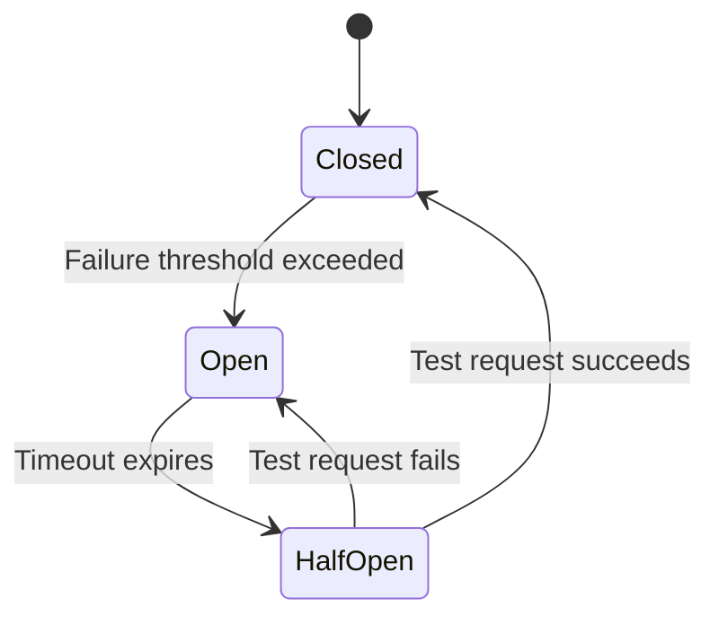

# How to Implement the Circuit Breaker Pattern Using Azure API Management Policies

Author: [nawazdhandala](https://www.github.com/nawazdhandala)

Tags: Azure, API Management, Circuit Breaker, Resilience, Cloud Patterns, Microservices, Fault Tolerance

Description: Implement the circuit breaker pattern in Azure API Management using policies to protect your backend services from cascading failures.

---

When a backend service starts failing, continuing to send requests to it makes things worse. The failing service gets even more overloaded, the calling service wastes resources waiting for timeouts, and the entire system degrades. The circuit breaker pattern solves this by detecting failures and temporarily stopping requests to the unhealthy service, giving it time to recover.

Azure API Management (APIM) sits in front of your backend APIs, making it the perfect place to implement circuit breakers. In this post, I will show you how to build a circuit breaker using APIM policies.

## How the Circuit Breaker Pattern Works

A circuit breaker has three states:

- **Closed** - everything is normal, requests flow through to the backend
- **Open** - the backend is considered unhealthy, requests are immediately rejected without hitting the backend
- **Half-Open** - the circuit breaker allows a limited number of test requests through to check if the backend has recovered



## Built-in Circuit Breaker in APIM (Preview)

Azure API Management now has a built-in circuit breaker feature through backend configuration. You can configure it using the Azure CLI or ARM templates.

```bash
# Configure a backend with circuit breaker rules
# The circuit opens after 3 failures in a 30-second window
az apim backend create \
  --resource-group myResourceGroup \
  --service-name myApimService \
  --backend-id my-backend \
  --url "https://my-backend-api.azurewebsites.net" \
  --protocol http \
  --circuit-breaker-rules '[{
    "name": "defaultRule",
    "failureCondition": {
      "count": 3,
      "interval": "PT30S",
      "statusCodeRanges": [{"min": 500, "max": 599}],
      "errorReasons": ["Timeout"]
    },
    "tripDuration": "PT60S",
    "acceptRetryAfter": true
  }]'
```

This configuration opens the circuit after 3 failures (HTTP 5xx or timeouts) within 30 seconds. Once open, the circuit stays open for 60 seconds before transitioning to half-open.

## Implementing Circuit Breaker with APIM Policies

For more control, you can implement the circuit breaker pattern manually using APIM policies and cached state. This approach gives you full flexibility over the behavior.

Here is the complete policy implementation:

```xml
<policies>
    <inbound>
        <base />

        <!-- Check the circuit breaker state from cache -->
        <!-- The cache key is specific to the backend service -->
        <cache-lookup-value
            key="circuit-breaker-state-backend-api"
            variable-name="circuitState"
            default-value="closed" />

        <cache-lookup-value
            key="circuit-breaker-failures-backend-api"
            variable-name="failureCount"
            default-value="0" />

        <choose>
            <!-- If circuit is open, return 503 immediately -->
            <when condition="@(context.Variables.GetValueOrDefault<string>(
                "circuitState") == "open")">
                <return-response>
                    <set-status code="503" reason="Service Unavailable" />
                    <set-header name="Retry-After" exists-action="override">
                        <value>30</value>
                    </set-header>
                    <set-body>{
                        "error": "Circuit breaker is open. Backend service is temporarily unavailable.",
                        "retryAfter": 30
                    }</set-body>
                </return-response>
            </when>

            <!-- If circuit is half-open, allow only one test request -->
            <when condition="@(context.Variables.GetValueOrDefault<string>(
                "circuitState") == "half-open")">
                <set-variable name="isTestRequest" value="true" />
            </when>
        </choose>
    </inbound>

    <backend>
        <base />
    </backend>

    <outbound>
        <base />

        <choose>
            <!-- Backend returned success -->
            <when condition="@(context.Response.StatusCode < 500)">
                <!-- Reset failure count on success -->
                <cache-store-value
                    key="circuit-breaker-failures-backend-api"
                    value="0"
                    duration="300" />

                <!-- If this was a half-open test request, close the circuit -->
                <choose>
                    <when condition="@(context.Variables.GetValueOrDefault<string>(
                        "circuitState") == "half-open")">
                        <cache-store-value
                            key="circuit-breaker-state-backend-api"
                            value="closed"
                            duration="300" />
                    </when>
                </choose>
            </when>

            <!-- Backend returned 5xx error -->
            <when condition="@(context.Response.StatusCode >= 500)">
                <!-- Increment failure count -->
                <cache-store-value
                    key="circuit-breaker-failures-backend-api"
                    value="@{
                        var current = context.Variables.GetValueOrDefault<string>("failureCount");
                        return (int.Parse(current) + 1).ToString();
                    }"
                    duration="60" />

                <!-- Open circuit if failures exceed threshold -->
                <choose>
                    <when condition="@{
                        var failures = context.Variables.GetValueOrDefault<string>("failureCount");
                        return int.Parse(failures) >= 4;
                    }">
                        <!-- Set circuit to open for 30 seconds -->
                        <cache-store-value
                            key="circuit-breaker-state-backend-api"
                            value="open"
                            duration="30" />
                    </when>
                </choose>

                <!-- If half-open test request failed, reopen circuit -->
                <choose>
                    <when condition="@(context.Variables.GetValueOrDefault<string>(
                        "circuitState") == "half-open")">
                        <cache-store-value
                            key="circuit-breaker-state-backend-api"
                            value="open"
                            duration="30" />
                    </when>
                </choose>
            </when>
        </choose>
    </outbound>

    <on-error>
        <base />

        <!-- Handle timeout and connection errors -->
        <cache-store-value
            key="circuit-breaker-failures-backend-api"
            value="@{
                var current = context.Variables.GetValueOrDefault<string>("failureCount");
                return (int.Parse(current) + 1).ToString();
            }"
            duration="60" />

        <!-- Open circuit if failures exceed threshold -->
        <choose>
            <when condition="@{
                var failures = context.Variables.GetValueOrDefault<string>("failureCount");
                return int.Parse(failures) >= 4;
            }">
                <cache-store-value
                    key="circuit-breaker-state-backend-api"
                    value="open"
                    duration="30" />
            </when>
        </choose>

        <return-response>
            <set-status code="502" reason="Bad Gateway" />
            <set-body>{
                "error": "Backend service failed to respond."
            }</set-body>
        </return-response>
    </on-error>
</policies>
```

## Transitioning from Open to Half-Open

In the policy above, the transition from open to half-open happens automatically because the cache duration on the "open" state is set to 30 seconds. After 30 seconds, the cache entry expires, and the `circuitState` reverts to its default value of "closed." However, a more proper half-open implementation would set the state to "half-open" just before the timeout expires.

You can achieve this with an external timer. For example, an Azure Function that runs on a schedule:

```csharp
// Timer function that transitions open circuits to half-open
// Runs every 15 seconds to check circuit state
[Function("CircuitBreakerTimer")]
public async Task Run([TimerTrigger("*/15 * * * * *")] TimerInfo timer)
{
    var cacheClient = _apimManagementClient.Cache;

    // Check if circuit has been open long enough
    var state = await GetCircuitState("backend-api");
    var openSince = await GetCircuitOpenTimestamp("backend-api");

    if (state == "open" && DateTime.UtcNow - openSince > TimeSpan.FromSeconds(30))
    {
        // Transition to half-open
        await SetCircuitState("backend-api", "half-open");
        _logger.LogInformation("Circuit for backend-api transitioned to half-open");
    }
}
```

## Circuit Breaker with Multiple Backends

If you have multiple backend services, each one should have its own circuit breaker. You can parameterize the cache keys using the backend URL or a service identifier:

```xml
<!-- Dynamic circuit breaker key based on the backend service -->
<set-variable name="backendId" value="@(context.Request.MatchedParameters["serviceId"])" />

<cache-lookup-value
    key="@("circuit-breaker-state-" + context.Variables["backendId"])"
    variable-name="circuitState"
    default-value="closed" />
```

## Combining Circuit Breaker with Retry

The circuit breaker pattern works best when combined with the retry pattern. The retry policy handles individual transient failures, while the circuit breaker prevents sustained failures from overwhelming the system.

```xml
<!-- Retry policy that respects the circuit breaker -->
<retry condition="@(context.Response.StatusCode >= 500)"
       count="3"
       interval="1"
       max-interval="10"
       delta="2"
       first-fast-retry="true">
    <forward-request buffer-request-body="true" timeout="10" />
</retry>
```

The key is to place the circuit breaker check before the retry loop. If the circuit is open, you skip retries entirely and return the error immediately.

## Monitoring Circuit Breaker State

You want visibility into when circuits open and close. Use APIM's diagnostic settings to send logs to Application Insights:

```xml
<!-- Log circuit state changes for monitoring -->
<choose>
    <when condition="@(context.Variables.GetValueOrDefault<string>("circuitState") == "open")">
        <trace source="circuit-breaker" severity="warning">
            <message>@($"Circuit breaker OPEN for backend: {context.Variables["backendId"]}")</message>
        </trace>
    </when>
</choose>
```

In Application Insights, you can create alerts that trigger when circuit breakers open, so your operations team knows when backend services are having problems.

## Best Practices

After implementing circuit breakers across several Azure projects, here are the lessons I have learned:

1. **Set failure thresholds based on actual traffic patterns.** Five failures in 30 seconds might be normal for a high-traffic API but catastrophic for a low-traffic one.
2. **Use separate circuits for separate operations.** A read endpoint failing should not block write operations.
3. **Return meaningful error responses when the circuit is open.** Include a Retry-After header so clients know when to try again.
4. **Monitor and alert on circuit state changes.** An opening circuit is an early warning sign.
5. **Test your circuit breaker by simulating failures.** Use Azure Chaos Studio or manually return 500 errors from your backend.

The circuit breaker pattern is a critical piece of building resilient systems on Azure. Combined with retries, timeouts, and proper monitoring, it helps your application gracefully handle the inevitable failures that come with distributed systems.
