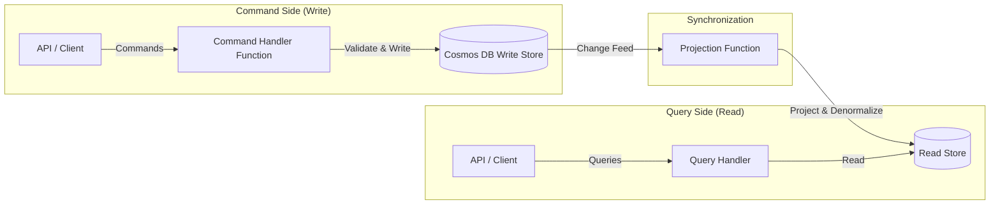

# How to Implement the CQRS Pattern with Azure Cosmos DB and Azure Functions

Author: [nawazdhandala](https://www.github.com/nawazdhandala)

Tags: Azure, CQRS, Cosmos DB, Azure Functions, Architecture Patterns, Event Sourcing, Microservices

Description: Implement the CQRS pattern using Azure Cosmos DB for the write model and a read-optimized store with Azure Functions for synchronization.

---

CQRS, which stands for Command Query Responsibility Segregation, is a pattern that separates the read and write operations of your application into different models. Instead of a single data model that handles both updates and queries, you have one model optimized for writing data and another optimized for reading it. This sounds like unnecessary complexity at first, but for applications with high read-to-write ratios or complex query requirements, it can dramatically improve performance and scalability.

In this post, I will show you how to implement CQRS using Azure Cosmos DB as the write store, Azure Functions for processing, and a read-optimized store for queries.

## Why CQRS on Azure

Most applications have very different read and write patterns. Writes need strong consistency, validation, and business logic. Reads need to be fast, often denormalized, and served from data structures optimized for specific query patterns.

Azure Cosmos DB is excellent for the write side because it offers single-digit millisecond writes, automatic partitioning, and a change feed that notifies you when data changes. Azure Functions can subscribe to the change feed and project the data into a read-optimized store.



## Setting Up the Write Store

The write store in Cosmos DB should be modeled around your domain aggregates. Each document represents a complete aggregate that can be validated and updated atomically.

Here is an example for an e-commerce order system:

```csharp
// The write model - represents the complete order aggregate
// This is the single source of truth for order data
public class OrderAggregate
{
    [JsonPropertyName("id")]
    public string Id { get; set; }

    [JsonPropertyName("partitionKey")]
    public string CustomerId { get; set; }

    public string Status { get; set; }
    public DateTime CreatedAt { get; set; }
    public DateTime UpdatedAt { get; set; }

    public CustomerInfo Customer { get; set; }
    public List<OrderItem> Items { get; set; }
    public ShippingAddress ShippingAddress { get; set; }
    public PaymentInfo Payment { get; set; }

    // Domain version for optimistic concurrency
    public int Version { get; set; }

    // Domain methods enforce business rules
    public void AddItem(string productId, int quantity, decimal price)
    {
        if (Status != "Draft")
            throw new InvalidOperationException("Cannot modify a submitted order");

        Items.Add(new OrderItem
        {
            ProductId = productId,
            Quantity = quantity,
            UnitPrice = price
        });

        UpdatedAt = DateTime.UtcNow;
        Version++;
    }

    public void Submit()
    {
        if (Items.Count == 0)
            throw new InvalidOperationException("Cannot submit an empty order");

        Status = "Submitted";
        UpdatedAt = DateTime.UtcNow;
        Version++;
    }
}
```

## Command Handler Function

Commands are operations that modify state. Each command goes through validation, loads the current aggregate state, applies the business logic, and saves the updated aggregate:

```csharp
// HTTP-triggered function that handles the AddItem command
[Function("AddItemToOrder")]
public async Task<HttpResponseData> AddItem(
    [HttpTrigger(AuthorizationLevel.Function, "post",
     Route = "orders/{orderId}/items")] HttpRequestData req,
    string orderId,
    FunctionContext context)
{
    var logger = context.GetLogger("AddItemToOrder");
    var command = await req.ReadFromJsonAsync<AddItemCommand>();

    // Load the current state of the order aggregate
    var container = _cosmosClient.GetContainer("OrdersDB", "Orders");

    try
    {
        var response = await container.ReadItemAsync<OrderAggregate>(
            orderId, new PartitionKey(command.CustomerId));

        var order = response.Resource;

        // Apply the command through domain logic
        order.AddItem(command.ProductId, command.Quantity, command.Price);

        // Save with optimistic concurrency using the ETag
        var options = new ItemRequestOptions
        {
            IfMatchEtag = response.ETag
        };

        await container.ReplaceItemAsync(
            order, orderId,
            new PartitionKey(command.CustomerId),
            options);

        var successResponse = req.CreateResponse(HttpStatusCode.OK);
        await successResponse.WriteAsJsonAsync(new { order.Id, order.Version });
        return successResponse;
    }
    catch (CosmosException ex) when (ex.StatusCode == HttpStatusCode.PreconditionFailed)
    {
        // Another process modified the order concurrently
        // Client should retry with fresh data
        logger.LogWarning("Concurrency conflict on order {OrderId}", orderId);
        return req.CreateResponse(HttpStatusCode.Conflict);
    }
}
```

## Change Feed Processor

The change feed is the bridge between the write and read sides. Cosmos DB's change feed captures every modification to documents in order. Azure Functions has a built-in Cosmos DB trigger that subscribes to the change feed:

```csharp
// This function runs whenever documents change in the write store
// It projects the data into a read-optimized format
[Function("ProjectOrdersToReadStore")]
public async Task ProjectOrders(
    [CosmosDBTrigger(
        databaseName: "OrdersDB",
        containerName: "Orders",
        Connection = "CosmosDBConnection",
        LeaseContainerName = "leases",
        CreateLeaseContainerIfNotExists = true)]
    IReadOnlyList<OrderAggregate> changedOrders,
    FunctionContext context)
{
    var logger = context.GetLogger("ProjectOrdersToReadStore");

    foreach (var order in changedOrders)
    {
        logger.LogInformation(
            "Projecting order {OrderId} version {Version}",
            order.Id, order.Version);

        // Create the read model - denormalized for fast queries
        var readModel = new OrderReadModel
        {
            Id = order.Id,
            CustomerId = order.Customer.Id,
            CustomerName = order.Customer.Name,
            CustomerEmail = order.Customer.Email,
            Status = order.Status,
            ItemCount = order.Items.Count,
            TotalAmount = order.Items.Sum(i => i.Quantity * i.UnitPrice),
            CreatedAt = order.CreatedAt,
            UpdatedAt = order.UpdatedAt,
            // Flatten items for search
            ProductIds = order.Items.Select(i => i.ProductId).ToList(),
            // Pre-compute display values
            StatusDisplay = GetStatusDisplay(order.Status),
            ShippingSummary = $"{order.ShippingAddress.City}, {order.ShippingAddress.Country}"
        };

        // Write to the read store
        await _readStoreContainer.UpsertItemAsync(
            readModel, new PartitionKey(readModel.CustomerId));

        // Also update the customer's order summary
        await UpdateCustomerOrderSummary(order);
    }
}

// Update a denormalized summary of all orders for a customer
private async Task UpdateCustomerOrderSummary(OrderAggregate order)
{
    var summaryId = $"summary-{order.Customer.Id}";

    CustomerOrderSummary summary;
    try
    {
        var response = await _summaryContainer.ReadItemAsync<CustomerOrderSummary>(
            summaryId, new PartitionKey(order.Customer.Id));
        summary = response.Resource;
    }
    catch (CosmosException ex) when (ex.StatusCode == HttpStatusCode.NotFound)
    {
        summary = new CustomerOrderSummary
        {
            Id = summaryId,
            CustomerId = order.Customer.Id
        };
    }

    // Update summary statistics
    summary.TotalOrders++;
    summary.TotalSpent += order.Items.Sum(i => i.Quantity * i.UnitPrice);
    summary.LastOrderDate = order.CreatedAt;

    await _summaryContainer.UpsertItemAsync(
        summary, new PartitionKey(order.Customer.Id));
}
```

## Read Model and Query Handler

The read side can use a different Cosmos DB container with different indexing policies, or even a completely different database like Azure SQL or Azure Cognitive Search for complex queries:

```csharp
// The read model - denormalized and optimized for queries
public class OrderReadModel
{
    [JsonPropertyName("id")]
    public string Id { get; set; }

    [JsonPropertyName("partitionKey")]
    public string CustomerId { get; set; }

    public string CustomerName { get; set; }
    public string CustomerEmail { get; set; }
    public string Status { get; set; }
    public string StatusDisplay { get; set; }
    public int ItemCount { get; set; }
    public decimal TotalAmount { get; set; }
    public DateTime CreatedAt { get; set; }
    public DateTime UpdatedAt { get; set; }
    public List<string> ProductIds { get; set; }
    public string ShippingSummary { get; set; }
}

// Query handler function - reads from the optimized read store
[Function("GetCustomerOrders")]
public async Task<HttpResponseData> GetOrders(
    [HttpTrigger(AuthorizationLevel.Function, "get",
     Route = "customers/{customerId}/orders")] HttpRequestData req,
    string customerId,
    FunctionContext context)
{
    // Query the read store - fast because data is already denormalized
    var query = new QueryDefinition(
        "SELECT * FROM c WHERE c.customerId = @customerId ORDER BY c.createdAt DESC")
        .WithParameter("@customerId", customerId);

    var orders = new List<OrderReadModel>();

    using var iterator = _readContainer.GetItemQueryIterator<OrderReadModel>(
        query, requestOptions: new QueryRequestOptions
        {
            PartitionKey = new PartitionKey(customerId),
            MaxItemCount = 50
        });

    while (iterator.HasMoreResults)
    {
        var batch = await iterator.ReadNextAsync();
        orders.AddRange(batch.Resource);
    }

    var response = req.CreateResponse(HttpStatusCode.OK);
    await response.WriteAsJsonAsync(orders);
    return response;
}
```

## Handling Eventual Consistency

CQRS introduces eventual consistency between the write and read stores. When a command is processed, the read model takes a short time (typically milliseconds to seconds) to update. Here is how to handle this gracefully:

```csharp
// After a write, return the command result directly
// Don't query the read store immediately - it might not be updated yet
[Function("SubmitOrder")]
public async Task<HttpResponseData> Submit(
    [HttpTrigger(AuthorizationLevel.Function, "post",
     Route = "orders/{orderId}/submit")] HttpRequestData req,
    string orderId,
    FunctionContext context)
{
    // Process the command
    var order = await LoadAndSubmitOrder(orderId);

    // Return the write model result directly
    // This avoids the read-after-write consistency issue
    var response = req.CreateResponse(HttpStatusCode.OK);
    await response.WriteAsJsonAsync(new
    {
        order.Id,
        order.Status,
        order.Version,
        Message = "Order submitted successfully"
    });
    return response;
}
```

On the client side, you can use optimistic UI updates - update the UI immediately based on the command response, and let the read model catch up in the background.

## When to Use CQRS

CQRS adds complexity, so it is not appropriate for every application. Use it when:

- Read and write workloads have very different scaling requirements
- Your queries need data from multiple aggregates joined together
- You need different read models for different consumers (mobile app vs admin dashboard)
- Your domain logic is complex enough to benefit from a separate command model

Do not use CQRS for simple CRUD applications where a single data model works fine. The extra infrastructure and eventual consistency complexity is not worth it for straightforward use cases.

## Summary

Implementing CQRS with Azure Cosmos DB and Functions gives you independently scalable read and write paths, data models optimized for their specific purpose, and a clean separation between command processing and query handling. The Cosmos DB change feed is the key enabler, providing a reliable, ordered stream of changes that your projection functions can use to keep the read store in sync. Start with a single projection and add more as your query requirements grow.
