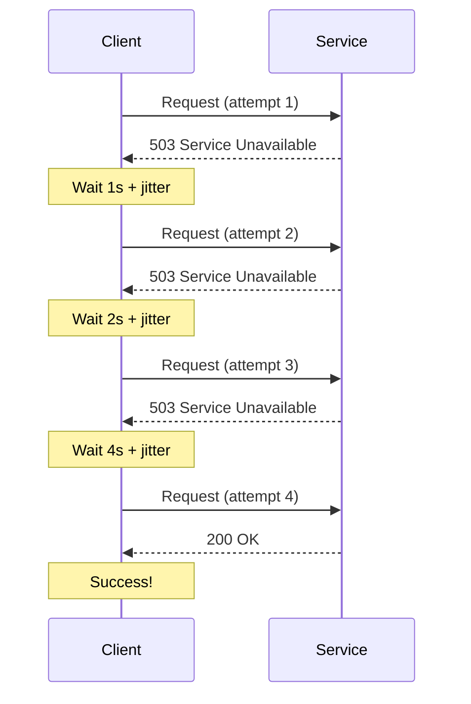

# How to Implement the Retry Pattern with Exponential Backoff in Azure Applications

Author: [nawazdhandala](https://www.github.com/nawazdhandala)

Tags: Azure, Retry Pattern, Exponential Backoff, Resilience, Cloud Patterns, Error Handling, Microservices

Description: Learn how to implement robust retry logic with exponential backoff in Azure applications to handle transient failures gracefully.

---

Transient failures are a fact of life in cloud computing. Network blips, temporary service unavailability, throttling responses, and brief DNS resolution failures happen all the time. If your application treats every failed HTTP call or database query as a permanent error, your users will see far more failures than necessary.

The retry pattern with exponential backoff is the standard solution to this problem. Instead of immediately failing or retrying in a tight loop, your application waits progressively longer between each retry attempt, giving the downstream service time to recover.

## Why Exponential Backoff Matters

A naive retry strategy that retries immediately can actually make things worse. If a service is struggling under load and hundreds of clients all retry at once, you create a retry storm that prevents the service from recovering. Exponential backoff solves this by spreading retries over time.

Here is the basic formula:

```
wait_time = base_delay * (2 ^ attempt_number) + random_jitter
```

The first retry might wait 1 second, the second waits 2 seconds, the third waits 4 seconds, and so on. Adding random jitter prevents multiple clients from synchronizing their retries.

## Implementing Retries with Polly in .NET

For .NET applications running on Azure, Polly is the go-to library for implementing resilience patterns. Here is a complete implementation:

```csharp
using Polly;
using Polly.Extensions.Http;

// Configure retry policy with exponential backoff
// Retries up to 5 times with increasing delays: ~1s, ~2s, ~4s, ~8s, ~16s
var retryPolicy = HttpPolicyExtensions
    .HandleTransientHttpError() // handles 5xx and 408 responses
    .OrResult(msg => msg.StatusCode == System.Net.HttpStatusCode.TooManyRequests)
    .WaitAndRetryAsync(
        retryCount: 5,
        sleepDurationProvider: (retryAttempt, response, context) =>
        {
            // Check if the server sent a Retry-After header
            if (response.Result?.Headers.RetryAfter?.Delta != null)
            {
                return response.Result.Headers.RetryAfter.Delta.Value;
            }

            // Calculate exponential backoff with jitter
            var baseDelay = TimeSpan.FromSeconds(Math.Pow(2, retryAttempt));
            var jitter = TimeSpan.FromMilliseconds(Random.Shared.Next(0, 1000));
            return baseDelay + jitter;
        },
        onRetryAsync: async (outcome, timespan, retryAttempt, context) =>
        {
            // Log each retry attempt for debugging
            Console.WriteLine(
                $"Retry {retryAttempt} after {timespan.TotalSeconds:F1}s " +
                $"due to {outcome.Result?.StatusCode ?? default}");
        }
    );

// Register the HttpClient with the retry policy
builder.Services.AddHttpClient("ResilientClient", client =>
{
    client.BaseAddress = new Uri("https://api.example.com/");
    client.Timeout = TimeSpan.FromSeconds(60);
})
.AddPolicyHandler(retryPolicy);
```

This implementation handles HTTP 5xx errors, 408 (Request Timeout), and 429 (Too Many Requests). It also respects the `Retry-After` header when the server provides one, which is critical for handling throttling correctly.

## Retry Logic for Azure Service Bus

Azure Service Bus operations can also experience transient failures. The Service Bus SDK has built-in retry support, but you should configure it properly:

```csharp
// Configure Service Bus client with custom retry options
var clientOptions = new ServiceBusClientOptions
{
    RetryOptions = new ServiceBusRetryOptions
    {
        Mode = ServiceBusRetryMode.Exponential,
        MaxRetries = 5,
        Delay = TimeSpan.FromSeconds(1),        // initial delay
        MaxDelay = TimeSpan.FromSeconds(30),     // cap on delay
        TryTimeout = TimeSpan.FromSeconds(60)    // timeout per attempt
    }
};

var client = new ServiceBusClient(connectionString, clientOptions);

// The sender will automatically retry on transient failures
var sender = client.CreateSender("my-queue");

try
{
    await sender.SendMessageAsync(new ServiceBusMessage("Hello"));
}
catch (ServiceBusException ex) when (ex.IsTransient)
{
    // All retries exhausted - handle the permanent failure
    Console.WriteLine($"Message send failed after all retries: {ex.Message}");
}
```

## Retry Logic for Azure Cosmos DB

Cosmos DB has its own retry mechanism built into the SDK, with special handling for rate-limited requests (HTTP 429). Here is how to configure it:

```csharp
// Configure Cosmos DB client with retry settings
var cosmosClientOptions = new CosmosClientOptions
{
    // Max retries for rate-limited requests
    MaxRetryAttemptsOnRateLimitedRequests = 10,

    // Maximum wait time for all retries combined
    MaxRetryWaitTimeOnRateLimitedRequests = TimeSpan.FromSeconds(30),

    // Connection mode - direct is faster but gateway handles retries better
    ConnectionMode = ConnectionMode.Direct,

    // Request timeout per individual attempt
    RequestTimeout = TimeSpan.FromSeconds(15)
};

var cosmosClient = new CosmosClient(connectionString, cosmosClientOptions);
```

## Implementing Retries in Python with Tenacity

If you are building Azure Functions or Flask applications in Python, the tenacity library provides a clean decorator-based approach:

```python
from tenacity import retry, stop_after_attempt, wait_exponential, retry_if_exception_type
import requests

# Decorator that retries on connection errors and server errors
# Waits 1s, 2s, 4s, 8s, then 16s between retries
@retry(
    stop=stop_after_attempt(5),
    wait=wait_exponential(multiplier=1, min=1, max=60),
    retry=retry_if_exception_type((requests.ConnectionError, requests.Timeout)),
    before_sleep=lambda retry_state: print(
        f"Retrying in {retry_state.next_action.sleep:.1f}s "
        f"(attempt {retry_state.attempt_number})"
    )
)
def call_external_api(endpoint):
    """Call an external API with automatic retry on transient failures."""
    response = requests.get(
        f"https://api.example.com/{endpoint}",
        timeout=10
    )

    # Raise for 5xx errors so they trigger a retry
    if response.status_code >= 500:
        raise requests.ConnectionError(f"Server error: {response.status_code}")

    # Don't retry 4xx errors (except 429)
    if response.status_code == 429:
        raise requests.ConnectionError("Rate limited")

    response.raise_for_status()
    return response.json()
```

## Implementing Retries in Azure Functions

Azure Functions have built-in retry policies for certain trigger types. For HTTP-triggered functions, you need to implement retries yourself, but for queue-triggered functions, you can use the built-in mechanism:

```json
{
  "version": "2.0",
  "extensions": {
    "serviceBus": {
      "messageHandlerOptions": {
        "maxConcurrentCalls": 16,
        "maxAutoLockRenewalDuration": "00:05:00"
      }
    }
  },
  "retry": {
    "strategy": "exponentialBackoff",
    "maxRetryCount": 5,
    "minimumInterval": "00:00:01",
    "maximumInterval": "00:00:30"
  }
}
```

For HTTP-triggered functions that call downstream services, wrap your logic with a retry policy:

```csharp
// Azure Function with built-in retry attribute
[Function("ProcessOrder")]
[ExponentialBackoffRetry(5, "00:00:01", "00:05:00")]
public async Task Run(
    [ServiceBusTrigger("orders", Connection = "ServiceBusConnection")]
    ServiceBusReceivedMessage message,
    ServiceBusMessageActions messageActions)
{
    var order = JsonSerializer.Deserialize<Order>(message.Body);

    // Process the order - if this throws, the function retries
    await _orderProcessor.ProcessAsync(order);

    // Complete the message only after successful processing
    await messageActions.CompleteMessageAsync(message);
}
```

## What to Retry and What Not to Retry

Not every failure should be retried. Here is a simple guide:

**Retry these:**
- HTTP 408 (Request Timeout)
- HTTP 429 (Too Many Requests)
- HTTP 500 (Internal Server Error)
- HTTP 502 (Bad Gateway)
- HTTP 503 (Service Unavailable)
- HTTP 504 (Gateway Timeout)
- Connection timeouts
- DNS resolution failures
- TCP connection resets

**Do not retry these:**
- HTTP 400 (Bad Request) - your request is malformed
- HTTP 401 (Unauthorized) - retrying will not fix authentication
- HTTP 403 (Forbidden) - you do not have permission
- HTTP 404 (Not Found) - the resource does not exist
- HTTP 409 (Conflict) - needs application logic to resolve
- Request validation errors
- Deserialization errors

## Visualizing the Retry Flow

Here is how the retry pattern with exponential backoff works in practice:



## Key Takeaways

The retry pattern with exponential backoff is essential for building resilient Azure applications. Always use jitter to prevent retry storms. Respect `Retry-After` headers from services. Set a maximum retry count and maximum delay to prevent infinite waits. Most importantly, only retry transient failures - retrying permanent errors just wastes resources and delays error reporting to the caller. When combined with circuit breakers, this pattern forms the backbone of a fault-tolerant distributed system.
