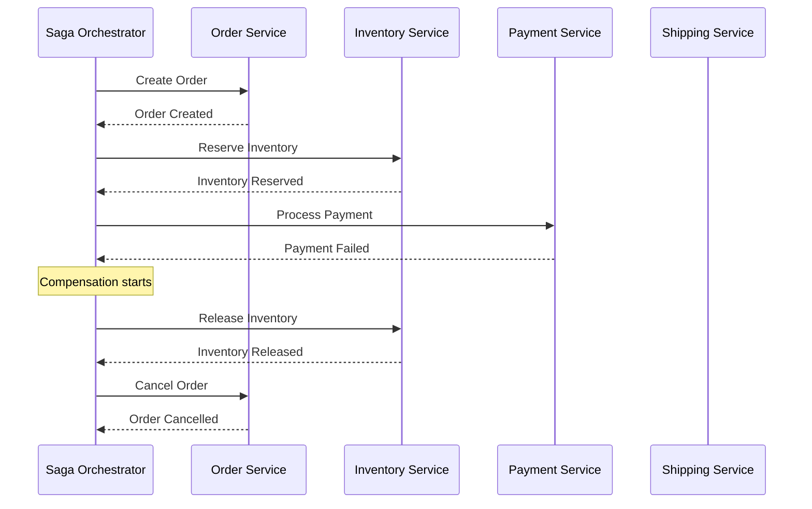

# How to Implement the Saga Pattern for Distributed Transactions in Azure Service Bus

Author: [nawazdhandala](https://www.github.com/nawazdhandala)

Tags: Azure, Saga Pattern, Service Bus, Distributed Transactions, Microservices, Orchestration, Cloud Patterns

Description: Learn how to implement the saga pattern for managing distributed transactions across microservices using Azure Service Bus for reliable messaging.

---

In a monolithic application, you can wrap multiple database operations in a single transaction. If anything fails, everything rolls back. In a microservices architecture, that luxury disappears. Each service has its own database, and there is no distributed transaction coordinator that works reliably across multiple services and databases.

The saga pattern solves this problem by breaking a distributed transaction into a sequence of local transactions. Each service performs its local transaction and publishes an event or message. If any step fails, compensating transactions undo the work done by previous steps. Azure Service Bus provides the reliable messaging backbone that makes this work.

## Two Flavors of Sagas

There are two ways to implement sagas:

**Choreography** - each service listens for events and decides what to do next. There is no central coordinator. This works well for simple sagas with few steps.

**Orchestration** - a central orchestrator service tells each participant what to do and handles the decision logic. This is better for complex sagas with many steps or conditional logic.

I will focus on the orchestration approach because it is easier to understand, debug, and maintain for most real-world scenarios.



## Setting Up Azure Service Bus

First, create the Service Bus namespace and the queues needed for saga communication:

```bash
# Create a Service Bus namespace
az servicebus namespace create \
  --resource-group myResourceGroup \
  --name my-saga-bus \
  --location eastus \
  --sku Standard

# Create queues for each saga step
# Each service has a command queue and a reply queue
az servicebus queue create --namespace-name my-saga-bus \
  --resource-group myResourceGroup --name order-commands
az servicebus queue create --namespace-name my-saga-bus \
  --resource-group myResourceGroup --name inventory-commands
az servicebus queue create --namespace-name my-saga-bus \
  --resource-group myResourceGroup --name payment-commands
az servicebus queue create --namespace-name my-saga-bus \
  --resource-group myResourceGroup --name shipping-commands

# Create a reply queue for the orchestrator
az servicebus queue create --namespace-name my-saga-bus \
  --resource-group myResourceGroup --name saga-replies
```

## The Saga State Machine

The orchestrator maintains the state of each saga instance. Here is the saga definition:

```csharp
// Defines the steps and compensations for the order saga
public class OrderSagaDefinition
{
    // Each step has a forward action and a compensating action
    public static readonly SagaStep[] Steps = new[]
    {
        new SagaStep
        {
            Name = "CreateOrder",
            CommandQueue = "order-commands",
            CommandType = "CreateOrder",
            CompensationCommandType = "CancelOrder"
        },
        new SagaStep
        {
            Name = "ReserveInventory",
            CommandQueue = "inventory-commands",
            CommandType = "ReserveInventory",
            CompensationCommandType = "ReleaseInventory"
        },
        new SagaStep
        {
            Name = "ProcessPayment",
            CommandQueue = "payment-commands",
            CommandType = "ProcessPayment",
            CompensationCommandType = "RefundPayment"
        },
        new SagaStep
        {
            Name = "ArrangeShipping",
            CommandQueue = "shipping-commands",
            CommandType = "ArrangeShipping",
            CompensationCommandType = "CancelShipping"
        }
    };
}

// Tracks the state of a running saga instance
public class SagaState
{
    public string SagaId { get; set; }
    public string Status { get; set; }  // Running, Compensating, Completed, Failed
    public int CurrentStep { get; set; }
    public Dictionary<string, object> Data { get; set; }
    public List<string> CompletedSteps { get; set; }
    public string FailureReason { get; set; }
    public DateTime StartedAt { get; set; }
    public DateTime UpdatedAt { get; set; }
}
```

## The Saga Orchestrator

The orchestrator is the brain of the saga. It receives replies from services and decides what to do next:

```csharp
// The saga orchestrator processes replies and advances the saga
public class OrderSagaOrchestrator
{
    private readonly ServiceBusSender[] _senders;
    private readonly CosmosContainer _sagaStore;

    // Start a new saga
    public async Task StartSaga(OrderRequest request)
    {
        // Create the initial saga state
        var sagaState = new SagaState
        {
            SagaId = Guid.NewGuid().ToString(),
            Status = "Running",
            CurrentStep = 0,
            Data = new Dictionary<string, object>
            {
                ["orderId"] = request.OrderId,
                ["customerId"] = request.CustomerId,
                ["items"] = request.Items,
                ["totalAmount"] = request.TotalAmount
            },
            CompletedSteps = new List<string>(),
            StartedAt = DateTime.UtcNow,
            UpdatedAt = DateTime.UtcNow
        };

        // Persist the saga state
        await _sagaStore.CreateItemAsync(sagaState);

        // Send the first command
        await SendStepCommand(sagaState, OrderSagaDefinition.Steps[0]);
    }

    // Process a reply from a service
    public async Task HandleReply(SagaReply reply)
    {
        // Load the current saga state
        var sagaState = await _sagaStore.ReadItemAsync<SagaState>(
            reply.SagaId, new PartitionKey(reply.SagaId));

        var state = sagaState.Resource;

        if (reply.Success)
        {
            // Step succeeded - record it and move to the next step
            state.CompletedSteps.Add(
                OrderSagaDefinition.Steps[state.CurrentStep].Name);
            state.CurrentStep++;

            if (state.CurrentStep >= OrderSagaDefinition.Steps.Length)
            {
                // All steps completed successfully
                state.Status = "Completed";
                state.UpdatedAt = DateTime.UtcNow;
                await _sagaStore.ReplaceItemAsync(state, state.SagaId);
                return;
            }

            // Send the next step command
            state.UpdatedAt = DateTime.UtcNow;
            await _sagaStore.ReplaceItemAsync(state, state.SagaId);
            await SendStepCommand(state, OrderSagaDefinition.Steps[state.CurrentStep]);
        }
        else
        {
            // Step failed - start compensating
            state.Status = "Compensating";
            state.FailureReason = reply.ErrorMessage;
            state.UpdatedAt = DateTime.UtcNow;
            await _sagaStore.ReplaceItemAsync(state, state.SagaId);

            // Start compensation from the last completed step
            await StartCompensation(state);
        }
    }

    // Send compensation commands in reverse order
    private async Task StartCompensation(SagaState state)
    {
        // Walk backwards through completed steps
        for (int i = state.CompletedSteps.Count - 1; i >= 0; i--)
        {
            var stepName = state.CompletedSteps[i];
            var step = OrderSagaDefinition.Steps.First(s => s.Name == stepName);

            await SendCompensationCommand(state, step);
        }
    }

    // Send a command to a service queue
    private async Task SendStepCommand(SagaState state, SagaStep step)
    {
        var message = new ServiceBusMessage(
            JsonSerializer.Serialize(new SagaCommand
            {
                SagaId = state.SagaId,
                CommandType = step.CommandType,
                Data = state.Data
            }))
        {
            // Correlation ID links all messages in a saga
            CorrelationId = state.SagaId,
            Subject = step.CommandType,
            // Reply queue for the response
            ReplyTo = "saga-replies",
            // Timeout for this step
            TimeToLive = TimeSpan.FromMinutes(5)
        };

        var sender = _serviceBusClient.CreateSender(step.CommandQueue);
        await sender.SendMessageAsync(message);
    }
}
```

## Service Participants

Each service processes commands from its queue and sends replies back to the orchestrator:

```csharp
// Inventory service processes reserve and release commands
[Function("InventoryCommandHandler")]
public async Task HandleCommand(
    [ServiceBusTrigger("inventory-commands", Connection = "ServiceBusConnection")]
    ServiceBusReceivedMessage message,
    ServiceBusMessageActions messageActions,
    FunctionContext context)
{
    var logger = context.GetLogger("InventoryCommandHandler");
    var command = JsonSerializer.Deserialize<SagaCommand>(message.Body);

    SagaReply reply;

    try
    {
        switch (command.CommandType)
        {
            case "ReserveInventory":
                // Try to reserve inventory for all items
                var items = JsonSerializer.Deserialize<List<OrderItem>>(
                    command.Data["items"].ToString());

                foreach (var item in items)
                {
                    var reserved = await _inventoryRepo.TryReserve(
                        item.ProductId, item.Quantity, command.SagaId);

                    if (!reserved)
                    {
                        // Not enough stock - release any reservations made so far
                        await _inventoryRepo.ReleaseReservation(command.SagaId);

                        reply = new SagaReply
                        {
                            SagaId = command.SagaId,
                            Success = false,
                            ErrorMessage = $"Insufficient stock for product {item.ProductId}"
                        };
                        await SendReply(message.ReplyTo, reply);
                        await messageActions.CompleteMessageAsync(message);
                        return;
                    }
                }

                reply = new SagaReply
                {
                    SagaId = command.SagaId,
                    Success = true
                };
                break;

            case "ReleaseInventory":
                // Compensation - release the reservation
                await _inventoryRepo.ReleaseReservation(command.SagaId);

                reply = new SagaReply
                {
                    SagaId = command.SagaId,
                    Success = true
                };
                break;

            default:
                throw new InvalidOperationException(
                    $"Unknown command type: {command.CommandType}");
        }

        await SendReply(message.ReplyTo, reply);
        await messageActions.CompleteMessageAsync(message);
    }
    catch (Exception ex)
    {
        logger.LogError(ex, "Failed to process command {Type} for saga {SagaId}",
            command.CommandType, command.SagaId);

        // Send failure reply so the orchestrator can compensate
        reply = new SagaReply
        {
            SagaId = command.SagaId,
            Success = false,
            ErrorMessage = ex.Message
        };
        await SendReply(message.ReplyTo, reply);
        await messageActions.CompleteMessageAsync(message);
    }
}
```

## Handling Timeouts

What happens if a service never responds? You need timeout handling. Service Bus message TTL combined with dead-letter queues handles this:

```csharp
// Monitor the dead letter queue for timed-out saga commands
[Function("SagaTimeoutHandler")]
public async Task HandleTimeout(
    [ServiceBusTrigger("saga-replies/$deadletterqueue",
     Connection = "ServiceBusConnection")]
    ServiceBusReceivedMessage message,
    FunctionContext context)
{
    var logger = context.GetLogger("SagaTimeoutHandler");
    var command = JsonSerializer.Deserialize<SagaCommand>(message.Body);

    logger.LogWarning("Saga {SagaId} step timed out: {CommandType}",
        command.SagaId, command.CommandType);

    // Treat timeout as a failure and trigger compensation
    var reply = new SagaReply
    {
        SagaId = command.SagaId,
        Success = false,
        ErrorMessage = "Step timed out"
    };

    await _orchestrator.HandleReply(reply);
}
```

## Idempotent Compensations

Compensation commands might be delivered more than once. Each participant must handle compensations idempotently:

```csharp
// Idempotent compensation - safe to call multiple times
public async Task ReleaseReservation(string sagaId)
{
    // Find all reservations for this saga
    var reservations = await _db.Reservations
        .Where(r => r.SagaId == sagaId && r.Status == "Reserved")
        .ToListAsync();

    if (reservations.Count == 0)
    {
        // Already released or never reserved - idempotent success
        return;
    }

    foreach (var reservation in reservations)
    {
        reservation.Status = "Released";
        reservation.ReleasedAt = DateTime.UtcNow;

        // Return quantity to available stock
        var product = await _db.Products.FindAsync(reservation.ProductId);
        product.AvailableStock += reservation.Quantity;
    }

    await _db.SaveChangesAsync();
}
```

## Summary

The saga pattern implemented with Azure Service Bus gives you reliable distributed transaction management across microservices. The orchestrator approach provides clear visibility into the transaction flow, making it easier to debug failures. Remember to make all compensations idempotent, handle timeouts with dead-letter queues, persist saga state for recovery, and design your services so that partial failures can always be compensated. It requires more design work upfront compared to simple API calls, but for any multi-service transaction that needs consistency guarantees, it is the proven approach.
