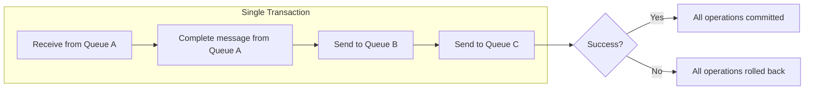

# How to Implement Transactions Across Azure Service Bus Queues

Author: [nawazdhandala](https://www.github.com/nawazdhandala)

Tags: Azure Service Bus, Transactions, Atomic Operations, Message Queue, Azure, Reliability, ACID

Description: Use Azure Service Bus transactions to send and complete messages atomically across queues, ensuring consistency in message-driven workflows.

---

In message-driven systems, you often need to perform multiple messaging operations as a single atomic unit. For example, you might need to receive a message from one queue, process it, and send results to two different queues - all as one transaction. If any step fails, everything should roll back. Without transactions, partial failures can leave your system in an inconsistent state where some messages were sent but others were not.

Azure Service Bus supports AMQP-based transactions that let you group multiple operations into an atomic unit of work. In this post, I will show you how transactions work, what operations can be grouped, and what the limitations are.

## What Service Bus Transactions Support

Service Bus transactions allow you to group the following operations into a single atomic unit:

- Complete a received message
- Send one or more messages
- Defer a message
- Dead-letter a message
- Abandon a message (within the same transaction)

All of these operations can be mixed in a single transaction. Either all of them succeed, or none of them take effect.



## Important Constraint: Same Namespace, Same Transaction

Transactions in Service Bus are scoped to a single namespace. You cannot span a transaction across different Service Bus namespaces, and you cannot combine Service Bus operations with database operations in the same transaction. For cross-service consistency, you need patterns like the Outbox pattern or Saga pattern.

Within a namespace, all entities participating in the transaction must share the same "via" connection for send operations to be part of the receive transaction.

## Basic Transaction: Receive, Process, and Forward

The most common transaction pattern is receiving a message from one queue, processing it, and sending the result to another queue - all atomically.

```csharp
using Azure.Messaging.ServiceBus;

public class TransactionalProcessor
{
    private readonly ServiceBusClient _client;
    private readonly ILogger<TransactionalProcessor> _logger;

    public TransactionalProcessor(ServiceBusClient client, ILogger<TransactionalProcessor> logger)
    {
        _client = client;
        _logger = logger;
    }

    public async Task ProcessTransactionallyAsync()
    {
        // Create receivers and senders
        var receiver = _client.CreateReceiver("input-queue");
        var outputSender = _client.CreateSender("output-queue");
        var auditSender = _client.CreateSender("audit-queue");

        var message = await receiver.ReceiveMessageAsync(TimeSpan.FromSeconds(30));
        if (message == null) return;

        _logger.LogInformation("Received message {Id} from input queue",
            message.MessageId);

        try
        {
            // Process the message (this is not part of the transaction)
            var result = await ProcessMessage(message);

            // Create output and audit messages
            var outputMessage = new ServiceBusMessage(
                BinaryData.FromObjectAsJson(result))
            {
                MessageId = $"output-{message.MessageId}",
                ContentType = "application/json",
                Subject = "ProcessingResult"
            };

            var auditMessage = new ServiceBusMessage(
                BinaryData.FromObjectAsJson(new
                {
                    OriginalMessageId = message.MessageId,
                    ProcessedAt = DateTime.UtcNow,
                    Result = "Success"
                }))
            {
                MessageId = $"audit-{message.MessageId}",
                ContentType = "application/json",
                Subject = "AuditLog"
            };

            // Execute all three operations in a single transaction:
            // 1. Send result to output queue
            // 2. Send audit record to audit queue
            // 3. Complete the input message
            // If any operation fails, all are rolled back
            using var scope = new System.Transactions.TransactionScope(
                System.Transactions.TransactionScopeAsyncFlowOption.Enabled);

            await outputSender.SendMessageAsync(outputMessage);
            await auditSender.SendMessageAsync(auditMessage);
            await receiver.CompleteMessageAsync(message);

            scope.Complete();

            _logger.LogInformation(
                "Transaction committed: message {Id} processed, result sent, audit logged",
                message.MessageId);
        }
        catch (Exception ex)
        {
            _logger.LogError(ex,
                "Transaction failed for message {Id} - all operations rolled back",
                message.MessageId);
            // The message will be abandoned and redelivered
        }
        finally
        {
            await receiver.DisposeAsync();
            await outputSender.DisposeAsync();
            await auditSender.DisposeAsync();
        }
    }
}
```

## Using the ServiceBusTransactionGroup

The newer Azure.Messaging.ServiceBus SDK provides the `ServiceBusTransactionGroup` pattern using the via-entity approach for cross-entity transactions.

```csharp
public class CrossEntityTransaction
{
    private readonly ServiceBusClient _client;
    private readonly ILogger<CrossEntityTransaction> _logger;

    public async Task ProcessWithCrossEntityTransactionAsync()
    {
        // For cross-entity transactions, senders need to use the "via" pattern
        // This sends to the target queue through the source queue's connection
        var receiver = _client.CreateReceiver("orders");

        // Create senders that participate in the transaction
        var fulfillmentSender = _client.CreateSender("fulfillment");
        var notificationSender = _client.CreateSender("notifications");

        var message = await receiver.ReceiveMessageAsync();
        if (message == null) return;

        var order = message.Body.ToObjectFromJson<Order>();

        // Prepare the outgoing messages
        var fulfillmentMessage = new ServiceBusMessage(
            BinaryData.FromObjectAsJson(new FulfillmentRequest
            {
                OrderId = order.Id,
                Items = order.Items,
                ShippingAddress = order.ShippingAddress
            }))
        {
            MessageId = $"fulfill-{order.Id}",
            ContentType = "application/json"
        };

        var notificationMessage = new ServiceBusMessage(
            BinaryData.FromObjectAsJson(new NotificationRequest
            {
                UserId = order.CustomerId,
                Template = "OrderConfirmation",
                Data = new { OrderId = order.Id, Total = order.TotalAmount }
            }))
        {
            MessageId = $"notify-{order.Id}",
            ContentType = "application/json"
        };

        // Execute as a transaction using TransactionScope
        using (var ts = new System.Transactions.TransactionScope(
            System.Transactions.TransactionScopeAsyncFlowOption.Enabled))
        {
            // All of these operations are part of the same AMQP transaction
            await fulfillmentSender.SendMessageAsync(fulfillmentMessage);
            await notificationSender.SendMessageAsync(notificationMessage);
            await receiver.CompleteMessageAsync(message);

            // Commit the transaction
            ts.Complete();
        }

        _logger.LogInformation(
            "Transactional processing complete for order {OrderId}", order.Id);
    }
}
```

## Transaction with Dead-Lettering

You can also dead-letter a message and send a notification as part of the same transaction.

```csharp
public async Task HandleInvalidMessageTransactionally(
    ServiceBusReceiver receiver,
    ServiceBusReceivedMessage message,
    string validationError)
{
    // Create an alert message about the invalid message
    var alertSender = _client.CreateSender("alerts");
    var alertMessage = new ServiceBusMessage(
        BinaryData.FromObjectAsJson(new
        {
            AlertType = "InvalidMessage",
            OriginalMessageId = message.MessageId,
            QueueName = "orders",
            Error = validationError,
            Timestamp = DateTime.UtcNow
        }))
    {
        MessageId = $"alert-invalid-{message.MessageId}",
        ContentType = "application/json"
    };

    // Dead-letter the bad message AND send the alert atomically
    using (var scope = new System.Transactions.TransactionScope(
        System.Transactions.TransactionScopeAsyncFlowOption.Enabled))
    {
        // Send the alert
        await alertSender.SendMessageAsync(alertMessage);

        // Dead-letter the original message
        await receiver.DeadLetterMessageAsync(message,
            deadLetterReason: "ValidationFailed",
            deadLetterErrorDescription: validationError);

        scope.Complete();
    }

    _logger.LogInformation(
        "Transactionally dead-lettered message {Id} and sent alert",
        message.MessageId);
}
```

## Transaction in Azure Functions

In Azure Functions, you can use the `ServiceBusMessageActions` to participate in transactions.

```csharp
public class TransactionalFunction
{
    private readonly ServiceBusClient _client;
    private readonly ILogger<TransactionalFunction> _logger;

    public TransactionalFunction(ServiceBusClient client, ILogger<TransactionalFunction> logger)
    {
        _client = client;
        _logger = logger;
    }

    [Function("TransactionalOrderProcessor")]
    public async Task Run(
        [ServiceBusTrigger("orders", Connection = "ServiceBusConnection")]
        ServiceBusReceivedMessage message,
        ServiceBusMessageActions messageActions)
    {
        var order = message.Body.ToObjectFromJson<Order>();

        // Create senders for output queues
        var fulfillmentSender = _client.CreateSender("fulfillment");
        var invoiceSender = _client.CreateSender("invoicing");

        try
        {
            // Process the order
            var fulfillmentRequest = CreateFulfillmentRequest(order);
            var invoiceRequest = CreateInvoiceRequest(order);

            // Send to both queues and complete the input message atomically
            using (var scope = new System.Transactions.TransactionScope(
                System.Transactions.TransactionScopeAsyncFlowOption.Enabled))
            {
                await fulfillmentSender.SendMessageAsync(
                    new ServiceBusMessage(BinaryData.FromObjectAsJson(fulfillmentRequest))
                    { MessageId = $"fulfill-{order.Id}" });

                await invoiceSender.SendMessageAsync(
                    new ServiceBusMessage(BinaryData.FromObjectAsJson(invoiceRequest))
                    { MessageId = $"invoice-{order.Id}" });

                await messageActions.CompleteMessageAsync(message);

                scope.Complete();
            }

            _logger.LogInformation("Order {Id} processed transactionally", order.Id);
        }
        catch (Exception ex)
        {
            _logger.LogError(ex, "Transaction failed for order {Id}", order.Id);
            // Message will be redelivered since it was not completed
            throw;
        }
        finally
        {
            await fulfillmentSender.DisposeAsync();
            await invoiceSender.DisposeAsync();
        }
    }
}
```

## Limitations and Considerations

There are several important limitations to understand about Service Bus transactions.

**Same namespace only**: All entities in a transaction must be in the same Service Bus namespace. Cross-namespace transactions are not supported.

**No database transactions**: You cannot combine Service Bus transactions with SQL database transactions or any other resource manager in a distributed transaction. Service Bus uses AMQP transactions, not distributed (DTC) transactions.

**Message count limits**: A transaction can include a maximum of 100 messages. For larger batches, you need to split into multiple transactions.

**Performance impact**: Transactions add latency because the broker must coordinate the atomic commit. For high-throughput scenarios, measure the impact.

**Timeout**: Transactions must complete within 2 minutes. Long-running processing should happen before the transaction starts.

## The Outbox Pattern Alternative

When you need to coordinate Service Bus operations with database changes (which cannot be in the same transaction), use the Outbox pattern.

```csharp
// Step 1: Write both the business data and the outbox messages to the database
// in a single database transaction
using (var dbTransaction = await _dbContext.Database.BeginTransactionAsync())
{
    // Save business data
    order.Status = "Processed";
    await _dbContext.SaveChangesAsync();

    // Save outgoing messages to an outbox table
    _dbContext.OutboxMessages.Add(new OutboxMessage
    {
        Id = Guid.NewGuid(),
        QueueName = "fulfillment",
        Body = JsonSerializer.Serialize(fulfillmentRequest),
        CreatedAt = DateTime.UtcNow,
        Sent = false
    });

    await _dbContext.SaveChangesAsync();
    await dbTransaction.CommitAsync();
}

// Step 2: A separate process reads the outbox and sends to Service Bus
// This is eventually consistent but guarantees no data loss
```

## Summary

Azure Service Bus transactions let you atomically complete, send, defer, and dead-letter messages across queues and topics within the same namespace. Use them when you need to guarantee that multiple messaging operations either all succeed or all fail. The main limitations are the single-namespace scope and the inability to combine with database transactions. For cross-resource consistency, supplement transactions with patterns like the Outbox pattern. Transactions are a powerful tool for building reliable message-driven workflows where partial failures are not acceptable.
