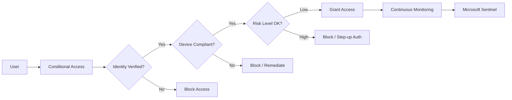

# How to Implement Zero Trust Security Architecture in Azure with Conditional Access

Author: [nawazdhandala](https://www.github.com/nawazdhandala)

Tags: Azure, Zero Trust, Conditional Access, Security, Identity, Azure AD, Cloud Security

Description: Step-by-step guide to implementing Zero Trust security architecture in Azure using Conditional Access policies, identity verification, and network controls.

---

The old castle-and-moat approach to security does not work anymore. When your users connect from coffee shops, home networks, and personal devices, there is no perimeter to defend. Zero Trust flips the model: never trust, always verify. Every access request gets evaluated based on identity, device health, location, and risk signals before being granted.

Azure has a mature set of tools for building a Zero Trust architecture, and Conditional Access sits right at the center of it. This post covers how to put the pieces together.

## What Zero Trust Actually Means in Practice

Zero Trust is built on three principles:

1. Verify explicitly - authenticate and authorize based on all available data points
2. Use least privilege access - limit user access with just-in-time and just-enough-access policies
3. Assume breach - minimize blast radius and segment access, verify end-to-end encryption, and use analytics to detect threats

In Azure, these principles map to specific services and configurations. Azure AD handles identity verification, Conditional Access enforces access policies, Microsoft Defender products detect threats, and Azure networking features provide segmentation.

## Start with Identity as the Control Plane

In a Zero Trust model, identity is the new perimeter. Every access decision starts with verifying who (or what) is making the request.

Make sure your Azure AD tenant is configured with these baseline settings:

- Security defaults enabled (or better, Conditional Access policies that replace them)
- Multi-factor authentication required for all users
- Legacy authentication protocols blocked
- Self-service password reset enabled with strong methods
- Azure AD Identity Protection configured to detect risky sign-ins

If you are still running on-premises Active Directory, set up Azure AD Connect with password hash sync. This gives Azure AD the ability to detect leaked credentials and risky sign-ins even for synced accounts.

## Building Conditional Access Policies

Conditional Access is the decision engine that evaluates every sign-in against your policies and decides whether to allow, block, or require additional verification. Think of it as a series of if-then statements: if a user matches certain conditions, then enforce specific controls.

Here is a practical set of policies to start with.

### Policy 1: Require MFA for All Users

This is your foundation. Every user, every app, every sign-in should require multi-factor authentication.

In the Azure portal, navigate to Azure AD, then Security, then Conditional Access. Create a new policy with these settings:

- Users: All users (exclude emergency access accounts)
- Cloud apps: All cloud apps
- Conditions: None (applies to all conditions)
- Grant: Require multi-factor authentication

### Policy 2: Block Legacy Authentication

Legacy authentication protocols like POP, IMAP, and SMTP do not support MFA, which makes them a common attack vector. Block them entirely.

- Users: All users
- Cloud apps: All cloud apps
- Conditions: Client apps - Exchange ActiveSync clients, Other clients
- Grant: Block access

### Policy 3: Require Compliant Devices for Sensitive Apps

For applications that handle sensitive data, require that the device connecting is managed and compliant according to your Intune policies.

- Users: All users
- Cloud apps: Select specific apps (e.g., SharePoint, your internal payment portal)
- Conditions: Any platform
- Grant: Require device to be marked as compliant

### Policy 4: Block Access from High-Risk Locations

If Azure AD Identity Protection flags a sign-in as high risk, block it outright.

- Users: All users
- Cloud apps: All cloud apps
- Conditions: Sign-in risk level - High
- Grant: Block access

### Policy 5: Require Password Change for Risky Users

When Identity Protection flags a user account as compromised, force a password change with MFA.

- Users: All users
- Cloud apps: All cloud apps
- Conditions: User risk level - High
- Grant: Require password change and require multi-factor authentication

## Implementing with Terraform

If you manage your Azure infrastructure as code, you can define Conditional Access policies using the AzureAD Terraform provider. Here is an example for the MFA policy.

```hcl
# Define a Conditional Access policy requiring MFA for all users
resource "azuread_conditional_access_policy" "require_mfa" {
  display_name = "Require MFA for all users"
  state        = "enabled"

  conditions {
    # Apply to all users except break-glass accounts
    users {
      included_users = ["All"]
      excluded_users = [azuread_user.break_glass.object_id]
    }

    # Apply to all cloud applications
    applications {
      included_applications = ["All"]
    }

    # Apply to all client app types
    client_app_types = ["all"]
  }

  grant_controls {
    operator          = "OR"
    built_in_controls = ["mfa"]
  }
}

# Define a policy to block legacy authentication protocols
resource "azuread_conditional_access_policy" "block_legacy_auth" {
  display_name = "Block legacy authentication"
  state        = "enabled"

  conditions {
    users {
      included_users = ["All"]
    }

    applications {
      included_applications = ["All"]
    }

    # Target only legacy auth client types
    client_app_types = ["exchangeActiveSync", "other"]
  }

  grant_controls {
    operator          = "OR"
    built_in_controls = ["block"]
  }
}
```

## Device Trust and Endpoint Verification

Zero Trust is not just about user identity. Device posture matters too. A legitimate user connecting from a compromised device is still a threat.

Use Microsoft Intune to define device compliance policies. These policies check whether a device meets your security requirements - disk encryption enabled, OS version up to date, antivirus running, no jailbreak detected.

When Intune marks a device as compliant, Conditional Access can use that signal to make access decisions. Non-compliant devices get blocked or redirected to a remediation page.

For unmanaged devices (BYOD scenarios), use Azure AD App Proxy or Microsoft Defender for Cloud Apps to provide session-level controls. Users can access applications through a browser, but they cannot download files or copy data to the local device.

## Network Segmentation and Micro-Segmentation

Zero Trust extends to the network layer. Even after a user and device are verified, network access should be limited to exactly what is needed.

In Azure, use these approaches:

- Virtual Network segmentation with NSGs to control traffic between subnets
- Azure Firewall for centralized network rule enforcement
- Private Endpoints to keep traffic to Azure PaaS services on the Microsoft backbone
- Azure Bastion for secure RDP/SSH access without exposing VMs to the internet

```bash
# Create a private endpoint for an Azure SQL database
# This ensures database traffic stays on the Azure backbone network
az network private-endpoint create \
  --resource-group zero-trust-rg \
  --name sql-private-endpoint \
  --vnet-name zt-vnet \
  --subnet data-subnet \
  --private-connection-resource-id "/subscriptions/<sub-id>/resourceGroups/zero-trust-rg/providers/Microsoft.Sql/servers/my-sql-server" \
  --group-id sqlServer \
  --connection-name sql-private-connection
```

## Continuous Monitoring and Threat Detection

Zero Trust assumes breach, which means you need to be watching for signs of compromise at all times.

Set up these monitoring components:

- Azure AD sign-in logs and audit logs sent to a Log Analytics workspace
- Microsoft Sentinel for SIEM and SOAR capabilities
- Microsoft Defender for Cloud for workload protection
- Microsoft Defender for Identity for on-premises AD monitoring

Create analytics rules in Sentinel that trigger on suspicious patterns: impossible travel, mass file downloads, privilege escalation, or anomalous resource access.

The following diagram shows how the Zero Trust components interact in an Azure environment.



## Privileged Access Management

Administrative accounts are high-value targets. Protect them with Azure AD Privileged Identity Management (PIM).

PIM provides just-in-time role activation. Instead of having permanent Global Administrator accounts, users activate the role when they need it, for a limited time, with approval workflows and MFA verification.

Configure PIM for all Azure AD roles and Azure resource roles. Set activation durations to the minimum practical period - typically one to four hours. Require justification and approval for high-privilege roles.

## Measuring Your Zero Trust Maturity

Zero Trust is not a binary state. Microsoft provides a Zero Trust assessment tool that evaluates your environment across six pillars: identity, endpoints, data, apps, infrastructure, and network.

Track your progress over time. Start with identity and Conditional Access because they give you the broadest coverage with the least friction. Then layer on device compliance, network segmentation, and data classification.

Review Conditional Access insights regularly. The report-only mode lets you see what a policy would do before enforcing it, which is invaluable for testing new policies without disrupting users.

## Common Pitfalls

A few things to watch out for:

- Always maintain at least two emergency access (break-glass) accounts that are excluded from Conditional Access policies. Store their credentials securely and monitor their use.
- Do not enable policies without testing in report-only mode first. A misconfigured policy can lock out your entire organization.
- Remember that Conditional Access only evaluates at sign-in time (and token refresh). Long-lived sessions can bypass new policies until the token expires. Use continuous access evaluation to address this.
- Service principals and managed identities may need separate consideration. Not all Conditional Access controls apply to non-interactive sign-ins.

Zero Trust is a journey, not a destination. Start with Conditional Access and MFA, build from there, and continuously tighten your security posture as your organization matures.
