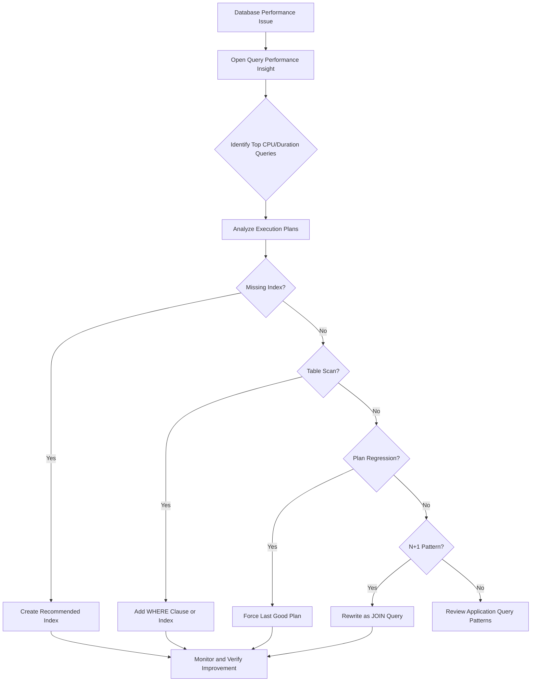

# How to Improve Azure SQL Database Performance with Query Performance Insight

Author: [nawazdhandala](https://www.github.com/nawazdhandala)

Tags: Azure, SQL Database, Query Performance, Database Optimization, Troubleshooting, Performance Tuning, Cloud

Description: Learn how to use Azure SQL Database Query Performance Insight to identify and fix slow queries that degrade application performance.

---

Slow database queries are the most common cause of application performance problems. Your app feels sluggish, response times spike, and users complain. The database metrics show high DTU or vCore usage, but you are not sure which queries are responsible.

Azure SQL Database has a built-in tool called Query Performance Insight that identifies the most resource-consuming queries so you can fix them. In this post, I will show you how to use it effectively and what to do once you have identified the problematic queries.

## What Is Query Performance Insight?

Query Performance Insight is a monitoring feature built into Azure SQL Database that combines Query Store data with visual analysis to show you:

- The top queries by CPU consumption, duration, and execution count
- Resource utilization trends over time
- Individual query execution plans
- Performance regression detection

It requires Query Store to be enabled (it is enabled by default on Azure SQL Database).

## Step 1: Access Query Performance Insight

Navigate to your Azure SQL Database in the portal, then go to **Intelligent Performance > Query Performance Insight**.

You can also check Query Store status from the CLI:

```bash
# Verify Query Store is enabled
az sql db show \
  --resource-group myResourceGroup \
  --server myserver \
  --name mydatabase \
  --query "currentServiceObjectiveName" \
  --output tsv
```

And query the database directly:

```sql
-- Check Query Store configuration
SELECT actual_state_desc, desired_state_desc,
       current_storage_size_mb, max_storage_size_mb,
       stale_query_threshold_days
FROM sys.database_query_store_options;
```

If Query Store shows `OFF`, enable it:

```sql
-- Enable Query Store with recommended settings
ALTER DATABASE [mydatabase]
SET QUERY_STORE = ON (
    OPERATION_MODE = READ_WRITE,
    MAX_STORAGE_SIZE_MB = 1000,
    INTERVAL_LENGTH_MINUTES = 60,
    CLEANUP_POLICY = (STALE_QUERY_THRESHOLD_DAYS = 30)
);
```

## Step 2: Identify the Top Resource-Consuming Queries

The Query Performance Insight dashboard shows the top 5 queries by default, but you can dig deeper with T-SQL:

```sql
-- Find the top 20 queries by average CPU time in the last 24 hours
SELECT TOP 20
    q.query_id,
    qt.query_sql_text,
    rs.avg_cpu_time / 1000.0 AS avg_cpu_ms,
    rs.avg_duration / 1000.0 AS avg_duration_ms,
    rs.count_executions,
    rs.avg_logical_io_reads,
    rs.avg_rowcount,
    -- Calculate total CPU impact
    (rs.avg_cpu_time / 1000.0) * rs.count_executions AS total_cpu_impact_ms
FROM sys.query_store_query q
JOIN sys.query_store_query_text qt ON q.query_text_id = qt.query_text_id
JOIN sys.query_store_plan p ON q.query_id = p.query_id
JOIN sys.query_store_runtime_stats rs ON p.plan_id = rs.plan_id
JOIN sys.query_store_runtime_stats_interval rsi ON rs.runtime_stats_interval_id = rsi.runtime_stats_interval_id
WHERE rsi.start_time > DATEADD(HOUR, -24, GETUTCDATE())
ORDER BY total_cpu_impact_ms DESC;
```

This query gives you the full picture: not just which queries are slow, but which ones consume the most total resources (average time multiplied by execution count). A query that takes 100ms but runs 100,000 times has more impact than a query that takes 10 seconds but runs once.

## Step 3: Analyze Query Execution Plans

Once you have identified a problematic query, look at its execution plan to understand why it is slow:

```sql
-- Get the execution plan for a specific query
-- Replace the query_id with the one from Step 2
SELECT
    p.plan_id,
    p.query_id,
    CAST(p.query_plan AS XML) AS execution_plan,
    p.is_forced_plan,
    rs.avg_cpu_time / 1000.0 AS avg_cpu_ms,
    rs.avg_duration / 1000.0 AS avg_duration_ms,
    rs.avg_logical_io_reads
FROM sys.query_store_plan p
JOIN sys.query_store_runtime_stats rs ON p.plan_id = rs.plan_id
JOIN sys.query_store_runtime_stats_interval rsi ON rs.runtime_stats_interval_id = rsi.runtime_stats_interval_id
WHERE p.query_id = 12345
  AND rsi.start_time > DATEADD(HOUR, -24, GETUTCDATE())
ORDER BY rs.avg_duration DESC;
```

Common execution plan problems:

- **Table scans**: The query reads every row in a table instead of using an index.
- **Key lookups**: The query finds rows via an index but then has to look up additional columns from the clustered index.
- **Hash/Merge joins on large tables**: Inefficient join strategies due to missing indexes.
- **Implicit conversions**: Data type mismatches force the engine to convert data on every row.
- **Large sorts/spills**: The query sorts more data than fits in memory, spilling to tempdb.

## Step 4: Fix Missing Indexes

The Query Store and execution plans often show missing index recommendations. Check for them:

```sql
-- Find missing index recommendations from Query Store
-- These are indexes that would improve query performance
SELECT
    mig.index_group_handle,
    mid.statement AS table_name,
    mid.equality_columns,
    mid.inequality_columns,
    mid.included_columns,
    migs.avg_total_user_cost * migs.avg_user_impact *
      (migs.user_seeks + migs.user_scans) AS improvement_measure,
    migs.user_seeks,
    migs.user_scans,
    migs.avg_total_user_cost,
    migs.avg_user_impact
FROM sys.dm_db_missing_index_groups mig
JOIN sys.dm_db_missing_index_group_stats migs ON mig.index_group_handle = migs.group_handle
JOIN sys.dm_db_missing_index_details mid ON mig.index_handle = mid.index_handle
ORDER BY improvement_measure DESC;
```

Create the recommended indexes:

```sql
-- Example: Create an index recommended by the missing index DMV
-- Always test in a non-production environment first
CREATE NONCLUSTERED INDEX IX_Orders_CustomerDate
ON dbo.Orders (CustomerId, OrderDate)
INCLUDE (TotalAmount, Status)
WITH (ONLINE = ON);  -- ONLINE = ON to avoid blocking queries during creation
```

After creating the index, monitor the query performance to verify improvement:

```sql
-- Compare query performance before and after index creation
-- Look at average duration for the specific query over time
SELECT
    rsi.start_time,
    rs.avg_duration / 1000.0 AS avg_duration_ms,
    rs.avg_cpu_time / 1000.0 AS avg_cpu_ms,
    rs.count_executions
FROM sys.query_store_runtime_stats rs
JOIN sys.query_store_runtime_stats_interval rsi ON rs.runtime_stats_interval_id = rsi.runtime_stats_interval_id
JOIN sys.query_store_plan p ON rs.plan_id = p.plan_id
WHERE p.query_id = 12345
ORDER BY rsi.start_time DESC;
```

## Step 5: Use Automatic Tuning

Azure SQL Database can automatically detect and fix some performance problems. Enable automatic tuning:

```sql
-- Enable all automatic tuning options
ALTER DATABASE [mydatabase]
SET AUTOMATIC_TUNING (
    CREATE_INDEX = ON,
    DROP_INDEX = ON,
    FORCE_LAST_GOOD_PLAN = ON
);
```

Or via CLI:

```bash
# Enable automatic tuning recommendations
az sql db update \
  --resource-group myResourceGroup \
  --server myserver \
  --name mydatabase \
  --set "automaticTuning.createIndex=On" \
  --set "automaticTuning.dropIndex=On" \
  --set "automaticTuning.forceLastGoodPlan=On"
```

The three automatic tuning options:

- **CREATE_INDEX**: Automatically creates indexes that the engine identifies as beneficial.
- **DROP_INDEX**: Removes duplicate and unused indexes that waste space and slow down writes.
- **FORCE_LAST_GOOD_PLAN**: If a query suddenly gets a worse execution plan (plan regression), forces the engine to use the previous good plan.

FORCE_LAST_GOOD_PLAN is particularly valuable. Plan regressions happen when statistics change and the optimizer picks a new plan that is worse than the old one. This feature catches those regressions automatically.

## Step 6: Optimize Specific Query Patterns

Here are fixes for the most common problematic query patterns:

### N+1 Query Pattern

The application runs one query to get a list, then runs N additional queries for each item:

```sql
-- Bad: N+1 pattern
-- First query: SELECT Id FROM Orders WHERE CustomerId = @id
-- Then for each order: SELECT * FROM OrderItems WHERE OrderId = @orderId

-- Fix: Use a single JOIN query
SELECT o.Id, o.OrderDate, oi.ProductName, oi.Quantity, oi.Price
FROM Orders o
JOIN OrderItems oi ON o.Id = oi.OrderId
WHERE o.CustomerId = @CustomerId;
```

### SELECT * Instead of Specific Columns

```sql
-- Bad: Returns all columns, wastes I/O
SELECT * FROM Orders WHERE Status = 'Active';

-- Fix: Select only the columns you need
-- This can use a covering index and avoid key lookups
SELECT OrderId, CustomerId, OrderDate, TotalAmount
FROM Orders WHERE Status = 'Active';
```

### Missing Parameterization

```sql
-- Bad: Different literal values create different query plans
-- This fills up the plan cache and prevents plan reuse
SELECT * FROM Products WHERE CategoryId = 5;
SELECT * FROM Products WHERE CategoryId = 12;

-- Fix: Use parameterized queries
SELECT * FROM Products WHERE CategoryId = @CategoryId;
```

## Step 7: Monitor DTU/vCore Usage Alongside Query Performance

High DTU or vCore usage is the symptom; bad queries are the disease. Correlate resource usage with query performance:

```bash
# Check DTU usage percentage over the last hour
az monitor metrics list \
  --resource "/subscriptions/<sub-id>/resourceGroups/myRG/providers/Microsoft.Sql/servers/myserver/databases/mydatabase" \
  --metric "dtu_consumption_percent" \
  --interval PT5M \
  --output table
```

If DTU usage is consistently above 80%, you need to either optimize queries or scale up the database. Always try query optimization first - scaling up costs money, query optimization is free.

## Performance Tuning Flowchart



## Summary

Azure SQL Database Query Performance Insight combined with Query Store gives you the data you need to find and fix slow queries. Start by identifying the top resource consumers, analyze their execution plans, create missing indexes, and enable automatic tuning for ongoing optimization. The most common fixes are adding indexes, rewriting N+1 queries as joins, and selecting only the columns you need. Always optimize queries before scaling up the database tier - it is cheaper and often more effective.
