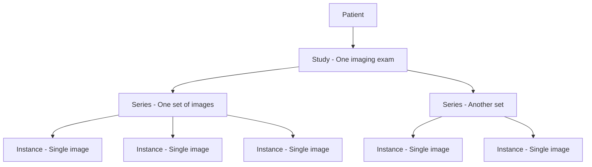

# How to Ingest and Query Medical Imaging Data Using the DICOM Service in Azure Health Data Services

Author: [nawazdhandala](https://www.github.com/nawazdhandala)

Tags: Azure Health Data Services, DICOM, Medical Imaging, Healthcare, Radiology, DICOMweb, Clinical Data

Description: Learn how to ingest, store, and query medical imaging data like X-rays and CT scans using the DICOM service in Azure Health Data Services.

---

Medical imaging is one of the most data-intensive areas of healthcare. A single CT scan can be hundreds of megabytes, and a busy radiology department might produce terabytes of imaging data every month. DICOM (Digital Imaging and Communications in Medicine) is the universal standard for medical imaging, and Azure Health Data Services includes a managed DICOM service that lets you store, query, and retrieve medical images through the DICOMweb standard API. This guide covers how to set up the service, upload imaging data, and build queries against it.

## What Is DICOM

DICOM is both a file format and a communication protocol used across the medical imaging industry. Every X-ray, MRI, CT scan, ultrasound, and other medical image is stored in DICOM format. A DICOM file contains both the image data (pixel data) and metadata (patient name, study date, modality, body part, imaging parameters, etc.).

DICOM data is organized hierarchically:



A patient has studies (imaging exams), each study contains series (groups of related images), and each series contains instances (individual images).

## Prerequisites

- An Azure Health Data Services workspace (see the FHIR deployment guide if you need to create one)
- Azure CLI installed
- A DICOM file for testing (you can download sample DICOM files from public datasets)
- Python 3.8+ with the `dicomweb-client` library (for the Python examples)

## Step 1: Create the DICOM Service

Within your Health Data Services workspace, create a DICOM service:

```bash
# Variables
RESOURCE_GROUP="rg-health-data"
WORKSPACE_NAME="healthworkspace01"
DICOM_SERVICE_NAME="dicom-radiology"

# Create the DICOM service
az healthcareapis dicom-service create \
    --name $DICOM_SERVICE_NAME \
    --workspace-name $WORKSPACE_NAME \
    --resource-group $RESOURCE_GROUP \
    --location eastus
```

The service URL will be:
`https://<workspace-name>-<dicom-service-name>.dicom.azurehealthcareapis.com`

## Step 2: Configure Authentication

Like the FHIR service, DICOM uses Azure AD authentication:

```bash
# Assign the DICOM Data Owner role to your application or user
DICOM_ID=$(az healthcareapis dicom-service show \
    --name $DICOM_SERVICE_NAME \
    --workspace-name $WORKSPACE_NAME \
    --resource-group $RESOURCE_GROUP \
    --query id -o tsv)

# For a service principal
az role assignment create \
    --role "DICOM Data Owner" \
    --assignee $APP_ID \
    --scope $DICOM_ID

# For an interactive user
USER_OBJECT_ID=$(az ad signed-in-user show --query id -o tsv)
az role assignment create \
    --role "DICOM Data Owner" \
    --assignee $USER_OBJECT_ID \
    --scope $DICOM_ID
```

## Step 3: Upload DICOM Images

The DICOM service implements the DICOMweb standard, specifically the STOW-RS (Store Over the Web) transaction for uploading images.

### Using curl

```bash
# Get an access token for the DICOM service
DICOM_URL="https://${WORKSPACE_NAME}-${DICOM_SERVICE_NAME}.dicom.azurehealthcareapis.com"
TENANT_ID=$(az account show --query tenantId -o tsv)

TOKEN=$(curl -s -X POST \
    "https://login.microsoftonline.com/${TENANT_ID}/oauth2/v2.0/token" \
    -d "grant_type=client_credentials" \
    -d "client_id=${APP_ID}" \
    -d "client_secret=${CLIENT_SECRET}" \
    -d "scope=${DICOM_URL}/.default" \
    | jq -r '.access_token')

# Upload a DICOM file using STOW-RS
# The file must be a valid .dcm file
curl -X POST \
    "${DICOM_URL}/v1/studies" \
    -H "Authorization: Bearer $TOKEN" \
    -H "Content-Type: application/dicom" \
    --data-binary @sample-xray.dcm
```

### Using Python

For batch uploads and more complex workflows, Python is more practical:

```python
# upload_dicom.py - Upload DICOM files to Azure Health Data Services
import os
import glob
from azure.identity import ClientSecretCredential
from dicomweb_client import DICOMwebClient
from dicomweb_client.session_utils import create_session_from_user

# Authentication setup
tenant_id = os.environ["AZURE_TENANT_ID"]
client_id = os.environ["AZURE_CLIENT_ID"]
client_secret = os.environ["AZURE_CLIENT_SECRET"]
dicom_url = os.environ["DICOM_SERVICE_URL"]

# Get an access token using Azure Identity
credential = ClientSecretCredential(
    tenant_id=tenant_id,
    client_id=client_id,
    client_secret=client_secret
)

token = credential.get_token(f"{dicom_url}/.default")

# Create a DICOMweb client session
from requests import Session
session = Session()
session.headers.update({
    "Authorization": f"Bearer {token.token}"
})

# Initialize the DICOMweb client
client = DICOMwebClient(
    url=f"{dicom_url}/v1",
    session=session
)

# Upload all DICOM files from a directory
dicom_files = glob.glob("/path/to/dicom/files/*.dcm")

for dcm_file in dicom_files:
    with open(dcm_file, "rb") as f:
        # Read the DICOM file as bytes
        dicom_data = f.read()

    # Store the instance using STOW-RS
    try:
        client.store_instances(datasets=[dicom_data])
        print(f"Uploaded: {dcm_file}")
    except Exception as e:
        print(f"Failed to upload {dcm_file}: {e}")

print(f"Upload complete. Processed {len(dicom_files)} files.")
```

## Step 4: Query DICOM Data

The DICOM service supports QIDO-RS (Query based on ID for DICOM Objects) for searching:

### Query Studies

```bash
# Search for all studies for a specific patient
curl -s -H "Authorization: Bearer $TOKEN" \
    "${DICOM_URL}/v1/studies?PatientName=Smith" | jq '.[].["00100010"]'

# Search studies by date range
curl -s -H "Authorization: Bearer $TOKEN" \
    "${DICOM_URL}/v1/studies?StudyDate=20260101-20260216" | jq length

# Search studies by modality (CT, MR, CR, etc.)
curl -s -H "Authorization: Bearer $TOKEN" \
    "${DICOM_URL}/v1/studies?ModalitiesInStudy=CT" | jq '.[].["0020000D"]'
```

### Query Series Within a Study

```bash
# Get all series for a specific study
STUDY_UID="1.2.840.113619.2.55.3.604688.123456789"

curl -s -H "Authorization: Bearer $TOKEN" \
    "${DICOM_URL}/v1/studies/${STUDY_UID}/series" \
    | jq '.[].["0008103E"]["Value"][0]'
```

### Query Instances Within a Series

```bash
# Get all instances (individual images) in a series
SERIES_UID="1.2.840.113619.2.55.3.604688.987654321"

curl -s -H "Authorization: Bearer $TOKEN" \
    "${DICOM_URL}/v1/studies/${STUDY_UID}/series/${SERIES_UID}/instances" \
    | jq length
```

## Step 5: Retrieve DICOM Images

WADO-RS (Web Access to DICOM Objects) is used to retrieve images:

```bash
# Retrieve an entire study (all series and instances)
curl -s -H "Authorization: Bearer $TOKEN" \
    -H "Accept: multipart/related; type=application/dicom" \
    "${DICOM_URL}/v1/studies/${STUDY_UID}" \
    --output study.dcm

# Retrieve a single instance
INSTANCE_UID="1.2.840.113619.2.55.3.604688.111222333"

curl -s -H "Authorization: Bearer $TOKEN" \
    -H "Accept: application/dicom" \
    "${DICOM_URL}/v1/studies/${STUDY_UID}/series/${SERIES_UID}/instances/${INSTANCE_UID}" \
    --output single-image.dcm

# Retrieve as rendered image (JPEG or PNG) for web display
curl -s -H "Authorization: Bearer $TOKEN" \
    -H "Accept: image/jpeg" \
    "${DICOM_URL}/v1/studies/${STUDY_UID}/series/${SERIES_UID}/instances/${INSTANCE_UID}/rendered" \
    --output image.jpg
```

The rendered endpoint is particularly useful for building web-based DICOM viewers. It converts the DICOM pixel data into standard image formats that browsers can display without a specialized DICOM viewer.

## Step 6: Working with Extended Query Tags

By default, the DICOM service indexes a standard set of DICOM tags for searching. If you need to search by custom or less common tags, you can add extended query tags:

```bash
# Add a custom query tag for Referring Physician Name (0008,0090)
curl -X POST \
    "${DICOM_URL}/v1/extendedquerytags" \
    -H "Authorization: Bearer $TOKEN" \
    -H "Content-Type: application/json" \
    -d '[{
        "path": "00080090",
        "vr": "PN",
        "level": "Study"
    }]'

# Check the indexing status of the new tag
curl -s -H "Authorization: Bearer $TOKEN" \
    "${DICOM_URL}/v1/extendedquerytags/00080090" | jq '.status'
```

After the tag is indexed (which reprocesses existing data), you can query by it:

```bash
# Search studies by referring physician
curl -s -H "Authorization: Bearer $TOKEN" \
    "${DICOM_URL}/v1/studies?ReferringPhysicianName=Johnson" | jq length
```

## Integration with FHIR

One of the powerful aspects of Azure Health Data Services is the ability to link DICOM imaging data with FHIR clinical data. You can create FHIR ImagingStudy resources that reference DICOM studies:

```json
{
    "resourceType": "ImagingStudy",
    "status": "available",
    "subject": {
        "reference": "Patient/patient-123"
    },
    "started": "2026-02-16T10:00:00Z",
    "endpoint": [{
        "reference": "Endpoint/dicom-endpoint"
    }],
    "series": [{
        "uid": "1.2.840.113619.2.55.3.604688.987654321",
        "modality": {
            "system": "http://dicom.nema.org/resources/ontology/DCM",
            "code": "CT"
        },
        "numberOfInstances": 150,
        "bodySite": {
            "system": "http://snomed.info/sct",
            "code": "51185008",
            "display": "Thorax"
        }
    }]
}
```

This lets clinicians search for a patient in the FHIR system and find links to their imaging studies, which can then be retrieved from the DICOM service for viewing.

## Performance and Storage Considerations

Medical imaging data is large. Here are some practical considerations:

- **Storage costs**: DICOM data is stored in Azure managed storage. A typical CT scan with 500 slices is about 250 MB. Plan your storage budget based on expected imaging volume.
- **Upload speed**: For bulk migrations from on-premises PACS (Picture Archiving and Communication Systems), use a dedicated network connection or Azure ExpressRoute. Uploading terabytes of imaging data over the public internet is slow.
- **Query performance**: The DICOM service is optimized for metadata queries. Image retrieval performance depends on image size and concurrent users.
- **Retention**: Configure data lifecycle policies based on your institution's retention requirements. Many jurisdictions require medical images to be retained for 7 to 10 years.

## Summary

The DICOM service in Azure Health Data Services provides a managed, standards-compliant platform for medical imaging data. You upload images using STOW-RS, query metadata using QIDO-RS, and retrieve images using WADO-RS - all standard DICOMweb operations. Combined with Azure AD authentication, private networking, and integration with the FHIR service, it forms a comprehensive platform for healthcare data management. Whether you are building a cloud-native radiology workflow or migrating from an on-premises PACS, the DICOM service handles the infrastructure complexity so you can focus on clinical applications.
