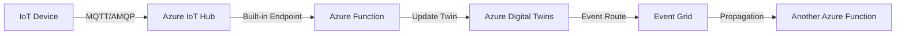

# How to Ingest Real-Time IoT Hub Telemetry into Azure Digital Twins Using Azure Functions

Author: [nawazdhandala](https://www.github.com/nawazdhandala)

Tags: Azure Digital Twins, IoT Hub, Azure Functions, Telemetry Ingestion, Real-Time Data, IoT Integration, Event Processing

Description: Step-by-step guide to building a real-time telemetry ingestion pipeline from Azure IoT Hub to Azure Digital Twins using Azure Functions.

---

Azure Digital Twins models the state of your physical environment, but it does not connect directly to IoT devices. The data bridge between physical devices and their digital representations is something you have to build. The most common pattern is an Azure Function triggered by IoT Hub events that updates the corresponding digital twin in Azure Digital Twins. This function reads the incoming telemetry, identifies which twin it belongs to, and applies the update.

This guide covers building this ingestion pipeline end to end, including handling different telemetry formats, mapping devices to twins, and making the pipeline robust enough for production.

## Architecture Overview

Here is the complete data flow from a physical device to its digital twin representation.



IoT Hub receives telemetry from devices. The built-in Event Hub-compatible endpoint triggers an Azure Function. The function parses the telemetry and updates the matching digital twin. From there, event routes in Azure Digital Twins can propagate changes further through the graph.

## Prerequisites

Before starting, you need:

- An Azure IoT Hub with registered devices sending telemetry
- An Azure Digital Twins instance with models and twins already created
- Azure Functions Core Tools installed locally for development
- Python 3.9+ or Node.js 18+ (we will use Python in this guide)

## Step 1: Create the Azure Function Project

Start by creating a new Functions project locally.

```bash
# Create the function project
func init iot-to-adt --python

cd iot-to-adt

# Create the function triggered by IoT Hub events
func new --name IngestTelemetry --template "Azure Event Hub trigger"
```

## Step 2: Configure the IoT Hub Connection

The function needs to read from IoT Hub's built-in Event Hub-compatible endpoint. Get the connection string from IoT Hub.

```bash
# Get the Event Hub-compatible endpoint
az iot hub connection-string show \
  --hub-name my-iot-hub \
  --default-eventhub \
  --query connectionString -o tsv
```

Add this to your `local.settings.json` for local development.

```json
{
  "IsEncrypted": false,
  "Values": {
    "AzureWebJobsStorage": "UseDevelopmentStorage=true",
    "FUNCTIONS_WORKER_RUNTIME": "python",
    "IoTHubConnectionString": "Endpoint=sb://ihsuprodbyres123.servicebus.windows.net/;SharedAccessKeyName=iothubowner;SharedAccessKey=...;EntityPath=my-iot-hub",
    "ADT_URL": "https://my-digital-twins.api.eus.digitaltwins.azure.net"
  }
}
```

## Step 3: Write the Ingestion Function

Here is the core function that bridges IoT Hub telemetry to Azure Digital Twins.

```python
# function_app.py - Ingest IoT Hub telemetry into Azure Digital Twins
import azure.functions as func
import json
import logging
import os
from azure.digitaltwins.core import DigitalTwinsClient
from azure.identity import DefaultAzureCredential

app = func.FunctionApp()

# Cache the Digital Twins client across invocations for performance
_adt_client = None

def get_adt_client():
    """Get or create a cached Digital Twins client."""
    global _adt_client
    if _adt_client is None:
        adt_url = os.environ["ADT_URL"]
        credential = DefaultAzureCredential()
        _adt_client = DigitalTwinsClient(adt_url, credential)
    return _adt_client


@app.function_name(name="IngestTelemetry")
@app.event_hub_message_trigger(
    arg_name="events",
    event_hub_name="my-iot-hub",
    connection="IoTHubConnectionString",
    cardinality="many",
    consumer_group="$Default"
)
def ingest_telemetry(events: list[func.EventHubEvent]):
    """Process a batch of IoT Hub telemetry messages and update digital twins."""
    client = get_adt_client()

    for event in events:
        try:
            # Extract the device ID from the IoT Hub system properties
            device_id = event.iothub_metadata.get("connection-device-id")
            if not device_id:
                logging.warning("Event missing device ID, skipping")
                continue

            # Parse the telemetry payload
            body = event.get_body().decode("utf-8")
            telemetry = json.loads(body)

            logging.info(f"Processing telemetry from device {device_id}: {body}")

            # Map the device ID to a twin ID
            # In simple cases, the twin ID matches the device ID
            # In complex cases, you might use a lookup table or naming convention
            twin_id = map_device_to_twin(device_id)

            # Build the update patch from the telemetry data
            patch = build_twin_patch(telemetry)

            if patch:
                # Update the digital twin
                client.update_digital_twin(twin_id, patch)
                logging.info(f"Updated twin {twin_id} with {len(patch)} operations")

                # Also publish the telemetry through the twin for event routing
                client.publish_telemetry(twin_id, telemetry)

        except Exception as e:
            # Log but don't throw - we don't want one bad message to block the batch
            logging.error(f"Failed to process event: {str(e)}")


def map_device_to_twin(device_id: str) -> str:
    """Map an IoT Hub device ID to a Digital Twins twin ID.

    In production, this might query a mapping table or use a naming convention.
    For this example, we use a simple prefix convention: device 'temp-sensor-01'
    maps to twin 'sensor-temp-sensor-01'.
    """
    # Simple mapping - device ID is the same as twin ID
    # Adjust this to match your naming convention
    return f"sensor-{device_id}"


def build_twin_patch(telemetry: dict) -> list:
    """Convert a telemetry payload into a JSON Patch for updating the twin.

    Only includes fields that are defined as properties on the twin model.
    Telemetry-only fields are published separately.
    """
    patch = []

    # Map telemetry fields to twin properties
    property_mappings = {
        "temperature": "/reading",
        "humidity": "/reading",
        "pressure": "/reading",
        "batteryVoltage": "/batteryLevel",
        "batteryLevel": "/batteryLevel"
    }

    for telemetry_field, twin_path in property_mappings.items():
        if telemetry_field in telemetry:
            patch.append({
                "op": "replace",
                "path": twin_path,
                "value": telemetry[telemetry_field]
            })

    return patch
```

## Step 4: Handle Different Telemetry Formats

Real IoT deployments often have devices sending telemetry in different formats. Some send flat JSON, others send nested payloads, and some batch multiple readings. Here is a more robust parser.

```python
def normalize_telemetry(raw_body: str, device_id: str) -> dict:
    """Normalize various telemetry formats into a standard structure.

    Handles:
    - Flat JSON: {"temperature": 22.5, "humidity": 65}
    - Nested JSON: {"sensors": {"temp": 22.5}, "meta": {"ts": "..."}}
    - Batched readings: [{"temperature": 22.5}, {"temperature": 23.1}]
    """
    data = json.loads(raw_body)

    # Handle batched readings - take the latest one
    if isinstance(data, list):
        if len(data) == 0:
            return {}
        data = data[-1]  # Use the most recent reading

    # Handle nested payloads from specific device types
    if "sensors" in data:
        # Flatten nested sensor data
        flat = {}
        for sensor_name, sensor_value in data["sensors"].items():
            if isinstance(sensor_value, dict):
                for key, value in sensor_value.items():
                    flat[f"{sensor_name}_{key}"] = value
            else:
                flat[sensor_name] = sensor_value
        return flat

    # Handle payload with metadata wrapper
    if "body" in data and "metadata" in data:
        return data["body"]

    # Default: return as-is
    return data
```

## Step 5: Device-to-Twin Mapping Strategies

The simplest mapping uses the device ID directly as the twin ID. But in practice, you often need more flexibility. Here are three approaches.

**Direct mapping** - The device ID is the twin ID. Simple but requires coordination between device provisioning and twin creation.

**Convention-based mapping** - Apply a transformation rule. For example, prepend a prefix or convert between naming schemes.

**Lookup-based mapping** - Maintain a mapping table in a database or in the twin graph itself as a property.

```python
# device_mapping.py - Different strategies for mapping devices to twins
import json

# Strategy 1: Direct mapping
def direct_mapping(device_id: str) -> str:
    return device_id

# Strategy 2: Convention-based mapping with a prefix
def convention_mapping(device_id: str) -> str:
    # Device 'temp-sensor-01' maps to twin 'sensor-temp-sensor-01'
    return f"sensor-{device_id}"

# Strategy 3: Lookup table (loaded from config or database)
DEVICE_TWIN_MAP = {
    "device-001": "sensor-temp-101",
    "device-002": "sensor-temp-201",
    "device-003": "sensor-hum-201",
}

def lookup_mapping(device_id: str) -> str:
    twin_id = DEVICE_TWIN_MAP.get(device_id)
    if not twin_id:
        raise ValueError(f"No twin mapping found for device {device_id}")
    return twin_id

# Strategy 4: Query the twin graph for the mapping
def graph_mapping(client, device_id: str) -> str:
    """Find the twin that has a matching IoT Hub device ID property."""
    query = f"SELECT T.$dtId FROM digitaltwins T WHERE T.iotDeviceId = '{device_id}'"
    results = list(client.query_twins(query))
    if results:
        return results[0]["$dtId"]
    raise ValueError(f"No twin found with iotDeviceId = {device_id}")
```

## Step 6: Deploy to Azure

Deploy the function and configure the managed identity for accessing Azure Digital Twins.

```bash
# Create the Function App with a system-assigned managed identity
az functionapp create \
  --name iot-to-adt-func \
  --resource-group digital-twins-rg \
  --storage-account iottoadtfuncstor \
  --consumption-plan-location eastus \
  --runtime python \
  --runtime-version 3.11 \
  --functions-version 4 \
  --assign-identity

# Get the managed identity principal ID
FUNC_PRINCIPAL=$(az functionapp identity show \
  --name iot-to-adt-func \
  --resource-group digital-twins-rg \
  --query principalId -o tsv)

# Grant the function access to Azure Digital Twins
az dt role-assignment create \
  --dt-name my-digital-twins \
  --assignee "$FUNC_PRINCIPAL" \
  --role "Azure Digital Twins Data Owner"

# Set the application settings
az functionapp config appsettings set \
  --name iot-to-adt-func \
  --resource-group digital-twins-rg \
  --settings \
    "IoTHubConnectionString=Endpoint=sb://..." \
    "ADT_URL=https://my-digital-twins.api.eus.digitaltwins.azure.net"

# Deploy the function code
func azure functionapp publish iot-to-adt-func
```

## Step 7: Monitoring and Troubleshooting

Once deployed, monitor the pipeline to make sure telemetry is flowing correctly.

```bash
# Check function invocation logs
az monitor app-insights query \
  --app iot-to-adt-func \
  --analytics-query "traces | where message contains 'Updated twin' | take 20"

# Check for errors
az monitor app-insights query \
  --app iot-to-adt-func \
  --analytics-query "exceptions | order by timestamp desc | take 10"
```

Common issues and their fixes:

**403 Forbidden when updating twins.** The function's managed identity does not have the "Azure Digital Twins Data Owner" role. Re-run the role assignment command.

**Twin not found errors.** The device-to-twin mapping is producing twin IDs that do not exist. Check your mapping logic and verify the twins are created.

**JSON Patch operation failed.** You are trying to set a property that does not exist on the twin model, or using "replace" on a property that was never set (use "add" for the first write).

**High latency.** If you are processing events individually instead of in batches, switch to `cardinality="many"` in the trigger configuration. Also consider using a dedicated consumer group instead of `$Default`.

## Performance Optimization

For high-throughput scenarios (thousands of devices sending telemetry every second), consider these optimizations:

- Use batch processing (`cardinality="many"`) to handle multiple events per function invocation
- Cache the Digital Twins client across invocations (as shown in the code above)
- Use a dedicated App Service Plan instead of Consumption plan for consistent performance
- Create a separate consumer group for the function to avoid contention with other readers
- Implement retry logic with exponential backoff for transient Azure Digital Twins API errors

## Wrapping Up

The Azure Function bridge between IoT Hub and Azure Digital Twins is a critical piece of any digital twin solution. It is conceptually simple - read telemetry, find the twin, update it - but the production details matter. Get the device-to-twin mapping right, handle telemetry format variations gracefully, monitor for errors, and tune the performance for your throughput requirements. Once this pipeline is running reliably, your digital twin graph becomes a live, up-to-date mirror of your physical environment, and that is when the real value of Azure Digital Twins starts to emerge.
