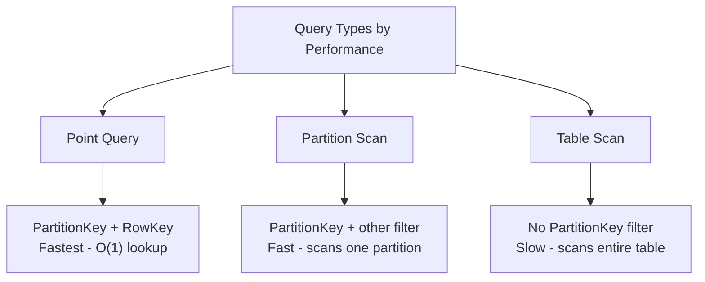

# How to Insert and Query Entities in Azure Table Storage

Author: [nawazdhandala](https://www.github.com/nawazdhandala)

Tags: Azure, Table Storage, NoSQL, Data Storage, Cloud Development, CRUD Operations

Description: A practical guide to inserting, querying, updating, and deleting entities in Azure Table Storage using Python and C# SDKs.

---

Azure Table Storage is a NoSQL key-value store that can hold massive amounts of structured data without the cost and complexity of a full database. It is well suited for storing things like user profiles, device telemetry, log data, and configuration settings. In this post, I will walk through the fundamentals of working with entities - inserting them, querying them, and the patterns that make Table Storage work well at scale.

## Understanding Table Storage Structure

Before writing any code, you need to understand how Table Storage organizes data. Every entity (think of it as a row) has three required properties:

- **PartitionKey**: A string that groups related entities. All entities with the same partition key are stored together and can be queried efficiently.
- **RowKey**: A string that uniquely identifies an entity within a partition. The combination of PartitionKey and RowKey forms the entity's primary key.
- **Timestamp**: Automatically managed by Azure, this records when the entity was last modified.

Beyond these, you can add up to 252 custom properties per entity. Properties can be strings, integers, floats, booleans, DateTimes, GUIDs, or binary data. Each entity can have up to 1 MB of data.

## Setting Up the Client

First, install the Azure Data Tables SDK. This is the newer SDK that replaces the older azure-cosmosdb-table package.

```bash
# Python
pip install azure-data-tables

# .NET
dotnet add package Azure.Data.Tables
```

Here is how to create a table client.

```python
from azure.data.tables import TableServiceClient, TableClient
import os

# Connect using the storage account connection string
connection_string = os.environ["AZURE_STORAGE_CONNECTION_STRING"]

# Create the table service client
service_client = TableServiceClient.from_connection_string(connection_string)

# Create a table if it does not already exist
table_client = service_client.create_table_if_not_exists("Employees")
```

## Inserting Entities

Inserting an entity is done with the create_entity method. The entity is just a dictionary in Python.

```python
# Define the entity as a dictionary
# PartitionKey and RowKey are required for every entity
employee = {
    "PartitionKey": "Engineering",
    "RowKey": "emp-001",
    "FirstName": "Sarah",
    "LastName": "Chen",
    "Email": "sarah.chen@example.com",
    "HireDate": "2023-03-15",
    "Salary": 95000,
    "IsActive": True
}

# Insert the entity into the table
table_client.create_entity(entity=employee)
print("Entity inserted successfully")
```

If an entity with the same PartitionKey and RowKey already exists, create_entity will raise a ResourceExistsError. If you want to insert or replace, use upsert_entity instead.

```python
# Upsert inserts the entity if it does not exist, or replaces it if it does
# This is useful when you do not want to check for existence first
table_client.upsert_entity(entity=employee)
```

## Inserting in .NET

The C# approach uses strongly typed models or TableEntity.

```csharp
using Azure.Data.Tables;

var tableClient = new TableClient(connectionString, "Employees");
await tableClient.CreateIfNotExistsAsync();

// Create an entity using TableEntity (dictionary-like)
var employee = new TableEntity("Engineering", "emp-001")
{
    { "FirstName", "Sarah" },
    { "LastName", "Chen" },
    { "Email", "sarah.chen@example.com" },
    { "Salary", 95000 },
    { "IsActive", true }
};

// Insert the entity
await tableClient.AddEntityAsync(employee);
```

## Querying Entities

Azure Table Storage supports several query patterns. The most efficient query specifies both PartitionKey and RowKey, which retrieves a single entity in constant time.

```python
# Point query - the fastest possible query
# Retrieves exactly one entity by its composite key
entity = table_client.get_entity(
    partition_key="Engineering",
    row_key="emp-001"
)

print(f"Name: {entity['FirstName']} {entity['LastName']}")
print(f"Email: {entity['Email']}")
```

## Querying with Filters

For broader queries, you can use OData-style filter expressions.

```python
# Query all employees in the Engineering department
# The filter targets the PartitionKey for efficient scanning
engineering_employees = table_client.query_entities(
    query_filter="PartitionKey eq 'Engineering'"
)

for emp in engineering_employees:
    print(f"{emp['FirstName']} {emp['LastName']} - {emp['Email']}")
```

You can combine filters with `and` and `or` operators.

```python
# Query active employees in Engineering with salary above 80000
filter_str = (
    "PartitionKey eq 'Engineering' "
    "and IsActive eq true "
    "and Salary gt 80000"
)

results = table_client.query_entities(query_filter=filter_str)

for emp in results:
    print(f"{emp['FirstName']} {emp['LastName']} - Salary: {emp['Salary']}")
```

## Selecting Specific Properties

If you only need certain fields, you can use the select parameter to reduce the data transferred.

```python
# Only retrieve name and email, reducing bandwidth usage
results = table_client.query_entities(
    query_filter="PartitionKey eq 'Engineering'",
    select=["FirstName", "LastName", "Email"]
)

for emp in results:
    print(f"{emp['FirstName']} {emp['LastName']} - {emp['Email']}")
```

## Updating Entities

There are two ways to update entities: merge and replace. A merge update only changes the properties you specify, leaving others intact. A replace update overwrites the entire entity.

```python
# Merge update - only changes the specified properties
# Other properties on the entity remain unchanged
update = {
    "PartitionKey": "Engineering",
    "RowKey": "emp-001",
    "Salary": 105000,
    "Title": "Senior Engineer"
}

table_client.update_entity(entity=update, mode="merge")

# Replace update - replaces the entire entity
# Any properties not included in this dictionary will be removed
full_entity = {
    "PartitionKey": "Engineering",
    "RowKey": "emp-001",
    "FirstName": "Sarah",
    "LastName": "Chen",
    "Email": "sarah.chen@example.com",
    "Salary": 105000,
    "Title": "Senior Engineer",
    "IsActive": True
}

table_client.update_entity(entity=full_entity, mode="replace")
```

## Deleting Entities

Deleting an entity requires the PartitionKey and RowKey.

```python
# Delete a specific entity
table_client.delete_entity(
    partition_key="Engineering",
    row_key="emp-001"
)
print("Entity deleted")
```

## Querying in .NET

```csharp
// Point query
var entity = await tableClient.GetEntityAsync<TableEntity>("Engineering", "emp-001");
Console.WriteLine($"Name: {entity.Value["FirstName"]} {entity.Value["LastName"]}");

// Filter query using LINQ-style expressions
var results = tableClient.QueryAsync<TableEntity>(
    filter: $"PartitionKey eq 'Engineering' and Salary gt 80000",
    select: new[] { "FirstName", "LastName", "Salary" }
);

await foreach (var emp in results)
{
    Console.WriteLine($"{emp["FirstName"]} {emp["LastName"]} - {emp["Salary"]}");
}
```

## Query Performance Considerations

The speed of your queries depends heavily on which properties you filter on.



Always include the PartitionKey in your filter when possible. A query without a PartitionKey filter results in a full table scan, which gets progressively slower as your table grows.

## Handling Continuation Tokens

Azure Table Storage returns results in pages. If your query matches more than 1,000 entities (or exceeds 4 MB of data), you will get a continuation token to fetch the next page. The Python SDK handles this transparently when you iterate over query results.

```python
# The SDK handles pagination automatically when you iterate
# Each page fetches up to 1000 entities from the server
all_employees = table_client.query_entities(
    query_filter="PartitionKey eq 'Engineering'"
)

count = 0
for emp in all_employees:
    count += 1
    # Process each entity

print(f"Total employees found: {count}")
```

If you need manual control over pagination, you can work with pages directly.

```python
# Manual pagination for more control over batching
pages = table_client.query_entities(
    query_filter="PartitionKey eq 'Engineering'"
).by_page()

for page in pages:
    entities = list(page)
    print(f"Page with {len(entities)} entities")
    for entity in entities:
        process_employee(entity)
```

## Best Practices

Choose your PartitionKey carefully. It determines query performance and scalability. Group entities that are frequently queried together under the same PartitionKey.

Use upsert_entity when you do not need strict insert-only behavior. It simplifies your code by removing the need for existence checks.

Select only the properties you need. Transferring less data means faster queries and lower costs.

Watch out for entity size limits. Each entity can be at most 1 MB, and each property value has its own size limits (64 KB for strings, for example).

Azure Table Storage is a solid choice when you need a simple, scalable, and cost-effective data store. Master the basics of inserting and querying entities, and you have a tool that can handle billions of records without breaking a sweat.
