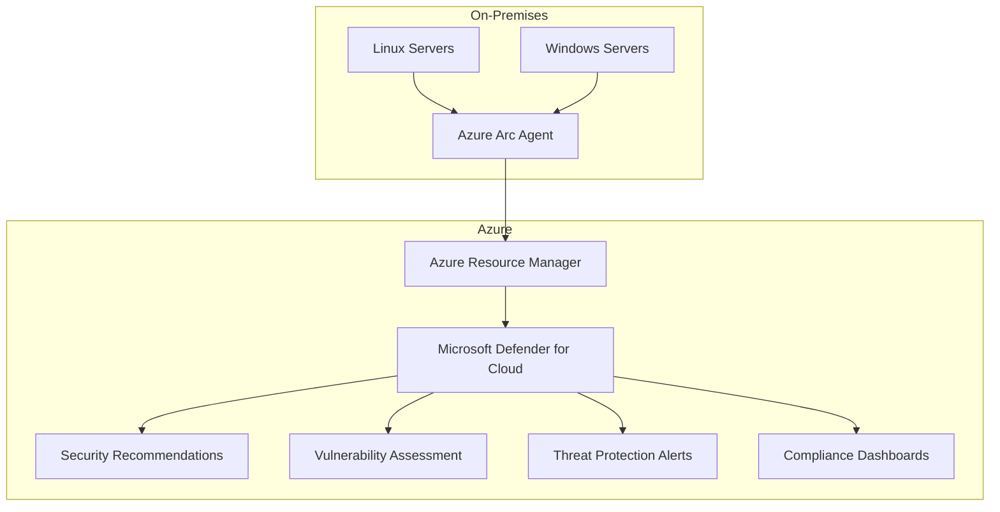

# How to Integrate Azure Arc-Enabled Servers with Microsoft Defender for Cloud

Author: [nawazdhandala](https://www.github.com/nawazdhandala)

Tags: Azure Arc, Microsoft Defender, Cloud Security, Hybrid Cloud, On-Premises, Security Monitoring, Azure Cloud

Description: Learn how to connect on-premises and multi-cloud servers to Microsoft Defender for Cloud using Azure Arc for unified security posture management and threat protection.

---

If you have servers running on-premises, in AWS, in GCP, or in a co-location facility, they exist outside Azure's native security tools. Microsoft Defender for Cloud can protect Azure resources out of the box, but your non-Azure servers are invisible to it. Azure Arc fixes this gap by projecting your external servers into Azure as managed resources, making them eligible for the same security features that Azure VMs enjoy.

Once your servers are Arc-enabled and connected to Defender for Cloud, you get vulnerability assessments, security recommendations, regulatory compliance checks, and threat protection - all from a single pane of glass regardless of where the servers physically run.

## What Azure Arc Does

Azure Arc installs a lightweight agent on your server that creates a representation of that server in Azure Resource Manager. The server gets an Azure resource ID, can be tagged, can be organized into resource groups, and can be targeted by Azure Policy - just like a native Azure VM.

This is the foundation that makes Defender for Cloud integration possible. Defender for Cloud works with Azure resources, and Arc makes your non-Azure servers appear as Azure resources.

## Step 1: Onboard Servers to Azure Arc

Install the Connected Machine Agent on each server you want to protect.

For a single Linux server:

```bash
# Download and install the Azure Connected Machine agent on Linux
wget https://aka.ms/azcmagent -O install_linux_azcmagent.sh
bash install_linux_azcmagent.sh

# Connect the server to Azure Arc
azcmagent connect \
  --resource-group "arc-servers-rg" \
  --tenant-id "<tenant-id>" \
  --location "eastus" \
  --subscription-id "<sub-id>" \
  --resource-name "$(hostname)" \
  --tags "Environment=Production,Department=Engineering,OS=Linux"
```

For a single Windows server:

```powershell
# Download and install the Azure Connected Machine agent on Windows
Invoke-WebRequest -Uri https://aka.ms/AzureConnectedMachineAgent -OutFile AzureConnectedMachineAgent.msi
msiexec /i AzureConnectedMachineAgent.msi /l*v installationlog.txt /qn

# Connect the server to Azure Arc
& "$env:ProgramFiles\AzureConnectedMachineAgent\azcmagent.exe" connect `
  --resource-group "arc-servers-rg" `
  --tenant-id "<tenant-id>" `
  --location "eastus" `
  --subscription-id "<sub-id>" `
  --resource-name $env:COMPUTERNAME `
  --tags "Environment=Production,Department=Engineering,OS=Windows"
```

For bulk onboarding hundreds of servers, use a service principal:

```bash
# Create a service principal for bulk onboarding
az ad sp create-for-rbac \
  --name "arc-onboarding-sp" \
  --role "Azure Connected Machine Onboarding" \
  --scopes "/subscriptions/<sub-id>/resourceGroups/arc-servers-rg"
```

Then use the service principal credentials in your deployment script:

```bash
# Bulk onboarding using service principal (no interactive login required)
azcmagent connect \
  --service-principal-id "<sp-app-id>" \
  --service-principal-secret "<sp-secret>" \
  --resource-group "arc-servers-rg" \
  --tenant-id "<tenant-id>" \
  --location "eastus" \
  --subscription-id "<sub-id>" \
  --resource-name "$(hostname)"
```

## Step 2: Enable Microsoft Defender for Cloud

Defender for Cloud has two tiers:

- **Free tier (Foundational CSPM)**: Basic security recommendations and Secure Score
- **Defender for Servers (Plan 1 or Plan 2)**: Advanced threat protection, vulnerability assessment, just-in-time VM access, adaptive application controls

For Arc-enabled servers, you need Defender for Servers enabled on the subscription:

```bash
# Enable Defender for Servers Plan 2 on the subscription
az security pricing create \
  --name VirtualMachines \
  --tier Standard \
  --subplan P2
```

You can also enable it through the portal:

1. Go to Microsoft Defender for Cloud
2. Click Environment settings
3. Select your subscription
4. Toggle "Servers" to On
5. Select Plan 2 for full capabilities
6. Save

## Step 3: Deploy the Defender for Cloud Extensions

Once Defender for Servers is enabled, deploy the necessary extensions to your Arc-enabled servers.

**Microsoft Defender for Endpoint (MDE)**: Provides endpoint detection and response (EDR):

```bash
# Deploy Microsoft Defender for Endpoint to an Arc-enabled Linux server
az connectedmachine extension create \
  --machine-name "my-linux-server" \
  --resource-group "arc-servers-rg" \
  --name "MDE.Linux" \
  --publisher "Microsoft.Azure.AzureDefenderForServers" \
  --type "MDE.Linux" \
  --location "eastus"
```

```bash
# Deploy to an Arc-enabled Windows server
az connectedmachine extension create \
  --machine-name "my-windows-server" \
  --resource-group "arc-servers-rg" \
  --name "MDE.Windows" \
  --publisher "Microsoft.Azure.AzureDefenderForServers" \
  --type "MDE.Windows" \
  --location "eastus"
```

**Log Analytics Agent or Azure Monitor Agent**: Required for security event collection:

```bash
# Deploy Azure Monitor Agent to Arc-enabled server
az connectedmachine extension create \
  --machine-name "my-linux-server" \
  --resource-group "arc-servers-rg" \
  --name "AzureMonitorLinuxAgent" \
  --publisher "Microsoft.Azure.Monitor" \
  --type "AzureMonitorLinuxAgent" \
  --location "eastus"
```

## Step 4: Use Azure Policy for Automated Deployment

Manually deploying extensions to each server does not scale. Use Azure Policy to automatically deploy Defender extensions to all Arc-enabled servers:

```bash
# Assign the built-in policy to auto-deploy MDE to Arc servers
az policy assignment create \
  --name "deploy-mde-arc-servers" \
  --display-name "Deploy Microsoft Defender for Endpoint to Arc servers" \
  --policy "4eb909e7-6d64-656d-6465-2eeb37a6f626" \
  --scope "/subscriptions/<sub-id>" \
  --mi-system-assigned \
  --location "eastus"
```

Azure Policy also provides initiatives (policy sets) that deploy all Defender-related extensions together:

1. Go to Azure Policy > Definitions
2. Search for "Deploy Microsoft Defender for Cloud" or "Configure Arc"
3. Select the initiative that matches your needs
4. Assign it to your subscription or management group

## Step 5: Review Security Recommendations

Once the extensions are deployed and data starts flowing, Defender for Cloud generates security recommendations for your Arc-enabled servers.

Go to Defender for Cloud > Recommendations to see:

- **OS vulnerabilities**: Missing patches, insecure configurations
- **Endpoint protection**: Whether antimalware is installed and up to date
- **Network security**: Open management ports, missing network segmentation
- **Data encryption**: Disk encryption status, TLS configuration
- **Authentication**: Weak password policies, missing MFA for administrative access

Each recommendation includes:

- Severity (High, Medium, Low)
- Affected resources
- Remediation steps
- Impact on Secure Score

## Step 6: Configure Vulnerability Assessment

Defender for Servers Plan 2 includes integrated vulnerability assessment powered by Qualys or Microsoft Defender Vulnerability Management (MDVM).

MDVM is deployed automatically with the MDE agent. It scans your servers for:

- Missing OS patches
- Vulnerable software versions
- Known CVEs in installed applications
- Insecure configurations

View vulnerability findings in Defender for Cloud > Recommendations > "Machines should have vulnerability findings resolved".

You can also query vulnerability data programmatically:

```bash
# Get vulnerability assessment results for Arc servers
az security sub-assessment list \
  --assessed-resource-type "ServerVulnerabilityAssessment" \
  --query "[?contains(resourceDetails.id, 'Microsoft.HybridCompute')].{Server:resourceDetails.id, CVE:id, Severity:status.severity, Description:displayName}" \
  --output table
```

## Step 7: Enable Just-in-Time VM Access

Just-in-Time (JIT) access reduces the attack surface by closing management ports (SSH, RDP) and only opening them temporarily when needed.

For Arc-enabled servers, JIT works through the Azure Arc agent:

```bash
# Enable JIT access policy for an Arc-enabled server
az security jit-policy create \
  --resource-group "arc-servers-rg" \
  --jit-network-access-policy-name "jit-arc-policy" \
  --virtual-machines '[{
    "id": "/subscriptions/<sub-id>/resourceGroups/arc-servers-rg/providers/Microsoft.HybridCompute/machines/my-linux-server",
    "ports": [
      {"number": 22, "protocol": "TCP", "allowedSourceAddressPrefix": "*", "maxRequestAccessDuration": "PT3H"},
      {"number": 3389, "protocol": "TCP", "allowedSourceAddressPrefix": "*", "maxRequestAccessDuration": "PT3H"}
    ]
  }]'
```

When an engineer needs SSH access, they request it through the portal or CLI. The port opens for the specified duration and then automatically closes.

## Step 8: Monitor Security Alerts

Defender for Cloud generates security alerts when it detects threats on your Arc-enabled servers. These include:

- Suspicious process execution
- Brute force attacks
- Fileless attacks detected in memory
- Communication with known malicious IPs
- Cryptomining activity
- Privilege escalation attempts

View alerts in Defender for Cloud > Security alerts:

```bash
# List recent security alerts for Arc-enabled servers
az security alert list \
  --query "[?contains(entities[0].resourceId, 'HybridCompute')].{Alert:alertDisplayName, Severity:severity, Time:startTimeUtc, Server:entities[0].hostName}" \
  --output table
```

Configure alert notifications through email, Logic App, or integration with your SIEM:

```bash
# Configure email notifications for security alerts
az security contact create \
  --name "default" \
  --email "security-team@company.com" \
  --alert-notifications "on" \
  --alerts-admins "on"
```

## Step 9: Compliance Monitoring

Defender for Cloud provides regulatory compliance dashboards for standards like CIS, NIST, PCI DSS, and ISO 27001. Arc-enabled servers are included in these assessments.

Go to Defender for Cloud > Regulatory compliance to see:

- Your compliance score per standard
- Which controls are passing or failing
- Which servers are non-compliant and why
- Recommended remediation actions

This is particularly valuable for hybrid environments where compliance auditors need to see a unified view across on-premises and cloud resources.

## Architecture Overview



## Troubleshooting

**Arc agent not connecting**: Check network connectivity from the server to Azure endpoints. The agent needs outbound HTTPS (443) access to `*.his.arc.azure.com`, `*.guestconfiguration.azure.com`, and `management.azure.com`.

**Extensions failing to install**: Verify the Arc agent is healthy with `azcmagent show`. Check extension logs in `/var/lib/GuestConfig/` (Linux) or `C:\ProgramData\GuestConfig\` (Windows).

**Recommendations not appearing**: It can take up to 24 hours for initial recommendations to appear. Verify that the Defender plan is enabled and the extensions are installed and reporting.

## Summary

Azure Arc combined with Microsoft Defender for Cloud extends enterprise-grade security monitoring to servers running anywhere. The onboarding process involves installing the Arc agent, enabling Defender for Servers, and deploying the required extensions. Once connected, your non-Azure servers benefit from the same vulnerability assessments, threat detection, JIT access controls, and compliance monitoring that native Azure VMs receive. Use Azure Policy to automate the deployment across your server fleet and maintain consistent security coverage.
