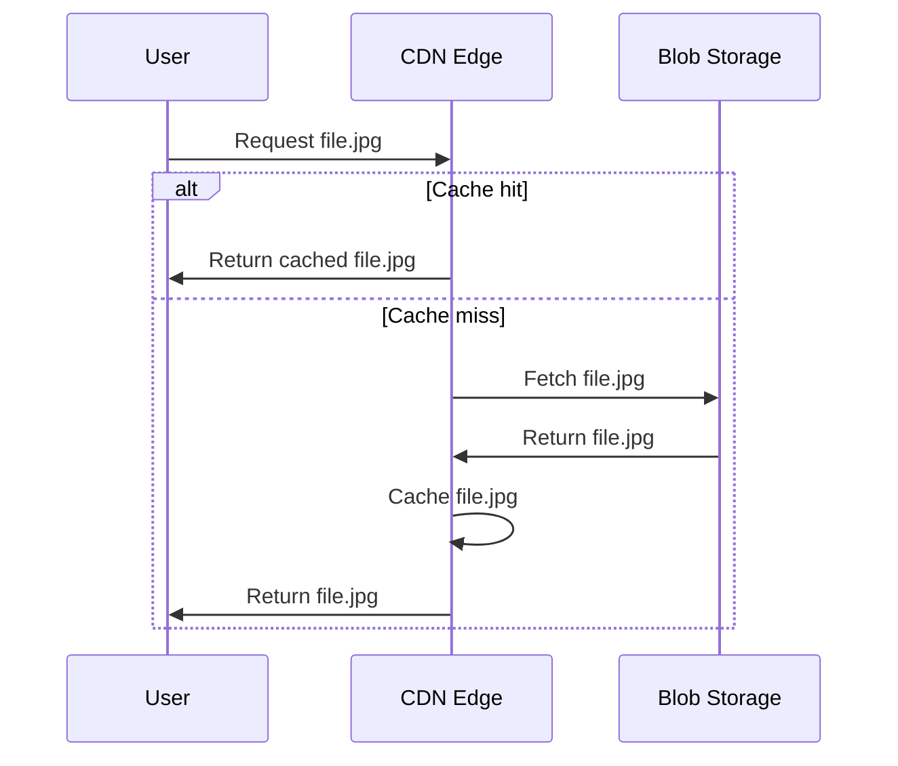

# How to Integrate Azure CDN with Azure Blob Storage for Faster Content Delivery

Author: [nawazdhandala](https://www.github.com/nawazdhandala)

Tags: Azure, CDN, Blob Storage, Content Delivery, Performance, Azure Storage, Caching

Description: Learn how to set up Azure CDN in front of Azure Blob Storage to cache and deliver content from edge locations around the world for faster load times.

---

Serving files directly from Azure Blob Storage works fine when your users are close to the storage account's region. But when someone in Tokyo requests an image stored in East US, the round trip adds noticeable latency. Azure CDN solves this by caching your content at edge locations worldwide, so users get served from the nearest point of presence instead of traveling across the globe.

Setting up Azure CDN with Blob Storage is straightforward, but there are several configuration details that make the difference between a well-optimized setup and a frustrating one. Let me walk through the full process.

## How Azure CDN Works with Blob Storage

The flow is simple:



The first request for a file goes through to your Blob Storage origin. After that, the CDN edge caches the file and serves it directly for subsequent requests. The cache duration depends on the TTL (Time to Live) settings you configure.

## Azure CDN Tiers

Azure offers several CDN tiers, each with different features and pricing:

- **Azure CDN Standard from Microsoft** - Basic CDN features, no rules engine, good for simple use cases.
- **Azure CDN Standard from Akamai** - Akamai's network with basic feature set.
- **Azure CDN Standard from Verizon** - Verizon's network with basic features.
- **Azure CDN Premium from Verizon** - Advanced rules engine, real-time analytics, token authentication.
- **Azure Front Door Standard/Premium** - The newer product that combines CDN with load balancing and WAF.

For most Blob Storage integration scenarios, Azure CDN Standard from Microsoft or Azure Front Door Standard works well.

## Creating the CDN Profile and Endpoint

### Using Azure CLI

First, create a CDN profile, which is a container for one or more CDN endpoints:

```bash
# Create a CDN profile with Microsoft's Standard tier
az cdn profile create \
  --name mycdnprofile \
  --resource-group myresourcegroup \
  --sku Standard_Microsoft \
  --location global
```

Then create an endpoint that points to your Blob Storage account:

```bash
# Create a CDN endpoint with Blob Storage as the origin
az cdn endpoint create \
  --name mycdnendpoint \
  --profile-name mycdnprofile \
  --resource-group myresourcegroup \
  --origin mystorageaccount.blob.core.windows.net \
  --origin-host-header mystorageaccount.blob.core.windows.net \
  --enable-compression true \
  --query-string-caching-behavior IgnoreQueryString
```

The `--origin-host-header` is important. Without it, Azure CDN sends requests to Blob Storage with the CDN endpoint hostname in the Host header, which Blob Storage does not recognize. Setting it to the storage account hostname ensures proper routing.

After creation, your CDN endpoint URL will be something like `https://mycdnendpoint.azureedge.net/`. It takes about 10 minutes for the endpoint to propagate to all edge locations.

### Using Bicep

```bicep
// Create a CDN profile and endpoint pointing to Blob Storage
resource cdnProfile 'Microsoft.Cdn/profiles@2023-05-01' = {
  name: 'mycdnprofile'
  location: 'global'
  sku: {
    name: 'Standard_Microsoft'
  }
}

resource cdnEndpoint 'Microsoft.Cdn/profiles/endpoints@2023-05-01' = {
  parent: cdnProfile
  name: 'mycdnendpoint'
  location: 'global'
  properties: {
    originHostHeader: 'mystorageaccount.blob.core.windows.net'
    isCompressionEnabled: true
    contentTypesToCompress: [
      'text/html'
      'text/css'
      'application/javascript'
      'application/json'
      'image/svg+xml'
    ]
    origins: [
      {
        name: 'blob-origin'
        properties: {
          hostName: 'mystorageaccount.blob.core.windows.net'
        }
      }
    ]
  }
}
```

## Configuring Compression

CDN compression can significantly reduce transfer sizes for text-based content. Enable it and specify which content types to compress:

```bash
# Update the endpoint to enable compression for common content types
az cdn endpoint update \
  --name mycdnendpoint \
  --profile-name mycdnprofile \
  --resource-group myresourcegroup \
  --enable-compression true \
  --content-types-to-compress \
    "text/html" \
    "text/css" \
    "application/javascript" \
    "application/json" \
    "image/svg+xml" \
    "text/plain" \
    "text/xml" \
    "application/xml"
```

Do not compress already-compressed formats like JPEG, PNG, or ZIP. It wastes CPU cycles and can sometimes make the files larger.

## Cache Rules and TTL

By default, Azure CDN respects the `Cache-Control` and `Expires` headers that your Blob Storage origin sends. If your blobs do not have these headers set, CDN uses default caching behavior.

You can set cache headers on your blobs when uploading:

```bash
# Upload a file with a long cache duration (for hashed/versioned assets)
az storage blob upload \
  --account-name mystorageaccount \
  --container-name images \
  --file ./logo.png \
  --name logo.v2.png \
  --content-cache-control "public, max-age=2592000"
```

You can also override cache behavior at the CDN level using caching rules:

```bash
# Set a global caching rule to cache everything for 7 days
az cdn endpoint rule add \
  --name mycdnendpoint \
  --profile-name mycdnprofile \
  --resource-group myresourcegroup \
  --order 1 \
  --rule-name "CacheOverride" \
  --match-variable RequestUri \
  --operator Contains \
  --match-values "/" \
  --action-name CacheExpiration \
  --cache-behavior Override \
  --cache-duration "7.00:00:00"
```

## Custom Domain and HTTPS

Using a custom domain with Azure CDN involves two steps: DNS configuration and HTTPS certificate setup.

### DNS Setup

Create a CNAME record in your DNS provider:

```
cdn.example.com  CNAME  mycdnendpoint.azureedge.net
```

### Configure the Custom Domain

```bash
# Add a custom domain to the CDN endpoint
az cdn custom-domain create \
  --name cdn-example-com \
  --endpoint-name mycdnendpoint \
  --profile-name mycdnprofile \
  --resource-group myresourcegroup \
  --hostname cdn.example.com
```

### Enable HTTPS

```bash
# Enable managed HTTPS certificate for the custom domain
az cdn custom-domain enable-https \
  --name cdn-example-com \
  --endpoint-name mycdnendpoint \
  --profile-name mycdnprofile \
  --resource-group myresourcegroup \
  --min-tls-version 1.2
```

Azure will provision and manage a free TLS certificate. This process takes several hours to complete.

## Purging the CDN Cache

When you update content in Blob Storage, the CDN continues serving the cached version until the TTL expires. To force an immediate update, purge the cache:

```bash
# Purge all cached content
az cdn endpoint purge \
  --name mycdnendpoint \
  --profile-name mycdnprofile \
  --resource-group myresourcegroup \
  --content-paths "/*"
```

For targeted purges when you update specific files:

```bash
# Purge specific paths only
az cdn endpoint purge \
  --name mycdnendpoint \
  --profile-name mycdnprofile \
  --resource-group myresourcegroup \
  --content-paths "/images/logo.png" "/css/style.css"
```

Purges can take a few minutes to propagate across all edge locations. Do not rely on instant purges for time-sensitive content updates.

## Query String Behavior

How the CDN handles query strings affects caching efficiency:

- **IgnoreQueryString** - All requests for the same path share the same cache entry regardless of query string. Best for static content.
- **BypassCaching** - Requests with query strings always go to the origin. Useful for dynamic content.
- **UseQueryString** - Each unique query string gets its own cache entry. Useful for cache-busting with version parameters.

```bash
# Set query string caching behavior
az cdn endpoint update \
  --name mycdnendpoint \
  --profile-name mycdnprofile \
  --resource-group myresourcegroup \
  --query-string-caching-behavior IgnoreQueryString
```

For static sites with cache-busting query parameters (like `style.css?v=123`), use `UseQueryString` so each version is cached separately.

## Restricting Direct Blob Storage Access

Once CDN is set up, you may want to ensure users can only access content through the CDN, not directly from Blob Storage. You can do this by restricting the Blob Storage firewall to only allow CDN IP ranges, or by using a private origin with Azure Front Door.

A simpler approach is to use SAS tokens on the origin that only the CDN knows about, but this adds complexity to token management.

## Monitoring and Analytics

Azure CDN provides metrics through Azure Monitor:

- **Byte hit ratio** - Percentage of requests served from cache. Higher is better.
- **Request count** - Total number of requests to the CDN edge.
- **Response size** - Total data transferred.
- **Latency** - Time to first byte from the edge.

```bash
# View CDN endpoint metrics
az monitor metrics list \
  --resource "/subscriptions/{sub-id}/resourceGroups/myresourcegroup/providers/Microsoft.Cdn/profiles/mycdnprofile/endpoints/mycdnendpoint" \
  --metric "ByteHitRatio" \
  --interval PT1H
```

A low byte hit ratio usually means your TTL settings are too short or your content is too dynamic for CDN caching.

## Wrapping Up

Azure CDN in front of Blob Storage is one of the simplest performance improvements you can make for content-heavy applications. The setup takes 15 minutes, the cost is reasonable, and your users worldwide get faster load times. Focus on getting your cache headers right, enable compression for text-based content, and set up monitoring to make sure your cache hit ratio stays healthy.
