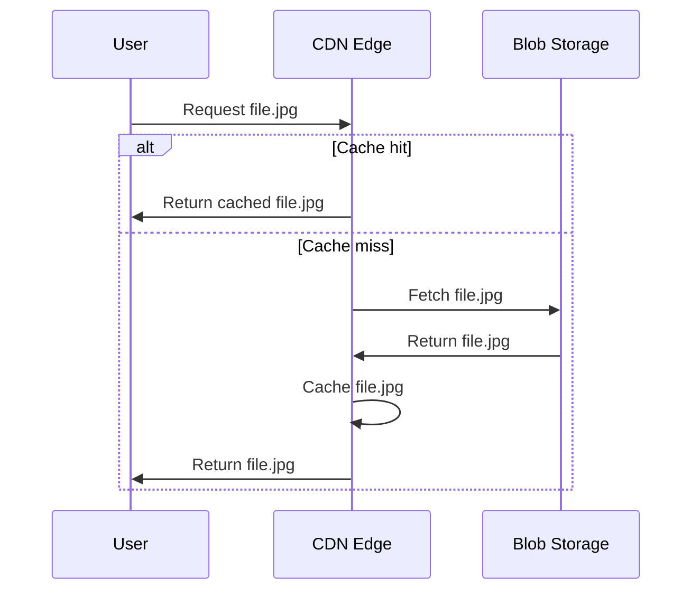

# How to Integrate Azure CDN with Azure Blob Storage for Faster Content Delivery

Author: [nawazdhandala](https://www.github.com/nawazdhandala)

Tags: Azure, CDN, Blob Storage, Content Delivery, Performance, Azure Storage, Caching

Description: Learn how to set up Azure CDN in front of Azure Blob Storage to cache and deliver content from edge locations around the world for faster load times.

---

Serving files directly from Azure Blob Storage works fine when your users are close to the storage account's region. But when someone in Tokyo requests an image stored in East US, the round trip adds noticeable latency. A CDN solves this by caching your content at edge locations worldwide, so users get served from the nearest point of presence instead of traveling across the globe.

Setting up Azure CDN with Blob Storage is straightforward for existing Azure CDN Standard from Microsoft (classic) profiles, but there are several configuration details that make the difference between a well-optimized setup and a frustrating one. As of 2026, new deployments should use Azure Front Door Standard or Premium instead: Azure CDN Standard from Microsoft (classic) no longer supports new profile or domain creation and is scheduled to retire on September 30, 2027. Let me walk through the full process for classic Azure CDN profiles that are still being maintained.

## How Azure CDN Works with Blob Storage

The flow is simple:


```mermaid
sequenceDiagram
    participant User
    participant CDN Edge
    participant Blob Storage
    User->>CDN Edge: Request file.jpg
    alt Cache hit
        CDN Edge->>User: Return cached file.jpg
    else Cache miss
        CDN Edge->>Blob Storage: Fetch file.jpg
        Blob Storage->>CDN Edge: Return file.jpg
        CDN Edge->>CDN Edge: Cache file.jpg
        CDN Edge->>User: Return file.jpg
    end
```

The first request for a file goes through to your Blob Storage origin. After that, the CDN edge caches the file and serves it directly for subsequent requests. The cache duration depends on the TTL (Time to Live) settings you configure.

## Azure CDN Tiers

Azure has changed its CDN lineup over time, so the current choices matter:

- **Azure CDN Standard from Microsoft (classic)** - Existing profiles can still serve traffic, and the SKU supports the standard rules engine, but new profile and domain creation is no longer supported and the service retires on September 30, 2027.
- **Azure CDN from Akamai** - Retired in 2023.
- **Azure CDN Standard/Premium from Verizon/Edgio** - Retired on January 15, 2025.
- **Azure Front Door Standard/Premium** - The current Microsoft CDN platform for new deployments, combining CDN, global load balancing, rules, and optional WAF features.

For most new Blob Storage integration scenarios, Azure Front Door Standard works well. Use the Azure CDN commands below only when you are maintaining an existing Azure CDN Standard from Microsoft (classic) profile.

## Creating the CDN Profile and Endpoint

### Using Azure CLI

First, confirm that you have an existing CDN profile, which is a container for one or more CDN endpoints:

```bash
# Show an existing Azure CDN Standard from Microsoft (classic) profile
az cdn profile show \
  --name mycdnprofile \
  --resource-group myresourcegroup
```

Then create an endpoint that points to your Blob Storage account if your existing classic profile still allows endpoint changes:

```bash
# Create a CDN endpoint with Blob Storage as the origin
az cdn endpoint create \
  --name mycdnendpoint \
  --profile-name mycdnprofile \
  --resource-group myresourcegroup \
  --origin mystorageaccount.blob.core.windows.net \
  --origin-host-header mystorageaccount.blob.core.windows.net \
  --enable-compression true \
  --query-string-caching-behavior IgnoreQueryString
```

The `--origin-host-header` is important. Without it, Azure CDN sends requests to Blob Storage with the CDN endpoint hostname in the Host header, which Blob Storage does not recognize. Setting it to the storage account hostname ensures proper routing.

After creation, your CDN endpoint URL will be something like `https://mycdnendpoint.azureedge.net/`. It takes about 10 minutes for the endpoint to propagate to all edge locations.

### Using Bicep

```bicep
// Reference an existing Azure CDN Standard from Microsoft (classic) profile
resource cdnProfile 'Microsoft.Cdn/profiles@2023-05-01' existing = {
  name: 'mycdnprofile'
}

resource cdnEndpoint 'Microsoft.Cdn/profiles/endpoints@2023-05-01' = {
  parent: cdnProfile
  name: 'mycdnendpoint'
  location: 'global'
  properties: {
    originHostHeader: 'mystorageaccount.blob.core.windows.net'
    isCompressionEnabled: true
    contentTypesToCompress: [
      'text/html'
      'text/css'
      'application/javascript'
      'application/json'
      'image/svg+xml'
    ]
    origins: [
      {
        name: 'blob-origin'
        properties: {
          hostName: 'mystorageaccount.blob.core.windows.net'
        }
      }
    ]
  }
}
```

## Configuring Compression

CDN compression can significantly reduce transfer sizes for text-based content. Enable it and specify which content types to compress:

```bash
# Update the endpoint to enable compression for common content types
az cdn endpoint update \
  --name mycdnendpoint \
  --profile-name mycdnprofile \
  --resource-group myresourcegroup \
  --enable-compression true \
  --content-types-to-compress \
    "text/html" \
    "text/css" \
    "application/javascript" \
    "application/json" \
    "image/svg+xml" \
    "text/plain" \
    "text/xml" \
    "application/xml"
```

Do not compress already-compressed formats like JPEG, PNG, or ZIP. It wastes CPU cycles and can sometimes make the files larger.

## Cache Rules and TTL

By default, Azure CDN respects the `Cache-Control` and `Expires` headers that your Blob Storage origin sends. If your blobs do not have these headers set, CDN uses default caching behavior.

You can set cache headers on your blobs when uploading:

```bash
# Upload a file with a long cache duration (for hashed/versioned assets)
az storage blob upload \
  --account-name mystorageaccount \
  --container-name images \
  --file ./logo.png \
  --name logo.v2.png \
  --content-cache-control "public, max-age=2592000"
```

You can also override cache behavior at the CDN level using caching rules:

```bash
# Set a global caching rule to cache everything for 7 days
az cdn endpoint rule add \
  --name mycdnendpoint \
  --profile-name mycdnprofile \
  --resource-group myresourcegroup \
  --order 1 \
  --rule-name "CacheOverride" \
  --match-variable RequestUri \
  --operator Contains \
  --match-values "/" \
  --action-name CacheExpiration \
  --cache-behavior Override \
  --cache-duration "7.00:00:00"
```

## Custom Domain and HTTPS

Using a custom domain with Azure CDN involves two steps: DNS configuration and HTTPS certificate setup. For Azure CDN Standard from Microsoft (classic), new custom domain onboarding is no longer supported. For existing custom domains, Azure-managed certificates are also no longer supported, so use a certificate from Key Vault or migrate to Azure Front Door Standard/Premium.

### DNS Setup

Create a CNAME record in your DNS provider:

```text
cdn.example.com  CNAME  mycdnendpoint.azureedge.net
```

### Check the Custom Domain

```bash
# Show an existing custom domain on the CDN endpoint
az cdn custom-domain show \
  --name cdn-example-com \
  --endpoint-name mycdnendpoint \
  --profile-name mycdnprofile \
  --resource-group myresourcegroup
```

### Enable HTTPS

```bash
# Enable HTTPS with a customer-managed certificate from Key Vault
az cdn custom-domain enable-https \
  --name cdn-example-com \
  --endpoint-name mycdnendpoint \
  --profile-name mycdnprofile \
  --resource-group myresourcegroup \
  --user-cert-vault-name mykeyvault \
  --user-cert-group-name myresourcegroup \
  --user-cert-secret-name cdn-example-com \
  --user-cert-secret-version <secret-version> \
  --user-cert-subscription-id <subscription-id> \
  --user-cert-protocol-type sni \
  --min-tls-version 1.2
```

Certificate deployment can take several hours to complete.

## Purging the CDN Cache

When you update content in Blob Storage, the CDN continues serving the cached version until the TTL expires. To force an immediate update, purge the cache:

```bash
# Purge all cached content
az cdn endpoint purge \
  --name mycdnendpoint \
  --profile-name mycdnprofile \
  --resource-group myresourcegroup \
  --content-paths "/*"
```

For targeted purges when you update specific files:

```bash
# Purge specific paths only
az cdn endpoint purge \
  --name mycdnendpoint \
  --profile-name mycdnprofile \
  --resource-group myresourcegroup \
  --content-paths "/images/logo.png" "/css/style.css"
```

Purges can take a few minutes to propagate across all edge locations. Do not rely on instant purges for time-sensitive content updates.

## Query String Behavior

How the CDN handles query strings affects caching efficiency:

- **IgnoreQueryString** - All requests for the same path share the same cache entry regardless of query string. Best for static content.
- **BypassCaching** - Requests with query strings always go to the origin. Useful for dynamic content.
- **UseQueryString** - Each unique query string gets its own cache entry. Useful for cache-busting with version parameters.

```bash
# Set query string caching behavior
az cdn endpoint update \
  --name mycdnendpoint \
  --profile-name mycdnprofile \
  --resource-group myresourcegroup \
  --query-string-caching-behavior IgnoreQueryString
```

For static sites with cache-busting query parameters (like `style.css?v=123`), use `UseQueryString` so each version is cached separately.

## Restricting Direct Blob Storage Access

Once CDN is set up, you may want to ensure users can only access content through the CDN, not directly from Blob Storage. For new deployments, Azure Front Door Premium with Private Link is the cleaner approach because the origin can stay private.

With classic Azure CDN and Blob Storage, direct-origin restriction is harder. Storage firewall rules based on CDN address ranges are operationally brittle, and SAS tokens are usually client-facing signed URLs rather than an origin secret that Azure CDN Standard from Microsoft can automatically append for every origin request.

## Monitoring and Analytics

Azure CDN provides metrics through Azure Monitor:

- **Byte hit ratio** - Percentage of requests served from cache. Higher is better.
- **Request count** - Total number of requests to the CDN edge.
- **Response size** - Total data transferred.
- **Latency** - Time to first byte from the edge.

```bash
# View CDN endpoint metrics
az monitor metrics list \
  --resource "/subscriptions/{sub-id}/resourceGroups/myresourcegroup/providers/Microsoft.Cdn/profiles/mycdnprofile/endpoints/mycdnendpoint" \
  --metric "ByteHitRatio" \
  --interval PT1H
```

A low byte hit ratio usually means your TTL settings are too short or your content is too dynamic for CDN caching.

## Wrapping Up

For existing classic profiles, Azure CDN in front of Blob Storage is still a useful performance improvement for content-heavy applications. For new deployments, use Azure Front Door Standard or Premium instead. In either case, focus on getting your cache headers right, enable compression for text-based content, and set up monitoring to make sure your cache hit ratio stays healthy.
