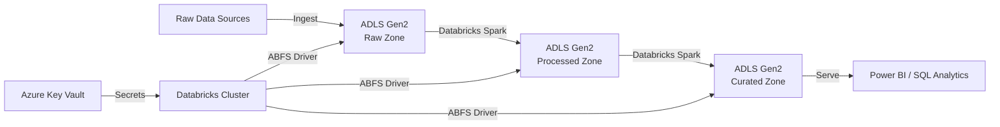

# How to Integrate Azure Data Lake Storage Gen2 with Azure Databricks

Author: [nawazdhandala](https://www.github.com/nawazdhandala)

Tags: Azure, Data Lake Storage, Databricks, Big Data, Spark, Gen2, Data Engineering

Description: Learn how to connect Azure Databricks to Azure Data Lake Storage Gen2 for scalable data processing using service principals and direct access.

---

Azure Databricks and Azure Data Lake Storage Gen2 are a natural pairing for big data workloads. Databricks provides the compute engine (Apache Spark), and ADLS Gen2 provides the scalable storage layer. Getting them connected properly involves configuring authentication, mounting storage, and setting up access patterns that work for both interactive notebooks and production pipelines. Let me walk through the setup from start to finish.

## Authentication Options

There are several ways Databricks can authenticate to ADLS Gen2.

**Service Principal with OAuth 2.0** is the recommended approach for production. You create an Azure AD application, give it access to the storage account, and configure Databricks to use its credentials.

**Account Key** is the simplest method but the least secure. The account key gives full access to everything in the storage account.

**Azure AD Passthrough** uses the identity of the user running the notebook. Good for interactive exploration, but not suitable for scheduled jobs.

**Managed Identity** is available when Databricks is deployed with a system-assigned managed identity. This avoids managing credentials entirely.

## Setting Up a Service Principal

First, create a service principal in Azure AD.

```bash
# Create an Azure AD app registration
az ad app create --display-name "databricks-adls-access"

# Note the application (client) ID from the output
# Create a service principal for the app
az ad sp create --id <application-id>

# Create a client secret
az ad app credential reset \
  --id <application-id> \
  --append \
  --display-name "databricks-secret"
```

Then grant the service principal access to your ADLS Gen2 account.

```bash
# Assign "Storage Blob Data Contributor" role to the service principal
# This allows read, write, and delete operations on blobs
az role assignment create \
  --assignee <service-principal-object-id> \
  --role "Storage Blob Data Contributor" \
  --scope "/subscriptions/<sub-id>/resourceGroups/<rg>/providers/Microsoft.Storage/storageAccounts/<account-name>"
```

## Configuring Direct Access in Databricks

The most flexible approach is configuring Spark to access ADLS Gen2 directly using the ABFS (Azure Blob File System) driver.

```python
# Configure Spark to use the service principal for ADLS Gen2 access
# These settings go in your notebook or cluster configuration
storage_account = "mydatalakeaccount"
client_id = dbutils.secrets.get(scope="adls-secrets", key="client-id")
client_secret = dbutils.secrets.get(scope="adls-secrets", key="client-secret")
tenant_id = dbutils.secrets.get(scope="adls-secrets", key="tenant-id")

# Set the Spark configuration for OAuth authentication
spark.conf.set(
    f"fs.azure.account.auth.type.{storage_account}.dfs.core.windows.net",
    "OAuth"
)
spark.conf.set(
    f"fs.azure.account.oauth.provider.type.{storage_account}.dfs.core.windows.net",
    "org.apache.hadoop.fs.azurebfs.oauth2.ClientCredsTokenProvider"
)
spark.conf.set(
    f"fs.azure.account.oauth2.client.id.{storage_account}.dfs.core.windows.net",
    client_id
)
spark.conf.set(
    f"fs.azure.account.oauth2.client.secret.{storage_account}.dfs.core.windows.net",
    client_secret
)
spark.conf.set(
    f"fs.azure.account.oauth2.client.endpoint.{storage_account}.dfs.core.windows.net",
    f"https://login.microsoftonline.com/{tenant_id}/oauth2/token"
)
```

Now you can read and write data using the abfss:// URI scheme.

```python
# Read a CSV file from ADLS Gen2
df = spark.read.csv(
    "abfss://analytics@mydatalakeaccount.dfs.core.windows.net/raw-data/sales.csv",
    header=True,
    inferSchema=True
)

df.show(10)

# Write processed data back to ADLS Gen2 in Parquet format
df.write.parquet(
    "abfss://analytics@mydatalakeaccount.dfs.core.windows.net/processed/sales-parquet",
    mode="overwrite"
)
```

## Storing Secrets Securely

Never hardcode credentials in notebooks. Use Databricks secret scopes backed by Azure Key Vault.

```bash
# Create a Databricks secret scope backed by Azure Key Vault
# Run this using the Databricks CLI
databricks secrets create-scope \
  --scope adls-secrets \
  --scope-backend-type AZURE_KEYVAULT \
  --resource-id "/subscriptions/<sub>/resourceGroups/<rg>/providers/Microsoft.KeyVault/vaults/<vault-name>" \
  --dns-name "https://<vault-name>.vault.azure.net/"
```

Then store your service principal credentials in Key Vault.

```bash
# Store the service principal credentials in Key Vault
az keyvault secret set --vault-name my-keyvault --name client-id --value "<client-id>"
az keyvault secret set --vault-name my-keyvault --name client-secret --value "<client-secret>"
az keyvault secret set --vault-name my-keyvault --name tenant-id --value "<tenant-id>"
```

## Mounting ADLS Gen2 as a Databricks Mount Point

Mount points make it easier to reference storage paths. Instead of typing the full abfss:// URI every time, you mount the storage to a path like /mnt/datalake.

```python
# Mount ADLS Gen2 file system to a Databricks mount point
configs = {
    "fs.azure.account.auth.type": "OAuth",
    "fs.azure.account.oauth.provider.type": "org.apache.hadoop.fs.azurebfs.oauth2.ClientCredsTokenProvider",
    "fs.azure.account.oauth2.client.id": dbutils.secrets.get("adls-secrets", "client-id"),
    "fs.azure.account.oauth2.client.secret": dbutils.secrets.get("adls-secrets", "client-secret"),
    "fs.azure.account.oauth2.client.endpoint": f"https://login.microsoftonline.com/{dbutils.secrets.get('adls-secrets', 'tenant-id')}/oauth2/token"
}

# Mount the file system
# The mount point persists across cluster restarts
dbutils.fs.mount(
    source="abfss://analytics@mydatalakeaccount.dfs.core.windows.net/",
    mount_point="/mnt/datalake",
    extra_configs=configs
)

print("Mount successful")
```

Now you can use the mount point in all your Spark operations.

```python
# Read from the mount point - much cleaner syntax
df = spark.read.parquet("/mnt/datalake/processed/sales-parquet")

# List files in the mount
files = dbutils.fs.ls("/mnt/datalake/raw-data/")
for f in files:
    print(f"{f.name} - {f.size} bytes")
```

## Setting Up Cluster-Level Configuration

For production workloads, it is better to configure the ADLS Gen2 access at the cluster level rather than in individual notebooks. This way, every notebook running on the cluster has access without repeating the configuration.

In the Databricks cluster configuration, add these Spark configuration entries:

```
fs.azure.account.auth.type.mydatalakeaccount.dfs.core.windows.net OAuth
fs.azure.account.oauth.provider.type.mydatalakeaccount.dfs.core.windows.net org.apache.hadoop.fs.azurebfs.oauth2.ClientCredsTokenProvider
fs.azure.account.oauth2.client.id.mydatalakeaccount.dfs.core.windows.net {{secrets/adls-secrets/client-id}}
fs.azure.account.oauth2.client.secret.mydatalakeaccount.dfs.core.windows.net {{secrets/adls-secrets/client-secret}}
fs.azure.account.oauth2.client.endpoint.mydatalakeaccount.dfs.core.windows.net https://login.microsoftonline.com/<tenant-id>/oauth2/token
```

## End-to-End Data Pipeline Example

Here is a complete example that reads raw data, processes it, and writes the results back.

```python
# Read raw JSON events from ADLS Gen2
raw_events = spark.read.json(
    "abfss://analytics@mydatalakeaccount.dfs.core.windows.net/raw-data/events/2026/02/"
)

# Transform the data: filter, aggregate, and clean
from pyspark.sql.functions import col, count, avg, date_format

daily_summary = (
    raw_events
    .filter(col("event_type") == "purchase")
    .withColumn("event_date", date_format(col("timestamp"), "yyyy-MM-dd"))
    .groupBy("event_date", "product_category")
    .agg(
        count("*").alias("total_purchases"),
        avg("amount").alias("avg_amount")
    )
    .orderBy("event_date", "product_category")
)

# Write the results as a Delta table for downstream analytics
daily_summary.write.format("delta").mode("overwrite").save(
    "abfss://analytics@mydatalakeaccount.dfs.core.windows.net/curated/daily-purchase-summary"
)

print(f"Processed {raw_events.count()} events into daily summaries")
```

## Architecture Overview



## Troubleshooting Common Issues

If you get "403 Forbidden" errors, check that the service principal has the correct RBAC role assigned at the storage account level. The "Storage Blob Data Contributor" role is required for read-write access.

If mount operations fail, verify that the container name and storage account name are spelled correctly in the abfss:// URI.

If reads are slow, consider using Delta Lake format instead of CSV or JSON. Delta provides optimized file layouts and predicate pushdown that significantly improve read performance.

Integrating Databricks with ADLS Gen2 is foundational for any Azure-based data platform. Once the connection is configured, you have a powerful combination of scalable storage and distributed compute that can handle analytics workloads of any size.
