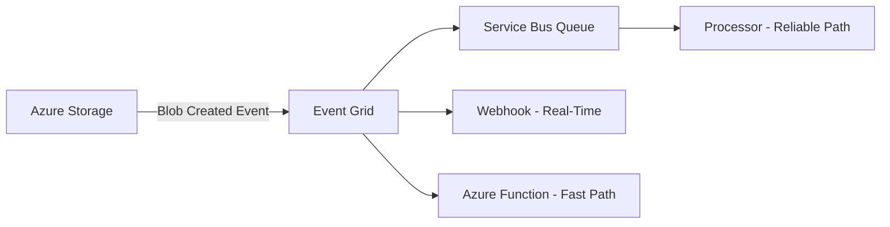

# How to Integrate Azure Event Grid with Azure Service Bus for Event-Driven Messaging

Author: [nawazdhandala](https://www.github.com/nawazdhandala)

Tags: Azure, Event Grid, Service Bus, Event-Driven, Messaging, Integration, Serverless

Description: Integrate Azure Event Grid with Azure Service Bus to build event-driven architectures that combine pub/sub events with reliable message queuing.

---

Azure Event Grid and Azure Service Bus serve different purposes in a messaging architecture. Event Grid is a lightweight pub/sub system for event distribution - it routes events to subscribers with low latency and minimal overhead. Service Bus is a full-featured message broker with queues, topics, sessions, and dead-letter queues for reliable processing. When you connect them together, you get the best of both worlds: instant event distribution from Event Grid feeding into reliable processing queues in Service Bus.

In this post, I will show you how to set up this integration, explain when and why you would use it, and walk through practical patterns.

## Why Combine Event Grid and Service Bus?

Consider these scenarios:

- **Azure resource events need reliable processing.** When a blob is uploaded to Storage, Event Grid fires an event instantly. But if your processor is down, the event is lost after retries. By routing Event Grid events to a Service Bus queue, the messages persist until processed.

- **Fan-out with different processing guarantees.** An event from Event Grid can go to multiple subscribers. Some need instant webhook delivery (Event Grid handles this), while others need guaranteed, ordered processing (Service Bus handles this).

- **Buffering bursty events.** If a burst of events arrives from Event Grid faster than your processor can handle, Service Bus queues absorb the burst and let the processor drain at its own pace.



## Setting Up the Integration

### Step 1: Create the Service Bus Resources

```bash
# Create a Service Bus namespace
az servicebus namespace create \
  --name my-servicebus-ns \
  --resource-group rg-events \
  --location eastus \
  --sku Standard

# Create a queue for receiving Event Grid events
az servicebus queue create \
  --name event-processing \
  --namespace-name my-servicebus-ns \
  --resource-group rg-events \
  --max-size 1024 \
  --default-message-time-to-live P7D

# Or create a topic if you need multiple subscribers
az servicebus topic create \
  --name events \
  --namespace-name my-servicebus-ns \
  --resource-group rg-events

az servicebus topic subscription create \
  --name processor-1 \
  --topic-name events \
  --namespace-name my-servicebus-ns \
  --resource-group rg-events
```

### Step 2: Create an Event Grid Subscription with Service Bus as the Endpoint

You can route Event Grid events to a Service Bus queue or topic.

```bash
# Route blob storage events to a Service Bus queue
az eventgrid event-subscription create \
  --name blob-to-servicebus \
  --source-resource-id "/subscriptions/<sub-id>/resourceGroups/rg-events/providers/Microsoft.Storage/storageAccounts/mystorageaccount" \
  --endpoint-type servicebusqueue \
  --endpoint "/subscriptions/<sub-id>/resourceGroups/rg-events/providers/Microsoft.ServiceBus/namespaces/my-servicebus-ns/queues/event-processing" \
  --included-event-types Microsoft.Storage.BlobCreated Microsoft.Storage.BlobDeleted
```

To route to a Service Bus topic instead:

```bash
# Route events to a Service Bus topic
az eventgrid event-subscription create \
  --name events-to-topic \
  --source-resource-id "/subscriptions/<sub-id>/resourceGroups/rg-events/providers/Microsoft.Storage/storageAccounts/mystorageaccount" \
  --endpoint-type servicebustopic \
  --endpoint "/subscriptions/<sub-id>/resourceGroups/rg-events/providers/Microsoft.ServiceBus/namespaces/my-servicebus-ns/topics/events"
```

### Step 3: Process Events from Service Bus

Now write a processor that reads events from the Service Bus queue. The events arrive in the CloudEvents or Event Grid schema format, wrapped in a Service Bus message.

```javascript
// event-processor.js - Process Event Grid events from Service Bus
const { ServiceBusClient } = require('@azure/service-bus');

const connectionString = process.env.SERVICEBUS_CONNECTION_STRING;
const queueName = 'event-processing';

async function processEvents() {
  const client = new ServiceBusClient(connectionString);
  const receiver = client.createReceiver(queueName);

  console.log('Listening for events from Service Bus...');

  // Process messages as they arrive
  const subscription = receiver.subscribe({
    processMessage: async (message) => {
      // The Event Grid event is the message body
      const event = message.body;

      console.log('Received event:');
      console.log('  Type:', event.eventType);
      console.log('  Subject:', event.subject);
      console.log('  Time:', event.eventTime);

      // Route based on event type
      switch (event.eventType) {
        case 'Microsoft.Storage.BlobCreated':
          await handleBlobCreated(event);
          break;

        case 'Microsoft.Storage.BlobDeleted':
          await handleBlobDeleted(event);
          break;

        default:
          console.log('Unknown event type:', event.eventType);
      }

      // Complete the message (removes it from the queue)
      await receiver.completeMessage(message);
    },

    processError: async (args) => {
      console.error('Error processing message:', args.error.message);
    }
  });
}

async function handleBlobCreated(event) {
  const blobUrl = event.data.url;
  const blobSize = event.data.contentLength;

  console.log(`Processing new blob: ${blobUrl} (${blobSize} bytes)`);

  // Your processing logic here:
  // - Generate thumbnails
  // - Index the content
  // - Run validation
  // - Trigger downstream workflows
}

async function handleBlobDeleted(event) {
  const blobUrl = event.data.url;
  console.log(`Handling blob deletion: ${blobUrl}`);

  // Clean up related resources
}

processEvents().catch(console.error);
```

### Using Azure Functions with Service Bus Trigger

For serverless processing, use an Azure Function with a Service Bus trigger.

```javascript
// function-processor.js - Azure Function triggered by Service Bus messages
module.exports = async function (context, message) {
  // The message body contains the Event Grid event
  const event = message;

  context.log(`Processing event: ${event.eventType}`);
  context.log(`Subject: ${event.subject}`);
  context.log(`Data: ${JSON.stringify(event.data)}`);

  switch (event.eventType) {
    case 'Microsoft.Storage.BlobCreated':
      // Process the new blob
      const blobUrl = event.data.url;
      await processNewBlob(blobUrl);
      break;

    case 'Microsoft.Storage.BlobDeleted':
      await cleanupBlob(event.data.url);
      break;
  }
};
```

```json
{
  "bindings": [
    {
      "name": "message",
      "type": "serviceBusTrigger",
      "direction": "in",
      "queueName": "event-processing",
      "connection": "ServiceBusConnection"
    }
  ]
}
```

## Filtering Events

Event Grid supports event filtering at the subscription level, so you only send relevant events to Service Bus.

```bash
# Only route events for specific blob paths
az eventgrid event-subscription create \
  --name filtered-events \
  --source-resource-id "/subscriptions/<sub-id>/resourceGroups/rg-events/providers/Microsoft.Storage/storageAccounts/mystorageaccount" \
  --endpoint-type servicebusqueue \
  --endpoint "/subscriptions/<sub-id>/resourceGroups/rg-events/providers/Microsoft.ServiceBus/namespaces/my-servicebus-ns/queues/event-processing" \
  --included-event-types Microsoft.Storage.BlobCreated \
  --subject-begins-with "/blobServices/default/containers/uploads/" \
  --subject-ends-with ".pdf"
```

You can also use advanced filters for more specific conditions.

```bash
# Advanced filtering: only events where content length is greater than 1MB
az eventgrid event-subscription create \
  --name large-blob-events \
  --source-resource-id "/subscriptions/<sub-id>/..." \
  --endpoint-type servicebusqueue \
  --endpoint "/subscriptions/<sub-id>/..." \
  --advanced-filter data.contentLength numberGreaterThan 1048576
```

## Custom Events Through Event Grid to Service Bus

This pattern also works with custom events from your own applications.

```javascript
// publish-custom-events.js - Publish custom events that route to Service Bus
const { EventGridPublisherClient, AzureKeyCredential } = require('@azure/eventgrid');

const topicEndpoint = process.env.EVENTGRID_TOPIC_ENDPOINT;
const topicKey = process.env.EVENTGRID_TOPIC_KEY;

const client = new EventGridPublisherClient(
  topicEndpoint,
  'EventGrid',
  new AzureKeyCredential(topicKey)
);

async function publishOrderEvent(order) {
  await client.send([
    {
      eventType: 'Order.Created',
      subject: `/orders/${order.id}`,
      dataVersion: '1.0',
      data: {
        orderId: order.id,
        customerId: order.customerId,
        totalAmount: order.totalAmount,
        items: order.items
      }
    }
  ]);

  console.log(`Published Order.Created event for order ${order.id}`);
}
```

Create an Event Grid subscription that routes these custom events to Service Bus for reliable processing.

## Dead-Letter Handling

When Event Grid cannot deliver an event to Service Bus (or any endpoint), it can dead-letter the event to a storage account for investigation.

```bash
# Configure dead-lettering for failed event delivery
az eventgrid event-subscription create \
  --name events-with-deadletter \
  --source-resource-id "/subscriptions/<sub-id>/..." \
  --endpoint-type servicebusqueue \
  --endpoint "/subscriptions/<sub-id>/..." \
  --deadletter-endpoint "/subscriptions/<sub-id>/resourceGroups/rg-events/providers/Microsoft.Storage/storageAccounts/mystorageaccount/blobServices/default/containers/deadletters"
```

On the Service Bus side, configure the queue's dead-letter settings for messages that cannot be processed by your consumer.

## Wrapping Up

Integrating Azure Event Grid with Azure Service Bus gives you a messaging architecture that combines instant event distribution with reliable processing. Event Grid handles the event routing with filtering and fan-out, while Service Bus provides the queuing guarantees that production workloads need. The setup is straightforward: create a Service Bus queue or topic, create an Event Grid subscription that points to it, and process the messages with your consumer of choice. Whether you are handling Azure resource events or custom application events, this pattern gives you the reliability and flexibility to build robust event-driven systems.
