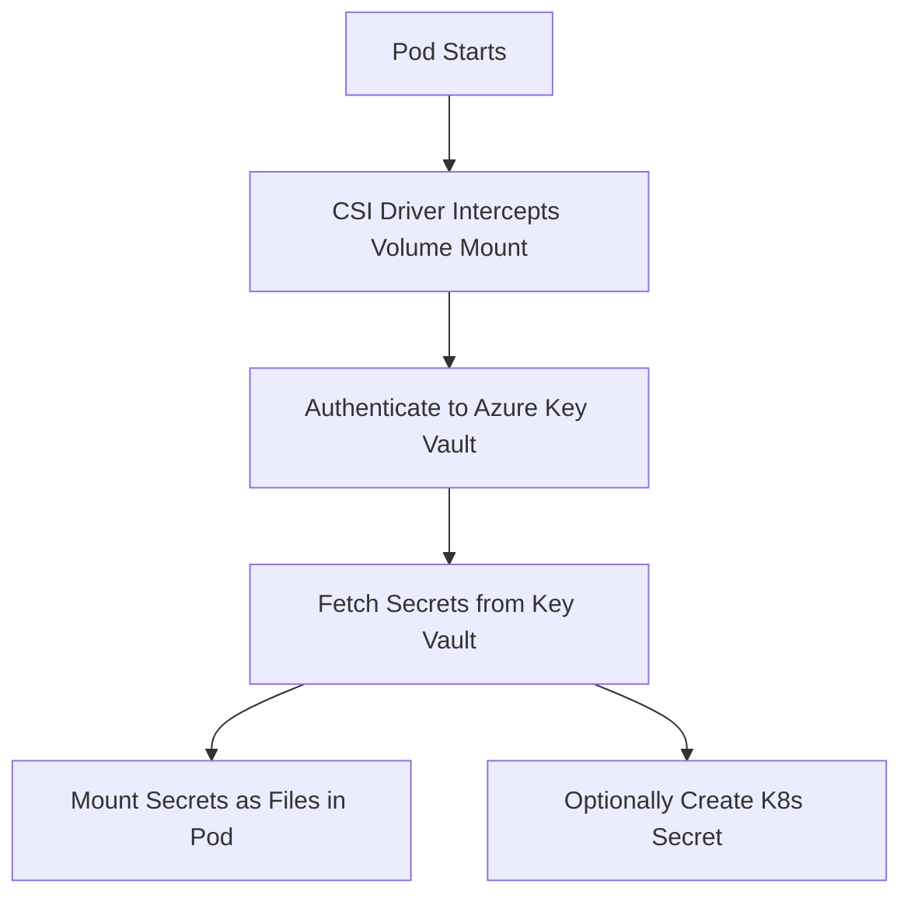

# How to Integrate Azure Key Vault Secrets with AKS Pods Using CSI Driver

Author: [nawazdhandala](https://www.github.com/nawazdhandala)

Tags: AKS, Azure Key Vault, CSI Driver, Kubernetes, Secrets Management, Azure, Security

Description: Complete walkthrough for mounting Azure Key Vault secrets into AKS pods using the Secrets Store CSI Driver with workload identity.

---

Hardcoding secrets in Kubernetes manifests or ConfigMaps is a security risk that bites teams sooner or later. Azure Key Vault provides a centralized, auditable, and access-controlled secrets store, and the Secrets Store CSI Driver bridges the gap between Key Vault and your AKS pods. Instead of creating Kubernetes secrets manually, the CSI driver mounts Key Vault secrets directly into your pods as files or syncs them as Kubernetes secrets automatically.

## How the CSI Driver Works

The Secrets Store CSI Driver operates as a DaemonSet on your AKS nodes. When a pod references a SecretProviderClass volume, the driver intercepts the volume mount, fetches the specified secrets from Azure Key Vault, and presents them to the pod as files in a tmpfs volume. Optionally, it can also create Kubernetes Secret objects from those values so you can reference them as environment variables.



## Prerequisites

Before starting, ensure you have:

- An AKS cluster running Kubernetes 1.24 or later
- An Azure Key Vault with at least one secret stored
- Azure CLI 2.40+ installed
- kubectl configured for your cluster
- The AKS cluster must have the Secrets Store CSI Driver add-on enabled

## Step 1: Enable the Secrets Store CSI Driver Add-On

AKS offers the Secrets Store CSI Driver as a managed add-on. This is the recommended approach because Azure handles upgrades and patching.

```bash
# Enable the Secrets Store CSI Driver add-on on your AKS cluster
# This installs the CSI driver DaemonSet and the Azure Key Vault provider
az aks enable-addons \
  --addons azure-keyvault-secrets-provider \
  --resource-group myResourceGroup \
  --name myAKSCluster
```

Verify the add-on is running.

```bash
# Check that the CSI driver pods are running on each node
kubectl get pods -n kube-system -l app=secrets-store-csi-driver
kubectl get pods -n kube-system -l app=secrets-store-provider-azure
```

You should see one pod per node for both the CSI driver and the Azure provider.

## Step 2: Enable Workload Identity

The CSI driver needs to authenticate to Azure Key Vault. The recommended approach is workload identity, which uses federated identity credentials instead of client secrets or managed identity assignments on the node pool.

```bash
# Enable OIDC issuer and workload identity on the cluster
az aks update \
  --resource-group myResourceGroup \
  --name myAKSCluster \
  --enable-oidc-issuer \
  --enable-workload-identity
```

Get the OIDC issuer URL.

```bash
# Retrieve the OIDC issuer URL for your cluster
export AKS_OIDC_ISSUER=$(az aks show \
  --resource-group myResourceGroup \
  --name myAKSCluster \
  --query "oidcIssuerProfile.issuerUrl" \
  --output tsv)
```

## Step 3: Create a Managed Identity and Federated Credential

Create a user-assigned managed identity that the CSI driver will use to access Key Vault.

```bash
# Create a managed identity for Key Vault access
az identity create \
  --resource-group myResourceGroup \
  --name keyvault-identity

# Store the client ID for later use
export IDENTITY_CLIENT_ID=$(az identity show \
  --resource-group myResourceGroup \
  --name keyvault-identity \
  --query clientId \
  --output tsv)
```

Create a federated credential that links the Kubernetes service account to the managed identity.

```bash
# Create a federated identity credential
# This links the Kubernetes service account to the Azure managed identity
az identity federated-credential create \
  --name keyvault-federated-cred \
  --identity-name keyvault-identity \
  --resource-group myResourceGroup \
  --issuer "$AKS_OIDC_ISSUER" \
  --subject system:serviceaccount:default:workload-sa \
  --audience api://AzureADTokenExchange
```

## Step 4: Grant Key Vault Access

Assign the managed identity a Key Vault role that allows reading secrets.

```bash
# Get the Key Vault resource ID
export KV_RESOURCE_ID=$(az keyvault show \
  --name myKeyVault \
  --query id \
  --output tsv)

# Assign the Key Vault Secrets User role to the managed identity
az role assignment create \
  --role "Key Vault Secrets User" \
  --assignee "$IDENTITY_CLIENT_ID" \
  --scope "$KV_RESOURCE_ID"
```

## Step 5: Create the Kubernetes Service Account

The service account must include an annotation referencing the managed identity client ID.

```yaml
# service-account.yaml
# Kubernetes service account linked to the Azure managed identity
apiVersion: v1
kind: ServiceAccount
metadata:
  name: workload-sa
  namespace: default
  annotations:
    # This annotation links the service account to the managed identity
    azure.workload.identity/client-id: "<IDENTITY_CLIENT_ID>"
  labels:
    azure.workload.identity/use: "true"
```

Replace `<IDENTITY_CLIENT_ID>` with the actual client ID value. Apply it with `kubectl apply -f service-account.yaml`.

## Step 6: Create the SecretProviderClass

The SecretProviderClass defines which secrets to fetch from Key Vault and how to present them.

```yaml
# secret-provider-class.yaml
# Defines which Azure Key Vault secrets to mount into pods
apiVersion: secrets-store.csi.x-k8s.io/v1
kind: SecretProviderClass
metadata:
  name: azure-kv-secrets
  namespace: default
spec:
  provider: azure
  parameters:
    usePodIdentity: "false"
    useVMManagedIdentity: "false"
    clientID: "<IDENTITY_CLIENT_ID>"
    keyvaultName: "myKeyVault"
    tenantId: "<TENANT_ID>"
    objects: |
      array:
        - |
          objectName: database-password
          objectType: secret
          objectVersion: ""
        - |
          objectName: api-key
          objectType: secret
          objectVersion: ""
  # Optional: sync secrets as Kubernetes Secret objects
  secretObjects:
  - secretName: app-secrets-k8s
    type: Opaque
    data:
    - objectName: database-password
      key: DB_PASSWORD
    - objectName: api-key
      key: API_KEY
```

The `objects` array lists the Key Vault secrets to fetch. The `secretObjects` section optionally creates a Kubernetes Secret from those values, which lets you use them as environment variables.

## Step 7: Deploy a Pod with Mounted Secrets

Now deploy a pod that uses the SecretProviderClass.

```yaml
# app-with-secrets.yaml
# Pod that mounts Azure Key Vault secrets via the CSI driver
apiVersion: apps/v1
kind: Deployment
metadata:
  name: my-app
  namespace: default
spec:
  replicas: 1
  selector:
    matchLabels:
      app: my-app
  template:
    metadata:
      labels:
        app: my-app
    spec:
      serviceAccountName: workload-sa
      containers:
      - name: my-app
        image: myregistry.azurecr.io/my-app:latest
        # Reference secrets as environment variables from the synced K8s secret
        env:
        - name: DB_PASSWORD
          valueFrom:
            secretKeyRef:
              name: app-secrets-k8s
              key: DB_PASSWORD
        - name: API_KEY
          valueFrom:
            secretKeyRef:
              name: app-secrets-k8s
              key: API_KEY
        # Mount secrets as files in the pod
        volumeMounts:
        - name: secrets-store
          mountPath: "/mnt/secrets"
          readOnly: true
      volumes:
      - name: secrets-store
        csi:
          driver: secrets-store.csi.k8s.io
          readOnly: true
          volumeAttributes:
            secretProviderClass: "azure-kv-secrets"
```

The pod gets secrets in two ways: as files under `/mnt/secrets/` and as environment variables via the synced Kubernetes Secret.

## Step 8: Verify Secrets Are Mounted

After deploying, check that secrets are accessible inside the pod.

```bash
# Exec into the pod and check the mounted secrets
kubectl exec -it deployment/my-app -- ls /mnt/secrets/

# Read a specific secret file
kubectl exec -it deployment/my-app -- cat /mnt/secrets/database-password

# Check that the Kubernetes Secret was created
kubectl get secret app-secrets-k8s -o yaml
```

## Secret Rotation

The CSI driver supports automatic secret rotation. When a secret changes in Key Vault, the driver picks up the new value on its next poll interval.

Enable rotation by updating the add-on.

```bash
# Enable secret rotation with a 2-minute poll interval
az aks addon update \
  --addons azure-keyvault-secrets-provider \
  --resource-group myResourceGroup \
  --name myAKSCluster \
  --enable-secret-rotation \
  --rotation-poll-interval 2m
```

Note that file-based secrets update automatically, but environment variables from Kubernetes Secrets require a pod restart to pick up new values.

## Troubleshooting Common Issues

**SecretProviderClass not found**: Make sure the SecretProviderClass is in the same namespace as the pod. The CSI driver only looks in the pod's namespace.

**Authentication failures**: Check that the federated credential subject matches the service account name and namespace exactly. The format is `system:serviceaccount:<namespace>:<service-account-name>`.

**Secrets not mounting**: Look at the CSI driver pod logs for errors. Run `kubectl logs -n kube-system -l app=secrets-store-provider-azure` to find authentication or permission issues.

**Kubernetes Secret not created**: The synced Kubernetes Secret is only created when at least one pod mounts the SecretProviderClass. If no pods reference it, the secret will not exist.

## Security Best Practices

Keep your Key Vault access tight. Use the principle of least privilege - assign the "Key Vault Secrets User" role rather than broader roles like "Key Vault Administrator". Use separate managed identities for different applications so you can audit and revoke access independently. Enable Key Vault diagnostic logging to track who accessed which secrets and when.

Avoid storing secrets as environment variables when possible. File-based secrets are safer because they are not exposed in process listings or crash dumps. If you must use environment variables, make sure your application does not log them.

## Summary

The Secrets Store CSI Driver provides a clean integration path between Azure Key Vault and AKS pods. By combining workload identity with the CSI driver, you get a secure, auditable secrets pipeline that does not require storing credentials in your Kubernetes cluster. The setup involves several moving parts - managed identity, federated credentials, SecretProviderClass, and service accounts - but once configured, it handles secret delivery and rotation without manual intervention.
