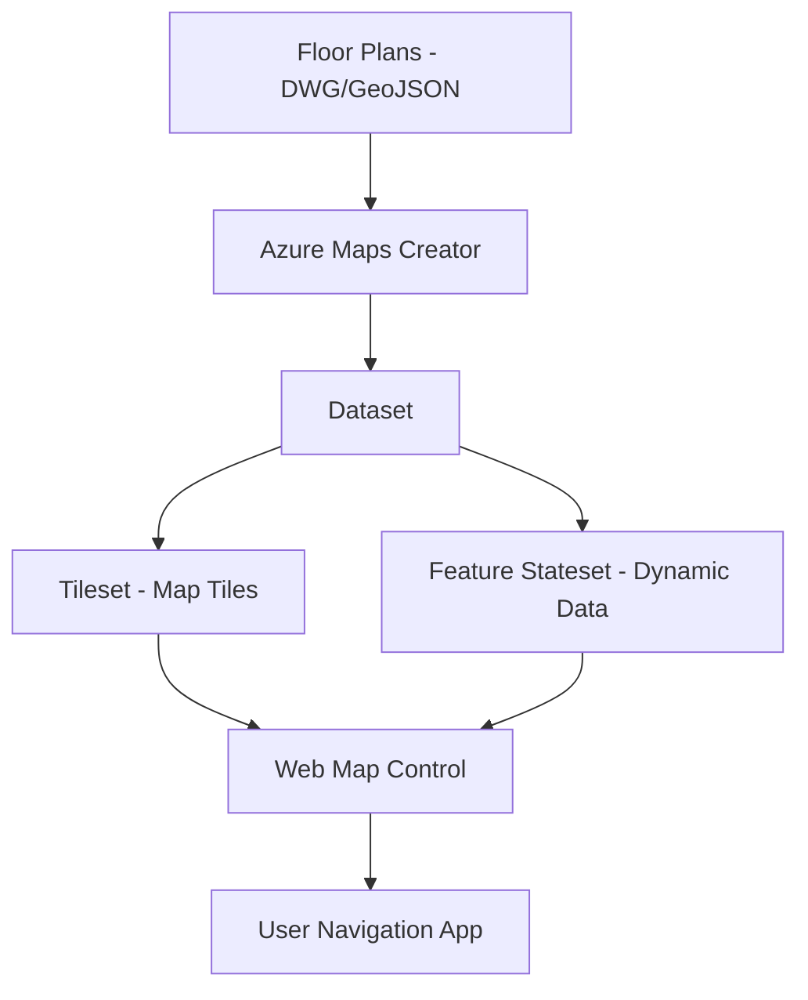

# How to Integrate Azure Maps Indoor Maps for Building Navigation and Wayfinding

Author: [nawazdhandala](https://www.github.com/nawazdhandala)

Tags: Azure Maps, Indoor Maps, Wayfinding, Building Navigation, Geospatial, Indoor Positioning, Mapping

Description: Learn how to integrate Azure Maps Indoor Maps into your application to provide building navigation and wayfinding for airports, hospitals, malls, and offices.

---

Finding your way through a large building - an airport terminal, a hospital complex, a corporate campus, or a convention center - is a surprisingly common problem. Outdoor navigation is solved by GPS and mapping services, but indoor navigation requires a different approach because GPS signals do not work reliably inside buildings. Azure Maps Indoor Maps provides the tools to create indoor maps, display them in your application, and build wayfinding features that guide users through complex indoor spaces. This guide covers the complete integration from creating the map data to building a working wayfinding application.

## How Azure Maps Indoor Maps Works

Azure Maps Indoor Maps uses a facility data package to represent indoor spaces. You provide building floor plans in a supported format (typically a Drawing Package based on DWG files or GeoJSON), upload them to Azure Maps, and the service converts them into map tiles that you can display in a web or mobile application.

The main components are:

- **Creator**: The Azure Maps service that processes facility data and creates indoor map datasets
- **Tilesets**: Rendered map tiles for displaying in the map control
- **Feature Statesets**: Dynamic data layers that can change in real time (room occupancy, availability)
- **Wayfinding**: Routing calculations that find paths through indoor spaces



## Prerequisites

- An Azure Maps account (Gen2 pricing tier for Creator features)
- Building floor plans in DWG format or GeoJSON
- Azure CLI installed
- Basic JavaScript/web development knowledge for the frontend

## Step 1: Create an Azure Maps Account with Creator

```bash
# Create an Azure Maps account with the Gen2 pricing tier
RESOURCE_GROUP="rg-maps"
MAPS_ACCOUNT="maps-indoor-nav"
LOCATION="eastus"

az group create --name $RESOURCE_GROUP --location $LOCATION

az maps account create \
    --name $MAPS_ACCOUNT \
    --resource-group $RESOURCE_GROUP \
    --sku G2 \
    --kind Gen2

# Create a Creator resource for indoor map processing
az maps creator create \
    --name "indoor-creator" \
    --maps-account $MAPS_ACCOUNT \
    --resource-group $RESOURCE_GROUP \
    --location $LOCATION \
    --storage-units 1

# Get the subscription key for API calls
MAPS_KEY=$(az maps account keys list \
    --name $MAPS_ACCOUNT \
    --resource-group $RESOURCE_GROUP \
    --query "primaryKey" -o tsv)
```

## Step 2: Prepare and Upload the Facility Data

Azure Maps Creator accepts a Drawing Package - a ZIP file containing DWG floor plans and a manifest file. If you have floor plans from an architect, they are likely already in DWG format.

The manifest file describes the building structure:

```json
{
    "version": "2.0",
    "buildingLevels": {
        "dwgLayers": {
            "exterior": ["A-WALL-EXT"],
            "unit": ["A-ROOM", "A-AREA"],
            "wall": ["A-WALL-INT"],
            "door": ["A-DOOR"],
            "verticalPenetration": ["A-STAIR", "A-ELEV"],
            "opening": ["A-OPENING"]
        },
        "levels": [
            {
                "filename": "ground-floor.dwg",
                "levelName": "Ground Floor",
                "ordinal": 0,
                "verticalExtent": 3.5
            },
            {
                "filename": "first-floor.dwg",
                "levelName": "First Floor",
                "ordinal": 1,
                "verticalExtent": 3.5
            },
            {
                "filename": "second-floor.dwg",
                "levelName": "Second Floor",
                "ordinal": 2,
                "verticalExtent": 3.5
            }
        ]
    },
    "georeference": {
        "lat": 47.6367,
        "lon": -122.1320,
        "angle": 0
    },
    "facilityName": "Corporate Headquarters",
    "facilityId": "building-hq"
}
```

Upload the drawing package:

```bash
# Upload the Drawing Package (ZIP file containing DWG files and manifest)
UPLOAD_RESPONSE=$(curl -s -X POST \
    "https://us.atlas.microsoft.com/mapData?api-version=2.0&dataFormat=dwgzippackage&subscription-key=$MAPS_KEY" \
    -H "Content-Type: application/zip" \
    --data-binary @building-plans.zip \
    -i)

# Extract the operation location for status checking
OPERATION_URL=$(echo "$UPLOAD_RESPONSE" | grep -i "Operation-Location" | awk '{print $2}' | tr -d '\r')

# Poll until the upload is complete
echo "Upload in progress..."
sleep 30

# Get the upload status and data ID
UPLOAD_STATUS=$(curl -s "$OPERATION_URL&subscription-key=$MAPS_KEY")
DATA_ID=$(echo "$UPLOAD_STATUS" | jq -r '.resourceLocation' | awk -F'/' '{print $NF}' | awk -F'?' '{print $1}')

echo "Data ID: $DATA_ID"
```

## Step 3: Convert the Drawing Package to a Dataset

The conversion step transforms DWG floor plans into Azure Maps' internal format:

```bash
# Start the conversion process
CONVERT_RESPONSE=$(curl -s -X POST \
    "https://us.atlas.microsoft.com/conversions?api-version=2.0&udid=$DATA_ID&outputOntology=facility-2.0&subscription-key=$MAPS_KEY" \
    -i)

CONVERT_OP_URL=$(echo "$CONVERT_RESPONSE" | grep -i "Operation-Location" | awk '{print $2}' | tr -d '\r')

# Wait for conversion to complete
echo "Conversion in progress..."
sleep 60

CONVERT_STATUS=$(curl -s "$CONVERT_OP_URL&subscription-key=$MAPS_KEY")
CONVERSION_ID=$(echo "$CONVERT_STATUS" | jq -r '.resourceLocation' | awk -F'/' '{print $NF}' | awk -F'?' '{print $1}')

# Create a dataset from the conversion
DATASET_RESPONSE=$(curl -s -X POST \
    "https://us.atlas.microsoft.com/datasets?api-version=2.0&conversionId=$CONVERSION_ID&subscription-key=$MAPS_KEY" \
    -i)

# Extract dataset ID
DATASET_OP_URL=$(echo "$DATASET_RESPONSE" | grep -i "Operation-Location" | awk '{print $2}' | tr -d '\r')
sleep 30
DATASET_STATUS=$(curl -s "$DATASET_OP_URL&subscription-key=$MAPS_KEY")
DATASET_ID=$(echo "$DATASET_STATUS" | jq -r '.resourceLocation' | awk -F'/' '{print $NF}' | awk -F'?' '{print $1}')

echo "Dataset ID: $DATASET_ID"
```

## Step 4: Create a Tileset for Rendering

The tileset is what the map control uses to render the indoor map:

```bash
# Create a tileset from the dataset
TILESET_RESPONSE=$(curl -s -X POST \
    "https://us.atlas.microsoft.com/tilesets?api-version=2.0&datasetId=$DATASET_ID&subscription-key=$MAPS_KEY" \
    -i)

TILESET_OP_URL=$(echo "$TILESET_RESPONSE" | grep -i "Operation-Location" | awk '{print $2}' | tr -d '\r')
sleep 60
TILESET_STATUS=$(curl -s "$TILESET_OP_URL&subscription-key=$MAPS_KEY")
TILESET_ID=$(echo "$TILESET_STATUS" | jq -r '.resourceLocation' | awk -F'/' '{print $NF}' | awk -F'?' '{print $1}')

echo "Tileset ID: $TILESET_ID"
```

## Step 5: Build the Indoor Map Web Application

Now build a web application that displays the indoor map and provides wayfinding:

```html
<!DOCTYPE html>
<html>
<head>
    <title>Indoor Navigation</title>
    <meta charset="utf-8" />
    <meta name="viewport" content="width=device-width, initial-scale=1, shrink-to-fit=no" />

    <!-- Azure Maps CSS and JS -->
    <link rel="stylesheet" href="https://atlas.microsoft.com/sdk/javascript/mapcontrol/3/atlas.min.css" />
    <script src="https://atlas.microsoft.com/sdk/javascript/mapcontrol/3/atlas.min.js"></script>

    <!-- Indoor Maps module -->
    <link rel="stylesheet" href="https://atlas.microsoft.com/sdk/javascript/indoor/0.2/atlas-indoor.min.css" />
    <script src="https://atlas.microsoft.com/sdk/javascript/indoor/0.2/atlas-indoor.min.js"></script>

    <style>
        html, body { margin: 0; padding: 0; width: 100%; height: 100%; }
        #map { width: 100%; height: 100%; }
        #controls {
            position: absolute;
            top: 10px;
            right: 10px;
            z-index: 100;
            background: white;
            padding: 15px;
            border-radius: 8px;
            box-shadow: 0 2px 6px rgba(0,0,0,0.2);
        }
    </style>
</head>
<body>
    <div id="map"></div>
    <div id="controls">
        <h3>Wayfinding</h3>
        <label>From: <input type="text" id="fromInput" placeholder="Room 101" /></label><br/><br/>
        <label>To: <input type="text" id="toInput" placeholder="Cafeteria" /></label><br/><br/>
        <button onclick="findRoute()">Navigate</button>
    </div>

    <script>
        // Initialize the map centered on the building location
        var map = new atlas.Map('map', {
            center: [-122.1320, 47.6367],
            zoom: 19,
            style: 'grayscale_light',
            authOptions: {
                authType: 'subscriptionKey',
                subscriptionKey: 'YOUR_MAPS_SUBSCRIPTION_KEY'
            }
        });

        var indoorManager;

        map.events.add('ready', function () {
            // Initialize the Indoor Maps manager with the tileset
            indoorManager = new atlas.indoor.IndoorManager(map, {
                tilesetId: 'YOUR_TILESET_ID',
                statesetId: 'YOUR_STATESET_ID' // Optional: for dynamic state
            });

            // Add a floor picker control
            var floorPicker = new atlas.indoor.control.LevelControl({
                position: 'top-left'
            });
            map.controls.add(floorPicker);

            // Handle room click events
            map.events.add('click', indoorManager, function (e) {
                if (e.features && e.features.length > 0) {
                    var feature = e.features[0];
                    var roomName = feature.properties.name || 'Unknown';
                    var category = feature.properties.categoryName || '';

                    // Show room information in a popup
                    var popup = new atlas.Popup({
                        content: '<div style="padding:10px">' +
                            '<strong>' + roomName + '</strong><br/>' +
                            'Category: ' + category +
                            '</div>',
                        position: e.position
                    });
                    popup.open(map);
                }
            });
        });

        // Wayfinding function
        function findRoute() {
            var from = document.getElementById('fromInput').value;
            var to = document.getElementById('toInput').value;

            // Query the wayfinding API for a route between two locations
            fetch('https://us.atlas.microsoft.com/wayfinding/path?' +
                'api-version=2023-03-01-preview' +
                '&subscription-key=YOUR_MAPS_SUBSCRIPTION_KEY' +
                '&datasetId=YOUR_DATASET_ID' +
                '&routesetId=YOUR_ROUTESET_ID' +
                '&facilityId=building-hq' +
                '&fromPoint=' + encodeURIComponent(from) +
                '&toPoint=' + encodeURIComponent(to))
                .then(function(response) { return response.json(); })
                .then(function(data) {
                    // Draw the route on the map
                    if (data.paths && data.paths.length > 0) {
                        var routeLine = new atlas.data.LineString(
                            data.paths[0].legs.flatMap(function(leg) {
                                return leg.points.map(function(p) {
                                    return [p.longitude, p.latitude];
                                });
                            })
                        );

                        // Add the route line to the map
                        var dataSource = new atlas.source.DataSource();
                        map.sources.add(dataSource);
                        dataSource.add(new atlas.data.Feature(routeLine));

                        map.layers.add(new atlas.layer.LineLayer(dataSource, null, {
                            strokeColor: '#2196F3',
                            strokeWidth: 5,
                            strokeDashArray: [2, 2]
                        }));
                    }
                });
        }
    </script>
</body>
</html>
```

## Step 6: Create a Feature Stateset for Dynamic Data

Feature statesets let you show real-time data on the indoor map, like room occupancy or availability:

```bash
# Create a feature stateset for room occupancy
STATESET_RESPONSE=$(curl -s -X POST \
    "https://us.atlas.microsoft.com/featureStateSets?api-version=2.0&datasetId=$DATASET_ID&subscription-key=$MAPS_KEY" \
    -H "Content-Type: application/json" \
    -d '{
        "styles": [
            {
                "keyName": "occupied",
                "type": "boolean",
                "rules": [
                    {
                        "true": {"color": "#FF6B6B"},
                        "false": {"color": "#51CF66"}
                    }
                ]
            },
            {
                "keyName": "temperature",
                "type": "number",
                "rules": [
                    {
                        "range": {"minimum": 0, "maximum": 20},
                        "color": "#74C0FC"
                    },
                    {
                        "range": {"minimum": 20, "maximum": 25},
                        "color": "#51CF66"
                    },
                    {
                        "range": {"minimum": 25, "maximum": 40},
                        "color": "#FF6B6B"
                    }
                ]
            }
        ]
    }')

STATESET_ID=$(echo "$STATESET_RESPONSE" | jq -r '.statesetId')
echo "Stateset ID: $STATESET_ID"
```

Update room states in real time:

```bash
# Update a room's state (e.g., mark as occupied)
FEATURE_ID="room-101-feature-id"

curl -X PUT \
    "https://us.atlas.microsoft.com/featureStateSets/$STATESET_ID/featureStates/$FEATURE_ID?api-version=2.0&subscription-key=$MAPS_KEY" \
    -H "Content-Type: application/json" \
    -d '{
        "states": [
            {"keyName": "occupied", "value": true},
            {"keyName": "temperature", "value": 23.5}
        ]
    }'
```

When the stateset is connected to your Indoor Maps manager, rooms will change color in real time based on these state updates. This is perfect for showing meeting room availability, temperature zones, or security zones.

## Use Cases

Indoor maps with wayfinding are valuable in many scenarios:

- **Hospitals**: Guide patients and visitors to departments, rooms, and services across multi-building campuses
- **Airports**: Help travelers find gates, lounges, restaurants, and baggage claim
- **Corporate offices**: Show room availability, guide visitors to meeting rooms, display evacuation routes
- **Shopping malls**: Store locator, nearest restrooms, food court navigation
- **Convention centers**: Navigate to booths, sessions, and amenities during events

## Summary

Azure Maps Indoor Maps provides the infrastructure for building indoor navigation applications. The process involves uploading floor plans, converting them to map datasets, creating tilesets for rendering, and building a web application with the Azure Maps SDK. Feature statesets add dynamic data overlays, and the wayfinding API calculates routes through indoor spaces. While the initial setup requires some effort to prepare the facility data, once the pipeline is established, you have a powerful platform for indoor navigation that can be extended with real-time data from IoT sensors and building management systems.
