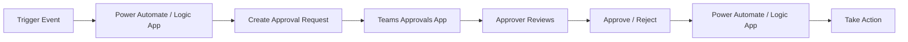

# How to Integrate Microsoft Teams Approvals with Power Automate and Azure Logic Apps

Author: [nawazdhandala](https://www.github.com/nawazdhandala)

Tags: Microsoft Teams, Power Automate, Azure Logic Apps, Approvals, Workflow Automation, Business Process, Low-Code

Description: Integrate Microsoft Teams Approvals with Power Automate and Azure Logic Apps to build automated approval workflows triggered by business events.

---

Approval workflows are everywhere in organizations. Purchase requests, time-off approvals, document reviews, expense reports, change requests - they all follow the same pattern: someone submits a request, one or more people need to approve or reject it, and the system needs to take action based on the outcome.

Microsoft Teams has a built-in Approvals app, and when you connect it with Power Automate or Azure Logic Apps, you can build sophisticated approval workflows that trigger from any business event. In this guide, I will show you how to set up approval workflows that integrate with both Power Automate for simpler flows and Azure Logic Apps for more complex enterprise scenarios.

## How Teams Approvals Work

The Teams Approvals framework has three components:



A business event triggers the flow, the flow creates an approval request, Teams delivers it to the approver, the approver responds, and the flow takes the appropriate action.

## Basic Approval Flow with Power Automate

Let us start with a straightforward scenario: approving purchase requests submitted through a SharePoint list. Here is the Power Automate flow definition:

```json
{
    "definition": {
        "triggers": {
            "When_an_item_is_created": {
                "type": "ApiConnection",
                "inputs": {
                    "host": {
                        "connection": { "name": "@parameters('$connections')['sharepointonline']['connectionId']" }
                    },
                    "method": "get",
                    "path": "/datasets/{site-url}/tables/{list-id}/onnewitems"
                }
            }
        },
        "actions": {
            "Start_and_wait_for_an_approval": {
                "type": "ApiConnection",
                "inputs": {
                    "host": {
                        "connection": { "name": "@parameters('$connections')['approvals']['connectionId']" }
                    },
                    "method": "post",
                    "path": "/approvals/create",
                    "body": {
                        "title": "Purchase Request: @{triggerOutputs()?['body/Title']}",
                        "assignedTo": "@{triggerOutputs()?['body/ManagerEmail']}",
                        "details": "Amount: $@{triggerOutputs()?['body/Amount']}\nVendor: @{triggerOutputs()?['body/Vendor']}\nJustification: @{triggerOutputs()?['body/Justification']}",
                        "itemLink": "https://yourcompany.sharepoint.com/lists/PurchaseRequests",
                        "itemLinkDescription": "View Request",
                        "enableNotifications": true
                    }
                }
            }
        }
    }
}
```

The approver receives a notification in Teams that looks like a native Teams card with Approve and Reject buttons. They can respond directly from the notification without opening any other application.

## Multi-Stage Approval with Power Automate

For requests above a certain threshold, you might need multiple levels of approval. The manager approves first, then the finance director:

```json
{
    "actions": {
        "Check_Amount": {
            "type": "If",
            "expression": {
                "greaterOrEquals": [
                    "@triggerOutputs()?['body/Amount']",
                    5000
                ]
            },
            "actions": {
                "Manager_Approval": {
                    "type": "ApiConnection",
                    "inputs": {
                        "body": {
                            "title": "Purchase Request Approval (Stage 1): @{triggerOutputs()?['body/Title']}",
                            "assignedTo": "@{triggerOutputs()?['body/ManagerEmail']}",
                            "details": "Amount: $@{triggerOutputs()?['body/Amount']}",
                            "enableNotifications": true
                        }
                    }
                },
                "Check_Manager_Response": {
                    "type": "If",
                    "runAfter": { "Manager_Approval": ["Succeeded"] },
                    "expression": {
                        "equals": [
                            "@body('Manager_Approval')?['outcome']",
                            "Approve"
                        ]
                    },
                    "actions": {
                        "Finance_Director_Approval": {
                            "type": "ApiConnection",
                            "inputs": {
                                "body": {
                                    "title": "Purchase Request Approval (Stage 2): @{triggerOutputs()?['body/Title']}",
                                    "assignedTo": "finance.director@yourcompany.com",
                                    "details": "Manager approved. Amount: $@{triggerOutputs()?['body/Amount']}",
                                    "enableNotifications": true
                                }
                            }
                        }
                    }
                }
            }
        }
    }
}
```

## Azure Logic Apps for Enterprise Scenarios

When you need more control, error handling, and integration with enterprise systems, Azure Logic Apps provides a more robust platform. Here is a Logic App that handles expense report approvals with parallel approvers:

```json
{
    "$schema": "https://schema.management.azure.com/providers/Microsoft.Logic/schemas/2016-06-01/workflowdefinition.json#",
    "contentVersion": "1.0.0.0",
    "triggers": {
        "When_a_HTTP_request_is_received": {
            "type": "Request",
            "kind": "Http",
            "inputs": {
                "schema": {
                    "type": "object",
                    "properties": {
                        "requestId": { "type": "string" },
                        "submitter": { "type": "string" },
                        "amount": { "type": "number" },
                        "category": { "type": "string" },
                        "description": { "type": "string" },
                        "approvers": {
                            "type": "array",
                            "items": { "type": "string" }
                        }
                    }
                }
            }
        }
    },
    "actions": {
        "Create_Teams_Approval": {
            "type": "ApiConnection",
            "inputs": {
                "host": {
                    "connection": { "name": "@parameters('$connections')['teams']['connectionId']" }
                },
                "method": "post",
                "path": "/v1.0/approvals",
                "body": {
                    "title": "Expense Report: @{triggerBody()?['description']}",
                    "approvalType": "CustomResponse",
                    "assignedTo": "@{join(triggerBody()?['approvers'], ';')}",
                    "details": "Submitted by: @{triggerBody()?['submitter']}\nAmount: $@{triggerBody()?['amount']}\nCategory: @{triggerBody()?['category']}",
                    "responseOptions": ["Approve", "Reject", "Request More Info"]
                }
            }
        },
        "Handle_Response": {
            "type": "Switch",
            "runAfter": { "Create_Teams_Approval": ["Succeeded"] },
            "expression": "@body('Create_Teams_Approval')?['outcome']",
            "cases": {
                "Approved": {
                    "case": "Approve",
                    "actions": {
                        "Process_Reimbursement": {
                            "type": "Http",
                            "inputs": {
                                "method": "POST",
                                "uri": "https://api.yourcompany.com/expenses/process",
                                "body": {
                                    "requestId": "@{triggerBody()?['requestId']}",
                                    "status": "approved",
                                    "approvedBy": "@{body('Create_Teams_Approval')?['responses'][0]?['approver']}"
                                }
                            }
                        },
                        "Notify_Submitter_Approved": {
                            "type": "ApiConnection",
                            "inputs": {
                                "method": "post",
                                "path": "/v3/conversations/@{triggerBody()?['submitter']}/activities",
                                "body": {
                                    "text": "Your expense report has been approved and is being processed for reimbursement."
                                }
                            }
                        }
                    }
                },
                "Rejected": {
                    "case": "Reject",
                    "actions": {
                        "Update_Status_Rejected": {
                            "type": "Http",
                            "inputs": {
                                "method": "POST",
                                "uri": "https://api.yourcompany.com/expenses/reject",
                                "body": {
                                    "requestId": "@{triggerBody()?['requestId']}",
                                    "reason": "@{body('Create_Teams_Approval')?['responses'][0]?['comments']}"
                                }
                            }
                        }
                    }
                },
                "NeedInfo": {
                    "case": "Request More Info",
                    "actions": {
                        "Send_Info_Request": {
                            "type": "ApiConnection",
                            "inputs": {
                                "method": "post",
                                "body": {
                                    "text": "Your expense report requires additional information. Please update and resubmit. Comments: @{body('Create_Teams_Approval')?['responses'][0]?['comments']}"
                                }
                            }
                        }
                    }
                }
            }
        }
    }
}
```

## Approval Reminders and Escalation

Approvals that sit unanswered slow down business processes. Build in reminders and escalation:

```csharp
// Azure Function that sends reminders for pending approvals
public class ApprovalReminderFunction
{
    private readonly GraphServiceClient _graphClient;

    [FunctionName("SendApprovalReminders")]
    public async Task Run(
        [TimerTrigger("0 0 9 * * 1-5")] TimerInfo timer, // 9 AM weekdays
        ILogger log)
    {
        // Query for approvals that have been pending more than 24 hours
        var pendingApprovals = await GetPendingApprovalsAsync(
            TimeSpan.FromHours(24));

        foreach (var approval in pendingApprovals)
        {
            // Send a Teams chat message reminder
            var message = new ChatMessage
            {
                Body = new ItemBody
                {
                    Content = $"Reminder: You have a pending approval request " +
                              $"'{approval.Title}' submitted {approval.SubmittedAt:g}. " +
                              $"Please review and respond at your earliest convenience.",
                    ContentType = BodyType.Text
                }
            };

            await _graphClient.Chats[approval.ApproverChatId]
                .Messages
                .PostAsync(message);

            log.LogInformation(
                "Reminder sent for approval {ApprovalId} to {Approver}",
                approval.Id, approval.ApproverEmail);

            // If pending more than 48 hours, escalate to the approver's manager
            if (approval.PendingSince > TimeSpan.FromHours(48))
            {
                await EscalateApprovalAsync(approval);
                log.LogWarning(
                    "Approval {ApprovalId} escalated after 48 hours",
                    approval.Id);
            }
        }
    }

    private async Task EscalateApprovalAsync(PendingApproval approval)
    {
        // Get the approver's manager from Azure AD
        var manager = await _graphClient.Users[approval.ApproverId]
            .Manager
            .GetAsync();

        // Create a new approval for the manager with context
        // about why it was escalated
    }

    private async Task<List<PendingApproval>> GetPendingApprovalsAsync(TimeSpan age)
    {
        // Query your database for approvals older than the specified age
        return new List<PendingApproval>();
    }
}
```

## Tracking Approval Metrics

Build a dashboard to monitor approval workflow performance:

```csharp
// API endpoint that returns approval workflow analytics
[HttpGet("api/approvals/analytics")]
public async Task<IActionResult> GetAnalytics(
    [FromQuery] string period = "30d")
{
    var days = int.Parse(period.Replace("d", ""));
    var since = DateTime.UtcNow.AddDays(-days);

    var stats = await _approvalRepo.GetStatisticsAsync(since);

    return Ok(new
    {
        period = period,
        totalApprovals = stats.Total,
        approved = stats.Approved,
        rejected = stats.Rejected,
        pendingInfo = stats.PendingInfo,
        averageResponseTime = stats.AverageResponseTime.TotalHours,
        approvalRate = (double)stats.Approved / stats.Total * 100,
        slowestCategory = stats.SlowestCategory,
        fastestApprover = stats.FastestApprover,
        escalationCount = stats.Escalations
    });
}
```

## Best Practices for Approval Workflows

After building a number of these workflows, here are the patterns that work well:

- Always include a link back to the source document or system in the approval card. Approvers need context.
- Set reasonable deadlines and communicate them. An approval with no deadline often gets ignored.
- Use "First to respond" approval type when any one approver is sufficient. Use "Everyone must respond" only when consensus is genuinely required.
- Log everything. Store the full audit trail including who approved, when, and any comments they provided.
- Test with real approvers before going live. The Teams notification experience varies between desktop, mobile, and web clients.

## Wrapping Up

Microsoft Teams Approvals combined with Power Automate or Azure Logic Apps provides a powerful platform for automating business approval workflows. Power Automate works well for straightforward flows that a business analyst can build and maintain. Azure Logic Apps steps in when you need enterprise-grade error handling, complex branching, and integration with APIs and databases. Either way, the approver experience is the same: a clean, actionable notification right inside Teams, with no context switching needed. Start with your most common approval workflow, prove the pattern, and then expand to other business processes.
