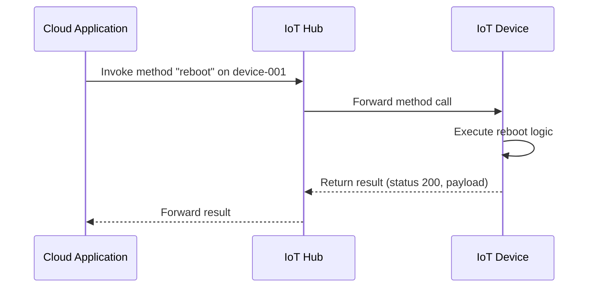

# How to Invoke Direct Methods on IoT Devices from Azure IoT Hub

Author: [nawazdhandala](https://www.github.com/nawazdhandala)

Tags: Azure IoT Hub, Direct Methods, IoT, Remote Commands, Device Management, Cloud-to-Device, Real-Time

Description: Learn how to invoke direct methods on IoT devices from Azure IoT Hub for real-time remote command execution, including request-response patterns and error handling.

---

Device twins are great for configuration management, but sometimes you need to tell a device to do something right now and get an immediate response. Reboot the device. Run a diagnostic. Open a valve. Lock a door. These are action-oriented commands that do not fit the desired/reported property model. Azure IoT Hub direct methods are built for exactly this use case.

A direct method is a synchronous request-response interaction between the cloud and a device. You invoke a method, the device executes it, and returns a result - all within a configurable timeout. If the device is offline, the call fails immediately rather than queuing, which is the right behavior for real-time commands.

## How Direct Methods Work

The flow is straightforward:



Key characteristics:
- **Synchronous** - The caller waits for the device to respond
- **Timeout** - Configurable from 5 to 300 seconds
- **Request payload** - Up to 128 KB of JSON data sent to the device
- **Response payload** - Up to 128 KB of JSON data returned by the device
- **Status code** - The device returns an HTTP-like status code (200 for success, 400s/500s for errors)
- **No queuing** - If the device is disconnected, the call fails immediately

## Prerequisites

- An Azure IoT Hub with at least one registered device
- The device must be connected and have a handler registered for the method name
- Azure CLI with the IoT extension, or an SDK-based application

## Step 1: Define Direct Methods for Your Devices

Before writing code, define the methods your devices will support. Think of them as an API contract between the cloud and the device.

Common direct methods include:

| Method Name | Purpose | Payload |
|------------|---------|---------|
| reboot | Restart the device | `{"delay": 5}` (seconds to wait) |
| firmwareUpdate | Start a firmware update | `{"url": "...", "version": "2.2.0"}` |
| runDiagnostics | Run device diagnostics | `{"tests": ["network", "sensors"]}` |
| setLED | Control an LED indicator | `{"color": "red", "blink": true}` |
| getStatus | Get detailed device status | None |
| resetConfig | Reset to factory defaults | `{"confirm": true}` |
| calibrateSensor | Calibrate a sensor | `{"sensorId": "temp-1", "reference": 22.5}` |

## Step 2: Implement Method Handlers on the Device

The device needs to register handlers for each supported method. Here is a comprehensive example in Python:

```python
# Device-side direct method handlers
# These functions execute when the cloud invokes a method on this device
from azure.iot.device import IoTHubDeviceClient, MethodResponse
import json
import subprocess
import time
import threading

CONNECTION_STRING = "HostName=iothub-production-001.azure-devices.net;DeviceId=sensor-temp-042;SharedAccessKey=..."

def method_request_handler(method_request):
    """
    Central handler for all direct method invocations.
    Routes to the appropriate handler based on method name.
    """
    print(f"Received method: {method_request.name}")
    print(f"Payload: {json.dumps(method_request.payload, indent=2)}")

    # Route to the appropriate handler
    handlers = {
        "reboot": handle_reboot,
        "getStatus": handle_get_status,
        "runDiagnostics": handle_run_diagnostics,
        "calibrateSensor": handle_calibrate_sensor,
        "setTelemetryInterval": handle_set_telemetry_interval,
    }

    handler = handlers.get(method_request.name)
    if handler:
        status, payload = handler(method_request.payload)
    else:
        # Method not found
        status = 404
        payload = {"error": f"Method '{method_request.name}' not supported"}

    # Send the response back to IoT Hub
    response = MethodResponse.create_from_method_request(
        method_request, status, payload
    )
    client.send_method_response(response)
    print(f"Response sent: status={status}")


def handle_reboot(payload):
    """
    Handle a reboot request.
    Optionally delays the reboot to allow the response to be sent.
    """
    delay = payload.get("delay", 5) if payload else 5

    # Schedule the reboot in a background thread
    # so the response can be sent before the device goes down
    def do_reboot():
        time.sleep(delay)
        print("Rebooting now...")
        subprocess.run(["sudo", "reboot"])

    thread = threading.Thread(target=do_reboot)
    thread.start()

    return 200, {
        "message": f"Reboot scheduled in {delay} seconds",
        "currentTime": time.strftime("%Y-%m-%dT%H:%M:%SZ", time.gmtime())
    }


def handle_get_status(payload):
    """
    Return detailed device status information.
    Collects system metrics and sensor readings.
    """
    import psutil

    status = {
        "system": {
            "cpuPercent": psutil.cpu_percent(interval=1),
            "memoryUsedPercent": psutil.virtual_memory().percent,
            "diskUsedPercent": psutil.disk_usage('/').percent,
            "uptimeSeconds": int(time.time() - psutil.boot_time()),
            "temperature": get_cpu_temperature()
        },
        "sensors": {
            "temperature": read_temperature_sensor(),
            "humidity": read_humidity_sensor()
        },
        "network": {
            "connectionType": "wifi",
            "signalStrength": get_wifi_signal(),
            "ipAddress": get_device_ip()
        },
        "firmware": {
            "version": "2.1.0",
            "buildDate": "2026-02-01"
        }
    }

    return 200, status


def handle_run_diagnostics(payload):
    """
    Run specified diagnostic tests and return results.
    """
    tests_to_run = payload.get("tests", ["all"]) if payload else ["all"]
    results = {}

    if "all" in tests_to_run or "network" in tests_to_run:
        # Test network connectivity
        import socket
        try:
            socket.create_connection(("8.8.8.8", 53), timeout=5)
            results["network"] = {"status": "pass", "latency_ms": 12}
        except OSError:
            results["network"] = {"status": "fail", "error": "No internet connectivity"}

    if "all" in tests_to_run or "sensors" in tests_to_run:
        # Test sensor readings
        temp = read_temperature_sensor()
        if -40 <= temp <= 85:  # Valid range for most temperature sensors
            results["sensors"] = {"status": "pass", "temperature": temp}
        else:
            results["sensors"] = {"status": "fail", "error": f"Temperature reading out of range: {temp}"}

    if "all" in tests_to_run or "storage" in tests_to_run:
        # Test storage health
        import psutil
        disk = psutil.disk_usage('/')
        if disk.percent < 90:
            results["storage"] = {"status": "pass", "usedPercent": disk.percent}
        else:
            results["storage"] = {"status": "warning", "usedPercent": disk.percent}

    overall = "pass" if all(r["status"] == "pass" for r in results.values()) else "fail"

    return 200, {"overall": overall, "tests": results}


def handle_calibrate_sensor(payload):
    """
    Calibrate a specific sensor with a reference value.
    """
    sensor_id = payload.get("sensorId")
    reference = payload.get("reference")

    if not sensor_id or reference is None:
        return 400, {"error": "sensorId and reference are required"}

    # Perform calibration (hardware-specific)
    try:
        offset = calibrate(sensor_id, reference)
        return 200, {
            "sensorId": sensor_id,
            "referenceValue": reference,
            "calibrationOffset": offset,
            "status": "calibrated"
        }
    except Exception as e:
        return 500, {"error": str(e)}


def handle_set_telemetry_interval(payload):
    """
    Dynamically change the telemetry sending interval.
    """
    interval = payload.get("interval")
    if not interval or interval < 1 or interval > 3600:
        return 400, {"error": "interval must be between 1 and 3600 seconds"}

    global TELEMETRY_INTERVAL
    TELEMETRY_INTERVAL = interval

    # Also report the change via twin
    client.patch_twin_reported_properties({"telemetryInterval": interval})

    return 200, {"interval": interval, "status": "applied"}


# Connect and register the handler
client = IoTHubDeviceClient.create_from_connection_string(CONNECTION_STRING)
client.connect()
client.on_method_request_received = method_request_handler

print("Device connected, waiting for method invocations...")
```

## Step 3: Invoke Methods from the Cloud

### Using Azure CLI

The CLI is perfect for manual invocations and testing:

```bash
# Invoke the getStatus method on a specific device
# --method-response-timeout specifies how long to wait for the device response
az iot hub invoke-device-method \
    --hub-name iothub-production-001 \
    --device-id sensor-temp-042 \
    --method-name getStatus \
    --method-payload '{}' \
    --timeout 30

# Invoke reboot with a 10-second delay
az iot hub invoke-device-method \
    --hub-name iothub-production-001 \
    --device-id sensor-temp-042 \
    --method-name reboot \
    --method-payload '{"delay": 10}'

# Run specific diagnostic tests
az iot hub invoke-device-method \
    --hub-name iothub-production-001 \
    --device-id sensor-temp-042 \
    --method-name runDiagnostics \
    --method-payload '{"tests": ["network", "sensors"]}'

# Calibrate a temperature sensor
az iot hub invoke-device-method \
    --hub-name iothub-production-001 \
    --device-id sensor-temp-042 \
    --method-name calibrateSensor \
    --method-payload '{"sensorId": "temp-1", "reference": 22.5}'
```

### Using the Azure IoT SDK (C#)

For application-level integration, use the service SDK:

```csharp
// Cloud-side code to invoke a direct method on a device
// This runs in your backend application or Azure Function
using Microsoft.Azure.Devices;
using System.Text.Json;

// Create the service client
var serviceClient = ServiceClient.CreateFromConnectionString(
    "HostName=iothub-production-001.azure-devices.net;SharedAccessKeyName=service;SharedAccessKey=..."
);

// Build the method invocation
var methodInvocation = new CloudToDeviceMethod("runDiagnostics")
{
    // Timeout for the device to respond
    ResponseTimeout = TimeSpan.FromSeconds(30),
    // Timeout for IoT Hub to connect to the device
    ConnectionTimeout = TimeSpan.FromSeconds(10)
};

// Set the payload
var payload = new { tests = new[] { "network", "sensors", "storage" } };
methodInvocation.SetPayloadJson(JsonSerializer.Serialize(payload));

// Invoke the method
try
{
    var response = await serviceClient.InvokeDeviceMethodAsync(
        "sensor-temp-042",
        methodInvocation
    );

    Console.WriteLine($"Status: {response.Status}");
    Console.WriteLine($"Response: {response.GetPayloadAsJson()}");
}
catch (DeviceNotFoundException)
{
    Console.WriteLine("Device not found or not connected");
}
```

## Step 4: Invoke Methods on Multiple Devices

For fleet-wide operations, use IoT Hub jobs to invoke methods across many devices:

```bash
# Schedule a method invocation job for all devices on floor 3
az iot hub job create \
    --hub-name iothub-production-001 \
    --job-id "diagnostics-floor3-$(date +%s)" \
    --job-type scheduleDeviceMethod \
    --method-name runDiagnostics \
    --method-payload '{"tests": ["all"]}' \
    --query-condition "tags.location.floor = 3" \
    --start-time "2026-02-16T20:00:00Z"
```

The job schedules the method invocation on all matching devices. Results are available through the job API.

## Error Handling and Timeouts

Proper error handling is essential for direct methods:

**Device offline** - The method call fails with a 404 status. Your cloud application should handle this gracefully, perhaps queuing the command for retry or notifying an operator.

**Method timeout** - If the device does not respond within the timeout period, the call fails. Set timeouts appropriately for the expected operation duration. A reboot might need 5 seconds; a firmware update check might need 60 seconds.

**Method not found** - If the device does not have a handler for the requested method name, return a 404 from the device handler.

**Invalid payload** - Validate the payload on the device side and return a 400 with a descriptive error message.

## Direct Methods vs. Device Twins vs. Cloud-to-Device Messages

| Feature | Direct Methods | Device Twin | C2D Messages |
|---------|:---:|:---:|:---:|
| Pattern | Request-response | Configuration sync | Fire-and-forget |
| Timeout | 5-300 seconds | N/A | Up to 48 hours in queue |
| Offline support | No | Yes | Yes (queued) |
| Max payload | 128 KB | 32 KB total | 256 KB |
| Feedback | Immediate | Eventual | Delivery acknowledgment |
| Use case | Actions, commands | Config, state | Notifications, commands |

Use direct methods when you need immediate execution and feedback. Use twin desired properties for configuration that should persist and be applied whenever the device connects. Use cloud-to-device messages for notifications or commands that can be queued.

## Wrapping Up

Direct methods give you a clean, synchronous way to send commands to IoT devices and get immediate results. Define a clear method contract for your devices, implement robust handlers with proper error codes and response payloads, and handle the failure cases (offline devices, timeouts) gracefully on the cloud side. Combined with device twins for configuration and telemetry messages for data, direct methods complete the communication toolkit for managing IoT devices at scale.
