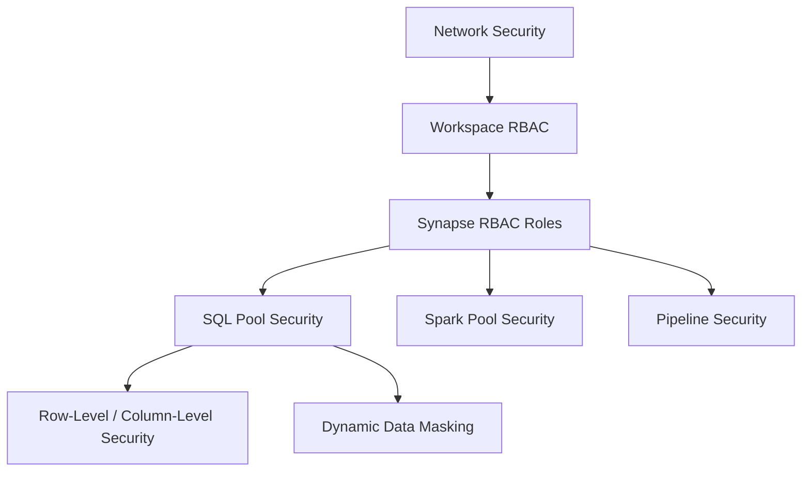

# How to Manage Access Control and Security in Azure Synapse Analytics

Author: [nawazdhandala](https://www.github.com/nawazdhandala)

Tags: Azure, Synapse Analytics, Security, Access Control, RBAC, Data Security, Azure Active Directory

Description: A comprehensive guide to managing access control, security, and data protection in Azure Synapse Analytics across SQL pools, Spark pools, and pipelines.

---

Azure Synapse Analytics is a multi-engine platform - it includes SQL pools, Spark pools, pipelines, and a data lake. Each of these components has its own access control mechanisms, and getting security right means understanding how they all fit together. This guide covers the security model from the workspace level down to individual table columns.

## Security Layers in Azure Synapse

Synapse security operates at multiple layers:



1. **Network security**: Firewalls, private endpoints, managed VNet
2. **Workspace-level RBAC**: Azure RBAC roles controlling who can manage the workspace
3. **Synapse RBAC**: Synapse-specific roles for fine-grained access to artifacts
4. **SQL security**: Database-level permissions within SQL pools
5. **Data-level security**: Row-level security, column-level security, data masking

## Step 1: Configure Network Security

Lock down network access before worrying about user permissions.

### Firewall Rules

```bash
# Only allow specific IP ranges to access the workspace
az synapse workspace firewall-rule create \
  --name OfficeNetwork \
  --workspace-name my-synapse-workspace \
  --resource-group rg-synapse \
  --start-ip-address 203.0.113.0 \
  --end-ip-address 203.0.113.255

# Optionally allow Azure services (needed for Power BI, ADF, etc.)
az synapse workspace firewall-rule create \
  --name AllowAzureServices \
  --workspace-name my-synapse-workspace \
  --resource-group rg-synapse \
  --start-ip-address 0.0.0.0 \
  --end-ip-address 0.0.0.0
```

### Managed Virtual Network

For stronger isolation, enable managed VNet on the workspace. This ensures all Synapse compute runs inside a Microsoft-managed VNet, and data exfiltration is controlled through managed private endpoints.

```bash
# Create a workspace with managed VNet (must be set at creation time)
az synapse workspace create \
  --name my-secure-synapse \
  --resource-group rg-synapse \
  --location eastus \
  --storage-account synapsedatalake2026 \
  --file-system synapse-data \
  --sql-admin-login-user sqladmin \
  --sql-admin-login-password '<StrongPassword123!>' \
  --enable-managed-virtual-network true \
  --prevent-data-exfiltration true
```

With data exfiltration prevention enabled, Synapse can only connect to approved targets through managed private endpoints. This prevents malicious or accidental data transfer to unauthorized destinations.

### Managed Private Endpoints

Create managed private endpoints to allow Synapse to connect to your data sources securely:

```bash
# Create a managed private endpoint to connect to Azure SQL Database
az synapse managed-private-endpoints create \
  --workspace-name my-secure-synapse \
  --resource-group rg-synapse \
  --name sql-source-endpoint \
  --group-id sqlServer \
  --private-link-resource-id "/subscriptions/<sub-id>/resourceGroups/rg-data/providers/Microsoft.Sql/servers/my-sql-server"
```

## Step 2: Configure Workspace RBAC

Azure RBAC controls who can manage the Synapse workspace itself - things like creating or deleting SQL pools, modifying firewall rules, and managing billing.

```bash
# Assign Contributor role for workspace management
az role assignment create \
  --role "Contributor" \
  --assignee user@company.com \
  --scope "/subscriptions/<sub-id>/resourceGroups/rg-synapse/providers/Microsoft.Synapse/workspaces/my-synapse-workspace"

# Assign Reader role for view-only access
az role assignment create \
  --role "Reader" \
  --assignee viewer@company.com \
  --scope "/subscriptions/<sub-id>/resourceGroups/rg-synapse/providers/Microsoft.Synapse/workspaces/my-synapse-workspace"
```

## Step 3: Configure Synapse RBAC Roles

Synapse has its own RBAC system that controls access to workspace artifacts (notebooks, pipelines, SQL scripts, etc.). These are separate from Azure RBAC.

Available Synapse roles:

| Role | Permissions |
|------|------------|
| Synapse Administrator | Full access to everything |
| Synapse SQL Administrator | Manage SQL pools, run any SQL query |
| Synapse Spark Administrator | Manage Spark pools, run notebooks |
| Synapse Contributor | Create and edit artifacts, but cannot manage access |
| Synapse Artifact Publisher | Publish artifacts (deploy to production) |
| Synapse Artifact User | Read and execute published artifacts |
| Synapse Credential User | Use credentials in pipelines and linked services |

Assign Synapse RBAC roles in Synapse Studio:

1. Go to Manage > Access control.
2. Click "Add".
3. Select the role.
4. Select the user, group, or service principal.
5. Optionally scope the assignment to a specific item (e.g., a specific Spark pool).

```bash
# Assign Synapse Contributor role via CLI
az synapse role assignment create \
  --workspace-name my-synapse-workspace \
  --role "Synapse Contributor" \
  --assignee user@company.com
```

## Step 4: Configure SQL Pool Security

Within dedicated SQL pools, you have the full SQL Server security model available.

### Create Logins and Users

```sql
-- Create a login at the server level (master database)
CREATE LOGIN analyst_login WITH PASSWORD = '<StrongPassword!>';

-- Switch to the dedicated SQL pool database
USE myDataWarehouse;

-- Create a database user mapped to the login
CREATE USER analyst_user FOR LOGIN analyst_login;

-- Add the user to a database role
ALTER ROLE db_datareader ADD MEMBER analyst_user;
```

### Azure AD Authentication

For production, use Azure AD authentication instead of SQL logins.

```sql
-- Create a database user from an Azure AD account
-- (requires Azure AD admin to be set on the workspace)
CREATE USER [analyst@company.com] FROM EXTERNAL PROVIDER;

-- Grant specific permissions
GRANT SELECT ON SCHEMA::dbo TO [analyst@company.com];

-- Create a user from an Azure AD group
CREATE USER [SynapseAnalysts] FROM EXTERNAL PROVIDER;
GRANT SELECT ON SCHEMA::dbo TO [SynapseAnalysts];
```

Set the Azure AD admin:

```bash
# Set Azure AD admin for the Synapse workspace
az synapse workspace ad-admin update \
  --workspace-name my-synapse-workspace \
  --resource-group rg-synapse \
  --display-name "Synapse Admins" \
  --object-id "<azure-ad-group-object-id>"
```

### Grant Granular Permissions

```sql
-- Grant SELECT on specific tables only
GRANT SELECT ON dbo.FactSales TO analyst_user;
GRANT SELECT ON dbo.DimProduct TO analyst_user;

-- Deny access to sensitive tables
DENY SELECT ON dbo.EmployeeSalaries TO analyst_user;

-- Grant permission on specific columns only
GRANT SELECT ON dbo.DimCustomer (CustomerId, CustomerName, City, Country)
TO analyst_user;
-- The user cannot see Email or other columns not listed
```

## Step 5: Implement Row-Level Security

Row-level security (RLS) restricts which rows a user can see. This is useful when different business units should only see their own data.

```sql
-- Create a schema for security predicates
CREATE SCHEMA Security;
GO

-- Create a function that filters rows based on the current user
CREATE FUNCTION Security.fn_SalesFilter(@Region AS NVARCHAR(100))
RETURNS TABLE
WITH SCHEMABINDING
AS
    RETURN SELECT 1 AS fn_result
    WHERE
        -- Admins can see all data
        IS_MEMBER('db_owner') = 1
        -- Regular users can only see their assigned region
        OR @Region = (
            SELECT Region FROM dbo.UserRegionMapping
            WHERE UserName = USER_NAME()
        );
GO

-- Create a security policy that applies the filter
CREATE SECURITY POLICY SalesFilter
ADD FILTER PREDICATE Security.fn_SalesFilter(Region)
ON dbo.FactSales
WITH (STATE = ON);
```

Now when `analyst_user` queries `dbo.FactSales`, they only see rows matching their assigned region.

## Step 6: Implement Dynamic Data Masking

Dynamic data masking hides sensitive data from non-privileged users without changing the underlying data.

```sql
-- Add masking to sensitive columns
ALTER TABLE dbo.DimCustomer
ALTER COLUMN Email ADD MASKED WITH (FUNCTION = 'email()');

ALTER TABLE dbo.DimCustomer
ALTER COLUMN PhoneNumber ADD MASKED WITH (FUNCTION = 'partial(0,"XXX-XXX-",4)');

-- Credit card numbers - show only last 4 digits
ALTER TABLE dbo.PaymentInfo
ALTER COLUMN CreditCardNumber ADD MASKED WITH (FUNCTION = 'partial(0,"XXXX-XXXX-XXXX-",4)');

-- Grant unmask permission to specific users who need to see full data
GRANT UNMASK TO [finance_team@company.com];
```

With masking active:
- `analyst_user` sees: `aXXX@XXXX.com` for email, `XXX-XXX-1234` for phone
- `finance_team@company.com` sees the full values

## Step 7: Secure Data Lake Access

The data lake backing your Synapse workspace also needs access control.

### Storage Account RBAC

```bash
# Grant Storage Blob Data Reader to analysts (read-only access to data lake)
az role assignment create \
  --role "Storage Blob Data Reader" \
  --assignee analyst@company.com \
  --scope "/subscriptions/<sub-id>/resourceGroups/rg-synapse/providers/Microsoft.Storage/storageAccounts/synapsedatalake2026"

# Grant Storage Blob Data Contributor for users who need to write
az role assignment create \
  --role "Storage Blob Data Contributor" \
  --assignee dataengineer@company.com \
  --scope "/subscriptions/<sub-id>/resourceGroups/rg-synapse/providers/Microsoft.Storage/storageAccounts/synapsedatalake2026"
```

### ACLs for Fine-Grained Data Lake Access

For folder-level permissions, use POSIX-style ACLs on Data Lake Gen2:

```bash
# Grant read and execute on a specific folder
az storage fs access set \
  --acl "user:<user-object-id>:r-x" \
  --path "curated/sales" \
  --file-system synapse-data \
  --account-name synapsedatalake2026

# Grant read/write/execute on a folder for data engineers
az storage fs access set \
  --acl "user:<engineer-object-id>:rwx" \
  --path "curated/sales" \
  --file-system synapse-data \
  --account-name synapsedatalake2026
```

## Audit and Monitoring

Enable auditing to track who accessed what data:

```bash
# Enable SQL auditing for the Synapse workspace
az synapse workspace audit-policy update \
  --workspace-name my-synapse-workspace \
  --resource-group rg-synapse \
  --state Enabled \
  --storage-account synapsedatalake2026 \
  --retention-days 90
```

Review audit logs in Azure Monitor or Log Analytics to investigate security incidents and meet compliance requirements.

## Wrapping Up

Security in Azure Synapse Analytics is a layered approach. Start with network security (firewalls, managed VNet, private endpoints), then configure workspace RBAC and Synapse RBAC for access to workspace artifacts. Within SQL pools, use database roles, row-level security, and dynamic data masking for data-level protection. For the data lake, combine storage RBAC with POSIX ACLs for folder-level access control. No single layer is sufficient on its own - defense in depth means applying controls at every level.
