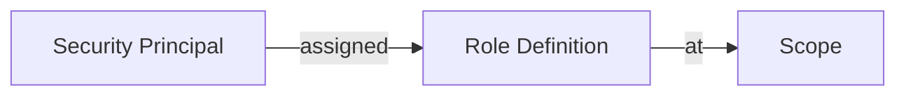

# How to Manage Azure RBAC Role Assignments at Scale with Terraform

Author: [nawazdhandala](https://www.github.com/nawazdhandala)

Tags: Terraform, Azure, RBAC, Role Assignments, Identity Management, Infrastructure as Code, Security

Description: Manage Azure RBAC role assignments at scale with Terraform using data-driven patterns for consistent access control across subscriptions and resource groups.

---

Azure RBAC (Role-Based Access Control) is how you control who can do what in your Azure environment. At small scale, you click through the portal and assign roles manually. At enterprise scale with hundreds of subscriptions, thousands of resources, and dozens of teams, that approach is completely unmanageable. You end up with inconsistent permissions, orphaned role assignments, no audit trail, and security teams who cannot answer basic questions like "who has Contributor access to production?"

Terraform fixes this by managing role assignments as code. Every assignment is declared, version controlled, and applied consistently. In this post, I will show patterns for managing RBAC at scale, from simple assignments to data-driven approaches that handle hundreds of assignments cleanly.

## RBAC Fundamentals

Azure RBAC has three components:



- **Security Principal**: Who gets the access (user, group, service principal, managed identity)
- **Role Definition**: What they can do (Reader, Contributor, custom role)
- **Scope**: Where it applies (management group, subscription, resource group, individual resource)

The combination of these three is a **role assignment**. Terraform manages these with the `azurerm_role_assignment` resource.

## Basic Role Assignments

Start with simple assignments:

```hcl
# rbac.tf - Basic role assignments

# Get the current subscription
data "azurerm_subscription" "current" {}

# Assign Reader role to a security group at subscription scope
resource "azurerm_role_assignment" "readers" {
  scope                = data.azurerm_subscription.current.id
  role_definition_name = "Reader"
  principal_id         = "aaaaaaaa-bbbb-cccc-dddd-eeeeeeeeeeee"  # Azure AD group object ID
  description          = "Read access for the monitoring team"
}

# Assign Contributor to a service principal at resource group scope
resource "azurerm_role_assignment" "app_contributor" {
  scope                = azurerm_resource_group.app.id
  role_definition_name = "Contributor"
  principal_id         = azurerm_user_assigned_identity.app.principal_id
  description          = "App managed identity needs to manage resources in its RG"
}

# Assign a built-in role using its ID (more reliable than name)
resource "azurerm_role_assignment" "keyvault_reader" {
  scope              = azurerm_key_vault.main.id
  role_definition_id = "/providers/Microsoft.Authorization/roleDefinitions/4633458b-17de-408a-b874-0445c86b69e6"  # Key Vault Secrets User
  principal_id       = azurerm_user_assigned_identity.app.principal_id
  description        = "Allow the app to read Key Vault secrets"
}
```

A few important details. The `principal_id` must be the **object ID** of the security principal, not the application ID or display name. For Azure AD groups, get the object ID with `az ad group show --group "Group Name" --query id`.

## Data-Driven Role Assignments

For organizations with many assignments, a data-driven approach is much cleaner. Define all assignments in a variable and use `for_each`:

```hcl
# variables.tf - Define role assignments as structured data

variable "role_assignments" {
  description = "Map of role assignments to create"
  type = map(object({
    principal_id         = string
    principal_type       = string  # User, Group, ServicePrincipal
    role_definition_name = string
    scope                = string  # subscription, resource_group, or resource
    scope_name           = optional(string)
    description          = string
  }))
}
```

```hcl
# terraform.tfvars - Role assignments for the production environment

role_assignments = {
  # Platform engineering team - full access
  "platform-team-subscription-contributor" = {
    principal_id         = "11111111-2222-3333-4444-555555555555"
    principal_type       = "Group"
    role_definition_name = "Contributor"
    scope                = "subscription"
    description          = "Platform team manages all infrastructure"
  }

  # Security team - read access everywhere
  "security-team-subscription-reader" = {
    principal_id         = "22222222-3333-4444-5555-666666666666"
    principal_type       = "Group"
    role_definition_name = "Reader"
    scope                = "subscription"
    description          = "Security team monitors all resources"
  }

  # Security team - Security Admin on subscription
  "security-team-security-admin" = {
    principal_id         = "22222222-3333-4444-5555-666666666666"
    principal_type       = "Group"
    role_definition_name = "Security Admin"
    scope                = "subscription"
    description          = "Security team manages Defender and security settings"
  }

  # Application team - Contributor on their resource group only
  "app-team-rg-contributor" = {
    principal_id         = "33333333-4444-5555-6666-777777777777"
    principal_type       = "Group"
    role_definition_name = "Contributor"
    scope                = "resource_group"
    scope_name           = "rg-app-prod"
    description          = "App team manages their own resource group"
  }

  # CI/CD service principal - limited access
  "cicd-sp-rg-contributor" = {
    principal_id         = "44444444-5555-6666-7777-888888888888"
    principal_type       = "ServicePrincipal"
    role_definition_name = "Contributor"
    scope                = "resource_group"
    scope_name           = "rg-app-prod"
    description          = "CI/CD pipeline deploys to the app resource group"
  }

  # Database admins - specific role on database resources
  "dba-team-sql-contributor" = {
    principal_id         = "55555555-6666-7777-8888-999999999999"
    principal_type       = "Group"
    role_definition_name = "SQL DB Contributor"
    scope                = "resource_group"
    scope_name           = "rg-data-prod"
    description          = "DBAs manage SQL databases"
  }
}
```

```hcl
# rbac.tf - Create all role assignments from the variable

data "azurerm_subscription" "current" {}

# Look up resource groups by name for assignments scoped to RGs
data "azurerm_resource_group" "scoped" {
  for_each = {
    for k, v in var.role_assignments : k => v
    if v.scope == "resource_group"
  }
  name = each.value.scope_name
}

# Resolve the scope for each assignment
locals {
  resolved_assignments = {
    for k, v in var.role_assignments : k => merge(v, {
      resolved_scope = (
        v.scope == "subscription" ? data.azurerm_subscription.current.id :
        v.scope == "resource_group" ? data.azurerm_resource_group.scoped[k].id :
        v.scope  # Assume it is a full resource ID
      )
    })
  }
}

# Create all role assignments
resource "azurerm_role_assignment" "this" {
  for_each = local.resolved_assignments

  scope                = each.value.resolved_scope
  role_definition_name = each.value.role_definition_name
  principal_id         = each.value.principal_id
  description          = each.value.description

  # Skip principal validation for service principals in different tenants
  skip_service_principal_aad_check = each.value.principal_type == "ServicePrincipal"
}
```

This pattern makes it easy to review, audit, and modify role assignments. All the access control for an environment is in one tfvars file.

## Creating Custom Roles

Built-in roles do not always match your needs. Custom roles let you define exactly the permissions required:

```hcl
# custom-roles.tf - Define custom RBAC roles

# Custom role: allows managing VMs but not deleting them
resource "azurerm_role_definition" "vm_operator" {
  name        = "VM Operator"
  scope       = data.azurerm_subscription.current.id
  description = "Can start, stop, restart, and monitor VMs but not create or delete them"

  permissions {
    actions = [
      # VM operations
      "Microsoft.Compute/virtualMachines/start/action",
      "Microsoft.Compute/virtualMachines/powerOff/action",
      "Microsoft.Compute/virtualMachines/restart/action",
      "Microsoft.Compute/virtualMachines/read",
      "Microsoft.Compute/virtualMachines/instanceView/read",

      # Network read access for troubleshooting
      "Microsoft.Network/networkInterfaces/read",
      "Microsoft.Network/publicIPAddresses/read",

      # Metrics and logs for monitoring
      "Microsoft.Insights/metrics/read",
      "Microsoft.Insights/diagnosticSettings/read",

      # Resource group read access
      "Microsoft.Resources/subscriptions/resourceGroups/read",
    ]

    not_actions = [
      # Explicitly deny deletion and creation
      "Microsoft.Compute/virtualMachines/delete",
      "Microsoft.Compute/virtualMachines/write",
    ]
  }

  assignable_scopes = [
    data.azurerm_subscription.current.id,
  ]
}

# Custom role: read-only access to Key Vault metadata (not secrets)
resource "azurerm_role_definition" "keyvault_metadata_reader" {
  name        = "Key Vault Metadata Reader"
  scope       = data.azurerm_subscription.current.id
  description = "Can view Key Vault properties and list secret names but not read secret values"

  permissions {
    actions = [
      "Microsoft.KeyVault/vaults/read",
      "Microsoft.KeyVault/vaults/*/read",
    ]

    not_actions = []

    data_actions = [
      # Can list secrets but not get their values
      "Microsoft.KeyVault/vaults/secrets/getmetadata/action",
    ]

    not_data_actions = [
      "Microsoft.KeyVault/vaults/secrets/readMetadata/action",
    ]
  }

  assignable_scopes = [
    data.azurerm_subscription.current.id,
  ]
}

# Use the custom role in an assignment
resource "azurerm_role_assignment" "ops_vm_operator" {
  scope              = data.azurerm_subscription.current.id
  role_definition_id = azurerm_role_definition.vm_operator.role_definition_resource_id
  principal_id       = var.operations_team_group_id
  description        = "Operations team can manage VM lifecycle but not create or delete VMs"
}
```

## Managing Assignments Across Multiple Subscriptions

For organizations with many subscriptions, manage RBAC centrally using provider aliases:

```hcl
# multi-sub-rbac.tf - Manage RBAC across subscriptions

provider "azurerm" {
  alias           = "prod"
  subscription_id = var.production_subscription_id
  features {}
}

provider "azurerm" {
  alias           = "staging"
  subscription_id = var.staging_subscription_id
  features {}
}

# Define assignments per subscription
locals {
  subscription_assignments = {
    production = {
      subscription_id = var.production_subscription_id
      assignments = {
        "prod-reader" = {
          principal_id = var.dev_team_group_id
          role         = "Reader"
          description  = "Dev team read access to production"
        }
      }
    }
    staging = {
      subscription_id = var.staging_subscription_id
      assignments = {
        "staging-contributor" = {
          principal_id = var.dev_team_group_id
          role         = "Contributor"
          description  = "Dev team full access to staging"
        }
      }
    }
  }
}
```

## Handling Common RBAC Issues

**Assignment already exists.** If you try to create a role assignment that already exists (same principal, role, and scope), Terraform will fail. Use `import` to bring existing assignments under management, or use the `azurerm_role_assignment` data source to check first.

**Propagation delay.** Role assignments can take up to 10 minutes to propagate. If a resource depends on a role assignment (e.g., an app that needs Key Vault access), add a time delay:

```hcl
# Wait for RBAC propagation before the app tries to access Key Vault
resource "time_sleep" "rbac_propagation" {
  depends_on      = [azurerm_role_assignment.app_keyvault]
  create_duration = "60s"  # Wait 60 seconds for propagation
}

resource "azurerm_linux_web_app" "this" {
  depends_on = [time_sleep.rbac_propagation]
  # ... app configuration that reads from Key Vault
}
```

**Orphaned assignments.** When you remove a role assignment from Terraform, the assignment is deleted from Azure. But if someone created assignments manually, Terraform does not know about them. Periodically audit for assignments not managed by Terraform.

## Auditing Role Assignments

Export all current role assignments for audit:

```bash
# List all role assignments in the subscription
az role assignment list --all --output table

# Find all assignments for a specific principal
az role assignment list --assignee "user@company.com" --all --output table

# Find all Contributor assignments (potential over-provisioning)
az role assignment list --all --query "[?roleDefinitionName=='Contributor']" --output table
```

## Principle of Least Privilege

A few guidelines for keeping role assignments secure:

- Prefer Azure AD groups over individual user assignments. When someone leaves the team, removing them from the group removes all their Azure access.
- Use the most specific scope possible. Contributor at subscription scope is almost always too broad.
- Prefer built-in roles over Contributor. "Website Contributor" is better than "Contributor" for a web app team.
- Review and audit assignments quarterly. People change teams, projects end, but role assignments persist.
- Use Privileged Identity Management (PIM) for just-in-time access to sensitive roles instead of permanent assignments.

## Wrapping Up

Managing Azure RBAC with Terraform transforms access control from an ad-hoc process into a governed, auditable system. The data-driven approach with `for_each` keeps your code clean even with hundreds of assignments. Custom roles let you implement least privilege precisely. And version control gives you an audit trail of every access change. Start by importing your existing role assignments into Terraform, then enforce that all new assignments go through code review. Your security team will thank you.
